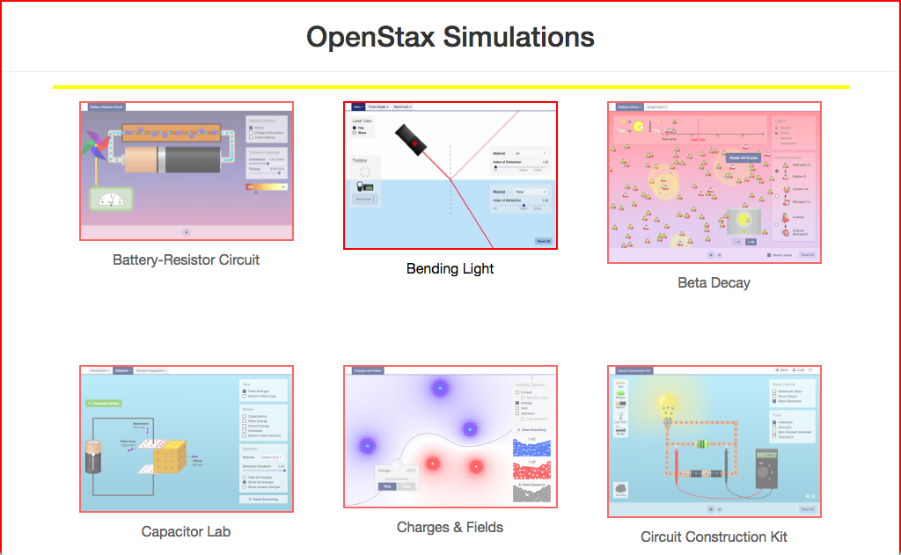

# http://archive.cnx.org/specials/



# AJAX Calls


# WCAG2AAA Errors

Showing first 50 of 35 errors

```
ERROR html WCAG2AAA.Principle3.Guideline3_1.3_1_1.H57.2
warning div.simulation-links WCAG2AAA.Principle1.Guideline1_3.1_3_1.H48
ERROR img[src='http://archive.cnx.org/specials/ee4d9924-b4ce-11e5-84cb-4b93623233d2/battery-resistor-circuit/screenshot.png'] WCAG2AAA.Principle1.Guideline1_1.1_1_1.H37
ERROR img[src='http://archive.cnx.org/specials/5eed1d0c-ae72-11e5-a68d-ef9e5ff0b7f8/bending-light/screenshot.png'] WCAG2AAA.Principle1.Guideline1_1.1_1_1.H37
ERROR img[src='http://archive.cnx.org/specials/f0a27b96-f5c8-11e5-a22c-73f8c149bebf/beta-decay/screenshot.png'] WCAG2AAA.Principle1.Guideline1_1.1_1_1.H37
ERROR img[src='http://archive.cnx.org/specials/dbc79077-17cf-477f-bb5b-0da111bc61b9/capacitor-lab/screenshot.png'] WCAG2AAA.Principle1.Guideline1_1.1_1_1.H37
ERROR img[src='http://archive.cnx.org/specials/551d2ffb-fcfb-49a3-b0a5-77163f94f7a3/charges-and-fields/screenshot.png'] WCAG2AAA.Principle1.Guideline1_1.1_1_1.H37
ERROR img[src='http://archive.cnx.org/specials/f23ce496-c9d1-11e5-bdc8-bb04dc1eecb6/circuit-construction-kit-dc-only/screenshot.png'] WCAG2AAA.Principle1.Guideline1_1.1_1_1.H37
ERROR img[src='http://archive.cnx.org/specials/2c7acb3c-2fbd-11e5-b2d9-e7f92291703c/collision-lab/screenshot.png'] WCAG2AAA.Principle1.Guideline1_1.1_1_1.H37
ERROR img[src='http://archive.cnx.org/specials/ca9a78b4-06a7-11e6-b638-3bb71d1f0b42/electric-field-of-dreams/screenshot.png'] WCAG2AAA.Principle1.Guideline1_1.1_1_1.H37
ERROR img[src='http://archive.cnx.org/specials/eb99fecc-0e7a-4c09-86e2-8bcb1490c0d3/energy-forms-and-changes/screenshot.png'] WCAG2AAA.Principle1.Guideline1_1.1_1_1.H37
ERROR img[src='http://archive.cnx.org/specials/70b14c10-ae73-11e5-8eb2-b7fbe0c5c7a4/faraday/screenshot.png'] WCAG2AAA.Principle1.Guideline1_1.1_1_1.H37
ERROR img[src='http://archive.cnx.org/specials/1e9b7292-ae74-11e5-a9dc-c7c8521ba8e6/generator/screenshot.png'] WCAG2AAA.Principle1.Guideline1_1.1_1_1.H37
ERROR img[src='http://archive.cnx.org/specials/137b787c-9c2c-4430-b4c0-c1f55e3921d2/geometric-optics/screenshot.png'] WCAG2AAA.Principle1.Guideline1_1.1_1_1.H37
ERROR img[src='http://archive.cnx.org/specials/a14085c8-96b8-4d04-bb5a-56d9ccbe6e69/gravity-and-orbits/screenshot.png'] WCAG2AAA.Principle1.Guideline1_1.1_1_1.H37
ERROR img[src='http://archive.cnx.org/specials/317a2b1e-2fbd-11e5-99b5-e38ffb545fe6/ladybug-motion/screenshot.png'] WCAG2AAA.Principle1.Guideline1_1.1_1_1.H37
ERROR img[src='http://archive.cnx.org/specials/55c0bfce-33e5-11e6-9667-f3580a657346/lasers/screenshot.png'] WCAG2AAA.Principle1.Guideline1_1.1_1_1.H37
ERROR img[src='http://archive.cnx.org/specials/5ca3e2cc-ae74-11e5-b6d3-f3c228f04b5c/magnet-and-compass/screenshot.png'] WCAG2AAA.Principle1.Guideline1_1.1_1_1.H37
ERROR img[src='http://archive.cnx.org/specials/92176000-ae74-11e5-baad-cfab91c15075/magnets-and-electromagnets/screenshot.png'] WCAG2AAA.Principle1.Guideline1_1.1_1_1.H37
ERROR img[src='http://archive.cnx.org/specials/62ced05e-ebae-4d57-a172-a2c364478a7f/masses-and-springs/screenshot.png'] WCAG2AAA.Principle1.Guideline1_1.1_1_1.H37
ERROR img[src='http://archive.cnx.org/specials/30e37034-2fbd-11e5-83a2-03be60006ece/maze-game/screenshot.png'] WCAG2AAA.Principle1.Guideline1_1.1_1_1.H37
ERROR img[src='http://archive.cnx.org/specials/d77cc1d0-33e4-11e6-b016-6726afecd2be/hydrogen-atom/screenshot.png'] WCAG2AAA.Principle1.Guideline1_1.1_1_1.H37
ERROR img[src='http://archive.cnx.org/specials/e2ca52af-8c6b-450e-ac2f-9300b38e8739/moving-man/screenshot.png'] WCAG2AAA.Principle1.Guideline1_1.1_1_1.H37
ERROR img[src='http://archive.cnx.org/specials/ee816dff-0b5f-4e6f-8250-f9fb9e39d716/my-solar-system/screenshot.png'] WCAG2AAA.Principle1.Guideline1_1.1_1_1.H37
ERROR img[src='http://archive.cnx.org/specials/01caf0d0-116f-11e6-b891-abfdaa77b03b/nuclear-fission/screenshot.png'] WCAG2AAA.Principle1.Guideline1_1.1_1_1.H37
ERROR img[src='http://archive.cnx.org/specials/cf1152da-eae8-11e5-b874-f779884a9994/photoelectric-effect/screenshot.png'] WCAG2AAA.Principle1.Guideline1_1.1_1_1.H37
ERROR img[src='http://archive.cnx.org/specials/317dbd00-8e61-4065-b3eb-f2b80db9b7ed/projectile-motion/screenshot.png'] WCAG2AAA.Principle1.Guideline1_1.1_1_1.H37
ERROR img[src='http://archive.cnx.org/specials/c8dd764c-ae74-11e5-af4c-3375261fa183/radio-waves/screenshot.png'] WCAG2AAA.Principle1.Guideline1_1.1_1_1.H37
ERROR img[src='http://archive.cnx.org/specials/d709a8b0-068c-11e6-bcfb-f38266817c66/radioactive-dating-game/screenshot.png'] WCAG2AAA.Principle1.Guideline1_1.1_1_1.H37
ERROR img[src='http://archive.cnx.org/specials/4817c87a-fb48-11e5-bcbe-27036fe6aba6/rutherford-scattering/screenshot.png'] WCAG2AAA.Principle1.Guideline1_1.1_1_1.H37
ERROR img[src='http://archive.cnx.org/specials/c4d3b96e-41f3-11e5-ab7b-47e22dffc18e/sound/screenshot.png'] WCAG2AAA.Principle1.Guideline1_1.1_1_1.H37
ERROR img[src='http://archive.cnx.org/specials/e857fdad-1515-498d-b92e-893cef70d6f0/states-of-matter/screenshot.png'] WCAG2AAA.Principle1.Guideline1_1.1_1_1.H37
ERROR img[src='http://archive.cnx.org/specials/7cd7b6ad-ba46-494c-b008-f540fa200676/greenhouse-effect/screenshot.png'] WCAG2AAA.Principle1.Guideline1_1.1_1_1.H37
ERROR img[src='http://archive.cnx.org/specials/d218bf9b-e50e-4d50-9a6c-b3db4dad0816/vector-addition/screenshot.png'] WCAG2AAA.Principle1.Guideline1_1.1_1_1.H37
ERROR img[src='http://archive.cnx.org/specials/2fe7ad15-b00e-4402-b068-ff503985a18f/wave-interference/screenshot.png'] WCAG2AAA.Principle1.Guideline1_1.1_1_1.H37
```

