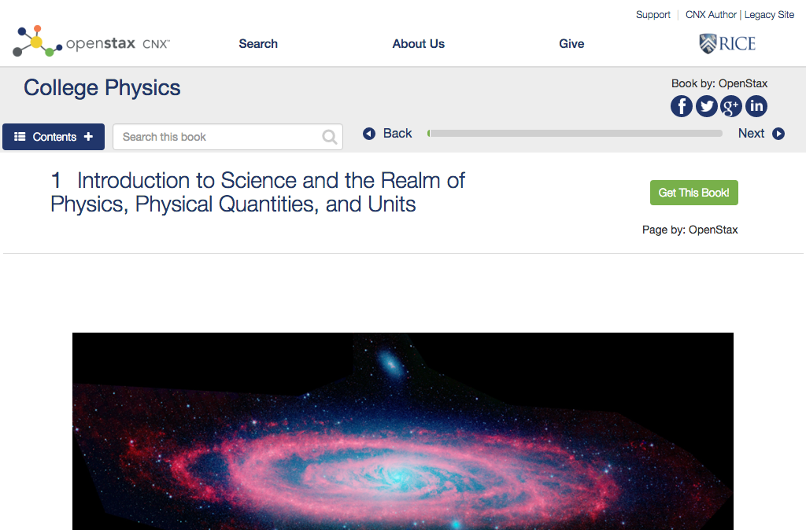

# https://cnx.org/contents/{uuid}



# AJAX Calls

## GET https://cnx.org/users/profile

```json
"<!DOCTYPE html><html lang=\"en-US\"><head><title>OpenStax CNX</title><meta charset=\"utf-8\"><meta name=\"viewport\" content=\"width=device-width,initial-sca ... 733 more"
```

## GET https://archive.cnx.org/extras

```json
{
  "featuredLinks": [
    {
      "abstract": "<div xmlns=\"http://www.w3.org/1999/xhtml\" xmlns:md=\"http://cnx.rice.edu/mdml\" xmlns:c=\"http://cnx.rice.edu/cnxml\" xmlns:html=\"http://www.w3.org/1999/x ... 706 more",
      "id": "d6db603c-cd31-4ca4-be19-d29734673b90",
      "legacy_id": "col11227",
      "legacy_version": "1.4",
      "resourcePath": "/resources/4c2732eca36eb7b56ae1b67dcb510e94744b6c99",
      "title": "Business Fundamentals",
      "type": "CNX Featured",
      "version": "4.3"
    },
    {
      "abstract": "<div xmlns=\"http://www.w3.org/1999/xhtml\" xmlns:md=\"http://cnx.rice.edu/mdml\" xmlns:c=\"http://cnx.rice.edu/cnxml\" xmlns:html=\"http://www.w3.org/1999/x ... 232 more",
      "id": "e7b71f2c-a51e-4c9f-8db2-066a4c3643e4",
      "legacy_id": "col10449",
      "legacy_version": "1.7",
      "resourcePath": "/resources/5fc217ae874f70e5194c172c8be4083abe4282ac",
      "title": "Images of Memorable Cases: 50 Years at the Bedside",
      "type": "CNX Featured",
      "version": "7.2"
    },
    "... skipped 56"
  ],
  "languages_and_count": [
    [
      "hu-hu",
      1
    ],
    [
      "es-ar",
      2
    ],
    "... skipped 60"
  ],
  "licenses": [
    {
      "code": "by",
      "isValidForPublication": true,
      "name": "Creative Commons Attribution License",
      "url": "http://creativecommons.org/licenses/by/4.0/",
      "version": "4.0"
    },
    {
      "code": "by-nc-sa",
      "isValidForPublication": false,
      "name": "Creative Commons Attribution-NonCommercial-ShareAlike License",
      "url": "http://creativecommons.org/licenses/by-nc-sa/4.0/",
      "version": "4.0"
    },
    "... skipped 9"
  ],
  "messages": [],
  "subjects": [
    {
      "count": {
        "collection": 819,
        "module": 14577
      },
      "id": 5,
      "name": "Science and Technology"
    },
    {
      "count": {
        "collection": 245,
        "module": 3703
      },
      "id": 7,
      "name": "Social Sciences"
    },
    "... skipped 4"
  ]
}
```

## GET https://archive.cnx.org/extras

```json
{
  "featuredLinks": [
    {
      "abstract": "<div xmlns=\"http://www.w3.org/1999/xhtml\" xmlns:md=\"http://cnx.rice.edu/mdml\" xmlns:c=\"http://cnx.rice.edu/cnxml\" xmlns:html=\"http://www.w3.org/1999/x ... 706 more",
      "id": "d6db603c-cd31-4ca4-be19-d29734673b90",
      "legacy_id": "col11227",
      "legacy_version": "1.4",
      "resourcePath": "/resources/4c2732eca36eb7b56ae1b67dcb510e94744b6c99",
      "title": "Business Fundamentals",
      "type": "CNX Featured",
      "version": "4.3"
    },
    {
      "abstract": "<div xmlns=\"http://www.w3.org/1999/xhtml\" xmlns:md=\"http://cnx.rice.edu/mdml\" xmlns:c=\"http://cnx.rice.edu/cnxml\" xmlns:html=\"http://www.w3.org/1999/x ... 232 more",
      "id": "e7b71f2c-a51e-4c9f-8db2-066a4c3643e4",
      "legacy_id": "col10449",
      "legacy_version": "1.7",
      "resourcePath": "/resources/5fc217ae874f70e5194c172c8be4083abe4282ac",
      "title": "Images of Memorable Cases: 50 Years at the Bedside",
      "type": "CNX Featured",
      "version": "7.2"
    },
    "... skipped 56"
  ],
  "languages_and_count": [
    [
      "hu-hu",
      1
    ],
    [
      "es-ar",
      2
    ],
    "... skipped 60"
  ],
  "licenses": [
    {
      "code": "by",
      "isValidForPublication": true,
      "name": "Creative Commons Attribution License",
      "url": "http://creativecommons.org/licenses/by/4.0/",
      "version": "4.0"
    },
    {
      "code": "by-nc-sa",
      "isValidForPublication": false,
      "name": "Creative Commons Attribution-NonCommercial-ShareAlike License",
      "url": "http://creativecommons.org/licenses/by-nc-sa/4.0/",
      "version": "4.0"
    },
    "... skipped 9"
  ],
  "messages": [],
  "subjects": [
    {
      "count": {
        "collection": 819,
        "module": 14577
      },
      "id": 5,
      "name": "Science and Technology"
    },
    {
      "count": {
        "collection": 245,
        "module": 3703
      },
      "id": 7,
      "name": "Social Sciences"
    },
    "... skipped 4"
  ]
}
```

## GET https://archive.cnx.org/contents/031da8d3-b525-429c-80cf-6c8ed997733a.json

```json
{
  "abstract": "<div xmlns=\"http://www.w3.org/1999/xhtml\" xmlns:md=\"http://cnx.rice.edu/mdml\" xmlns:c=\"http://cnx.rice.edu/cnxml\" xmlns:html=\"http://www.w3.org/1999/x ... 591 more",
  "authors": [
    {
      "firstname": "",
      "fullname": "OpenStax",
      "id": "OpenStaxCollege",
      "suffix": "",
      "surname": "OpenStax College",
      "title": ""
    }
  ],
  "buyLink": null,
  "collated": false,
  "created": "2012-01-23T19:03:30Z",
  "doctype": "",
  "googleAnalytics": "UA-30227798-1",
  "history": [
    {
      "changes": "removed module by incorrect author.",
      "publisher": {
        "firstname": "College",
        "fullname": "OpenStax College Physics",
        "id": "cnxcap",
        "suffix": "",
        "surname": "Physics",
        "title": ""
      },
      "revised": "2012-01-26T15:29:18Z",
      "version": "2.1"
    },
    {
      "changes": "Initial Publication",
      "publisher": {
        "firstname": "College",
        "fullname": "OpenStax College Physics",
        "id": "cnxcap",
        "suffix": "",
        "surname": "Physics",
        "title": ""
      },
      "revised": "2012-01-26T15:06:36Z",
      "version": "1.1"
    },
    "... skipped 145"
  ],
  "id": "031da8d3-b525-429c-80cf-6c8ed997733a",
  "keywords": [
    "vision and optical instruments",
    "wave optics",
    "... skipped 46"
  ],
  "language": "en",
  "legacy_id": "col11406",
  "legacy_version": "1.9",
  "license": {
    "code": "by",
    "name": "Creative Commons Attribution License",
    "url": "http://creativecommons.org/licenses/by/4.0/",
    "version": "4.0"
  },
  "licensors": [
    {
      "firstname": "Rice",
      "fullname": "Rice University",
      "id": "OSCRiceUniversity",
      "suffix": "",
      "surname": "University",
      "title": ""
    }
  ],
  "mediaType": "application/vnd.org.cnx.collection",
  "parent": {
    "authors": [],
    "id": null,
    "shortId": null,
    "title": null,
    "version": ""
  },
  "parentAuthors": [],
  "parentId": null,
  "parentTitle": null,
  "parentVersion": "",
  "printStyle": "ccap-physics",
  "publishers": [
    {
      "firstname": "",
      "fullname": "OpenStax",
      "id": "OpenStaxCollege",
      "suffix": "",
      "surname": "OpenStax College",
      "title": ""
    },
    {
      "firstname": "College",
      "fullname": "OpenStax College Physics",
      "id": "cnxcap",
      "suffix": "",
      "surname": "Physics",
      "title": ""
    }
  ],
  "resources": [],
  "revised": "2016-05-18T17:17:57Z",
  "roles": null,
  "shortId": "Ax2o07Ul",
  "stateid": 1,
  "subjects": [
    "Mathematics and Statistics",
    "Science and Technology"
  ],
  "submitlog": "Added Preface",
  "submitter": {
    "firstname": "College",
    "fullname": "OpenStax College Physics",
    "id": "cnxcap",
    "suffix": "",
    "surname": "Physics",
    "title": ""
  },
  "title": "College Physics",
  "tree": {
    "contents": [
      {
        "id": "72343285-683e-46d9-a6c2-5de097e36ff9@6",
        "shortId": "cjQyhWg-@6",
        "title": "Useful Information"
      },
      {
        "id": "f9d7e0fb-7dc8-471a-b4d8-976fce44baa0@4",
        "shortId": "-dfg-33I@4",
        "title": "Glossary of Key Symbols and Notation"
      },
      "... skipped 37"
    ],
    "id": "031da8d3-b525-429c-80cf-6c8ed997733a@9.33",
    "shortId": "Ax2o07Ul@9.33",
    "title": "College Physics"
  },
  "version": "9.33"
}
```

## GET https://archive.cnx.org/extras/031da8d3-b525-429c-80cf-6c8ed997733a@9.33

```json
{
  "canPublish": [
    "cnxcap",
    "cnxorg",
    "... skipped 1"
  ],
  "downloads": [
    {
      "created": null,
      "details": "Electronic book format file, for viewing on mobile devices.",
      "filename": "college-physics-9.33.epub",
      "format": "EPUB",
      "path": "/exports/031da8d3-b525-429c-80cf-6c8ed997733a%409.33.epub/college-physics-9.33.epub",
      "size": 0,
      "state": "missing"
    },
    {
      "created": "2016-05-18T19:38:17.545969-05:00",
      "details": "An offline HTML copy of the content.  Also includes XML, included media files, and other support files.",
      "filename": "college-physics-9.33.zip",
      "format": "Offline ZIP",
      "path": "/exports/031da8d3-b525-429c-80cf-6c8ed997733a%409.33.zip/college-physics-9.33.zip",
      "size": 432561522,
      "state": "good"
    },
    "... skipped 1"
  ],
  "isLatest": true
}
```

## GET https://archive.cnx.org/contents/031da8d3-b525-429c-80cf-6c8ed997733a@9.33:1d1fd537-77fb-4eac-8a8a-60bbaa747b6d@3.json

```json
{
  "abstract": "<div xmlns=\"http://www.w3.org/1999/xhtml\" xmlns:c=\"http://cnx.rice.edu/cnxml\" xmlns:md=\"http://cnx.rice.edu/mdml\" xmlns:qml=\"http://cnx.rice.edu/qml/1 ... 134 more",
  "authors": [
    {
      "firstname": "",
      "fullname": "OpenStax",
      "id": "OpenStaxCollege",
      "suffix": "",
      "surname": "OpenStax College",
      "title": ""
    }
  ],
  "buyLink": null,
  "content": "<html xmlns=\"http://www.w3.org/1999/xhtml\">\n<head xmlns:c=\"http://cnx.rice.edu/cnxml\" xmlns:md=\"http://cnx.rice.edu/mdml\"><title>Introduction to Scien ... 6070 more",
  "created": "2011-12-28T17:41:38Z",
  "doctype": "",
  "googleAnalytics": "UA-30227798-1",
  "history": [
    {
      "changes": "initial content publication",
      "publisher": {
        "firstname": "College",
        "fullname": "OpenStax College Physics",
        "id": "cnxcap",
        "suffix": "",
        "surname": "Physics",
        "title": ""
      },
      "revised": "2012-03-30T18:06:25Z",
      "version": "2"
    },
    {
      "changes": "Created module",
      "publisher": {
        "firstname": "College",
        "fullname": "OpenStax College Physics",
        "id": "cnxcap",
        "suffix": "",
        "surname": "Physics",
        "title": ""
      },
      "revised": "2011-12-28T17:42:12Z",
      "version": "1"
    },
    "... skipped 1"
  ],
  "id": "1d1fd537-77fb-4eac-8a8a-60bbaa747b6d",
  "keywords": [
    "Scientific method",
    "Second",
    "... skipped 26"
  ],
  "language": "en",
  "legacy_id": "m42119",
  "legacy_version": "1.3",
  "license": {
    "code": "by",
    "name": "Creative Commons Attribution License",
    "url": "http://creativecommons.org/licenses/by/3.0/",
    "version": "3.0"
  },
  "licensors": [
    {
      "firstname": "Rice",
      "fullname": "Rice University",
      "id": "OSCRiceUniversity",
      "suffix": "",
      "surname": "University",
      "title": ""
    }
  ],
  "mediaType": "application/vnd.org.cnx.module",
  "parent": {
    "authors": [],
    "id": null,
    "shortId": null,
    "title": null,
    "version": ""
  },
  "parentAuthors": [],
  "parentId": null,
  "parentTitle": null,
  "parentVersion": "",
  "printStyle": null,
  "publishers": [
    {
      "firstname": "",
      "fullname": "OpenStax",
      "id": "OpenStaxCollege",
      "suffix": "",
      "surname": "OpenStax College",
      "title": ""
    },
    {
      "firstname": "College",
      "fullname": "OpenStax College Physics",
      "id": "cnxcap",
      "suffix": "",
      "surname": "Physics",
      "title": ""
    }
  ],
  "resources": [
    {
      "filename": "Figure_01_00_01.jpg",
      "id": "d47864c2ac77d80b1f2ff4c4c7f1b2059669e3e9",
      "media_type": "image/jpeg"
    },
    {
      "filename": "Figure_01_00_01a.jpg",
      "id": "eee8d075029add60f3155a942b35e1c9fd9f3cfa",
      "media_type": "image/jpeg"
    },
    "... skipped 3"
  ],
  "revised": "2012-07-06T01:00:59Z",
  "roles": null,
  "shortId": "HR_VN3f7",
  "stateid": 1,
  "subjects": [
    "Mathematics and Statistics"
  ],
  "submitlog": "updated images",
  "submitter": {
    "firstname": "College",
    "fullname": "OpenStax College Physics",
    "id": "cnxcap",
    "suffix": "",
    "surname": "Physics",
    "title": ""
  },
  "title": "Introduction to Science and the Realm of Physics, Physical Quantities, and Units",
  "version": "3"
}
```

## GET https://archive.cnx.org/extras/1d1fd537-77fb-4eac-8a8a-60bbaa747b6d@3

```json
{
  "canPublish": [
    "OpenStaxCollege",
    "cnxcap"
  ],
  "downloads": [
    {
      "created": null,
      "details": "Electronic book format file, for viewing on mobile devices.",
      "filename": "introduction-to-science-and-the-realm-of-physics-physical-quantities-and-units-3.epub",
      "format": "EPUB",
      "path": "/exports/1d1fd537-77fb-4eac-8a8a-60bbaa747b6d%403.epub/introduction-to-science-and-the-realm-of-physics-physical-quantities-and-units-3.epub",
      "size": 0,
      "state": "missing"
    },
    {
      "created": null,
      "details": "An offline HTML copy of the content.  Also includes XML, included media files, and other support files.",
      "filename": "introduction-to-science-and-the-realm-of-physics-physical-quantities-and-units-3.zip",
      "format": "Offline ZIP",
      "path": "/exports/1d1fd537-77fb-4eac-8a8a-60bbaa747b6d%403.zip/introduction-to-science-and-the-realm-of-physics-physical-quantities-and-units-3.zip",
      "size": 0,
      "state": "missing"
    },
    "... skipped 1"
  ],
  "isLatest": true
}
```

## GET https://cnx.org/users/profile

```json
"<!DOCTYPE html><html lang=\"en-US\"><head><title>OpenStax CNX</title><meta charset=\"utf-8\"><meta name=\"viewport\" content=\"width=device-width,initial-sca ... 733 more"
```

