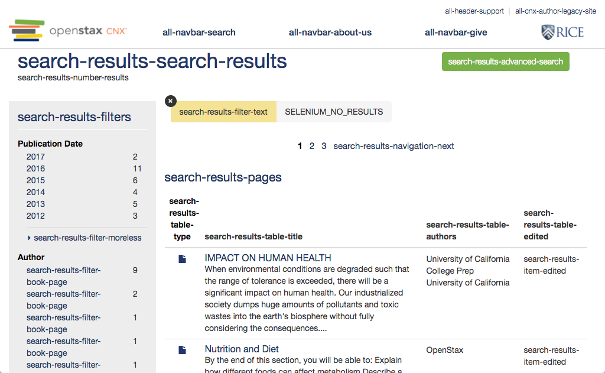

# https://cnx.org/search?q={searchText}



# AJAX Calls

## GET https://cnx.org/users/profile

```json
"<!DOCTYPE html><html lang=\"en-US\"><head><title>OpenStax CNX</title><meta charset=\"utf-8\"><meta name=\"viewport\" content=\"width=device-width,initial-sca ... 733 more"
```

## GET https://archive.cnx.org/extras

```json
{
  "featuredLinks": [
    {
      "abstract": "<div xmlns=\"http://www.w3.org/1999/xhtml\" xmlns:md=\"http://cnx.rice.edu/mdml\" xmlns:c=\"http://cnx.rice.edu/cnxml\" xmlns:html=\"http://www.w3.org/1999/x ... 706 more",
      "id": "d6db603c-cd31-4ca4-be19-d29734673b90",
      "legacy_id": "col11227",
      "legacy_version": "1.4",
      "resourcePath": "/resources/4c2732eca36eb7b56ae1b67dcb510e94744b6c99",
      "title": "Business Fundamentals",
      "type": "CNX Featured",
      "version": "4.3"
    },
    {
      "abstract": "<div xmlns=\"http://www.w3.org/1999/xhtml\" xmlns:md=\"http://cnx.rice.edu/mdml\" xmlns:c=\"http://cnx.rice.edu/cnxml\" xmlns:html=\"http://www.w3.org/1999/x ... 232 more",
      "id": "e7b71f2c-a51e-4c9f-8db2-066a4c3643e4",
      "legacy_id": "col10449",
      "legacy_version": "1.7",
      "resourcePath": "/resources/5fc217ae874f70e5194c172c8be4083abe4282ac",
      "title": "Images of Memorable Cases: 50 Years at the Bedside",
      "type": "CNX Featured",
      "version": "7.2"
    },
    "... skipped 56"
  ],
  "languages_and_count": [
    [
      "... skipped 2"
    ],
    [
      2,
      "... skipped 1"
    ],
    "... skipped 60"
  ],
  "licenses": [
    {
      "code": "by",
      "isValidForPublication": true,
      "name": "Creative Commons Attribution License",
      "url": "http://creativecommons.org/licenses/by/4.0/",
      "version": "4.0"
    },
    {
      "code": "by-nc-sa",
      "isValidForPublication": false,
      "name": "Creative Commons Attribution-NonCommercial-ShareAlike License",
      "url": "http://creativecommons.org/licenses/by-nc-sa/4.0/",
      "version": "4.0"
    },
    "... skipped 9"
  ],
  "messages": [],
  "subjects": [
    {
      "count": {
        "collection": 833,
        "module": 14732
      },
      "id": 5,
      "name": "Science and Technology"
    },
    {
      "count": {
        "collection": 246,
        "module": 3723
      },
      "id": 7,
      "name": "Social Sciences"
    },
    "... skipped 4"
  ]
}
```

## GET https://archive.cnx.org/search?q=SELENIUM_NO_RESULTS

```json
{
  "query": {
    "limits": [
      {
        "tag": "text",
        "value": "SELENIUM_NO_RESULTS"
      }
    ],
    "page": 1,
    "per_page": 20,
    "sort": []
  },
  "results": {
    "auxiliary": {
      "authors": [
        {
          "firstname": "Robert",
          "fullname": "Robert Bear",
          "id": "RobbieBear13",
          "suffix": "",
          "surname": "Bear",
          "title": ""
        },
        {
          "firstname": "",
          "fullname": "OpenStax",
          "id": "OpenStaxCollege",
          "suffix": "",
          "surname": "OpenStax College",
          "title": ""
        },
        "... skipped 15"
      ],
      "types": [
        {
          "id": "application/vnd.org.cnx.collection",
          "name": "Book"
        },
        {
          "id": "application/vnd.org.cnx.module",
          "name": "Page"
        }
      ]
    },
    "items": [
      {
        "authors": [
          {
            "id": "OpenStaxCollege",
            "index": 16
          }
        ],
        "bodySnippet": null,
        "id": "56ae5355-400b-4330-8552-980b0744e2ca@6",
        "keywords": [
          "Van de Graaff generator",
          "xerography",
          "... skipped 5"
        ],
        "mediaType": "application/vnd.org.cnx.module",
        "pubDate": "2012-07-06T02:19:29Z",
        "summarySnippet": "  \n Name several real-world applications of the study of electrostatics. \n  ",
        "title": "Applications of Electrostatics"
      },
      {
        "authors": [
          {
            "id": "bis2ateam",
            "index": 11
          }
        ],
        "bodySnippet": null,
        "id": "4fa27801-3cd6-4821-a1d2-4bd37b60ad55@1",
        "keywords": [
          "archaea",
          "symbiosis",
          "... skipped 2"
        ],
        "mediaType": "application/vnd.org.cnx.module",
        "pubDate": "2016-06-15T17:44:04Z",
        "summarySnippet": " A series of discussion topics relating bacteria and archaea to everyday life ",
        "title": "07.2 Discussion topics on bacteria and archaea  MS MI"
      },
      "... skipped 18"
    ],
    "limits": [
      {
        "tag": "keyword",
        "values": [
          {
            "count": 3,
            "value": "zinc blende"
          },
          {
            "count": 2,
            "value": "zone refining"
          },
          "... skipped 98"
        ]
      },
      {
        "tag": "subject",
        "values": [
          {
            "count": 47,
            "value": "Science and Technology"
          },
          {
            "count": 1,
            "value": "Social Sciences"
          }
        ]
      },
      "... skipped 3"
    ],
    "total": 37
  }
}
```

## GET https://archive.cnx.org/extras

```json
{
  "featuredLinks": [
    {
      "abstract": "<div xmlns=\"http://www.w3.org/1999/xhtml\" xmlns:md=\"http://cnx.rice.edu/mdml\" xmlns:c=\"http://cnx.rice.edu/cnxml\" xmlns:html=\"http://www.w3.org/1999/x ... 706 more",
      "id": "d6db603c-cd31-4ca4-be19-d29734673b90",
      "legacy_id": "col11227",
      "legacy_version": "1.4",
      "resourcePath": "/resources/4c2732eca36eb7b56ae1b67dcb510e94744b6c99",
      "title": "Business Fundamentals",
      "type": "CNX Featured",
      "version": "4.3"
    },
    {
      "abstract": "<div xmlns=\"http://www.w3.org/1999/xhtml\" xmlns:md=\"http://cnx.rice.edu/mdml\" xmlns:c=\"http://cnx.rice.edu/cnxml\" xmlns:html=\"http://www.w3.org/1999/x ... 232 more",
      "id": "e7b71f2c-a51e-4c9f-8db2-066a4c3643e4",
      "legacy_id": "col10449",
      "legacy_version": "1.7",
      "resourcePath": "/resources/5fc217ae874f70e5194c172c8be4083abe4282ac",
      "title": "Images of Memorable Cases: 50 Years at the Bedside",
      "type": "CNX Featured",
      "version": "7.2"
    },
    "... skipped 56"
  ],
  "languages_and_count": [
    [
      "... skipped 2"
    ],
    [
      2,
      "... skipped 1"
    ],
    "... skipped 60"
  ],
  "licenses": [
    {
      "code": "by",
      "isValidForPublication": true,
      "name": "Creative Commons Attribution License",
      "url": "http://creativecommons.org/licenses/by/4.0/",
      "version": "4.0"
    },
    {
      "code": "by-nc-sa",
      "isValidForPublication": false,
      "name": "Creative Commons Attribution-NonCommercial-ShareAlike License",
      "url": "http://creativecommons.org/licenses/by-nc-sa/4.0/",
      "version": "4.0"
    },
    "... skipped 9"
  ],
  "messages": [],
  "subjects": [
    {
      "count": {
        "collection": 833,
        "module": 14732
      },
      "id": 5,
      "name": "Science and Technology"
    },
    {
      "count": {
        "collection": 246,
        "module": 3723
      },
      "id": 7,
      "name": "Social Sciences"
    },
    "... skipped 4"
  ]
}
```


# WCAG2AAA Errors

Showing first 50 of 10 errors

```
warning a[href='#scrollable-content'] WCAG2AAA.Principle1.Guideline1_4.1_4_6.G17.Abs
warning a[href='#results'] WCAG2AAA.Principle1.Guideline1_4.1_4_6.G17.Abs
warning a.navbar-brand[href='/'] WCAG2AAA.Principle1.Guideline1_4.1_4_6.G17.BgImage
warning a[href='/search'].advanced-search.btn WCAG2AAA.Principle1.Guideline1_4.1_4_6.G17.Abs
ERROR a[href='/search'].advanced-search.btn WCAG2AAA.Principle1.Guideline1_4.1_4_6.G17.Fail
ERROR a[href='#'].remove WCAG2AAA.Principle4.Guideline4_1.4_1_2.H91.A.NoContent
warning span.secondary.facebook.circle WCAG2AAA.Principle1.Guideline1_4.1_4_6.G17.BgImage
warning span.secondary.twitter.circle WCAG2AAA.Principle1.Guideline1_4.1_4_6.G17.BgImage
warning span.secondary.google.circle WCAG2AAA.Principle1.Guideline1_4.1_4_6.G17.BgImage
warning span.secondary.mail.circle WCAG2AAA.Principle1.Guideline1_4.1_4_6.G17.BgImage
```

