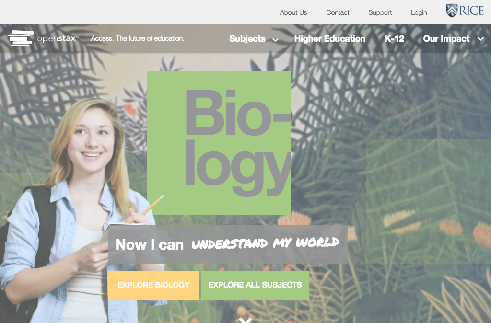

# https://openstax.org



# WCAG2AAA Errors

Showing first 50 of 11 errors

```
ERROR iframe[src='https://a7893320024.cdn.optimizely.com/client_storage/a7893320024.html'] WCAG2A.Principle2.Guideline2_4.2_4_1.H64.1
warning div.multi-button WCAG2A.Principle1.Guideline1_3.1_3_1.H48
ERROR button.expand[type='button'][role='button'][aria-haspopup='true'][aria-label='Toggle Meta Navigation Menu'][tabindex='0'] WCAG2A.Principle4.Guideline4_1.4_1_2.H91.Button.Name
warning div.subject-links.flyin WCAG2A.Principle1.Guideline1_3.1_3_1.H48
warning div.subject-links.flyout WCAG2A.Principle1.Guideline1_3.1_3_1.H48
warning div.subject-links.flyout WCAG2A.Principle1.Guideline1_3.1_3_1.H48
warning div.subject-links.flyout WCAG2A.Principle1.Guideline1_3.1_3_1.H48
warning div.subject-links.flyout WCAG2A.Principle1.Guideline1_3.1_3_1.H48
ERROR a[href='#education'] WCAG2A.Principle4.Guideline4_1.4_1_2.H91.A.NoContent
warning p WCAG2A.Principle1.Guideline1_3.1_3_1.H42
warning h3 WCAG2A.Principle1.Guideline1_3.1_3_1_A.G141
```

# AJAX Calls

## GET https://openstax.org/api/documents?search=press%20kit

```json
null
```

## GET https://openstax.org/api/user

```json
null
```

## GET https://openstax.org/api/sticky

```json
null
```

## GET https://openstax.org/api/news

```json
null
```

## GET https://openstax.org/api/books

```json
null
```

## GET https://openstax.org/api/user_salesforce

```json
null
```

## GET https://openstax.org/api/pages/openstax-homepage

```json
null
```

## GET https://openstax.org/api/images/140

```json
null
```

## GET https://openstax.org/api/images/38

```json
null
```


