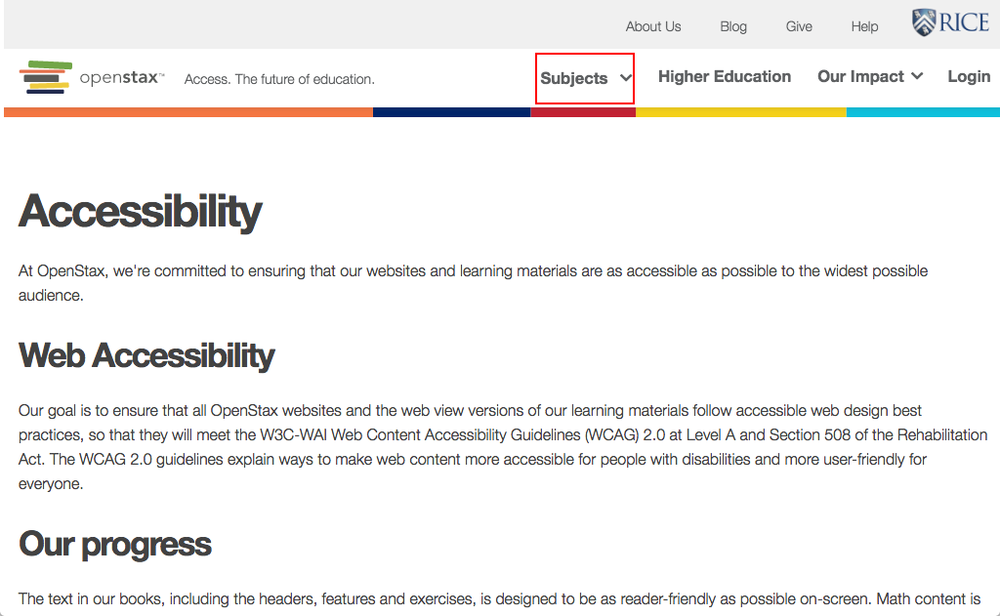

# https://openstax.org/accessibility-statement



# AJAX Calls

## GET https://openstax.org/api/v1/pages?type=news.NewsArticle&fields=slug%2Ctitle%2Cdate%2Cauthor%2Cpin_to_top%2Csubheading%2Cbody%2Carticle_image

```json
{
  "meta": {
    "total_count": 0
  },
  "pages": []
}
```

## GET https://openstax.org/api/user/

```json
[
  {
    "accounts_id": null,
    "groups": [],
    "is_staff": false,
    "is_superuser": false,
    "pending_verification": false,
    "username": ""
  }
]
```


# WCAG2A Errors

Showing first 50 of 1 errors

```
ERROR button.expand[type='button'][role='button'][aria-haspopup='true'][aria-label='Toggle Meta Navigation Menu'][tabindex='0'] WCAG2A.Principle4.Guideline4_1.4_1_2.H91.Button.Name
```

