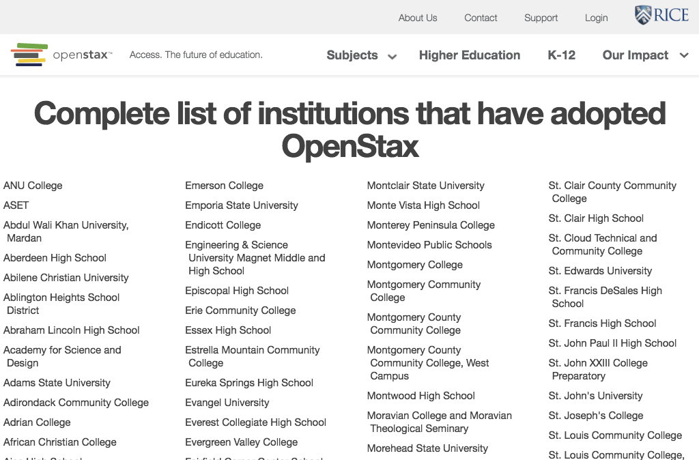

# https://openstax.org/adopters



# AJAX Calls

## GET https://openstax.org/app/models/usermodel.js

```json
"'use strict';\n\nObject.defineProperty(exports, \"__esModule\", {\n    value: true\n});\n\nvar _createClass = function () { function defineProperties(target,  ... 3500 more"
```

## GET https://openstax.org/app/pages/blog/newsPromise.js

```json
"'use strict';\n\nObject.defineProperty(exports, \"__esModule\", {\n    value: true\n});\n\nvar _pagemodel = require('~/models/pagemodel');\n\nvar _pagemodel2 =  ... 419 more"
```

## GET https://openstax.org/app/components/shell/header/header.hbs.js

```json
"\"use strict\";\n\nObject.defineProperty(exports, \"__esModule\", {\n    value: true\n});\nexports.template = undefined;\n\nvar _typeof = typeof Symbol === \"func ... 7839 more"
```

## GET https://openstax.org/app/components/shell/footer/footer.hbs.js

```json
"\"use strict\";\n\nObject.defineProperty(exports, \"__esModule\", {\n    value: true\n});\nexports.template = undefined;\n\nvar _handlebars = require(\"handlebars ... 3079 more"
```

## GET https://openstax.org/app/helpers/backbone/model.js

```json
"'use strict';\n\nObject.defineProperty(exports, \"__esModule\", {\n  value: true\n});\n\nvar _backbone = require('backbone');\n\nvar _backbone2 = _interopRequir ... 376 more"
```

## GET https://openstax.org/app/models/pagemodel.js

```json
"'use strict';\n\nObject.defineProperty(exports, \"__esModule\", {\n    value: true\n});\nexports.default = undefined;\n\nvar _model = require('~/helpers/backbo ... 1958 more"
```

## GET https://openstax.org/app/pages/adopters/adopters.js

```json
"'use strict';\n\nObject.defineProperty(exports, \"__esModule\", {\n    value: true\n});\nexports.default = undefined;\n\nvar _get = function get(object, proper ... 9682 more"
```

## GET https://openstax.org/app/helpers/backbone/loading-view.js

```json
"'use strict';\n\nObject.defineProperty(exports, \"__esModule\", {\n    value: true\n});\n\nvar _createClass = function () { function defineProperties(target,  ... 7101 more"
```

## GET https://openstax.org/api/v1/pages?type=news.NewsArticle&fields=slug%2Ctitle%2Cdate%2Cauthor%2Cpin_to_top%2Csubheading%2Cbody%2Carticle_image

```json
{
  "meta": {
    "total_count": 0
  },
  "pages": []
}
```

## GET https://openstax.org/app/pages/adopters/adopters.hbs.js

```json
"\"use strict\";\n\nObject.defineProperty(exports, \"__esModule\", {\n    value: true\n});\nexports.template = undefined;\n\nvar _handlebars = require(\"handlebars ... 508 more"
```

## GET https://openstax.org/app/pages/adopters/adopter-column.hbs.js

```json
"\"use strict\";\n\nObject.defineProperty(exports, \"__esModule\", {\n    value: true\n});\nexports.template = undefined;\n\nvar _handlebars = require(\"handlebars ... 851 more"
```

## GET https://openstax.org/app/components/loading-section/loading-section.js

```json
"'use strict';\n\nObject.defineProperty(exports, \"__esModule\", {\n    value: true\n});\nexports.default = undefined;\n\nvar _createClass = function () { funct ... 2490 more"
```

## GET https://openstax.org/app/components/loading-section/loading-section.hbs.js

```json
"\"use strict\";\n\nObject.defineProperty(exports, \"__esModule\", {\n    value: true\n});\nexports.template = undefined;\n\nvar _handlebars = require(\"handlebars ... 3688 more"
```

## GET https://openstax.org/api/user/

```json
[
  {
    "accounts_id": null,
    "groups": [],
    "is_staff": false,
    "is_superuser": false,
    "pending_verification": false,
    "username": ""
  }
]
```

## GET https://openstax.org/api/adopters

```json
[
  {
    "description": "This school did a trial spring quarter 2012. Gina Fiorini, Emily sprafk and Jennie Meyer. Thank you for giving Gina, Emily and myself the trial course ... 667 more",
    "name": "Bellevue College",
    "website": "bellevuecollege.edu"
  },
  {
    "description": "GEN CHEM uses lon kappa for all courseware. BIOCHEM uses lon kappa for courseware INTRO CHEM uses lon kappa ORG CHEM uses ACE ===== Sapling Product: O ... 2414 more",
    "name": "University of Illinois, Urbana-Champaign",
    "website": "http://chemistry.illinois.edu/"
  },
  "... skipped 1829"
]
```

