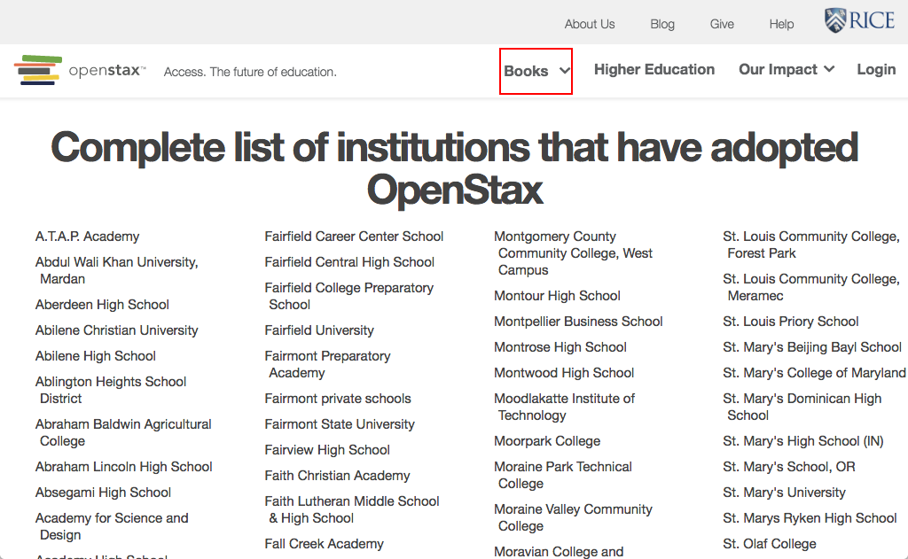

# https://openstax.org/adopters



# AJAX Calls

## GET https://openstax.org/api/v1/pages?type=news.NewsArticle&fields=slug%2Ctitle%2Cdate%2Cauthor%2Cpin_to_top%2Csubheading%2Cbody%2Carticle_image

```json
{
  "meta": {
    "total_count": 0
  },
  "pages": []
}
```

## GET https://openstax.org/api/user/

```json
[
  {
    "accounts_id": null,
    "groups": [],
    "is_staff": false,
    "is_superuser": false,
    "pending_verification": false,
    "username": ""
  }
]
```

## GET https://openstax.org/api/adopters

```json
[
  {
    "description": "This school did a trial spring quarter 2012. Gina Fiorini, Emily sprafk and Jennie Meyer. Thank you for giving Gina, Emily and myself the trial course ... 667 more",
    "name": "Bellevue College",
    "website": "bellevuecollege.edu"
  },
  {
    "description": "GEN CHEM uses lon kappa for all courseware. BIOCHEM uses lon kappa for courseware INTRO CHEM uses lon kappa ORG CHEM uses ACE ===== Sapling Product: O ... 2414 more",
    "name": "University of Illinois, Urbana-Champaign",
    "website": "http://chemistry.illinois.edu/"
  },
  "... skipped 1835"
]
```

