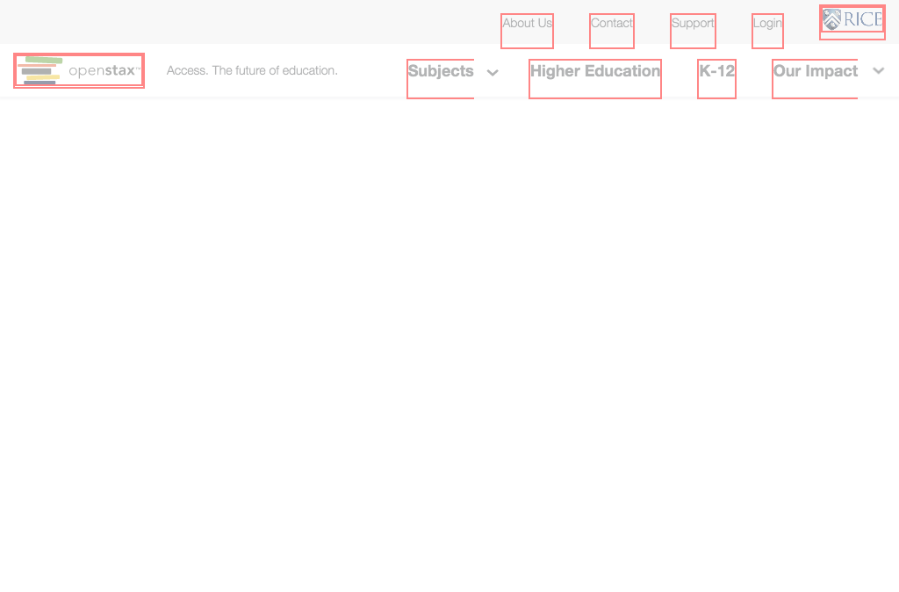

# https://openstax.org/article



# AJAX Calls

## GET https://openstax.org/api/v1/pages?type=news.NewsArticle&fields=slug%2Ctitle%2Cdate%2Cauthor%2Cpin_to_top%2Csubheading%2Cbody%2Carticle_image

```json
{
  "meta": {
    "total_count": 0
  },
  "pages": []
}
```

## GET https://openstax.org/api/user/

```json
[
  {
    "accounts_id": null,
    "groups": [],
    "is_staff": false,
    "is_superuser": false,
    "pending_verification": false,
    "username": ""
  }
]
```

## GET https://openstax.org/api/v1/pages?type=news.NewsArticle&slug=article

```json
{
  "meta": {
    "total_count": 0
  },
  "pages": []
}
```

## GET https://links.services.disqus.com/api/ping?format=jsonp&key=cfdfcf52dffd0a702a61bad27507376d&loc=https%3A%2F%2Fopenstax.org%2Farticle&subId=4331331&v=1&jsonp=vglnk_jsonp_14702632308820

```json
"/**/vglnk_jsonp_14702632308820(\"irfgrllp01000000000DAi5baate6y971\",2000,[],[],{\"debug\":false,\"plugins\":{\"modifiedClicks\":{\"enabled\":false}},\"dynamic\": ... 28 more"
```


# WCAG2A Errors

Showing first 50 of 4 errors

```
ERROR a[href='#maincontent'] WCAG2A.Principle2.Guideline2_4.2_4_1.G1,G123,G124.NoSuchID
ERROR button.expand[type='button'][role='button'][aria-haspopup='true'][aria-label='Toggle Meta Navigation Menu'][tabindex='0'] WCAG2A.Principle4.Guideline4_1.4_1_2.H91.Button.Name
ERROR h1[data-id='title'] WCAG2A.Principle1.Guideline1_3.1_3_1.H42.2
ERROR h2[data-id='subheading'] WCAG2A.Principle1.Guideline1_3.1_3_1.H42.2
```

