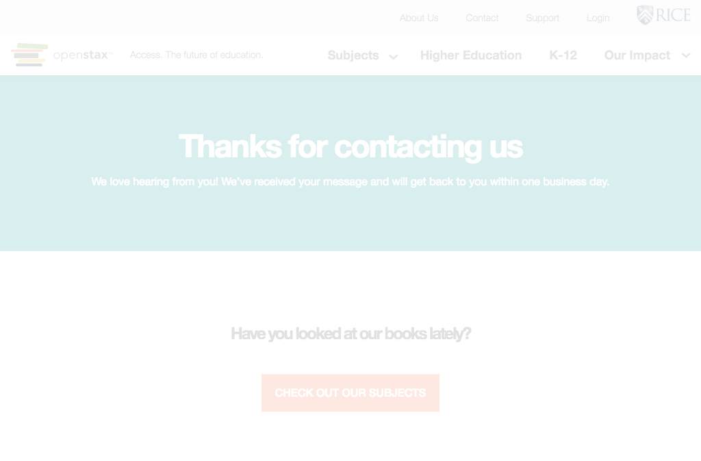

# https://openstax.org/contact-thank-you



# AJAX Calls

## GET https://openstax.org/app/helpers/backbone/model.js

```json
"'use strict';\n\nObject.defineProperty(exports, \"__esModule\", {\n  value: true\n});\n\nvar _backbone = require('backbone');\n\nvar _backbone2 = _interopRequir ... 376 more"
```

## GET https://openstax.org/app/models/pagemodel.js

```json
"'use strict';\n\nObject.defineProperty(exports, \"__esModule\", {\n    value: true\n});\nexports.default = undefined;\n\nvar _model = require('~/helpers/backbo ... 1958 more"
```

## GET https://openstax.org/app/pages/contact-thank-you/contact-thank-you.js

```json
"'use strict';\n\nObject.defineProperty(exports, \"__esModule\", {\n    value: true\n});\nexports.default = undefined;\n\nvar _createClass = function () { funct ... 2511 more"
```

## GET https://openstax.org/api/v1/pages?type=news.NewsArticle&fields=slug%2Ctitle%2Cdate%2Cauthor%2Cpin_to_top%2Csubheading%2Cbody%2Carticle_image

```json
{
  "meta": {
    "total_count": 0
  },
  "pages": []
}
```

## GET https://openstax.org/app/pages/contact-thank-you/contact-thank-you.hbs.js

```json
"\"use strict\";\n\nObject.defineProperty(exports, \"__esModule\", {\n    value: true\n});\nexports.template = undefined;\n\nvar _handlebars = require(\"handlebars ... 1374 more"
```

## GET https://openstax.org/api/user/

```json
[
  {
    "accounts_id": null,
    "groups": [],
    "is_staff": false,
    "is_superuser": false,
    "pending_verification": false,
    "username": ""
  }
]
```

