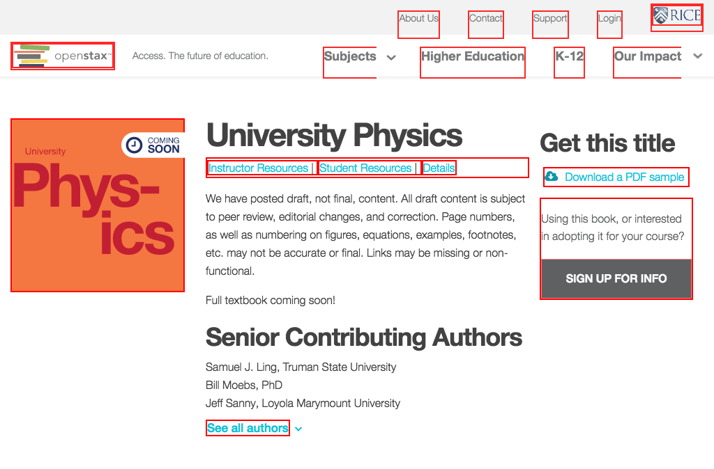

# https://openstax.org/details/university-physics



# AJAX Calls

## GET https://openstax.org/api/v1/pages?type=news.NewsArticle&fields=slug%2Ctitle%2Cdate%2Cauthor%2Cpin_to_top%2Csubheading%2Cbody%2Carticle_image

```json
{
  "meta": {
    "total_count": 0
  },
  "pages": []
}
```

## GET https://openstax.org/api/user/

```json
[
  {
    "accounts_id": null,
    "groups": [],
    "is_staff": false,
    "is_superuser": false,
    "pending_verification": false,
    "username": ""
  }
]
```

## GET https://openstax.org/api/v1/pages?type=books.Book&slug=university-physics

```json
{
  "meta": {
    "total_count": 1
  },
  "pages": [
    {
      "id": 82,
      "meta": {
        "detail_url": "https://openstax.org/api/v1/pages/82/",
        "type": "books.Book"
      },
      "title": "University Physics"
    }
  ]
}
```

## GET https://openstax.org/api/v1/pages/82/

```json
{
  "amazon_blurb": "",
  "amazon_link": "",
  "amazon_price": "0.00",
  "book_allies": [],
  "book_contributing_authors": [
    {
      "country": "",
      "display_at_top": false,
      "name": "Joseph Trout",
      "senior_author": false,
      "university": "Richard Stockton College"
    },
    {
      "country": "",
      "display_at_top": false,
      "name": "Kevin Wheelock",
      "senior_author": false,
      "university": "Bellevue College"
    },
    "... skipped 18"
  ],
  "book_faculty_resources": [],
  "book_quotes": [],
  "book_student_resources": [],
  "bookshare_link": "",
  "bookstore_blurb": "",
  "bookstore_link": "",
  "cnx_id": "",
  "community_resource_cta": null,
  "community_resource_url": "",
  "concept_coach_link": "",
  "cover_url": "https://d3bxy9euw4e147.cloudfront.net/oscms-prodcms/media/documents/university-physics.svg",
  "created": "2016-04-22T17:13:50.442000Z",
  "description": "<p>We have posted draft, not final, content. All draft content is subject to peer review, editorial changes, and correction. Page numbers, as well as  ... 165 more",
  "errata_corrections_link": "",
  "errata_link": "",
  "high_resolution_pdf_url": "https://d3bxy9euw4e147.cloudfront.net/oscms-prodcms/media/documents/Sample_University_Physics_Chapters_20160419.pdf",
  "ibook_link": "",
  "ibook_link_volume_2": "",
  "id": 82,
  "is_ap": false,
  "isbn_10": null,
  "isbn_13": "",
  "license_name": null,
  "license_text": "",
  "license_url": null,
  "license_version": null,
  "meta": {
    "detail_url": "https://openstax.org/api/v1/pages/82/",
    "type": "books.Book"
  },
  "parent": {
    "id": 30,
    "meta": {
      "detail_url": "https://openstax.org/api/v1/pages/30/",
      "type": "books.BookIndex"
    }
  },
  "publish_date": null,
  "slug": "university-physics",
  "student_handbook_url": "https://d3bxy9euw4e147.cloudfront.net/oscms-prodcms/media/documents/Student_Toolkit-FINAL.pdf",
  "subject_name": "Science",
  "table_of_contents": null,
  "title": "University Physics",
  "updated": "2016-07-08T23:03:44.596099Z",
  "webview_link": ""
}
```

## GET https://openstax.org/api/user/

```json
[
  {
    "accounts_id": null,
    "groups": [],
    "is_staff": false,
    "is_superuser": false,
    "pending_verification": false,
    "username": ""
  }
]
```

