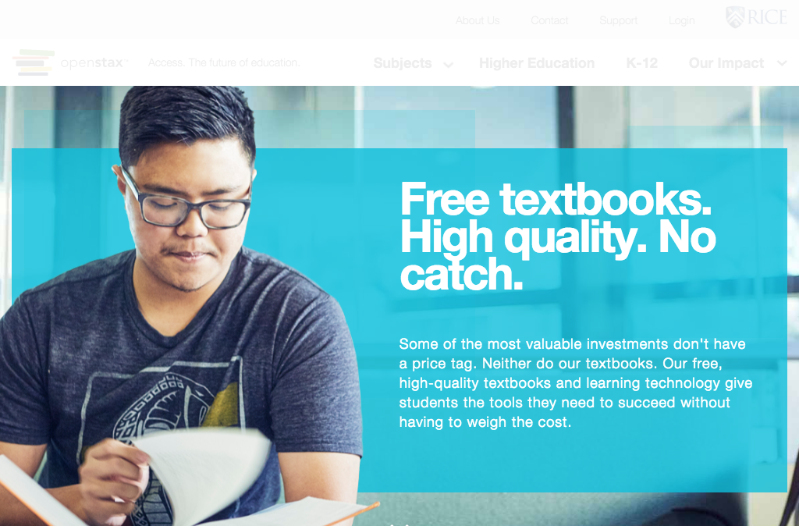

# https://openstax.org/higher-ed



# AJAX Calls

## GET https://openstax.org/app/pages/higher-ed/higher-ed.js

```json
"'use strict';\n\nObject.defineProperty(exports, \"__esModule\", {\n    value: true\n});\nexports.default = undefined;\n\nvar _createClass = function () { funct ... 12711 more"
```

## GET https://openstax.org/app/helpers/backbone/loading-view.js

```json
"'use strict';\n\nObject.defineProperty(exports, \"__esModule\", {\n    value: true\n});\n\nvar _createClass = function () { function defineProperties(target,  ... 7101 more"
```

## GET https://openstax.org/app/models/imagemodel.js

```json
"'use strict';\n\nObject.defineProperty(exports, \"__esModule\", {\n    value: true\n});\nexports.default = undefined;\n\nvar _model = require('~/helpers/backbo ... 1969 more"
```

## GET https://openstax.org/app/components/quotes/quotes.js

```json
"'use strict';\n\nObject.defineProperty(exports, \"__esModule\", {\n    value: true\n});\nexports.default = undefined;\n\nvar _createClass = function () { funct ... 3598 more"
```

## GET https://openstax.org/app/components/buckets/buckets.js

```json
"'use strict';\n\nObject.defineProperty(exports, \"__esModule\", {\n    value: true\n});\nexports.default = undefined;\n\nvar _createClass = function () { funct ... 5140 more"
```

## GET https://openstax.org/api/v1/pages?type=news.NewsArticle&fields=slug%2Ctitle%2Cdate%2Cauthor%2Cpin_to_top%2Csubheading%2Cbody%2Carticle_image

```json
{
  "meta": {
    "total_count": 0
  },
  "pages": []
}
```

## GET https://openstax.org/app/pages/higher-ed/higher-ed.hbs.js

```json
"\"use strict\";\n\nObject.defineProperty(exports, \"__esModule\", {\n    value: true\n});\nexports.template = undefined;\n\nvar _handlebars = require(\"handlebars ... 3535 more"
```

## GET https://openstax.org/app/components/products-boxes/products-boxes.js

```json
"'use strict';\n\nObject.defineProperty(exports, \"__esModule\", {\n    value: true\n});\nexports.default = undefined;\n\nvar _createClass = function () { funct ... 6037 more"
```

## GET https://openstax.org/app/components/loading-section/loading-section.js

```json
"'use strict';\n\nObject.defineProperty(exports, \"__esModule\", {\n    value: true\n});\nexports.default = undefined;\n\nvar _createClass = function () { funct ... 2490 more"
```

## GET https://openstax.org/app/components/quote/quote.js

```json
"'use strict';\n\nObject.defineProperty(exports, \"__esModule\", {\n    value: true\n});\nexports.default = undefined;\n\nvar _createClass = function () { funct ... 2433 more"
```

## GET https://openstax.org/app/components/quotes/quotes.hbs.js

```json
"\"use strict\";\n\nObject.defineProperty(exports, \"__esModule\", {\n    value: true\n});\nexports.template = undefined;\n\nvar _handlebars = require(\"handlebars ... 439 more"
```

## GET https://openstax.org/app/components/bucket/bucket.js

```json
"'use strict';\n\nObject.defineProperty(exports, \"__esModule\", {\n    value: true\n});\nexports.default = undefined;\n\nvar _createClass = function () { funct ... 2473 more"
```

## GET https://openstax.org/app/components/buckets/buckets.hbs.js

```json
"\"use strict\";\n\nObject.defineProperty(exports, \"__esModule\", {\n    value: true\n});\nexports.template = undefined;\n\nvar _handlebars = require(\"handlebars ... 449 more"
```

## GET https://openstax.org/app/components/loading-section/loading-section.hbs.js

```json
"\"use strict\";\n\nObject.defineProperty(exports, \"__esModule\", {\n    value: true\n});\nexports.template = undefined;\n\nvar _handlebars = require(\"handlebars ... 3688 more"
```

## GET https://openstax.org/app/components/quote/quote.hbs.js

```json
"\"use strict\";\n\nObject.defineProperty(exports, \"__esModule\", {\n    value: true\n});\nexports.template = undefined;\n\nvar _typeof = typeof Symbol === \"func ... 5560 more"
```

## GET https://openstax.org/app/components/bucket/bucket.hbs.js

```json
"\"use strict\";\n\nObject.defineProperty(exports, \"__esModule\", {\n    value: true\n});\nexports.template = undefined;\n\nvar _typeof = typeof Symbol === \"func ... 2820 more"
```

## GET https://openstax.org/app/components/product-box/product-box.js

```json
"'use strict';\n\nObject.defineProperty(exports, \"__esModule\", {\n    value: true\n});\nexports.default = undefined;\n\nvar _createClass = function () { funct ... 2465 more"
```

## GET https://openstax.org/app/components/products-boxes/products-boxes.hbs.js

```json
"\"use strict\";\n\nObject.defineProperty(exports, \"__esModule\", {\n    value: true\n});\nexports.template = undefined;\n\nvar _handlebars = require(\"handlebars ... 490 more"
```

## GET https://openstax.org/app/components/product-box/product-box.hbs.js

```json
"\"use strict\";\n\nObject.defineProperty(exports, \"__esModule\", {\n    value: true\n});\nexports.template = undefined;\n\nvar _typeof = typeof Symbol === \"func ... 2189 more"
```

## GET https://openstax.org/api/user/

```json
[
  {
    "accounts_id": null,
    "groups": [],
    "is_staff": false,
    "is_superuser": false,
    "pending_verification": false,
    "username": ""
  }
]
```

## GET https://openstax.org/api/v1/pages?type=pages.HigherEducation

```json
{
  "meta": {
    "total_count": 1
  },
  "pages": [
    {
      "id": 88,
      "meta": {
        "detail_url": "https://openstax.org/api/v1/pages/88/",
        "type": "pages.HigherEducation"
      },
      "title": "Higher Education"
    }
  ]
}
```

## GET https://openstax.org/api/v1/pages/88/

```json
{
  "adopt_cta": "Contact Us",
  "adopt_description": "<p>If you are an administrator interested in driving adoptions of OpenStax textbooks at your institution, we are here to support you!</p>",
  "adopt_heading": "Adopt as an Institution",
  "get_started_heading": "Getting Started",
  "get_started_step_1_cta": "View Books",
  "get_started_step_1_description": "<p>The entire contents of our free textbooks are available online. Review a book or chapter and see the quality for yourself.</p>",
  "get_started_step_1_heading": "Review a Textbook",
  "get_started_step_2_cta": "Create Account",
  "get_started_step_2_description": "<p>We provide additional free instructor-only resources like test banks and solution manuals to plan your course.</p>",
  "get_started_step_2_heading": "Create a Faculty Account",
  "get_started_step_3_cta": "Adopt",
  "get_started_step_3_description": "<p>Access to our textbooks is completely free. Let us know you've adopted, and share our URL with your students! You can also recommend a book as an o ... 27 more",
  "get_started_step_3_heading": "Adopt a Textbook",
  "id": 88,
  "intro_description": "<p>Some of the most valuable investments don't have a price tag. Neither do our textbooks. Our free, high-quality textbooks and learning technology gi ... 80 more",
  "intro_heading": "Free textbooks. High quality. No catch.",
  "meta": {
    "detail_url": "https://openstax.org/api/v1/pages/88/",
    "type": "pages.HigherEducation"
  },
  "parent": {
    "id": 29,
    "meta": {
      "detail_url": "https://openstax.org/api/v1/pages/29/",
      "type": "pages.HomePage"
    }
  },
  "row_0_box_1_content": "<p>\"Openstax makes acquisition of a textbook a no cost, one click experience.\" </p><p><b><i>— Alexander Wathen, <br/>University of Houston—Downtown</i ... 14 more",
  "row_0_box_1_cta": "",
  "row_0_box_1_image": null,
  "row_0_box_1_image_alignment": "L",
  "row_0_box_1_link": "",
  "row_0_box_2_content": "<p>Concept Coach is our free new tool that helps college students understand and retain what they’ve read. We’re recruiting faculty for our Fall 2016  ... 10 more",
  "row_0_box_2_cta": "Sign up",
  "row_0_box_2_image": {
    "id": 42,
    "meta": {
      "detail_url": "https://openstax.org/api/v1/images/42/",
      "type": "wagtailimages.Image"
    }
  },
  "row_0_box_2_image_alignment": "L",
  "row_0_box_2_link": "http://cc.openstax.org/sign-up",
  "row_0_box_3_content": "",
  "row_0_box_3_cta": "",
  "row_0_box_3_image": null,
  "row_0_box_3_image_alignment": null,
  "row_0_box_3_link": "",
  "row_1_box_1_cta": "Explore Our Subjects",
  "row_1_box_1_description": "<p>All of our textbooks are peer-reviewed and absolutely free. They meet standard scope and sequence requirements and come in web view, PDF, iBooks, o ... 31 more",
  "row_1_box_1_heading": "Our Books",
  "row_1_box_1_image": {
    "id": 37,
    "meta": {
      "detail_url": "https://openstax.org/api/v1/images/37/",
      "type": "wagtailimages.Image"
    }
  },
  "row_1_box_1_link": "http://openstax.org/subjects",
  "row_1_box_2_cta": "Learn More",
  "row_1_box_2_description": "<p>We're integrating our adaptive learning technology with our college textbooks to improve student reading comprehension at zero cost.</p>",
  "row_1_box_2_heading": "Concept Coach",
  "row_1_box_2_image": {
    "id": 38,
    "meta": {
      "detail_url": "https://openstax.org/api/v1/images/38/",
      "type": "wagtailimages.Image"
    }
  },
  "row_1_box_2_link": "http://cc.openstax.org",
  "row_1_box_3_cta": "Discover Free Content",
  "row_1_box_3_description": "<p>OpenStax CNX is an open library of educational content where anyone can contribute. View, share, and add material that you can remix and reuse for  ... 16 more",
  "row_1_box_3_heading": "OpenStax CNX",
  "row_1_box_3_image": {
    "id": 39,
    "meta": {
      "detail_url": "https://openstax.org/api/v1/images/39/",
      "type": "wagtailimages.Image"
    }
  },
  "row_1_box_3_link": "http://cnx.org",
  "row_2_box_1_cta": "See Our Impact",
  "row_2_box_1_description": "<p>Faculty at over 3,000 institutions are opening doors for student success by adopting OpenStax.</p>",
  "row_2_box_1_heading": "Our Impact",
  "row_2_box_1_link": "http://openstax.org/impact",
  "row_2_box_2_cta": "View Partners",
  "row_2_box_2_description": "<p>OpenStax partners have united with us to increase access to high-quality learning materials. Their low-cost tools integrate seamlessly with OpenSta ... 12 more",
  "row_2_box_2_heading": "OpenStax Partners",
  "row_2_box_2_link": "http://openstax.org/partners",
  "search_description": "",
  "seo_title": "",
  "slug": "higher-education",
  "title": "Higher Education"
}
```

## GET https://openstax.org/api/v0/images/42

```json
{
  "created_at": "2016-06-28T14:25:38.167565Z",
  "file": "https://d3bxy9euw4e147.cloudfront.net/oscms-prodcms/media/original_images/CCStudentsLargerPhoto.jpg",
  "height": 3850,
  "id": 42,
  "title": "Concept Coach Students Larger Image",
  "width": 4206
}
```

