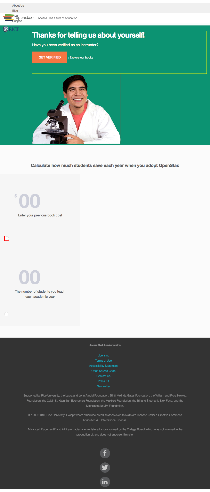

# https://openstax.org/interest-confirmation



# WCAG2AAA Errors

Showing first 50 of 8 errors

```
ERROR iframe[src='https://a7893320024.cdn.optimizely.com/client_storage/a7893320024.html'] WCAG2A.Principle2.Guideline2_4.2_4_1.H64.1
ERROR a[href='#maincontent'] WCAG2A.Principle2.Guideline2_4.2_4_1.G1,G123,G124.NoSuchID
warning div.multi-button WCAG2A.Principle1.Guideline1_3.1_3_1.H48
ERROR button.expand[type='button'][role='button'][aria-haspopup='true'][aria-label='Toggle Meta Navigation Menu'][tabindex='0'] WCAG2A.Principle4.Guideline4_1.4_1_2.H91.Button.Name
warning div.text-content.left-aligned WCAG2A.Principle1.Guideline1_3.1_3_1.H48
ERROR img[src='/images/components/student-chemistry.png'] WCAG2A.Principle1.Guideline1_1.1_1_1.H37
ERROR img[src='/images/components/unchecked-radio.svg'] WCAG2A.Principle1.Guideline1_1.1_1_1.H37
ERROR img[src='/images/components/unchecked-radio.svg'] WCAG2A.Principle1.Guideline1_1.1_1_1.H37
```

# AJAX Calls

## GET https://openstax.org/api/documents?search=press%20kit

```json
null
```

## GET https://openstax.org/api/sticky

```json
null
```

## GET https://openstax.org/api/user

```json
null
```

## GET https://openstax.org/api/news

```json
null
```

## GET https://openstax.org/api/user_salesforce

```json
null
```

## GET https://openstax.org/api/v2/pages/?type=books.Book&fields=title,id&limit=250

```json
null
```


