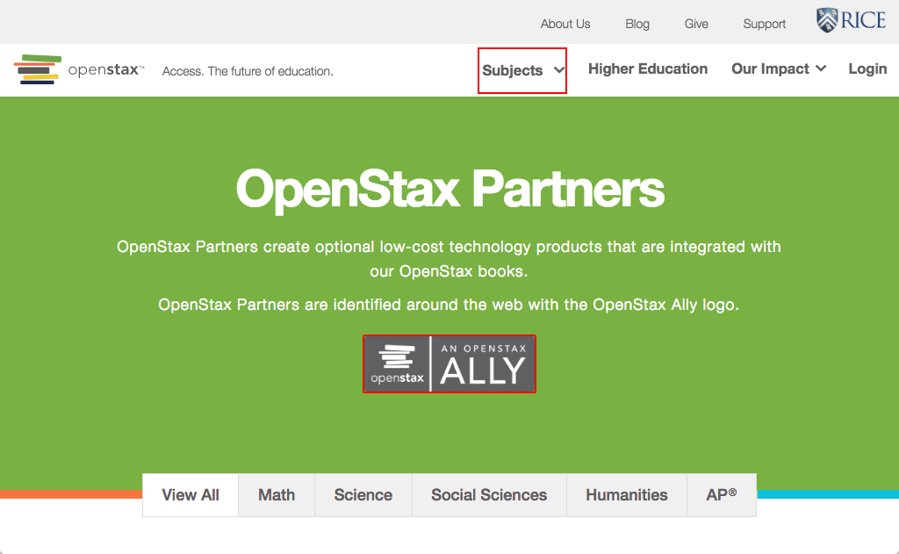

# https://openstax.org/partners



# AJAX Calls

## GET https://openstax.org/api/v1/pages?type=news.NewsArticle&fields=slug%2Ctitle%2Cdate%2Cauthor%2Cpin_to_top%2Csubheading%2Cbody%2Carticle_image

```json
{
  "meta": {
    "total_count": 0
  },
  "pages": []
}
```

## GET https://openstax.org/api/user/

```json
[
  {
    "accounts_id": null,
    "groups": [],
    "is_staff": false,
    "is_superuser": false,
    "pending_verification": false,
    "username": ""
  }
]
```

## GET https://openstax.org/api/v1/pages?type=pages.EcosystemAllies&fields=title%2Cclassroom_text

```json
{
  "meta": {
    "total_count": 1
  },
  "pages": [
    {
      "classroom_text": "<p>\n\n\n\n\n\n\n\n</p><p>OpenStax Partners have united with us in our mission to make high-quality learning materials affordable and accessible to students a ... 90 more",
      "id": 50,
      "meta": {
        "detail_url": "https://openstax.org/api/v1/pages/50/",
        "type": "pages.EcosystemAllies"
      },
      "title": "Partners"
    }
  ]
}
```

## GET https://openstax.org/api/v1/pages?type=allies.Ally&fields=ally_subject_list%2Ctitle%2Cshort_description%2Clong_description%2Cheading%2Cis_ap%2Cally_bw_logo

```json
{
  "meta": {
    "total_count": 18
  },
  "pages": [
    {
      "ally_bw_logo": "https://d3bxy9euw4e147.cloudfront.net/oscms-prodcms/media/original_images/emath-1_gray.png",
      "ally_subject_list": [
        "Math"
      ],
      "heading": "eMath",
      "id": 87,
      "is_ap": false,
      "long_description": "<p>eMath is a fully customizable online adaptive courseware focusing on student success. eMath provides ample options to help students learn and perfo ... 1290 more",
      "meta": {
        "detail_url": "https://openstax.org/api/v1/pages/87/",
        "type": "allies.Ally"
      },
      "short_description": "<p>eMath is a fully customizable online adaptive courseware focusing on student success. eMath supports textbooks from OpenStax with tens of thousands ... 81 more",
      "title": "eMath"
    },
    {
      "ally_bw_logo": "https://d3bxy9euw4e147.cloudfront.net/oscms-prodcms/media/original_images/Rice_Online_Learning_logo_BW.png",
      "ally_subject_list": [
        "Science"
      ],
      "heading": "Rice Online Learning",
      "id": 92,
      "is_ap": true,
      "long_description": "<p>Rice Online Learning offers the AP<sup>®</sup> Physics 1 online course through the edX platform and has partnered with OpenStax to bring this conte ... 766 more",
      "meta": {
        "detail_url": "https://openstax.org/api/v1/pages/92/",
        "type": "allies.Ally"
      },
      "short_description": "<p>Rice Online Learning offers the AP<sup>®</sup> Physics 1 online course through the edX platform and has partnered with OpenStax to bring this conte ... 48 more",
      "title": "Rice Online Learning"
    },
    "... skipped 16"
  ]
}
```


# WCAG2A Errors

Showing first 50 of 53 errors

```
ERROR a.logo-text[href='#Connect For Education-blurb'] WCAG2A.Principle1.Guideline1_1.1_1_1.H30.2
ERROR a.logo-text[href='#CourseWeaver-blurb'] WCAG2A.Principle1.Guideline1_1.1_1_1.H30.2
ERROR a.logo-text[href='#eMath-blurb'] WCAG2A.Principle1.Guideline1_1.1_1_1.H30.2
ERROR a.logo-text[href='#Expert TA-blurb'] WCAG2A.Principle1.Guideline1_1.1_1_1.H30.2
ERROR a.logo-text[href='#Junction-blurb'] WCAG2A.Principle1.Guideline1_1.1_1_1.H30.2
ERROR a.logo-text[href='#Lrnr-blurb'] WCAG2A.Principle1.Guideline1_1.1_1_1.H30.2
ERROR a.logo-text[href='#Lumen-blurb'] WCAG2A.Principle1.Guideline1_1.1_1_1.H30.2
ERROR a.logo-text[href='#Memory Science-blurb'] WCAG2A.Principle1.Guideline1_1.1_1_1.H30.2
ERROR a.logo-text[href='#Odigia-blurb'] WCAG2A.Principle1.Guideline1_1.1_1_1.H30.2
ERROR a.logo-text[href='#panOpen-blurb'] WCAG2A.Principle1.Guideline1_1.1_1_1.H30.2
ERROR a.logo-text[href='#Rice Online Learning-blurb'] WCAG2A.Principle1.Guideline1_1.1_1_1.H30.2
ERROR a.logo-text[href='#Sapling Learning-blurb'] WCAG2A.Principle1.Guideline1_1.1_1_1.H30.2
ERROR a.logo-text[href='#SimBio-blurb'] WCAG2A.Principle1.Guideline1_1.1_1_1.H30.2
ERROR a.logo-text[href='#Top Hat-blurb'] WCAG2A.Principle1.Guideline1_1.1_1_1.H30.2
ERROR a.logo-text[href='#WebAssign-blurb'] WCAG2A.Principle1.Guideline1_1.1_1_1.H30.2
ERROR a.logo-text[href='#Wiley-blurb'] WCAG2A.Principle1.Guideline1_1.1_1_1.H30.2
ERROR a.logo-text[href='#XYZ Homework-blurb'] WCAG2A.Principle1.Guideline1_1.1_1_1.H30.2
warning p WCAG2A.Principle1.Guideline1_3.1_3_1.H48
ERROR a[href='#filter'].to-top WCAG2A.Principle2.Guideline2_4.2_4_1.G1,G123,G124.NoSuchID
ERROR a[href='#filter'].to-top WCAG2A.Principle2.Guideline2_4.2_4_1.G1,G123,G124.NoSuchID
ERROR a[href='#filter'].to-top WCAG2A.Principle2.Guideline2_4.2_4_1.G1,G123,G124.NoSuchID
warning p WCAG2A.Principle1.Guideline1_3.1_3_1.H48
ERROR a[href='#filter'].to-top WCAG2A.Principle2.Guideline2_4.2_4_1.G1,G123,G124.NoSuchID
warning p WCAG2A.Principle1.Guideline1_3.1_3_1.H48
ERROR a[href='#filter'].to-top WCAG2A.Principle2.Guideline2_4.2_4_1.G1,G123,G124.NoSuchID
warning p WCAG2A.Principle1.Guideline1_3.1_3_1.H48
ERROR a[href='#filter'].to-top WCAG2A.Principle2.Guideline2_4.2_4_1.G1,G123,G124.NoSuchID
warning p WCAG2A.Principle1.Guideline1_3.1_3_1.H48
ERROR a[href='#filter'].to-top WCAG2A.Principle2.Guideline2_4.2_4_1.G1,G123,G124.NoSuchID
warning p WCAG2A.Principle1.Guideline1_3.1_3_1.H48
ERROR a[href='#filter'].to-top WCAG2A.Principle2.Guideline2_4.2_4_1.G1,G123,G124.NoSuchID
warning p WCAG2A.Principle1.Guideline1_3.1_3_1.H48
ERROR a[href='#filter'].to-top WCAG2A.Principle2.Guideline2_4.2_4_1.G1,G123,G124.NoSuchID
warning p WCAG2A.Principle1.Guideline1_3.1_3_1.H48
ERROR a[href='#filter'].to-top WCAG2A.Principle2.Guideline2_4.2_4_1.G1,G123,G124.NoSuchID
warning p WCAG2A.Principle1.Guideline1_3.1_3_1.H48
ERROR a[href='#filter'].to-top WCAG2A.Principle2.Guideline2_4.2_4_1.G1,G123,G124.NoSuchID
ERROR a[href='#filter'].to-top WCAG2A.Principle2.Guideline2_4.2_4_1.G1,G123,G124.NoSuchID
warning p WCAG2A.Principle1.Guideline1_3.1_3_1.H48
ERROR a[href='#filter'].to-top WCAG2A.Principle2.Guideline2_4.2_4_1.G1,G123,G124.NoSuchID
warning p WCAG2A.Principle1.Guideline1_3.1_3_1.H48
ERROR a[href='#filter'].to-top WCAG2A.Principle2.Guideline2_4.2_4_1.G1,G123,G124.NoSuchID
warning p WCAG2A.Principle1.Guideline1_3.1_3_1.H48
ERROR a[href='#filter'].to-top WCAG2A.Principle2.Guideline2_4.2_4_1.G1,G123,G124.NoSuchID
warning p WCAG2A.Principle1.Guideline1_3.1_3_1.H48
ERROR a[href='#filter'].to-top WCAG2A.Principle2.Guideline2_4.2_4_1.G1,G123,G124.NoSuchID
warning p WCAG2A.Principle1.Guideline1_3.1_3_1.H48
ERROR a[href='#filter'].to-top WCAG2A.Principle2.Guideline2_4.2_4_1.G1,G123,G124.NoSuchID
warning p WCAG2A.Principle1.Guideline1_3.1_3_1.H48
ERROR a[href='#filter'].to-top WCAG2A.Principle2.Guideline2_4.2_4_1.G1,G123,G124.NoSuchID
undefined undefined undefined
```

