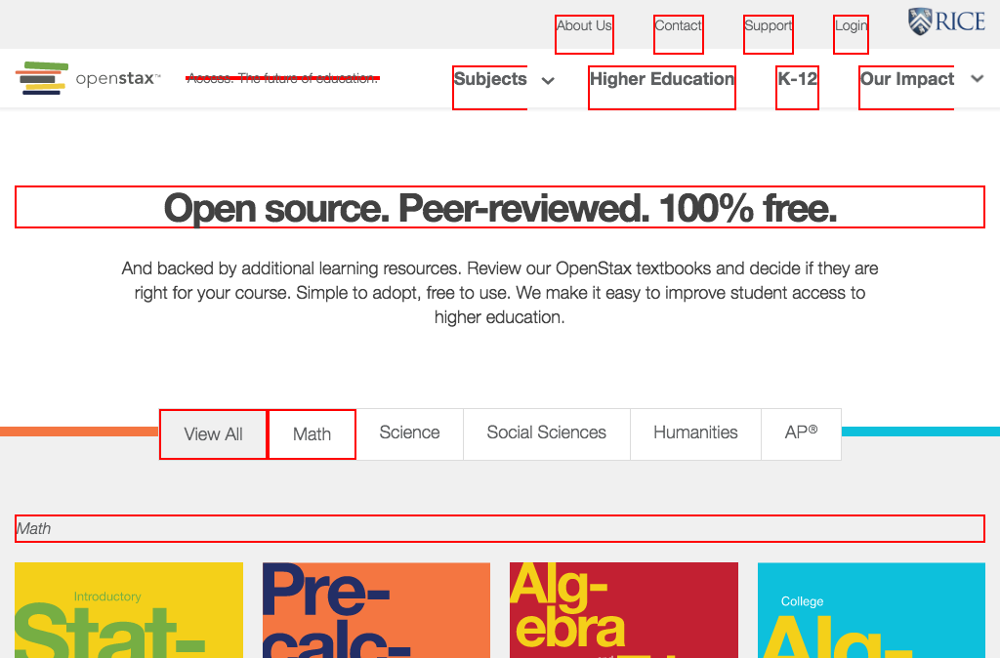

# https://openstax.org/subjects



# WCAG2AAA Errors

Showing first 50 of 145 errors

```
warning div.option WCAG2A.Principle1.Guideline1_3.1_3_1.H48
ERROR h3 WCAG2A.Principle1.Guideline1_3.1_3_1.H42.2
warning div.pdf-submenu WCAG2A.Principle1.Guideline1_3.1_3_1.H48
warning div.remover WCAG2A.Principle1.Guideline1_3.1_3_1.H42
warning div.remover WCAG2A.Principle1.Guideline1_3.1_3_1.H42
ERROR h3 WCAG2A.Principle1.Guideline1_3.1_3_1.H42.2
warning div.pdf-submenu WCAG2A.Principle1.Guideline1_3.1_3_1.H48
warning div.remover WCAG2A.Principle1.Guideline1_3.1_3_1.H42
warning div.remover WCAG2A.Principle1.Guideline1_3.1_3_1.H42
ERROR h3 WCAG2A.Principle1.Guideline1_3.1_3_1.H42.2
warning div.pdf-submenu WCAG2A.Principle1.Guideline1_3.1_3_1.H48
warning div.remover WCAG2A.Principle1.Guideline1_3.1_3_1.H42
warning div.remover WCAG2A.Principle1.Guideline1_3.1_3_1.H42
ERROR h3 WCAG2A.Principle1.Guideline1_3.1_3_1.H42.2
warning div.pdf-submenu WCAG2A.Principle1.Guideline1_3.1_3_1.H48
warning div.remover WCAG2A.Principle1.Guideline1_3.1_3_1.H42
warning div.remover WCAG2A.Principle1.Guideline1_3.1_3_1.H42
ERROR h3 WCAG2A.Principle1.Guideline1_3.1_3_1.H42.2
warning div.pdf-submenu WCAG2A.Principle1.Guideline1_3.1_3_1.H48
warning div.remover WCAG2A.Principle1.Guideline1_3.1_3_1.H42
warning div.remover WCAG2A.Principle1.Guideline1_3.1_3_1.H42
ERROR h3 WCAG2A.Principle1.Guideline1_3.1_3_1.H42.2
warning div.pdf-submenu WCAG2A.Principle1.Guideline1_3.1_3_1.H48
warning div.remover WCAG2A.Principle1.Guideline1_3.1_3_1.H42
warning div.remover WCAG2A.Principle1.Guideline1_3.1_3_1.H42
ERROR h3 WCAG2A.Principle1.Guideline1_3.1_3_1.H42.2
warning div.pdf-submenu WCAG2A.Principle1.Guideline1_3.1_3_1.H48
warning div.remover WCAG2A.Principle1.Guideline1_3.1_3_1.H42
warning div.remover WCAG2A.Principle1.Guideline1_3.1_3_1.H42
ERROR h3 WCAG2A.Principle1.Guideline1_3.1_3_1.H42.2
warning div.pdf-submenu WCAG2A.Principle1.Guideline1_3.1_3_1.H48
warning div.remover WCAG2A.Principle1.Guideline1_3.1_3_1.H42
warning div.remover WCAG2A.Principle1.Guideline1_3.1_3_1.H42
ERROR h3 WCAG2A.Principle1.Guideline1_3.1_3_1.H42.2
warning div.pdf-submenu WCAG2A.Principle1.Guideline1_3.1_3_1.H48
warning div.remover WCAG2A.Principle1.Guideline1_3.1_3_1.H42
warning div.remover WCAG2A.Principle1.Guideline1_3.1_3_1.H42
ERROR h3 WCAG2A.Principle1.Guideline1_3.1_3_1.H42.2
warning div.pdf-submenu WCAG2A.Principle1.Guideline1_3.1_3_1.H48
warning div.remover WCAG2A.Principle1.Guideline1_3.1_3_1.H42
warning div.remover WCAG2A.Principle1.Guideline1_3.1_3_1.H42
warning div.option WCAG2A.Principle1.Guideline1_3.1_3_1.H48
ERROR h3 WCAG2A.Principle1.Guideline1_3.1_3_1.H42.2
warning div.pdf-submenu WCAG2A.Principle1.Guideline1_3.1_3_1.H48
warning div.remover WCAG2A.Principle1.Guideline1_3.1_3_1.H42
warning div.remover WCAG2A.Principle1.Guideline1_3.1_3_1.H42
ERROR h3 WCAG2A.Principle1.Guideline1_3.1_3_1.H42.2
warning div.pdf-submenu WCAG2A.Principle1.Guideline1_3.1_3_1.H48
warning div.remover WCAG2A.Principle1.Guideline1_3.1_3_1.H42
warning div.remover WCAG2A.Principle1.Guideline1_3.1_3_1.H42
undefined undefined undefined
```

# AJAX Calls

## GET https://openstax.org/api/sticky

```json
null
```

## GET https://openstax.org/api/documents?search=press%20kit

```json
null
```

## GET https://openstax.org/api/user

```json
null
```

## GET https://openstax.org/api/news

```json
null
```

## GET https://openstax.org/api/user_salesforce

```json
null
```

## GET https://openstax.org/api/v2/pages/?type=books.Book&fields=title,id&limit=250

```json
null
```

## GET https://openstax.org/api/books

```json
null
```

## GET https://openstax.org/api/books

```json
null
```


