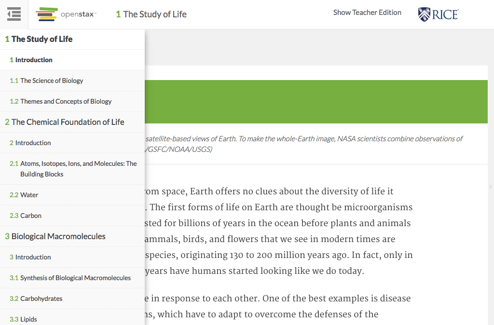

# https://tutor-{env}.openstax.org/books/{bookId}



# AJAX Calls


# WCAG2AAA Errors

Showing first 50 of 256 errors

```
ERROR span.section-number WCAG2AAA.Principle1.Guideline1_4.1_4_6.G17.Fail
ERROR span.section-number WCAG2AAA.Principle1.Guideline1_4.1_4_6.G17.Fail
ERROR span.section-number WCAG2AAA.Principle1.Guideline1_4.1_4_6.G17.Fail
ERROR span.section-number WCAG2AAA.Principle1.Guideline1_4.1_4_6.G17.Fail
ERROR span.section-number WCAG2AAA.Principle1.Guideline1_4.1_4_6.G17.Fail
ERROR span.section-number WCAG2AAA.Principle1.Guideline1_4.1_4_6.G17.Fail
ERROR span.section-number WCAG2AAA.Principle1.Guideline1_4.1_4_6.G17.Fail
ERROR span.section-number WCAG2AAA.Principle1.Guideline1_4.1_4_6.G17.Fail
ERROR span.section-number WCAG2AAA.Principle1.Guideline1_4.1_4_6.G17.Fail
ERROR span.section-number WCAG2AAA.Principle1.Guideline1_4.1_4_6.G17.Fail
ERROR span.section-number WCAG2AAA.Principle1.Guideline1_4.1_4_6.G17.Fail
ERROR span.section-number WCAG2AAA.Principle1.Guideline1_4.1_4_6.G17.Fail
ERROR span.section-number WCAG2AAA.Principle1.Guideline1_4.1_4_6.G17.Fail
ERROR span.section-number WCAG2AAA.Principle1.Guideline1_4.1_4_6.G17.Fail
ERROR span.section-number WCAG2AAA.Principle1.Guideline1_4.1_4_6.G17.Fail
ERROR span.section-number WCAG2AAA.Principle1.Guideline1_4.1_4_6.G17.Fail
ERROR span.section-number WCAG2AAA.Principle1.Guideline1_4.1_4_6.G17.Fail
ERROR span.section-number WCAG2AAA.Principle1.Guideline1_4.1_4_6.G17.Fail
ERROR span.section-number WCAG2AAA.Principle1.Guideline1_4.1_4_6.G17.Fail
ERROR span.section-number WCAG2AAA.Principle1.Guideline1_4.1_4_6.G17.Fail
ERROR span.section-number WCAG2AAA.Principle1.Guideline1_4.1_4_6.G17.Fail
ERROR span.section-number WCAG2AAA.Principle1.Guideline1_4.1_4_6.G17.Fail
ERROR span.section-number WCAG2AAA.Principle1.Guideline1_4.1_4_6.G17.Fail
ERROR span.section-number WCAG2AAA.Principle1.Guideline1_4.1_4_6.G17.Fail
ERROR span.section-number WCAG2AAA.Principle1.Guideline1_4.1_4_6.G17.Fail
ERROR span.section-number WCAG2AAA.Principle1.Guideline1_4.1_4_6.G17.Fail
ERROR span.section-number WCAG2AAA.Principle1.Guideline1_4.1_4_6.G17.Fail
ERROR span.section-number WCAG2AAA.Principle1.Guideline1_4.1_4_6.G17.Fail
ERROR span.section-number WCAG2AAA.Principle1.Guideline1_4.1_4_6.G17.Fail
ERROR span.section-number WCAG2AAA.Principle1.Guideline1_4.1_4_6.G17.Fail
ERROR span.section-number WCAG2AAA.Principle1.Guideline1_4.1_4_6.G17.Fail
ERROR span.section-number WCAG2AAA.Principle1.Guideline1_4.1_4_6.G17.Fail
ERROR span.section-number WCAG2AAA.Principle1.Guideline1_4.1_4_6.G17.Fail
ERROR span.section-number WCAG2AAA.Principle1.Guideline1_4.1_4_6.G17.Fail
ERROR span.section-number WCAG2AAA.Principle1.Guideline1_4.1_4_6.G17.Fail
ERROR span.section-number WCAG2AAA.Principle1.Guideline1_4.1_4_6.G17.Fail
ERROR span.section-number WCAG2AAA.Principle1.Guideline1_4.1_4_6.G17.Fail
ERROR span.section-number WCAG2AAA.Principle1.Guideline1_4.1_4_6.G17.Fail
ERROR span.section-number WCAG2AAA.Principle1.Guideline1_4.1_4_6.G17.Fail
ERROR span.section-number WCAG2AAA.Principle1.Guideline1_4.1_4_6.G17.Fail
ERROR span.section-number WCAG2AAA.Principle1.Guideline1_4.1_4_6.G17.Fail
ERROR span.section-number WCAG2AAA.Principle1.Guideline1_4.1_4_6.G17.Fail
ERROR span.section-number WCAG2AAA.Principle1.Guideline1_4.1_4_6.G17.Fail
ERROR figcaption WCAG2AAA.Principle1.Guideline1_4.1_4_6.G17.Fail
ERROR div.tutor-ui-overlay WCAG2AAA.Principle1.Guideline1_4.1_4_6.G18.Fail
ERROR a[href='http://openstaxcollege.org/l/32plasmodium'][target='_blank'] WCAG2AAA.Principle1.Guideline1_4.1_4_6.G17.Fail
warning a[href='http://openstaxcollege.org/l/32plasmodium'][target='_blank'] WCAG2AAA.Principle3.Guideline3_2.3_2_5.H83.3
warning a[href='http://openstaxcollege.org/l/32coevmalaria'][target='_blank'] WCAG2AAA.Principle3.Guideline3_2.3_2_5.H83.3
ERROR a.page-navigation.next[href='/books/1/section/1.1'] WCAG2AAA.Principle4.Guideline4_1.4_1_2.H91.A.NoContent
ERROR a[href='#spy'].debug-toggle-link WCAG2AAA.Principle2.Guideline2_4.2_4_1.G1,G123,G124.NoSuchID
undefined undefined undefined
```

