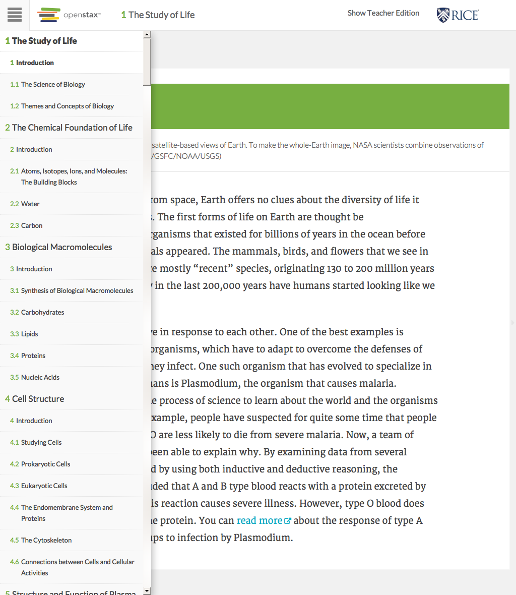

# https://tutor-{env}.openstax.org/books/{bookId}



# AJAX Calls

## GET /api/pages/dc74b6ed-d06a-4fef-8479-8eefd058b59a@23

```json
{
  "content_html": "<!DOCTYPE html PUBLIC \"-//W3C//DTD HTML 4.0 Transitional//EN\" \"http://www.w3.org/TR/REC-html40/loose.dtd\">\n<html xmlns=\"http://www.w3.org/1999/xhtml\">\n<head xmlns:c=\"http://cnx.rice.edu/cnxml\" xmlns:md=\"http://cnx.rice.edu/mdml\">\n<meta http-equiv=\"Content-Type\" content=\"text/html; charset=UTF-8\">\n<title>Introduction</title>\n<meta name=\"created-time\" content=\"2015/04/21 00:21:14 -0500\">\n<meta name=\"revised-time\" content=\"2015/06/26 03:22:28.862 GMT-5\">\n<meta name=\"author\" content=\"tutor_apbio\">\n<meta name=\"licensor\" content=\"tutor_apbio\">\n<meta name=\"license\" content=\"http://creativecommons.org/licenses/by/4.0/\">\n<meta name=\"keywords\" content=\"abstract, applied science, atom, basic science, biochemistry, biology, biosphere, botany, Carl Woese, cell, community, conclusion, control, deductive reasoning, descriptive science, discussion, ecosystem, eukaryote, evolution, experiment, falsifiable, homeostasis, hypothesis, hypothesis-based science, inductive reasoning, introduction, life, life science, macromolecule, materials and methods, microbiology, molecular biology, molecule, natural sciences, neurobiology, organ, organelle, organism, organ system, paleontology, peer-reviewed, phylogenetic tree, phylogeny, physical science, plagiarism, population, prokaryote, results, review article, science, scientific method, scientific reasoning, serendipity, theory, tissue, variable, zoology\">\n<meta name=\"subject\" content=\"Science and Technology\">\n</head>\n\n<body xmlns=\"http://www.w3.org/1999/xhtml\" xmlns:c=\"http://cnx.rice.edu/cnxml\" xmlns:md=\"http://cnx.rice.edu/mdml\" xmlns:qml=\"http://cnx.rice.edu/qml/1.0\" xmlns:mod=\"http://cnx.rice.edu/#moduleIds\" xmlns:bib=\"http://bibtexml.sf.net/\" xmlns:data=\"http://dev.w3.org/html5/spec/#custom\">\n<div data-type=\"document-title\">Introduction</div>\n<cnx-pi data-type=\"cnx.flag.introduction\">\n        class=\"introduction\"\n      </cnx-pi>\n<cnx-pi data-type=\"cnx.eoc\">class=\"summary\" title=\"Chapter Summary\"</cnx-pi>\n<cnx-pi data-type=\"cnx.eoc\">class=\"ost-reading-discard ost-chapter-review review\" title=\"Review Questions\"</cnx-pi>\n<cnx-pi data-type=\"cnx.eoc\">class=\"ost-reading-discard ost-chapter-review critical-thinking\" title=\"Critical Thinking Questions\"</cnx-pi>\n<cnx-pi data-type=\"cnx.eoc\">class=\"ost-chapter-review ost-reading-discard ap-test-prep\" title=\"Test Prep for AP&lt;sup&gt;&amp;#174;&lt;/sup&gt; Courses\"</cnx-pi>\n\n<figure id=\"fig-ch01_00_00\" class=\"splash\"><figcaption>This NASA image is a composite of several satellite-based views of Earth. To make the whole-Earth image, NASA scientists combine observations of different parts of the planet. (credit: NASA/GSFC/NOAA/USGS)</figcaption><span data-type=\"media\" id=\"fs-id1600276\" data-alt=\"Photo depicts Earth from space.\">\n\n</span>\n\n</figure>\n\n<p id=\"fs-id1167065801289\">Viewed from space, Earth offers no clues about the diversity of life it harbors. The first forms of life on Earth are thought be microorganisms that existed for billions of years in the ocean before plants and animals appeared. The mammals, birds, and flowers that we see in modern times are mostly “recent” species, originating 130 to 200 million years ago. In fact, only in the last 200,000 years have humans started looking like we do today.</p>\n\n<p id=\"fs-id1167066095971\">Organisms evolve in response to each other. One of the best examples is disease causing organisms, which have to adapt to overcome the defenses of the organisms they infect. One such organism that has evolved to specialize in infection in humans is <em data-effect=\"italics\">Plasmodium</em>, the organism that causes malaria. Biologists use the process of science to learn about the world and the organisms living in it. For example, people have suspected for quite some time that people with blood type O are less likely to die from severe malaria. Now, a team of scientists have been able to explain why. By examining data from several experiments, and by using both inductive and deductive reasoning, the scientists concluded that A and B type blood reacts with a protein excreted by <em data-effect=\"italics\">Plasmodium</em>. This reaction causes severe illness. However, type O blood does not react with the protein. You can <a href=\"http://openstaxcollege.org/l/32plasmodium\">read more</a> about the response of type A and B blood groups to infection by <em data-effect=\"italics\">Plasmodium</em>.\n\n</p>\n<div data-type=\"note\" data-has-label=\"true\" id=\"fs-id1167065722529\" class=\"note os-teacher\" data-label=\"Teacher Support\">\n<p id=\"fs-id1167065977234\">Introduce the concept of unity and diversity of life. There are so many varieties of organisms and, yet, the cell is the basic unit of life. The fundamental structures and life processes of cells are similar; but, how these cells are utilized in different organisms is hugely varied and reflects adaptation of the organism to its environment. The many differences between species accumulated over long periods of time. Students are often unfamiliar with geological time scales.</p>\n<p id=\"fs-id1167066145469\">The malaria example was chosen because malaria has been one of the most pervasive and widespread human disease. Therefore, through much of human history, malaria has been a strong force of natural selection on humans. Human genetics has evolved in response to this selection pressure, as with the example of resistance among O-type blood groups described in the introduction. Further examples can also be found <a href=\"http://openstaxcollege.org/l/32coevmalaria\" target=\"_window\">here</a>.</p>\n</div>\n\n</body>\n\n</html>\n",
  "spy": {
    "ecosystem_title": "Biology For AP® Courses (d52e93f4-8653-4273-86da-3850001c0786@9.14) - 2016-06-28 19:00:30 UTC"
  }
}
```

