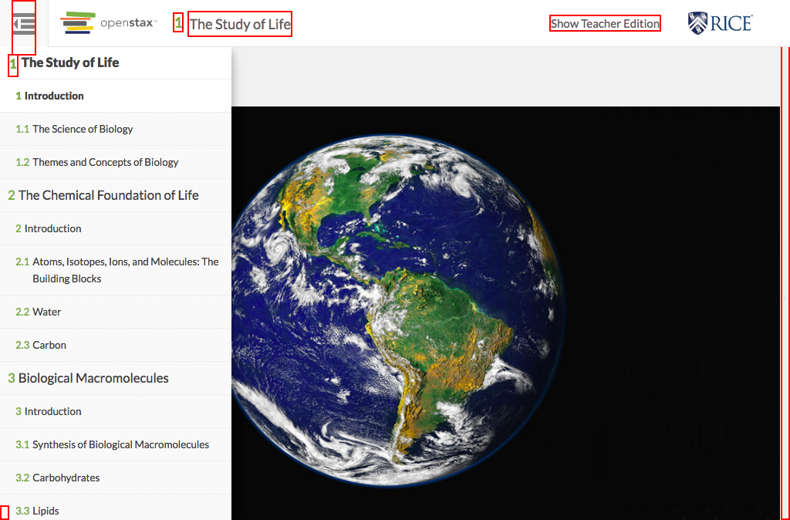

# https://tutor-{env}.openstax.org/books/{bookId}/page/{cnxId}



# AJAX Calls

## GET /api/pages/dc74b6ed-d06a-4fef-8479-8eefd058b59a@23

```json
{
  "content_html": "<!DOCTYPE html PUBLIC \"-//W3C//DTD HTML 4.0 Transitional//EN\" \"http://www.w3.org/TR/REC-html40/loose.dtd\">\n<html xmlns=\"http://www.w3.org/1999/xhtml\"> ... 5603 more",
  "spy": {
    "ecosystem_title": "Biology For AP® Courses (d52e93f4-8653-4273-86da-3850001c0786@9.14) - 2016-06-28 19:00:30 UTC"
  }
}
```


# WCAG2A Errors

Showing first 50 of 5 errors

```
ERROR html WCAG2A.Principle3.Guideline3_1.3_1_1.H57.2
ERROR a[href=''][aria-selected='false'] WCAG2A.Principle4.Guideline4_1.4_1_2.H91.A.EmptyNoId
warning a[href=''][aria-selected='false'] WCAG2A.Principle4.Guideline4_1.4_1_2.H91.A.Placeholder
ERROR a.page-navigation.next[href='/books/1/section/1.1'] WCAG2A.Principle4.Guideline4_1.4_1_2.H91.A.NoContent
ERROR a[href='#spy'].debug-toggle-link WCAG2A.Principle2.Guideline2_4.2_4_1.G1,G123,G124.NoSuchID
```

