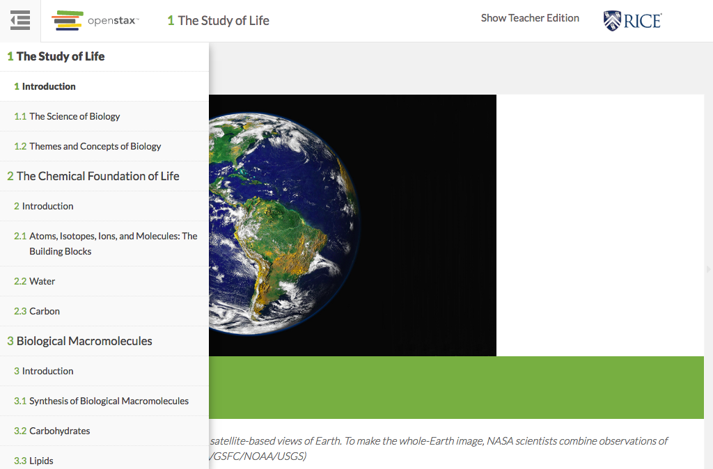

# https://tutor-{env}.openstax.org/books/{bookId}/section/{bookSection}



# AJAX Calls


# WCAG2A Errors

Showing first 50 of 5 errors

```
ERROR html WCAG2A.Principle3.Guideline3_1.3_1_1.H57.2
ERROR a[href=''][aria-selected='false'] WCAG2A.Principle4.Guideline4_1.4_1_2.H91.A.EmptyNoId
warning a[href=''][aria-selected='false'] WCAG2A.Principle4.Guideline4_1.4_1_2.H91.A.Placeholder
ERROR a.page-navigation.next[href='/books/1/section/1.1'] WCAG2A.Principle4.Guideline4_1.4_1_2.H91.A.NoContent
ERROR a[href='#spy'].debug-toggle-link WCAG2A.Principle2.Guideline2_4.2_4_1.G1,G123,G124.NoSuchID
```

