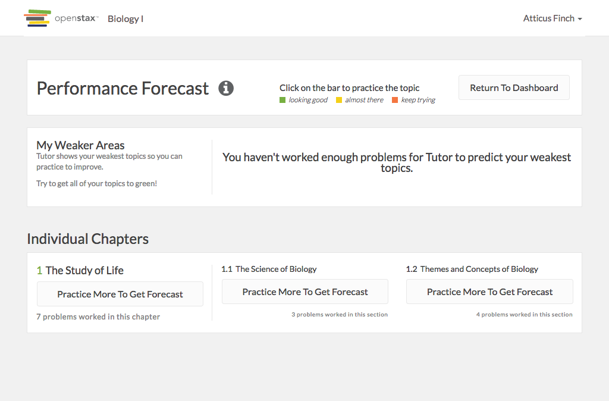

# https://tutor-{env}.openstax.org/courses/{courseId}/guide



# AJAX Calls

## GET /api/courses/1/guide

```json
{
  "period_id": "2",
  "title": "Biology For AP® Courses",
  "page_ids": [
    "313",
    "314"
  ],
  "children": [
    {
      "title": "The Study of Life",
      "chapter_section": [
        1
      ],
      "questions_answered_count": 7,
      "clue": {
        "value": 0.697475170372314,
        "value_interpretation": "medium",
        "confidence_interval": [
          0.441473756598886,
          0.968733381407464
        ],
        "confidence_interval_interpretation": "bad",
        "sample_size": 2,
        "sample_size_interpretation": "below",
        "unique_learner_count": 1
      },
      "practice_count": 0,
      "page_ids": [
        "313",
        "314"
      ],
      "children": [
        {
          "title": "The Science of Biology",
          "chapter_section": [
            1,
            1
          ],
          "questions_answered_count": 3,
          "clue": {
            "value": 0.562745914473422,
            "value_interpretation": "medium",
            "confidence_interval": [
              0.399343345192471,
              0.990959804212301
            ],
            "confidence_interval_interpretation": "bad",
            "sample_size": 0,
            "sample_size_interpretation": "below",
            "unique_learner_count": 0
          },
          "practice_count": 0,
          "page_ids": [
            "313"
          ]
        },
        {
          "title": "Themes and Concepts of Biology",
          "chapter_section": [
            1,
            2
          ],
          "questions_answered_count": 4,
          "clue": {
            "value": 0.770453517317548,
            "value_interpretation": "medium",
            "confidence_interval": [
              0.434350388763339,
              0.95713719576185
            ],
            "confidence_interval_interpretation": "bad",
            "sample_size": 2,
            "sample_size_interpretation": "below",
            "unique_learner_count": 1
          },
          "practice_count": 0,
          "page_ids": [
            "314"
          ]
        }
      ]
    }
  ]
}
```

