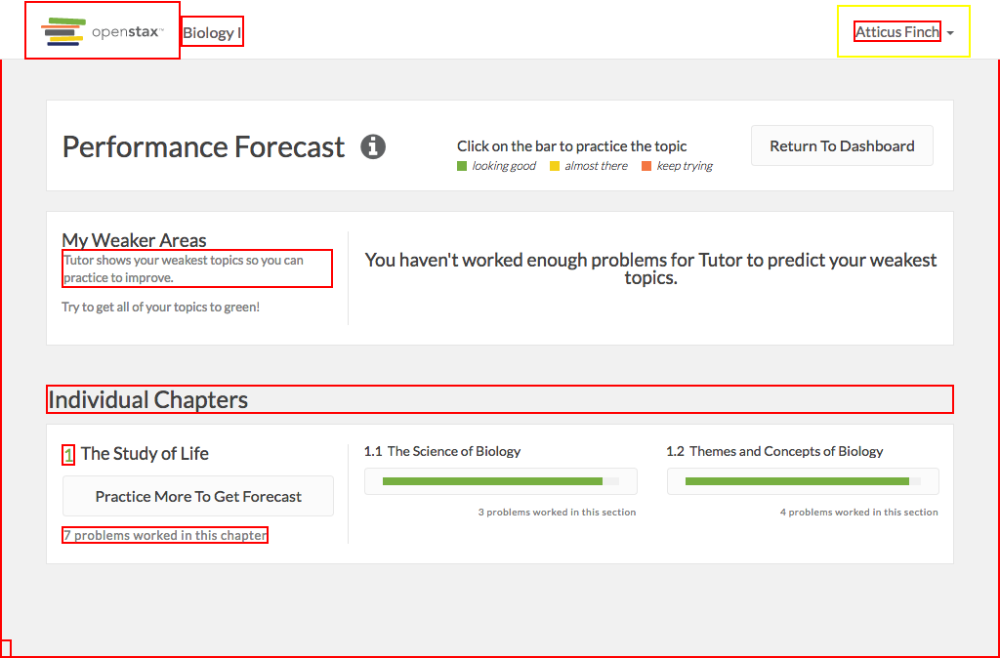

# https://tutor-{env}.openstax.org/courses/{courseId}/guide



# AJAX Calls

## GET /api/courses/1/guide

```json
{
  "children": [
    {
      "chapter_section": [
        1
      ],
      "children": [
        {
          "chapter_section": [
            1,
            1
          ],
          "clue": {
            "confidence_interval": [
              0.783821282853865,
              1
            ],
            "confidence_interval_interpretation": "good",
            "sample_size": 3,
            "sample_size_interpretation": "below",
            "unique_learner_count": 1,
            "value": 0.93322550831793,
            "value_interpretation": "high"
          },
          "page_ids": [
            "313"
          ],
          "practice_count": 0,
          "questions_answered_count": 3,
          "title": "The Science of Biology"
        },
        {
          "chapter_section": [
            1,
            2
          ],
          "clue": {
            "confidence_interval": [
              0.820858723472075,
              1
            ],
            "confidence_interval_interpretation": "good",
            "sample_size": 4,
            "sample_size_interpretation": "above",
            "unique_learner_count": 1,
            "value": 0.948189315166727,
            "value_interpretation": "high"
          },
          "page_ids": [
            "314"
          ],
          "practice_count": 0,
          "questions_answered_count": 4,
          "title": "Themes and Concepts of Biology"
        }
      ],
      "clue": {
        "confidence_interval": [
          0,
          1
        ],
        "confidence_interval_interpretation": "bad",
        "sample_size": 0,
        "sample_size_interpretation": "below",
        "unique_learner_count": 1,
        "value": 0.5,
        "value_interpretation": "medium"
      },
      "page_ids": [
        "313",
        "314"
      ],
      "practice_count": 0,
      "questions_answered_count": 7,
      "title": "The Study of Life"
    }
  ],
  "page_ids": [
    "313",
    "314"
  ],
  "period_id": "2",
  "title": "Biology For AP® Courses"
}
```


# WCAG2A Errors

Showing first 50 of 8 errors

```
ERROR html WCAG2A.Principle3.Guideline3_1.3_1_1.H57.2
ERROR a.navbar-brand.navbar-brand[href='/dashboard/'] WCAG2A.Principle4.Guideline4_1.4_1_2.H91.A.NoContent
warning a#navbar-dropdown.dropdown-toggle[type='button'][aria-haspopup='true'][aria-expanded='false'][href=''] WCAG2A.Principle4.Guideline4_1.4_1_2.H91.A.NoHref
ERROR a[href='#'] WCAG2A.Principle4.Guideline4_1.4_1_2.H91.A.NoContent
warning h3 WCAG2A.Principle1.Guideline1_3.1_3_1_A.G141
ERROR button[aria-describedby='progress-bar-tooltip-2'][type='button'].btn-block.btn.btn-default WCAG2A.Principle4.Guideline4_1.4_1_2.H91.Button.Name
ERROR button[aria-describedby='progress-bar-tooltip-3'][type='button'].btn-block.btn.btn-default WCAG2A.Principle4.Guideline4_1.4_1_2.H91.Button.Name
ERROR a[href='#spy'].debug-toggle-link WCAG2A.Principle2.Guideline2_4.2_4_1.G1,G123,G124.NoSuchID
```

