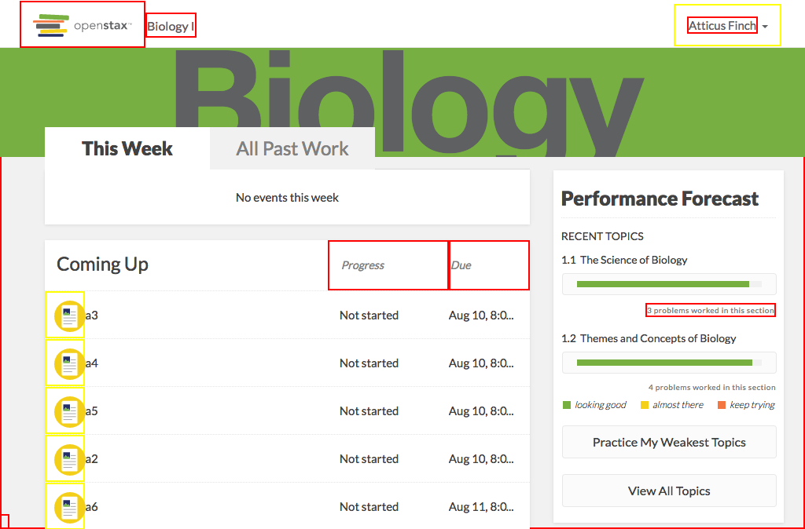

# https://tutor-{env}.openstax.org/courses/{courseId}/list



# AJAX Calls

## GET /api/courses/1/guide

```json
{
  "children": [
    {
      "chapter_section": [
        1
      ],
      "children": [
        {
          "chapter_section": [
            1,
            1
          ],
          "clue": {
            "confidence_interval": [
              0,
              0.15563502710434
            ],
            "confidence_interval_interpretation": "good",
            "sample_size": 5,
            "sample_size_interpretation": "above",
            "unique_learner_count": 1,
            "value": 0.0423257176332748,
            "value_interpretation": "low"
          },
          "page_ids": [
            "313"
          ],
          "practice_count": 0,
          "questions_answered_count": 3,
          "title": "The Science of Biology"
        },
        {
          "chapter_section": [
            1,
            2
          ],
          "clue": {
            "confidence_interval": [
              0,
              0.216178717146135
            ],
            "confidence_interval_interpretation": "good",
            "sample_size": 3,
            "sample_size_interpretation": "below",
            "unique_learner_count": 1,
            "value": 0.0667744916820703,
            "value_interpretation": "low"
          },
          "page_ids": [
            "314"
          ],
          "practice_count": 0,
          "questions_answered_count": 4,
          "title": "Themes and Concepts of Biology"
        }
      ],
      "clue": {
        "confidence_interval": [
          0,
          0.118347639732416
        ],
        "confidence_interval_interpretation": "good",
        "sample_size": 8,
        "sample_size_interpretation": "above",
        "unique_learner_count": 1,
        "value": 0.0273208546038949,
        "value_interpretation": "low"
      },
      "page_ids": [
        "313",
        "314"
      ],
      "practice_count": 0,
      "questions_answered_count": 7,
      "title": "The Study of Life"
    }
  ],
  "page_ids": [
    "313",
    "314"
  ],
  "period_id": "2",
  "title": "Biology For AP® Courses"
}
```

