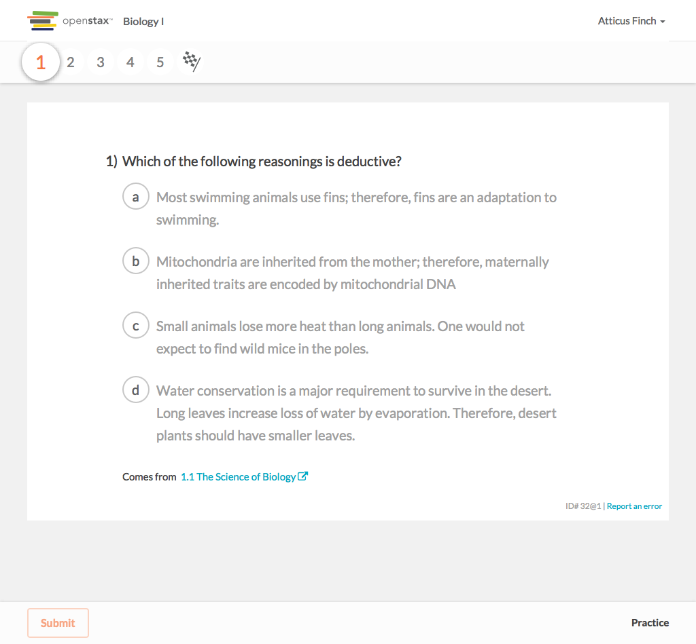

# https://tutor-{env}.openstax.org/courses/{courseId}/practice/?page_ids[]={practicePageId}



# AJAX Calls

## GET /api/steps/11304

```json
{
  "content": {
    "authors": [
      {
        "name": "OpenStax",
        "user_id": "1"
      }
    ],
    "copyright_holders": [
      {
        "name": "Rice University",
        "user_id": "2"
      }
    ],
    "derived_from": [],
    "editors": [],
    "is_vocab": false,
    "number": 8,
    "published_at": "2015-09-16T20:13:32.702Z",
    "questions": [
      {
        "answers": [
          {
            "content_html": "2, 1, 5, 4, 6, 3",
            "id": "31"
          },
          {
            "content_html": "2, 1, 5, 6, 3, 4",
            "id": "32"
          },
          "... skipped 2"
        ],
        "combo_choices": [],
        "formats": [
          "multiple-choice",
          "free-response"
        ],
        "hints": [],
        "id": "8",
        "is_answer_order_important": true,
        "stem_html": "<p>Although the scientific method is used by most of the sciences, it can also be applied to everyday situations. A situation is given below. Using th ... 514 more",
        "stimulus_html": ""
      }
    ],
    "stimulus_html": "",
    "tags": [
      "exid:apbio-ch01-ex008",
      "filter-type:import:hs",
      "... skipped 17"
    ],
    "uid": "8@1",
    "version": 1
  },
  "content_url": "https://exercises-dev.openstax.org/exercises/8@1",
  "group": "default",
  "has_recovery": false,
  "id": "11304",
  "is_completed": false,
  "is_in_multipart": false,
  "labels": [],
  "question_id": "8",
  "related_content": [
    {
      "chapter_section": [
        1,
        1
      ],
      "title": "The Science of Biology"
    }
  ],
  "task_id": "2011",
  "type": "exercise"
}
```

## GET /api/tasks/2011

```json
{
  "id": "2011",
  "is_feedback_available": true,
  "is_shared": false,
  "spy": {},
  "steps": [
    {
      "content": {
        "authors": [
          {
            "name": "OpenStax",
            "user_id": "1"
          }
        ],
        "copyright_holders": [
          {
            "name": "Rice University",
            "user_id": "2"
          }
        ],
        "derived_from": [],
        "editors": [],
        "is_vocab": false,
        "number": 6,
        "published_at": "2015-09-16T20:13:32.660Z",
        "questions": [
          {
            "answers": [
              {
                "content_html": "<p>plant responses to external stimuli, functioning of planetary orbitals,</p>\n\n<p>formation of metamorphic rocks, galaxy formation and evolution</p>\n",
                "id": "23"
              },
              {
                "content_html": "<p>plant responses to external stimuli, study of the shape and motion of physical objects,</p>\n\n<p>formation of metamorphic rocks, galaxy formation an ... 16 more",
                "id": "24"
              },
              "... skipped 2"
            ],
            "combo_choices": [],
            "formats": [
              "multiple-choice",
              "free-response"
            ],
            "hints": [],
            "id": "6",
            "is_answer_order_important": true,
            "stem_html": "What are two topics that are likely to be studied by biologists and two areas of scientific study that would fall outside the realm of biology?",
            "stimulus_html": ""
          }
        ],
        "stimulus_html": "",
        "tags": [
          "exid:apbio-ch01-ex006",
          "filter-type:import:hs",
          "... skipped 17"
        ],
        "uid": "6@1",
        "version": 1
      },
      "content_url": "https://exercises-dev.openstax.org/exercises/6@1",
      "group": "default",
      "has_recovery": false,
      "id": "11307",
      "is_completed": false,
      "is_in_multipart": false,
      "labels": [],
      "question_id": "6",
      "related_content": [
        {
          "chapter_section": [
            1,
            1
          ],
          "title": "The Science of Biology"
        }
      ],
      "task_id": "2011",
      "type": "exercise"
    },
    {
      "content": {
        "authors": [
          {
            "name": "OpenStax",
            "user_id": "1"
          }
        ],
        "copyright_holders": [
          {
            "name": "Rice University",
            "user_id": "2"
          }
        ],
        "derived_from": [],
        "editors": [],
        "is_vocab": false,
        "number": 31,
        "published_at": "2015-09-16T20:13:33.165Z",
        "questions": [
          {
            "answers": [
              {
                "content_html": "make a hypothesis",
                "id": "123"
              },
              {
                "content_html": "make an observation",
                "id": "124"
              },
              "... skipped 2"
            ],
            "combo_choices": [],
            "formats": [
              "multiple-choice"
            ],
            "hints": [],
            "id": "31",
            "is_answer_order_important": true,
            "stem_html": "Which of the following steps in the scientific method usually comes first?",
            "stimulus_html": ""
          }
        ],
        "stimulus_html": "",
        "tags": [
          "book:stax-apbio",
          "filter-type:import:hs",
          "... skipped 17"
        ],
        "uid": "31@1",
        "version": 1
      },
      "content_url": "https://exercises-dev.openstax.org/exercises/31@1",
      "group": "default",
      "has_recovery": false,
      "id": "11308",
      "is_completed": false,
      "is_in_multipart": false,
      "labels": [],
      "question_id": "31",
      "related_content": [
        {
          "chapter_section": [
            1,
            1
          ],
          "title": "The Science of Biology"
        }
      ],
      "task_id": "2011",
      "type": "exercise"
    },
    "... skipped 3"
  ],
  "title": "Practice",
  "type": "page_practice"
}
```

