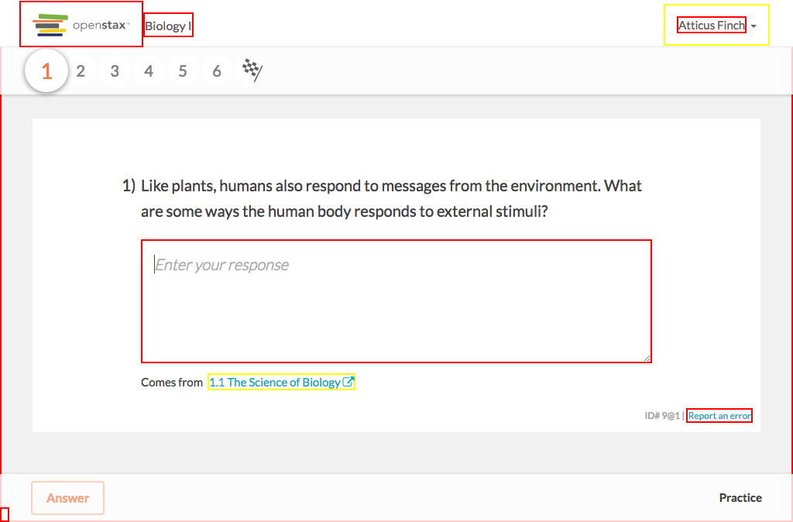

# https://tutor-{env}.openstax.org/courses/{courseId}/practice/?page_ids[]={practicePageId}



# AJAX Calls

## GET /api/tasks/2014

```json
{
  "id": "2014",
  "is_feedback_available": true,
  "is_shared": false,
  "spy": {},
  "steps": [
    {
      "content": {
        "authors": [
          {
            "name": "OpenStax",
            "user_id": "1"
          }
        ],
        "copyright_holders": [
          {
            "name": "Rice University",
            "user_id": "2"
          }
        ],
        "derived_from": [],
        "editors": [],
        "is_vocab": false,
        "number": 30,
        "published_at": "2015-09-16T20:13:33.142Z",
        "questions": [
          {
            "answers": [
              {
                "content_html": "playing the piano",
                "id": "119"
              },
              {
                "content_html": "writing a research paper on the life of Darwin",
                "id": "120"
              },
              "... skipped 2"
            ],
            "combo_choices": [],
            "formats": [
              "multiple-choice"
            ],
            "hints": [],
            "id": "30",
            "is_answer_order_important": true,
            "stem_html": "Which of the following statement describes an activity in a natural science?",
            "stimulus_html": ""
          }
        ],
        "stimulus_html": "",
        "tags": [
          "book:stax-apbio",
          "filter-type:import:hs",
          "... skipped 17"
        ],
        "uid": "30@1",
        "version": 1
      },
      "content_url": "https://exercises-dev.openstax.org/exercises/30@1",
      "group": "default",
      "has_recovery": false,
      "id": "11322",
      "is_completed": false,
      "is_in_multipart": false,
      "labels": [],
      "question_id": "30",
      "related_content": [
        {
          "chapter_section": [
            1,
            1
          ],
          "title": "The Science of Biology"
        }
      ],
      "task_id": "2014",
      "type": "exercise"
    },
    {
      "content": {
        "authors": [
          {
            "name": "OpenStax",
            "user_id": "1"
          }
        ],
        "copyright_holders": [
          {
            "name": "Rice University",
            "user_id": "2"
          }
        ],
        "derived_from": [],
        "editors": [],
        "is_vocab": false,
        "number": 10,
        "published_at": "2015-09-16T20:13:32.800Z",
        "questions": [
          {
            "answers": [
              {
                "content_html": "DNA is a double helix because it has two spiral strands held together like a spiral staircase.",
                "id": "39"
              },
              {
                "content_html": "Nucleotides are spiral-shaped molecules that bond together to form DNA.",
                "id": "40"
              },
              "... skipped 2"
            ],
            "combo_choices": [],
            "formats": [
              "multiple-choice",
              "free-response"
            ],
            "hints": [],
            "id": "10",
            "is_answer_order_important": true,
            "stem_html": "The word helix means spiral. What does this tell you about the structure of DNA, which is a double helix macromolecule?",
            "stimulus_html": ""
          }
        ],
        "stimulus_html": "",
        "tags": [
          "filter-type:import:hs",
          "filter-type:import:has-context",
          "... skipped 18"
        ],
        "uid": "10@1",
        "version": 1
      },
      "content_url": "https://exercises-dev.openstax.org/exercises/10@1",
      "group": "default",
      "has_recovery": false,
      "id": "11323",
      "is_completed": false,
      "is_in_multipart": false,
      "labels": [],
      "question_id": "10",
      "related_content": [
        {
          "chapter_section": [
            1,
            1
          ],
          "title": "The Science of Biology"
        }
      ],
      "task_id": "2014",
      "type": "exercise"
    },
    "... skipped 3"
  ],
  "title": "Practice",
  "type": "page_practice"
}
```

## GET /api/steps/11319

```json
{
  "content": {
    "authors": [
      {
        "name": "OpenStax",
        "user_id": "1"
      }
    ],
    "copyright_holders": [
      {
        "name": "Rice University",
        "user_id": "2"
      }
    ],
    "derived_from": [],
    "editors": [],
    "is_vocab": false,
    "number": 33,
    "published_at": "2015-09-16T20:13:33.182Z",
    "questions": [
      {
        "answers": [
          {
            "content_html": "Questions 1 and 3 are subjective and cannot be disproven using scientific method. Questions 2 and 4 can be tested using scientific method.",
            "id": "131"
          },
          {
            "content_html": "Questions 1 and 4 are subjective and cannot be disproven using scientific method. Questions 2 and 3 can be tested using scientific method.",
            "id": "132"
          },
          "... skipped 2"
        ],
        "combo_choices": [],
        "formats": [
          "multiple-choice",
          "free-response"
        ],
        "hints": [],
        "id": "33",
        "is_answer_order_important": true,
        "stem_html": "<p>Read the following questions. Does the statement lend itself to investigation using the scientific method? In other words, is the hypothesis falsif ... 248 more",
        "stimulus_html": ""
      }
    ],
    "stimulus_html": "",
    "tags": [
      "book:stax-apbio",
      "filter-type:import:hs",
      "... skipped 17"
    ],
    "uid": "33@1",
    "version": 1
  },
  "content_url": "https://exercises-dev.openstax.org/exercises/33@1",
  "group": "default",
  "has_recovery": false,
  "id": "11319",
  "is_completed": false,
  "is_in_multipart": false,
  "labels": [],
  "question_id": "33",
  "related_content": [
    {
      "chapter_section": [
        1,
        1
      ],
      "title": "The Science of Biology"
    }
  ],
  "task_id": "2014",
  "type": "exercise"
}
```

