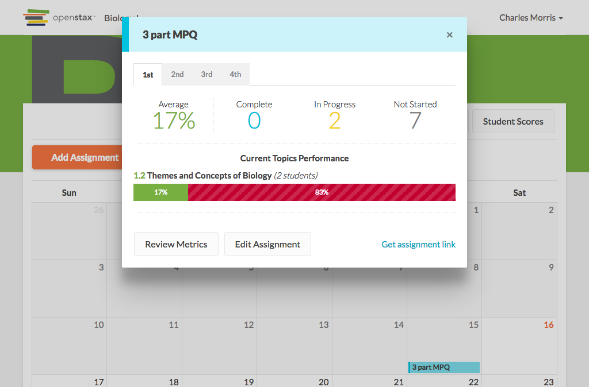

# https://tutor-{env}.openstax.org/courses/{courseId}/t/calendar/months/{date}/plans/{planId}



# AJAX Calls

## GET /api/plans/69/stats

```json
{
  "id": "69",
  "shareable_url": "/@/kEyX0d/3-part-mpq",
  "stats": [
    {
      "complete_count": 1,
      "current_pages": [
        {
          "chapter_section": [
            1,
            2
          ],
          "correct_count": 2,
          "id": "314",
          "incorrect_count": 2,
          "is_trouble": false,
          "student_count": 1,
          "title": "Themes and Concepts of Biology"
        }
      ],
      "is_trouble": false,
      "mean_grade_percent": 50,
      "name": "2nd",
      "partially_complete_count": 0,
      "period_id": "2",
      "spaced_pages": [],
      "total_count": 10
    },
    {
      "complete_count": 1,
      "current_pages": [
        {
          "chapter_section": [
            1,
            2
          ],
          "correct_count": 1,
          "id": "314",
          "incorrect_count": 3,
          "is_trouble": false,
          "student_count": 1,
          "title": "Themes and Concepts of Biology"
        }
      ],
      "is_trouble": false,
      "mean_grade_percent": 50,
      "name": "4th",
      "partially_complete_count": 0,
      "period_id": "4",
      "spaced_pages": [],
      "total_count": 11
    },
    "... skipped 2"
  ],
  "title": "3 part MPQ",
  "type": "homework"
}
```

