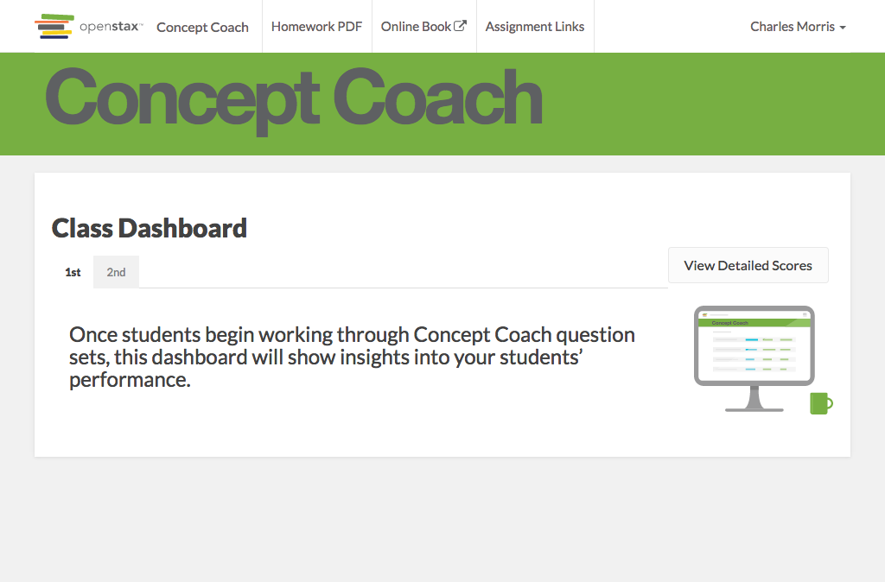

# https://tutor-{env}.openstax.org/courses/{courseId}/t/cc-dashboard/guide



# AJAX Calls

## GET /api/courses/2/cc/dashboard

```json
{
  "tasks": [],
  "role": {
    "id": "43",
    "type": "teacher"
  },
  "course": {
    "name": "Concept Coach",
    "teachers": [
      {
        "id": "2",
        "role_id": "43",
        "first_name": "Charles",
        "last_name": "Morris"
      }
    ],
    "periods": [
      {
        "id": "5",
        "name": "1st",
        "chapters": []
      },
      {
        "id": "6",
        "name": "2nd",
        "chapters": []
      }
    ]
  }
}
```

