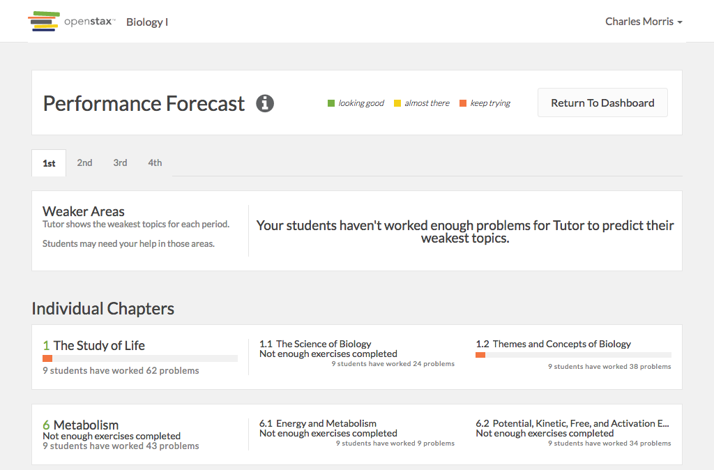

# https://tutor-{env}.openstax.org/courses/{courseId}/t/guide



# AJAX Calls

## GET /api/courses/1

```json
{
  "appearance_code": "biology",
  "book_pdf_url": "https://archive-staging-tutor.cnx.org/exports/d52e93f4-8653-4273-86da-3850001c0786@9.14.pdf",
  "default_due_time": "07:00",
  "default_open_time": "00:01",
  "ecosystem_id": "4",
  "id": "1",
  "is_college": false,
  "is_concept_coach": false,
  "name": "Biology I",
  "periods": [
    {
      "default_due_time": "07:00",
      "default_open_time": "00:01",
      "enrollment_code": "059521",
      "enrollment_url": "https://tutor-dev.openstax.org/enroll/059521",
      "id": "3",
      "is_archived": false,
      "name": "3rd"
    },
    {
      "default_due_time": "07:00",
      "default_open_time": "00:01",
      "enrollment_code": "569426",
      "enrollment_url": "https://tutor-dev.openstax.org/enroll/569426",
      "id": "4",
      "is_archived": false,
      "name": "4th"
    },
    "... skipped 2"
  ],
  "roles": [
    {
      "id": "1",
      "type": "teacher"
    }
  ],
  "salesforce_book_name": "Biology",
  "students": [],
  "time_zone": "Central Time (US & Canada)",
  "webview_url": "https://archive-staging-tutor.cnx.org/contents/d52e93f4-8653-4273-86da-3850001c0786@9.14"
}
```


# WCAG2AAA Errors

Showing first 50 of 32 errors

```
ERROR html WCAG2AAA.Principle3.Guideline3_1.3_1_1.H57.2
ERROR a.navbar-brand.navbar-brand[href='/dashboard/'] WCAG2AAA.Principle4.Guideline4_1.4_1_2.H91.A.NoContent
ERROR div.course-name WCAG2AAA.Principle1.Guideline1_4.1_4_6.G17.Fail
warning a#navbar-dropdown.dropdown-toggle[type='button'][aria-haspopup='true'][aria-expanded='false'][href=''] WCAG2AAA.Principle4.Guideline4_1.4_1_2.H91.A.NoHref
ERROR span WCAG2AAA.Principle1.Guideline1_4.1_4_6.G17.Fail
warning a.view-reference-guide[target='_blank'][href='/books/1/'] WCAG2AAA.Principle3.Guideline3_2.3_2_5.H83.3
warning a[href='https://accounts-dev.openstax.org/profile'][target='_blank'] WCAG2AAA.Principle3.Guideline3_2.3_2_5.H83.3
warning a[role='menuitem'][tabindex='-1'][target='_blank'][href='http://openstax.force.com/support?l=en_US&c=Products%3ATutor'] WCAG2AAA.Principle3.Guideline3_2.3_2_5.H83.3
ERROR a[href='#'] WCAG2AAA.Principle4.Guideline4_1.4_1_2.H91.A.NoContent
warning a[role='tab'][href=''][aria-selected='true'] WCAG2AAA.Principle4.Guideline4_1.4_1_2.H91.A.Placeholder
warning a[role='tab'][href=''][aria-selected='false'] WCAG2AAA.Principle4.Guideline4_1.4_1_2.H91.A.Placeholder
ERROR span.tab-item-period-name[aria-describedby='course-periods-nav-tab-1'] WCAG2AAA.Principle1.Guideline1_4.1_4_6.G17.Fail
warning a[role='tab'][href=''][aria-selected='false'] WCAG2AAA.Principle4.Guideline4_1.4_1_2.H91.A.Placeholder
ERROR span.tab-item-period-name[aria-describedby='course-periods-nav-tab-2'] WCAG2AAA.Principle1.Guideline1_4.1_4_6.G17.Fail
warning a[role='tab'][href=''][aria-selected='false'] WCAG2AAA.Principle4.Guideline4_1.4_1_2.H91.A.Placeholder
ERROR span.tab-item-period-name[aria-describedby='course-periods-nav-tab-3'] WCAG2AAA.Principle1.Guideline1_4.1_4_6.G17.Fail
ERROR span WCAG2AAA.Principle1.Guideline1_4.1_4_6.G17.Fail
ERROR span WCAG2AAA.Principle1.Guideline1_4.1_4_6.G17.Fail
ERROR span WCAG2AAA.Principle1.Guideline1_4.1_4_6.G17.Fail
ERROR p WCAG2AAA.Principle1.Guideline1_4.1_4_6.G17.Fail
ERROR span.count WCAG2AAA.Principle1.Guideline1_4.1_4_6.G17.Fail
ERROR span.count WCAG2AAA.Principle1.Guideline1_4.1_4_6.G17.Fail
ERROR h3 WCAG2AAA.Principle1.Guideline1_3.1_3_1_AAA.G141
ERROR span.number WCAG2AAA.Principle1.Guideline1_4.1_4_6.G17.Fail
ERROR span.count WCAG2AAA.Principle1.Guideline1_4.1_4_6.G17.Fail
ERROR span.count WCAG2AAA.Principle1.Guideline1_4.1_4_6.G17.Fail
ERROR span.count WCAG2AAA.Principle1.Guideline1_4.1_4_6.G17.Fail
ERROR span.number WCAG2AAA.Principle1.Guideline1_4.1_4_6.G17.Fail
ERROR span.count WCAG2AAA.Principle1.Guideline1_4.1_4_6.G17.Fail
ERROR span.count WCAG2AAA.Principle1.Guideline1_4.1_4_6.G17.Fail
ERROR span.count WCAG2AAA.Principle1.Guideline1_4.1_4_6.G17.Fail
ERROR a[href='#spy'].debug-toggle-link WCAG2AAA.Principle2.Guideline2_4.2_4_1.G1,G123,G124.NoSuchID
```

