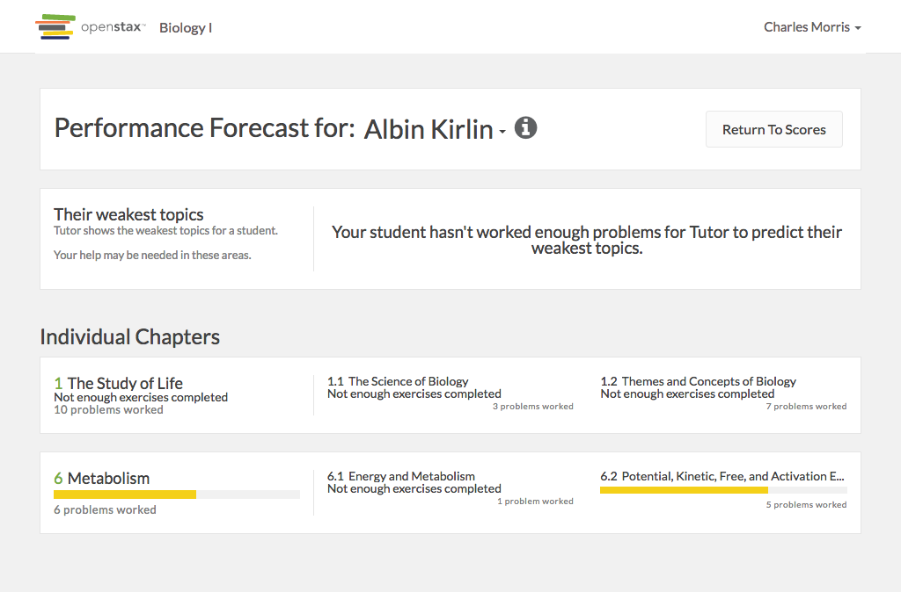

# https://tutor-{env}.openstax.org/courses/{courseId}/t/guide/student/{roleId}



# AJAX Calls

## GET /api/courses/1/performance

```json
[
  {
    "period_id": "1",
    "overall_average_score": 0.0277777777777778,
    "data_headings": [
      {
        "title": "3 part MPQ",
        "plan_id": 69,
        "type": "homework",
        "due_at": "2016-07-15T12:00:00.000Z",
        "average_score": 0.0277777777777778
      },
      {
        "title": "Read Chapter 1. The Study of Life",
        "plan_id": 1,
        "type": "reading",
        "due_at": "2016-06-29T12:00:00.000Z"
      },
      {
        "title": "Read Chapter 6. Metabolism",
        "plan_id": 2,
        "type": "reading",
        "due_at": "2016-06-24T12:00:00.000Z"
      }
    ],
    "students": [
      {
        "name": "Rabbit Angstrom",
        "first_name": "Rabbit",
        "last_name": "Angstrom",
        "role": 9,
        "student_identifier": "JQMVOWU2PA",
        "average_score": 0,
        "data": [
          {
            "type": "homework",
            "id": 1362,
            "status": "not_started",
            "step_count": 4,
            "completed_step_count": 0,
            "completed_on_time_step_count": 0,
            "completed_accepted_late_step_count": 0,
            "exercise_count": 4,
            "completed_exercise_count": 0,
            "completed_on_time_exercise_count": 0,
            "completed_accepted_late_exercise_count": 0,
            "correct_exercise_count": 0,
            "correct_on_time_exercise_count": 0,
            "correct_accepted_late_exercise_count": 0,
            "score": 0,
            "recovered_exercise_count": 0,
            "due_at": "2016-07-15T12:00:00.000Z",
            "is_late_work_accepted": false,
            "is_included_in_averages": true
          },
          {
            "type": "reading",
            "id": 8,
            "status": "in_progress",
            "step_count": 25,
            "completed_step_count": 24,
            "completed_on_time_step_count": 24,
            "completed_accepted_late_step_count": 0,
            "exercise_count": 8,
            "completed_exercise_count": 7,
            "completed_on_time_exercise_count": 7,
            "completed_accepted_late_exercise_count": 0,
            "correct_exercise_count": 7,
            "correct_on_time_exercise_count": 7,
            "correct_accepted_late_exercise_count": 0,
            "score": 0.875,
            "recovered_exercise_count": 0,
            "due_at": "2016-06-29T12:00:00.000Z",
            "last_worked_at": "2016-06-29T11:59:00.000Z",
            "is_late_work_accepted": false,
            "is_included_in_averages": false
          },
          {
            "type": "reading",
            "id": 49,
            "status": "completed",
            "step_count": 18,
            "completed_step_count": 18,
            "completed_on_time_step_count": 0,
            "completed_accepted_late_step_count": 0,
            "exercise_count": 6,
            "completed_exercise_count": 6,
            "completed_on_time_exercise_count": 0,
            "completed_accepted_late_exercise_count": 0,
            "correct_exercise_count": 5,
            "correct_on_time_exercise_count": 0,
            "correct_accepted_late_exercise_count": 0,
            "score": 0,
            "recovered_exercise_count": 0,
            "due_at": "2016-06-24T12:00:00.000Z",
            "last_worked_at": "2016-06-24T12:10:00.000Z",
            "is_late_work_accepted": false,
            "is_included_in_averages": false
          }
        ]
      },
      {
        "name": "Molly Bloom",
        "first_name": "Molly",
        "last_name": "Bloom",
        "role": 8,
        "student_identifier": "634D0SATO2",
        "average_score": 0,
        "data": [
          {
            "type": "homework",
            "id": 1361,
            "status": "not_started",
            "step_count": 4,
            "completed_step_count": 0,
            "completed_on_time_step_count": 0,
            "completed_accepted_late_step_count": 0,
            "exercise_count": 4,
            "completed_exercise_count": 0,
            "completed_on_time_exercise_count": 0,
            "completed_accepted_late_exercise_count": 0,
            "correct_exercise_count": 0,
            "correct_on_time_exercise_count": 0,
            "correct_accepted_late_exercise_count": 0,
            "score": 0,
            "recovered_exercise_count": 0,
            "due_at": "2016-07-15T12:00:00.000Z",
            "is_late_work_accepted": false,
            "is_included_in_averages": true
          },
          {
            "type": "reading",
            "id": 7,
            "status": "in_progress",
            "step_count": 25,
            "completed_step_count": 24,
            "completed_on_time_step_count": 24,
            "completed_accepted_late_step_count": 0,
            "exercise_count": 8,
            "completed_exercise_count": 7,
            "completed_on_time_exercise_count": 7,
            "completed_accepted_late_exercise_count": 0,
            "correct_exercise_count": 7,
            "correct_on_time_exercise_count": 7,
            "correct_accepted_late_exercise_count": 0,
            "score": 0.875,
            "recovered_exercise_count": 0,
            "due_at": "2016-06-29T12:00:00.000Z",
            "last_worked_at": "2016-06-29T11:59:00.000Z",
            "is_late_work_accepted": false,
            "is_included_in_averages": false
          },
          {
            "type": "reading",
            "id": 48,
            "status": "not_started",
            "step_count": 18,
            "completed_step_count": 0,
            "completed_on_time_step_count": 0,
            "completed_accepted_late_step_count": 0,
            "exercise_count": 6,
            "completed_exercise_count": 0,
            "completed_on_time_exercise_count": 0,
            "completed_accepted_late_exercise_count": 0,
            "correct_exercise_count": 0,
            "correct_on_time_exercise_count": 0,
            "correct_accepted_late_exercise_count": 0,
            "score": 0,
            "recovered_exercise_count": 0,
            "due_at": "2016-06-24T12:00:00.000Z",
            "is_late_work_accepted": false,
            "is_included_in_averages": false
          }
        ]
      },
      {
        "name": "Seymour Glass",
        "first_name": "Seymour",
        "last_name": "Glass",
        "role": 10,
        "student_identifier": "I7WY2PQ0MT",
        "average_score": 0,
        "data": [
          {
            "type": "homework",
            "id": 1363,
            "status": "not_started",
            "step_count": 4,
            "completed_step_count": 0,
            "completed_on_time_step_count": 0,
            "completed_accepted_late_step_count": 0,
            "exercise_count": 4,
            "completed_exercise_count": 0,
            "completed_on_time_exercise_count": 0,
            "completed_accepted_late_exercise_count": 0,
            "correct_exercise_count": 0,
            "correct_on_time_exercise_count": 0,
            "correct_accepted_late_exercise_count": 0,
            "score": 0,
            "recovered_exercise_count": 0,
            "due_at": "2016-07-15T12:00:00.000Z",
            "is_late_work_accepted": false,
            "is_included_in_averages": true
          },
          {
            "type": "reading",
            "id": 9,
            "status": "in_progress",
            "step_count": 25,
            "completed_step_count": 24,
            "completed_on_time_step_count": 24,
            "completed_accepted_late_step_count": 0,
            "exercise_count": 8,
            "completed_exercise_count": 7,
            "completed_on_time_exercise_count": 7,
            "completed_accepted_late_exercise_count": 0,
            "correct_exercise_count": 7,
            "correct_on_time_exercise_count": 7,
            "correct_accepted_late_exercise_count": 0,
            "score": 0.875,
            "recovered_exercise_count": 0,
            "due_at": "2016-06-29T12:00:00.000Z",
            "last_worked_at": "2016-06-29T11:59:00.000Z",
            "is_late_work_accepted": false,
            "is_included_in_averages": false
          },
          {
            "type": "reading",
            "id": 50,
            "status": "completed",
            "step_count": 18,
            "completed_step_count": 18,
            "completed_on_time_step_count": 18,
            "completed_accepted_late_step_count": 0,
            "exercise_count": 6,
            "completed_exercise_count": 6,
            "completed_on_time_exercise_count": 6,
            "completed_accepted_late_exercise_count": 0,
            "correct_exercise_count": 6,
            "correct_on_time_exercise_count": 6,
            "correct_accepted_late_exercise_count": 0,
            "score": 1,
            "recovered_exercise_count": 0,
            "due_at": "2016-06-24T12:00:00.000Z",
            "last_worked_at": "2016-06-24T11:59:00.000Z",
            "is_late_work_accepted": false,
            "is_included_in_averages": false
          }
        ]
      },
      {
        "name": "Bettie Hackett",
        "first_name": "Bettie",
        "last_name": "Hackett",
        "role": 4,
        "student_identifier": "SW5P1UI7JR",
        "average_score": 0,
        "data": [
          {
            "type": "homework",
            "id": 1357,
            "status": "not_started",
            "step_count": 4,
            "completed_step_count": 0,
            "completed_on_time_step_count": 0,
            "completed_accepted_late_step_count": 0,
            "exercise_count": 4,
            "completed_exercise_count": 0,
            "completed_on_time_exercise_count": 0,
            "completed_accepted_late_exercise_count": 0,
            "correct_exercise_count": 0,
            "correct_on_time_exercise_count": 0,
            "correct_accepted_late_exercise_count": 0,
            "score": 0,
            "recovered_exercise_count": 0,
            "due_at": "2016-07-15T12:00:00.000Z",
            "is_late_work_accepted": false,
            "is_included_in_averages": true
          },
          {
            "type": "reading",
            "id": 3,
            "status": "in_progress",
            "step_count": 25,
            "completed_step_count": 24,
            "completed_on_time_step_count": 24,
            "completed_accepted_late_step_count": 0,
            "exercise_count": 8,
            "completed_exercise_count": 7,
            "completed_on_time_exercise_count": 7,
            "completed_accepted_late_exercise_count": 0,
            "correct_exercise_count": 6,
            "correct_on_time_exercise_count": 6,
            "correct_accepted_late_exercise_count": 0,
            "score": 0.75,
            "recovered_exercise_count": 0,
            "due_at": "2016-06-29T12:00:00.000Z",
            "last_worked_at": "2016-06-29T11:59:00.000Z",
            "is_late_work_accepted": false,
            "is_included_in_averages": false
          },
          {
            "type": "reading",
            "id": 44,
            "status": "completed",
            "step_count": 18,
            "completed_step_count": 18,
            "completed_on_time_step_count": 18,
            "completed_accepted_late_step_count": 0,
            "exercise_count": 6,
            "completed_exercise_count": 6,
            "completed_on_time_exercise_count": 6,
            "completed_accepted_late_exercise_count": 0,
            "correct_exercise_count": 3,
            "correct_on_time_exercise_count": 3,
            "correct_accepted_late_exercise_count": 0,
            "score": 0.5,
            "recovered_exercise_count": 0,
            "due_at": "2016-06-24T12:00:00.000Z",
            "last_worked_at": "2016-06-24T11:59:00.000Z",
            "is_late_work_accepted": false,
            "is_included_in_averages": false
          }
        ]
      },
      {
        "name": "Giovanny Jaskolski",
        "first_name": "Giovanny",
        "last_name": "Jaskolski",
        "role": 5,
        "student_identifier": "IL72R6YN48",
        "average_score": 0,
        "data": [
          {
            "type": "homework",
            "id": 1358,
            "status": "not_started",
            "step_count": 4,
            "completed_step_count": 0,
            "completed_on_time_step_count": 0,
            "completed_accepted_late_step_count": 0,
            "exercise_count": 4,
            "completed_exercise_count": 0,
            "completed_on_time_exercise_count": 0,
            "completed_accepted_late_exercise_count": 0,
            "correct_exercise_count": 0,
            "correct_on_time_exercise_count": 0,
            "correct_accepted_late_exercise_count": 0,
            "score": 0,
            "recovered_exercise_count": 0,
            "due_at": "2016-07-15T12:00:00.000Z",
            "is_late_work_accepted": false,
            "is_included_in_averages": true
          },
          {
            "type": "reading",
            "id": 4,
            "status": "in_progress",
            "step_count": 25,
            "completed_step_count": 24,
            "completed_on_time_step_count": 24,
            "completed_accepted_late_step_count": 0,
            "exercise_count": 8,
            "completed_exercise_count": 7,
            "completed_on_time_exercise_count": 7,
            "completed_accepted_late_exercise_count": 0,
            "correct_exercise_count": 7,
            "correct_on_time_exercise_count": 7,
            "correct_accepted_late_exercise_count": 0,
            "score": 0.875,
            "recovered_exercise_count": 0,
            "due_at": "2016-06-29T12:00:00.000Z",
            "last_worked_at": "2016-06-29T11:59:00.000Z",
            "is_late_work_accepted": false,
            "is_included_in_averages": false
          },
          {
            "type": "reading",
            "id": 45,
            "status": "completed",
            "step_count": 18,
            "completed_step_count": 18,
            "completed_on_time_step_count": 18,
            "completed_accepted_late_step_count": 0,
            "exercise_count": 6,
            "completed_exercise_count": 6,
            "completed_on_time_exercise_count": 6,
            "completed_accepted_late_exercise_count": 0,
            "correct_exercise_count": 3,
            "correct_on_time_exercise_count": 3,
            "correct_accepted_late_exercise_count": 0,
            "score": 0.5,
            "recovered_exercise_count": 0,
            "due_at": "2016-06-24T12:00:00.000Z",
            "last_worked_at": "2016-06-24T11:59:00.000Z",
            "is_late_work_accepted": false,
            "is_included_in_averages": false
          }
        ]
      },
      {
        "name": "Albin Kirlin",
        "first_name": "Albin",
        "last_name": "Kirlin",
        "role": 2,
        "student_identifier": "QL30TB8FER",
        "average_score": 0,
        "data": [
          {
            "type": "homework",
            "id": 1355,
            "status": "in_progress",
            "step_count": 4,
            "completed_step_count": 3,
            "completed_on_time_step_count": 3,
            "completed_accepted_late_step_count": 0,
            "exercise_count": 4,
            "completed_exercise_count": 3,
            "completed_on_time_exercise_count": 3,
            "completed_accepted_late_exercise_count": 0,
            "correct_exercise_count": 0,
            "correct_on_time_exercise_count": 0,
            "correct_accepted_late_exercise_count": 0,
            "score": 0,
            "recovered_exercise_count": 0,
            "due_at": "2016-07-15T12:00:00.000Z",
            "last_worked_at": "2016-07-07T15:50:02.268Z",
            "is_late_work_accepted": false,
            "is_included_in_averages": true
          },
          {
            "type": "reading",
            "id": 1,
            "status": "in_progress",
            "step_count": 25,
            "completed_step_count": 24,
            "completed_on_time_step_count": 0,
            "completed_accepted_late_step_count": 0,
            "exercise_count": 8,
            "completed_exercise_count": 7,
            "completed_on_time_exercise_count": 0,
            "completed_accepted_late_exercise_count": 0,
            "correct_exercise_count": 7,
            "correct_on_time_exercise_count": 0,
            "correct_accepted_late_exercise_count": 0,
            "score": 0,
            "recovered_exercise_count": 0,
            "due_at": "2016-06-29T12:00:00.000Z",
            "last_worked_at": "2016-06-30T12:00:00.000Z",
            "is_late_work_accepted": false,
            "is_included_in_averages": false
          },
          {
            "type": "reading",
            "id": 42,
            "status": "completed",
            "step_count": 18,
            "completed_step_count": 18,
            "completed_on_time_step_count": 0,
            "completed_accepted_late_step_count": 0,
            "exercise_count": 6,
            "completed_exercise_count": 6,
            "completed_on_time_exercise_count": 0,
            "completed_accepted_late_exercise_count": 0,
            "correct_exercise_count": 6,
            "correct_on_time_exercise_count": 0,
            "correct_accepted_late_exercise_count": 0,
            "score": 0,
            "recovered_exercise_count": 0,
            "due_at": "2016-06-24T12:00:00.000Z",
            "last_worked_at": "2016-06-25T12:00:00.000Z",
            "is_late_work_accepted": false,
            "is_included_in_averages": false
          }
        ]
      },
      {
        "name": "Kevin Lowe",
        "first_name": "Kevin",
        "last_name": "Lowe",
        "role": 6,
        "student_identifier": "QFANHLB43T",
        "average_score": 0,
        "data": [
          {
            "type": "homework",
            "id": 1359,
            "status": "not_started",
            "step_count": 4,
            "completed_step_count": 0,
            "completed_on_time_step_count": 0,
            "completed_accepted_late_step_count": 0,
            "exercise_count": 4,
            "completed_exercise_count": 0,
            "completed_on_time_exercise_count": 0,
            "completed_accepted_late_exercise_count": 0,
            "correct_exercise_count": 0,
            "correct_on_time_exercise_count": 0,
            "correct_accepted_late_exercise_count": 0,
            "score": 0,
            "recovered_exercise_count": 0,
            "due_at": "2016-07-15T12:00:00.000Z",
            "is_late_work_accepted": false,
            "is_included_in_averages": true
          },
          {
            "type": "reading",
            "id": 5,
            "status": "in_progress",
            "step_count": 25,
            "completed_step_count": 24,
            "completed_on_time_step_count": 24,
            "completed_accepted_late_step_count": 0,
            "exercise_count": 8,
            "completed_exercise_count": 7,
            "completed_on_time_exercise_count": 7,
            "completed_accepted_late_exercise_count": 0,
            "correct_exercise_count": 7,
            "correct_on_time_exercise_count": 7,
            "correct_accepted_late_exercise_count": 0,
            "score": 0.875,
            "recovered_exercise_count": 0,
            "due_at": "2016-06-29T12:00:00.000Z",
            "last_worked_at": "2016-06-29T11:59:00.000Z",
            "is_late_work_accepted": false,
            "is_included_in_averages": false
          },
          {
            "type": "reading",
            "id": 46,
            "status": "completed",
            "step_count": 18,
            "completed_step_count": 18,
            "completed_on_time_step_count": 18,
            "completed_accepted_late_step_count": 0,
            "exercise_count": 6,
            "completed_exercise_count": 6,
            "completed_on_time_exercise_count": 6,
            "completed_accepted_late_exercise_count": 0,
            "correct_exercise_count": 4,
            "correct_on_time_exercise_count": 4,
            "correct_accepted_late_exercise_count": 0,
            "score": 0.666666666666667,
            "recovered_exercise_count": 0,
            "due_at": "2016-06-24T12:00:00.000Z",
            "last_worked_at": "2016-06-24T11:59:00.000Z",
            "is_late_work_accepted": false,
            "is_included_in_averages": false
          }
        ]
      },
      {
        "name": "Ignatius Reilly",
        "first_name": "Ignatius",
        "last_name": "Reilly",
        "role": 7,
        "student_identifier": "CF3RLWX2EA",
        "average_score": 0,
        "data": [
          {
            "type": "homework",
            "id": 1360,
            "status": "not_started",
            "step_count": 4,
            "completed_step_count": 0,
            "completed_on_time_step_count": 0,
            "completed_accepted_late_step_count": 0,
            "exercise_count": 4,
            "completed_exercise_count": 0,
            "completed_on_time_exercise_count": 0,
            "completed_accepted_late_exercise_count": 0,
            "correct_exercise_count": 0,
            "correct_on_time_exercise_count": 0,
            "correct_accepted_late_exercise_count": 0,
            "score": 0,
            "recovered_exercise_count": 0,
            "due_at": "2016-07-15T12:00:00.000Z",
            "is_late_work_accepted": false,
            "is_included_in_averages": true
          },
          {
            "type": "reading",
            "id": 6,
            "status": "not_started",
            "step_count": 25,
            "completed_step_count": 0,
            "completed_on_time_step_count": 0,
            "completed_accepted_late_step_count": 0,
            "exercise_count": 8,
            "completed_exercise_count": 0,
            "completed_on_time_exercise_count": 0,
            "completed_accepted_late_exercise_count": 0,
            "correct_exercise_count": 0,
            "correct_on_time_exercise_count": 0,
            "correct_accepted_late_exercise_count": 0,
            "score": 0,
            "recovered_exercise_count": 0,
            "due_at": "2016-06-29T12:00:00.000Z",
            "is_late_work_accepted": false,
            "is_included_in_averages": false
          },
          {
            "type": "reading",
            "id": 47,
            "status": "in_progress",
            "step_count": 18,
            "completed_step_count": 5,
            "completed_on_time_step_count": 5,
            "completed_accepted_late_step_count": 0,
            "exercise_count": 6,
            "completed_exercise_count": 1,
            "completed_on_time_exercise_count": 1,
            "completed_accepted_late_exercise_count": 0,
            "correct_exercise_count": 0,
            "correct_on_time_exercise_count": 0,
            "correct_accepted_late_exercise_count": 0,
            "score": 0,
            "recovered_exercise_count": 0,
            "due_at": "2016-06-24T12:00:00.000Z",
            "last_worked_at": "2016-06-24T11:59:00.000Z",
            "is_late_work_accepted": false,
            "is_included_in_averages": false
          }
        ]
      },
      {
        "name": "Alyce Tromp",
        "first_name": "Alyce",
        "last_name": "Tromp",
        "role": 3,
        "student_identifier": "7GAYD1CNJB",
        "average_score": 0.25,
        "data": [
          {
            "type": "homework",
            "id": 1356,
            "status": "in_progress",
            "step_count": 4,
            "completed_step_count": 3,
            "completed_on_time_step_count": 3,
            "completed_accepted_late_step_count": 0,
            "exercise_count": 4,
            "completed_exercise_count": 3,
            "completed_on_time_exercise_count": 3,
            "completed_accepted_late_exercise_count": 0,
            "correct_exercise_count": 1,
            "correct_on_time_exercise_count": 1,
            "correct_accepted_late_exercise_count": 0,
            "score": 0.25,
            "recovered_exercise_count": 0,
            "due_at": "2016-07-15T12:00:00.000Z",
            "last_worked_at": "2016-07-08T02:29:15.859Z",
            "is_late_work_accepted": false,
            "is_included_in_averages": true
          },
          {
            "type": "reading",
            "id": 2,
            "status": "in_progress",
            "step_count": 25,
            "completed_step_count": 24,
            "completed_on_time_step_count": 24,
            "completed_accepted_late_step_count": 0,
            "exercise_count": 8,
            "completed_exercise_count": 7,
            "completed_on_time_exercise_count": 7,
            "completed_accepted_late_exercise_count": 0,
            "correct_exercise_count": 6,
            "correct_on_time_exercise_count": 6,
            "correct_accepted_late_exercise_count": 0,
            "score": 0.75,
            "recovered_exercise_count": 0,
            "due_at": "2016-06-29T12:00:00.000Z",
            "last_worked_at": "2016-06-29T11:59:00.000Z",
            "is_late_work_accepted": false,
            "is_included_in_averages": false
          },
          {
            "type": "reading",
            "id": 43,
            "status": "completed",
            "step_count": 18,
            "completed_step_count": 18,
            "completed_on_time_step_count": 18,
            "completed_accepted_late_step_count": 0,
            "exercise_count": 6,
            "completed_exercise_count": 6,
            "completed_on_time_exercise_count": 6,
            "completed_accepted_late_exercise_count": 0,
            "correct_exercise_count": 5,
            "correct_on_time_exercise_count": 5,
            "correct_accepted_late_exercise_count": 0,
            "score": 0.833333333333333,
            "recovered_exercise_count": 0,
            "due_at": "2016-06-24T12:00:00.000Z",
            "last_worked_at": "2016-06-24T11:59:00.000Z",
            "is_late_work_accepted": false,
            "is_included_in_averages": false
          }
        ]
      }
    ]
  },
  {
    "period_id": "2",
    "overall_average_score": 0.05,
    "data_headings": [
      {
        "title": "3 part MPQ",
        "plan_id": 69,
        "type": "homework",
        "due_at": "2016-07-15T12:00:00.000Z",
        "average_score": 0.05
      },
      {
        "title": "Read Chapter 1. The Study of Life",
        "plan_id": 1,
        "type": "reading",
        "due_at": "2016-06-28T12:00:00.000Z"
      }
    ],
    "students": [
      {
        "name": "Jean Brodie",
        "first_name": "Jean",
        "last_name": "Brodie",
        "role": 16,
        "student_identifier": "C2ZY34BALV",
        "average_score": 0,
        "data": [
          {
            "type": "homework",
            "id": 1369,
            "status": "not_started",
            "step_count": 4,
            "completed_step_count": 0,
            "completed_on_time_step_count": 0,
            "completed_accepted_late_step_count": 0,
            "exercise_count": 4,
            "completed_exercise_count": 0,
            "completed_on_time_exercise_count": 0,
            "completed_accepted_late_exercise_count": 0,
            "correct_exercise_count": 0,
            "correct_on_time_exercise_count": 0,
            "correct_accepted_late_exercise_count": 0,
            "score": 0,
            "recovered_exercise_count": 0,
            "due_at": "2016-07-15T12:00:00.000Z",
            "is_late_work_accepted": false,
            "is_included_in_averages": true
          },
          {
            "type": "reading",
            "id": 15,
            "status": "in_progress",
            "step_count": 25,
            "completed_step_count": 1,
            "completed_on_time_step_count": 1,
            "completed_accepted_late_step_count": 0,
            "exercise_count": 8,
            "completed_exercise_count": 0,
            "completed_on_time_exercise_count": 0,
            "completed_accepted_late_exercise_count": 0,
            "correct_exercise_count": 0,
            "correct_on_time_exercise_count": 0,
            "correct_accepted_late_exercise_count": 0,
            "score": 0,
            "recovered_exercise_count": 0,
            "due_at": "2016-06-28T12:00:00.000Z",
            "last_worked_at": "2016-06-28T11:59:00.000Z",
            "is_late_work_accepted": false,
            "is_included_in_averages": false
          }
        ]
      },
      {
        "name": "Stephen Dedalus",
        "first_name": "Stephen",
        "last_name": "Dedalus",
        "role": 19,
        "student_identifier": "TWV1APIR8O",
        "average_score": 0,
        "data": [
          {
            "type": "homework",
            "id": 1372,
            "status": "not_started",
            "step_count": 4,
            "completed_step_count": 0,
            "completed_on_time_step_count": 0,
            "completed_accepted_late_step_count": 0,
            "exercise_count": 4,
            "completed_exercise_count": 0,
            "completed_on_time_exercise_count": 0,
            "completed_accepted_late_exercise_count": 0,
            "correct_exercise_count": 0,
            "correct_on_time_exercise_count": 0,
            "correct_accepted_late_exercise_count": 0,
            "score": 0,
            "recovered_exercise_count": 0,
            "due_at": "2016-07-15T12:00:00.000Z",
            "is_late_work_accepted": false,
            "is_included_in_averages": true
          },
          {
            "type": "reading",
            "id": 18,
            "status": "in_progress",
            "step_count": 25,
            "completed_step_count": 24,
            "completed_on_time_step_count": 24,
            "completed_accepted_late_step_count": 0,
            "exercise_count": 8,
            "completed_exercise_count": 7,
            "completed_on_time_exercise_count": 7,
            "completed_accepted_late_exercise_count": 0,
            "correct_exercise_count": 6,
            "correct_on_time_exercise_count": 6,
            "correct_accepted_late_exercise_count": 0,
            "score": 0.75,
            "recovered_exercise_count": 0,
            "due_at": "2016-06-28T12:00:00.000Z",
            "last_worked_at": "2016-06-28T11:59:00.000Z",
            "is_late_work_accepted": false,
            "is_included_in_averages": false
          }
        ]
      },
      {
        "name": "Nellie Effertz",
        "first_name": "Nellie",
        "last_name": "Effertz",
        "role": 18,
        "student_identifier": "NHVEKF80O4",
        "average_score": 0,
        "data": [
          {
            "type": "homework",
            "id": 1371,
            "status": "not_started",
            "step_count": 4,
            "completed_step_count": 0,
            "completed_on_time_step_count": 0,
            "completed_accepted_late_step_count": 0,
            "exercise_count": 4,
            "completed_exercise_count": 0,
            "completed_on_time_exercise_count": 0,
            "completed_accepted_late_exercise_count": 0,
            "correct_exercise_count": 0,
            "correct_on_time_exercise_count": 0,
            "correct_accepted_late_exercise_count": 0,
            "score": 0,
            "recovered_exercise_count": 0,
            "due_at": "2016-07-15T12:00:00.000Z",
            "is_late_work_accepted": false,
            "is_included_in_averages": true
          },
          {
            "type": "reading",
            "id": 17,
            "status": "in_progress",
            "step_count": 25,
            "completed_step_count": 24,
            "completed_on_time_step_count": 24,
            "completed_accepted_late_step_count": 0,
            "exercise_count": 8,
            "completed_exercise_count": 7,
            "completed_on_time_exercise_count": 7,
            "completed_accepted_late_exercise_count": 0,
            "correct_exercise_count": 7,
            "correct_on_time_exercise_count": 7,
            "correct_accepted_late_exercise_count": 0,
            "score": 0.875,
            "recovered_exercise_count": 0,
            "due_at": "2016-06-28T12:00:00.000Z",
            "last_worked_at": "2016-06-28T11:59:00.000Z",
            "is_late_work_accepted": false,
            "is_included_in_averages": false
          }
        ]
      },
      {
        "name": "Atticus Finch",
        "first_name": "Atticus",
        "last_name": "Finch",
        "role": 11,
        "student_identifier": "DLGVBUHZIE",
        "average_score": 0,
        "data": [
          {
            "type": "homework",
            "id": 1364,
            "status": "not_started",
            "step_count": 4,
            "completed_step_count": 0,
            "completed_on_time_step_count": 0,
            "completed_accepted_late_step_count": 0,
            "exercise_count": 4,
            "completed_exercise_count": 0,
            "completed_on_time_exercise_count": 0,
            "completed_accepted_late_exercise_count": 0,
            "correct_exercise_count": 0,
            "correct_on_time_exercise_count": 0,
            "correct_accepted_late_exercise_count": 0,
            "score": 0,
            "recovered_exercise_count": 0,
            "due_at": "2016-07-15T12:00:00.000Z",
            "is_late_work_accepted": false,
            "is_included_in_averages": true
          },
          {
            "type": "reading",
            "id": 10,
            "status": "in_progress",
            "step_count": 25,
            "completed_step_count": 24,
            "completed_on_time_step_count": 24,
            "completed_accepted_late_step_count": 0,
            "exercise_count": 8,
            "completed_exercise_count": 7,
            "completed_on_time_exercise_count": 7,
            "completed_accepted_late_exercise_count": 0,
            "correct_exercise_count": 7,
            "correct_on_time_exercise_count": 7,
            "correct_accepted_late_exercise_count": 0,
            "score": 0.875,
            "recovered_exercise_count": 0,
            "due_at": "2016-06-28T12:00:00.000Z",
            "last_worked_at": "2016-06-28T11:59:00.000Z",
            "is_late_work_accepted": false,
            "is_included_in_averages": false
          }
        ]
      },
      {
        "name": "Mikayla Hintz",
        "first_name": "Mikayla",
        "last_name": "Hintz",
        "role": 17,
        "student_identifier": "WLZ8CUIV70",
        "average_score": 0,
        "data": [
          {
            "type": "homework",
            "id": 1370,
            "status": "not_started",
            "step_count": 4,
            "completed_step_count": 0,
            "completed_on_time_step_count": 0,
            "completed_accepted_late_step_count": 0,
            "exercise_count": 4,
            "completed_exercise_count": 0,
            "completed_on_time_exercise_count": 0,
            "completed_accepted_late_exercise_count": 0,
            "correct_exercise_count": 0,
            "correct_on_time_exercise_count": 0,
            "correct_accepted_late_exercise_count": 0,
            "score": 0,
            "recovered_exercise_count": 0,
            "due_at": "2016-07-15T12:00:00.000Z",
            "is_late_work_accepted": false,
            "is_included_in_averages": true
          },
          {
            "type": "reading",
            "id": 16,
            "status": "in_progress",
            "step_count": 25,
            "completed_step_count": 2,
            "completed_on_time_step_count": 2,
            "completed_accepted_late_step_count": 0,
            "exercise_count": 8,
            "completed_exercise_count": 0,
            "completed_on_time_exercise_count": 0,
            "completed_accepted_late_exercise_count": 0,
            "correct_exercise_count": 0,
            "correct_on_time_exercise_count": 0,
            "correct_accepted_late_exercise_count": 0,
            "score": 0,
            "recovered_exercise_count": 0,
            "due_at": "2016-06-28T12:00:00.000Z",
            "last_worked_at": "2016-06-28T11:59:00.000Z",
            "is_late_work_accepted": false,
            "is_included_in_averages": false
          }
        ]
      },
      {
        "name": "Augie March",
        "first_name": "Augie",
        "last_name": "March",
        "role": 12,
        "student_identifier": "0EORVSNIJH",
        "average_score": 0.5,
        "data": [
          {
            "type": "homework",
            "id": 1365,
            "status": "completed",
            "step_count": 4,
            "completed_step_count": 4,
            "completed_on_time_step_count": 4,
            "completed_accepted_late_step_count": 0,
            "exercise_count": 4,
            "completed_exercise_count": 4,
            "completed_on_time_exercise_count": 4,
            "completed_accepted_late_exercise_count": 0,
            "correct_exercise_count": 2,
            "correct_on_time_exercise_count": 2,
            "correct_accepted_late_exercise_count": 0,
            "score": 0.5,
            "recovered_exercise_count": 0,
            "due_at": "2016-07-15T12:00:00.000Z",
            "last_worked_at": "2016-07-07T15:17:20.351Z",
            "is_late_work_accepted": false,
            "is_included_in_averages": true
          },
          {
            "type": "reading",
            "id": 11,
            "status": "in_progress",
            "step_count": 25,
            "completed_step_count": 24,
            "completed_on_time_step_count": 24,
            "completed_accepted_late_step_count": 0,
            "exercise_count": 8,
            "completed_exercise_count": 7,
            "completed_on_time_exercise_count": 7,
            "completed_accepted_late_exercise_count": 0,
            "correct_exercise_count": 7,
            "correct_on_time_exercise_count": 7,
            "correct_accepted_late_exercise_count": 0,
            "score": 0.875,
            "recovered_exercise_count": 0,
            "due_at": "2016-06-28T12:00:00.000Z",
            "last_worked_at": "2016-06-28T11:59:00.000Z",
            "is_late_work_accepted": false,
            "is_included_in_averages": false
          }
        ]
      },
      {
        "name": "Harry Potter",
        "first_name": "Harry",
        "last_name": "Potter",
        "role": 13,
        "student_identifier": "TI8DO02K1W",
        "average_score": 0,
        "data": [
          {
            "type": "homework",
            "id": 1366,
            "status": "not_started",
            "step_count": 4,
            "completed_step_count": 0,
            "completed_on_time_step_count": 0,
            "completed_accepted_late_step_count": 0,
            "exercise_count": 4,
            "completed_exercise_count": 0,
            "completed_on_time_exercise_count": 0,
            "completed_accepted_late_exercise_count": 0,
            "correct_exercise_count": 0,
            "correct_on_time_exercise_count": 0,
            "correct_accepted_late_exercise_count": 0,
            "score": 0,
            "recovered_exercise_count": 0,
            "due_at": "2016-07-15T12:00:00.000Z",
            "is_late_work_accepted": false,
            "is_included_in_averages": true
          },
          {
            "type": "reading",
            "id": 12,
            "status": "in_progress",
            "step_count": 25,
            "completed_step_count": 24,
            "completed_on_time_step_count": 24,
            "completed_accepted_late_step_count": 0,
            "exercise_count": 8,
            "completed_exercise_count": 7,
            "completed_on_time_exercise_count": 7,
            "completed_accepted_late_exercise_count": 0,
            "correct_exercise_count": 7,
            "correct_on_time_exercise_count": 7,
            "correct_accepted_late_exercise_count": 0,
            "score": 0.875,
            "recovered_exercise_count": 0,
            "due_at": "2016-06-28T12:00:00.000Z",
            "last_worked_at": "2016-06-28T11:59:00.000Z",
            "is_late_work_accepted": false,
            "is_included_in_averages": false
          }
        ]
      },
      {
        "name": "George Smiley",
        "first_name": "George",
        "last_name": "Smiley",
        "role": 15,
        "student_identifier": "R1PK4730GA",
        "average_score": 0,
        "data": [
          {
            "type": "homework",
            "id": 1368,
            "status": "not_started",
            "step_count": 4,
            "completed_step_count": 0,
            "completed_on_time_step_count": 0,
            "completed_accepted_late_step_count": 0,
            "exercise_count": 4,
            "completed_exercise_count": 0,
            "completed_on_time_exercise_count": 0,
            "completed_accepted_late_exercise_count": 0,
            "correct_exercise_count": 0,
            "correct_on_time_exercise_count": 0,
            "correct_accepted_late_exercise_count": 0,
            "score": 0,
            "recovered_exercise_count": 0,
            "due_at": "2016-07-15T12:00:00.000Z",
            "is_late_work_accepted": false,
            "is_included_in_averages": true
          },
          {
            "type": "reading",
            "id": 14,
            "status": "in_progress",
            "step_count": 25,
            "completed_step_count": 24,
            "completed_on_time_step_count": 24,
            "completed_accepted_late_step_count": 0,
            "exercise_count": 8,
            "completed_exercise_count": 7,
            "completed_on_time_exercise_count": 7,
            "completed_accepted_late_exercise_count": 0,
            "correct_exercise_count": 7,
            "correct_on_time_exercise_count": 7,
            "correct_accepted_late_exercise_count": 0,
            "score": 0.875,
            "recovered_exercise_count": 0,
            "due_at": "2016-06-28T12:00:00.000Z",
            "last_worked_at": "2016-06-28T11:59:00.000Z",
            "is_late_work_accepted": false,
            "is_included_in_averages": false
          }
        ]
      },
      {
        "name": "Fabiola Thiel",
        "first_name": "Fabiola",
        "last_name": "Thiel",
        "role": 14,
        "student_identifier": "NDS5AXM0C8",
        "average_score": 0,
        "data": [
          {
            "type": "homework",
            "id": 1367,
            "status": "not_started",
            "step_count": 4,
            "completed_step_count": 0,
            "completed_on_time_step_count": 0,
            "completed_accepted_late_step_count": 0,
            "exercise_count": 4,
            "completed_exercise_count": 0,
            "completed_on_time_exercise_count": 0,
            "completed_accepted_late_exercise_count": 0,
            "correct_exercise_count": 0,
            "correct_on_time_exercise_count": 0,
            "correct_accepted_late_exercise_count": 0,
            "score": 0,
            "recovered_exercise_count": 0,
            "due_at": "2016-07-15T12:00:00.000Z",
            "is_late_work_accepted": false,
            "is_included_in_averages": true
          },
          {
            "type": "reading",
            "id": 13,
            "status": "in_progress",
            "step_count": 25,
            "completed_step_count": 24,
            "completed_on_time_step_count": 24,
            "completed_accepted_late_step_count": 0,
            "exercise_count": 8,
            "completed_exercise_count": 7,
            "completed_on_time_exercise_count": 7,
            "completed_accepted_late_exercise_count": 0,
            "correct_exercise_count": 7,
            "correct_on_time_exercise_count": 7,
            "correct_accepted_late_exercise_count": 0,
            "score": 0.875,
            "recovered_exercise_count": 0,
            "due_at": "2016-06-28T12:00:00.000Z",
            "last_worked_at": "2016-06-28T11:59:00.000Z",
            "is_late_work_accepted": false,
            "is_included_in_averages": false
          }
        ]
      },
      {
        "name": "Vernien Walker",
        "first_name": "Vernien",
        "last_name": "Walker",
        "role": 20,
        "student_identifier": "01LARYXC3D",
        "average_score": 0,
        "data": [
          {
            "type": "homework",
            "id": 1373,
            "status": "not_started",
            "step_count": 4,
            "completed_step_count": 0,
            "completed_on_time_step_count": 0,
            "completed_accepted_late_step_count": 0,
            "exercise_count": 4,
            "completed_exercise_count": 0,
            "completed_on_time_exercise_count": 0,
            "completed_accepted_late_exercise_count": 0,
            "correct_exercise_count": 0,
            "correct_on_time_exercise_count": 0,
            "correct_accepted_late_exercise_count": 0,
            "score": 0,
            "recovered_exercise_count": 0,
            "due_at": "2016-07-15T12:00:00.000Z",
            "is_late_work_accepted": false,
            "is_included_in_averages": true
          },
          {
            "type": "reading",
            "id": 19,
            "status": "not_started",
            "step_count": 25,
            "completed_step_count": 0,
            "completed_on_time_step_count": 0,
            "completed_accepted_late_step_count": 0,
            "exercise_count": 8,
            "completed_exercise_count": 0,
            "completed_on_time_exercise_count": 0,
            "completed_accepted_late_exercise_count": 0,
            "correct_exercise_count": 0,
            "correct_on_time_exercise_count": 0,
            "correct_accepted_late_exercise_count": 0,
            "score": 0,
            "recovered_exercise_count": 0,
            "due_at": "2016-06-28T12:00:00.000Z",
            "is_late_work_accepted": false,
            "is_included_in_averages": false
          }
        ]
      }
    ]
  },
  {
    "period_id": "3",
    "overall_average_score": 0.267561983471074,
    "data_headings": [
      {
        "title": "3 part MPQ",
        "plan_id": 69,
        "type": "homework",
        "due_at": "2016-07-15T12:00:00.000Z",
        "average_score": 0.0227272727272727
      },
      {
        "title": "Read Chapter 1. The Study of Life",
        "plan_id": 1,
        "type": "reading",
        "due_at": "2016-06-28T12:00:00.000Z"
      },
      {
        "title": "HW Chapter 1 The Study of Life",
        "plan_id": 3,
        "type": "homework",
        "due_at": "2016-06-27T12:00:00.000Z",
        "average_score": 0.512396694214876
      }
    ],
    "students": [
      {
        "name": "Henry Chinaski",
        "first_name": "Henry",
        "last_name": "Chinaski",
        "role": 25,
        "student_identifier": "7C3J5D68ZU",
        "average_score": 0.454545454545455,
        "data": [
          {
            "type": "homework",
            "id": 1378,
            "status": "not_started",
            "step_count": 4,
            "completed_step_count": 0,
            "completed_on_time_step_count": 0,
            "completed_accepted_late_step_count": 0,
            "exercise_count": 4,
            "completed_exercise_count": 0,
            "completed_on_time_exercise_count": 0,
            "completed_accepted_late_exercise_count": 0,
            "correct_exercise_count": 0,
            "correct_on_time_exercise_count": 0,
            "correct_accepted_late_exercise_count": 0,
            "score": 0,
            "recovered_exercise_count": 0,
            "due_at": "2016-07-15T12:00:00.000Z",
            "is_late_work_accepted": false,
            "is_included_in_averages": true
          },
          {
            "type": "reading",
            "id": 24,
            "status": "in_progress",
            "step_count": 25,
            "completed_step_count": 24,
            "completed_on_time_step_count": 24,
            "completed_accepted_late_step_count": 0,
            "exercise_count": 8,
            "completed_exercise_count": 7,
            "completed_on_time_exercise_count": 7,
            "completed_accepted_late_exercise_count": 0,
            "correct_exercise_count": 7,
            "correct_on_time_exercise_count": 7,
            "correct_accepted_late_exercise_count": 0,
            "score": 0.875,
            "recovered_exercise_count": 0,
            "due_at": "2016-06-28T12:00:00.000Z",
            "last_worked_at": "2016-06-28T11:59:00.000Z",
            "is_late_work_accepted": false,
            "is_included_in_averages": false
          },
          {
            "type": "homework",
            "id": 66,
            "status": "completed",
            "step_count": 11,
            "completed_step_count": 11,
            "completed_on_time_step_count": 11,
            "completed_accepted_late_step_count": 0,
            "exercise_count": 11,
            "completed_exercise_count": 11,
            "completed_on_time_exercise_count": 11,
            "completed_accepted_late_exercise_count": 0,
            "correct_exercise_count": 10,
            "correct_on_time_exercise_count": 10,
            "correct_accepted_late_exercise_count": 0,
            "score": 0.909090909090909,
            "recovered_exercise_count": 0,
            "due_at": "2016-06-27T12:00:00.000Z",
            "last_worked_at": "2016-06-27T11:59:00.000Z",
            "is_late_work_accepted": false,
            "is_included_in_averages": true
          }
        ]
      },
      {
        "name": "Holly Golightly",
        "first_name": "Holly",
        "last_name": "Golightly",
        "role": 26,
        "student_identifier": "DF4USCA7JM",
        "average_score": 0,
        "data": [
          {
            "type": "homework",
            "id": 1379,
            "status": "not_started",
            "step_count": 4,
            "completed_step_count": 0,
            "completed_on_time_step_count": 0,
            "completed_accepted_late_step_count": 0,
            "exercise_count": 4,
            "completed_exercise_count": 0,
            "completed_on_time_exercise_count": 0,
            "completed_accepted_late_exercise_count": 0,
            "correct_exercise_count": 0,
            "correct_on_time_exercise_count": 0,
            "correct_accepted_late_exercise_count": 0,
            "score": 0,
            "recovered_exercise_count": 0,
            "due_at": "2016-07-15T12:00:00.000Z",
            "is_late_work_accepted": false,
            "is_included_in_averages": true
          },
          {
            "type": "reading",
            "id": 25,
            "status": "in_progress",
            "step_count": 25,
            "completed_step_count": 24,
            "completed_on_time_step_count": 24,
            "completed_accepted_late_step_count": 0,
            "exercise_count": 8,
            "completed_exercise_count": 7,
            "completed_on_time_exercise_count": 7,
            "completed_accepted_late_exercise_count": 0,
            "correct_exercise_count": 7,
            "correct_on_time_exercise_count": 7,
            "correct_accepted_late_exercise_count": 0,
            "score": 0.875,
            "recovered_exercise_count": 0,
            "due_at": "2016-06-28T12:00:00.000Z",
            "last_worked_at": "2016-06-28T11:59:00.000Z",
            "is_late_work_accepted": false,
            "is_included_in_averages": false
          },
          {
            "type": "homework",
            "id": 67,
            "status": "not_started",
            "step_count": 11,
            "completed_step_count": 0,
            "completed_on_time_step_count": 0,
            "completed_accepted_late_step_count": 0,
            "exercise_count": 11,
            "completed_exercise_count": 0,
            "completed_on_time_exercise_count": 0,
            "completed_accepted_late_exercise_count": 0,
            "correct_exercise_count": 0,
            "correct_on_time_exercise_count": 0,
            "correct_accepted_late_exercise_count": 0,
            "score": 0,
            "recovered_exercise_count": 0,
            "due_at": "2016-06-27T12:00:00.000Z",
            "is_late_work_accepted": false,
            "is_included_in_averages": true
          }
        ]
      },
      {
        "name": "Ashleigh Goyette",
        "first_name": "Ashleigh",
        "last_name": "Goyette",
        "role": 21,
        "student_identifier": "KQML6X5HZR",
        "average_score": 0.454545454545455,
        "data": [
          {
            "type": "homework",
            "id": 1374,
            "status": "not_started",
            "step_count": 4,
            "completed_step_count": 0,
            "completed_on_time_step_count": 0,
            "completed_accepted_late_step_count": 0,
            "exercise_count": 4,
            "completed_exercise_count": 0,
            "completed_on_time_exercise_count": 0,
            "completed_accepted_late_exercise_count": 0,
            "correct_exercise_count": 0,
            "correct_on_time_exercise_count": 0,
            "correct_accepted_late_exercise_count": 0,
            "score": 0,
            "recovered_exercise_count": 0,
            "due_at": "2016-07-15T12:00:00.000Z",
            "is_late_work_accepted": false,
            "is_included_in_averages": true
          },
          {
            "type": "reading",
            "id": 20,
            "status": "in_progress",
            "step_count": 25,
            "completed_step_count": 24,
            "completed_on_time_step_count": 24,
            "completed_accepted_late_step_count": 0,
            "exercise_count": 8,
            "completed_exercise_count": 7,
            "completed_on_time_exercise_count": 7,
            "completed_accepted_late_exercise_count": 0,
            "correct_exercise_count": 7,
            "correct_on_time_exercise_count": 7,
            "correct_accepted_late_exercise_count": 0,
            "score": 0.875,
            "recovered_exercise_count": 0,
            "due_at": "2016-06-28T12:00:00.000Z",
            "last_worked_at": "2016-06-28T11:59:00.000Z",
            "is_late_work_accepted": false,
            "is_included_in_averages": false
          },
          {
            "type": "homework",
            "id": 62,
            "status": "completed",
            "step_count": 11,
            "completed_step_count": 11,
            "completed_on_time_step_count": 11,
            "completed_accepted_late_step_count": 0,
            "exercise_count": 11,
            "completed_exercise_count": 11,
            "completed_on_time_exercise_count": 11,
            "completed_accepted_late_exercise_count": 0,
            "correct_exercise_count": 10,
            "correct_on_time_exercise_count": 10,
            "correct_accepted_late_exercise_count": 0,
            "score": 0.909090909090909,
            "recovered_exercise_count": 0,
            "due_at": "2016-06-27T12:00:00.000Z",
            "last_worked_at": "2016-06-27T11:59:00.000Z",
            "is_late_work_accepted": false,
            "is_included_in_averages": true
          }
        ]
      },
      {
        "name": "Earlene Hayes",
        "first_name": "Earlene",
        "last_name": "Hayes",
        "role": 24,
        "student_identifier": "JXSMZ3IQ5N",
        "average_score": 0.409090909090909,
        "data": [
          {
            "type": "homework",
            "id": 1377,
            "status": "not_started",
            "step_count": 4,
            "completed_step_count": 0,
            "completed_on_time_step_count": 0,
            "completed_accepted_late_step_count": 0,
            "exercise_count": 4,
            "completed_exercise_count": 0,
            "completed_on_time_exercise_count": 0,
            "completed_accepted_late_exercise_count": 0,
            "correct_exercise_count": 0,
            "correct_on_time_exercise_count": 0,
            "correct_accepted_late_exercise_count": 0,
            "score": 0,
            "recovered_exercise_count": 0,
            "due_at": "2016-07-15T12:00:00.000Z",
            "is_late_work_accepted": false,
            "is_included_in_averages": true
          },
          {
            "type": "reading",
            "id": 23,
            "status": "in_progress",
            "step_count": 25,
            "completed_step_count": 24,
            "completed_on_time_step_count": 24,
            "completed_accepted_late_step_count": 0,
            "exercise_count": 8,
            "completed_exercise_count": 7,
            "completed_on_time_exercise_count": 7,
            "completed_accepted_late_exercise_count": 0,
            "correct_exercise_count": 7,
            "correct_on_time_exercise_count": 7,
            "correct_accepted_late_exercise_count": 0,
            "score": 0.875,
            "recovered_exercise_count": 0,
            "due_at": "2016-06-28T12:00:00.000Z",
            "last_worked_at": "2016-06-28T11:59:00.000Z",
            "is_late_work_accepted": false,
            "is_included_in_averages": false
          },
          {
            "type": "homework",
            "id": 65,
            "status": "completed",
            "step_count": 11,
            "completed_step_count": 11,
            "completed_on_time_step_count": 11,
            "completed_accepted_late_step_count": 0,
            "exercise_count": 11,
            "completed_exercise_count": 11,
            "completed_on_time_exercise_count": 11,
            "completed_accepted_late_exercise_count": 0,
            "correct_exercise_count": 9,
            "correct_on_time_exercise_count": 9,
            "correct_accepted_late_exercise_count": 0,
            "score": 0.818181818181818,
            "recovered_exercise_count": 0,
            "due_at": "2016-06-27T12:00:00.000Z",
            "last_worked_at": "2016-06-27T11:59:00.000Z",
            "is_late_work_accepted": false,
            "is_included_in_averages": true
          }
        ]
      },
      {
        "name": "Sean Kuvalis",
        "first_name": "Sean",
        "last_name": "Kuvalis",
        "role": 31,
        "student_identifier": "8B5C2GMLYN",
        "average_score": 0.363636363636364,
        "data": [
          {
            "type": "homework",
            "id": 1384,
            "status": "not_started",
            "step_count": 4,
            "completed_step_count": 0,
            "completed_on_time_step_count": 0,
            "completed_accepted_late_step_count": 0,
            "exercise_count": 4,
            "completed_exercise_count": 0,
            "completed_on_time_exercise_count": 0,
            "completed_accepted_late_exercise_count": 0,
            "correct_exercise_count": 0,
            "correct_on_time_exercise_count": 0,
            "correct_accepted_late_exercise_count": 0,
            "score": 0,
            "recovered_exercise_count": 0,
            "due_at": "2016-07-15T12:00:00.000Z",
            "is_late_work_accepted": false,
            "is_included_in_averages": true
          },
          {
            "type": "reading",
            "id": 30,
            "status": "not_started",
            "step_count": 25,
            "completed_step_count": 0,
            "completed_on_time_step_count": 0,
            "completed_accepted_late_step_count": 0,
            "exercise_count": 8,
            "completed_exercise_count": 0,
            "completed_on_time_exercise_count": 0,
            "completed_accepted_late_exercise_count": 0,
            "correct_exercise_count": 0,
            "correct_on_time_exercise_count": 0,
            "correct_accepted_late_exercise_count": 0,
            "score": 0,
            "recovered_exercise_count": 0,
            "due_at": "2016-06-28T12:00:00.000Z",
            "is_late_work_accepted": false,
            "is_included_in_averages": false
          },
          {
            "type": "homework",
            "id": 72,
            "status": "completed",
            "step_count": 11,
            "completed_step_count": 11,
            "completed_on_time_step_count": 11,
            "completed_accepted_late_step_count": 0,
            "exercise_count": 11,
            "completed_exercise_count": 11,
            "completed_on_time_exercise_count": 11,
            "completed_accepted_late_exercise_count": 0,
            "correct_exercise_count": 8,
            "correct_on_time_exercise_count": 8,
            "correct_accepted_late_exercise_count": 0,
            "score": 0.727272727272727,
            "recovered_exercise_count": 0,
            "due_at": "2016-06-27T12:00:00.000Z",
            "last_worked_at": "2016-06-27T11:59:00.000Z",
            "is_late_work_accepted": false,
            "is_included_in_averages": true
          }
        ]
      },
      {
        "name": "Richmond Lang",
        "first_name": "Richmond",
        "last_name": "Lang",
        "role": 30,
        "student_identifier": "VPJYZOHCAB",
        "average_score": 0.409090909090909,
        "data": [
          {
            "type": "homework",
            "id": 1383,
            "status": "not_started",
            "step_count": 4,
            "completed_step_count": 0,
            "completed_on_time_step_count": 0,
            "completed_accepted_late_step_count": 0,
            "exercise_count": 4,
            "completed_exercise_count": 0,
            "completed_on_time_exercise_count": 0,
            "completed_accepted_late_exercise_count": 0,
            "correct_exercise_count": 0,
            "correct_on_time_exercise_count": 0,
            "correct_accepted_late_exercise_count": 0,
            "score": 0,
            "recovered_exercise_count": 0,
            "due_at": "2016-07-15T12:00:00.000Z",
            "is_late_work_accepted": false,
            "is_included_in_averages": true
          },
          {
            "type": "reading",
            "id": 29,
            "status": "in_progress",
            "step_count": 25,
            "completed_step_count": 24,
            "completed_on_time_step_count": 24,
            "completed_accepted_late_step_count": 0,
            "exercise_count": 8,
            "completed_exercise_count": 7,
            "completed_on_time_exercise_count": 7,
            "completed_accepted_late_exercise_count": 0,
            "correct_exercise_count": 7,
            "correct_on_time_exercise_count": 7,
            "correct_accepted_late_exercise_count": 0,
            "score": 0.875,
            "recovered_exercise_count": 0,
            "due_at": "2016-06-28T12:00:00.000Z",
            "last_worked_at": "2016-06-28T11:59:00.000Z",
            "is_late_work_accepted": false,
            "is_included_in_averages": false
          },
          {
            "type": "homework",
            "id": 71,
            "status": "completed",
            "step_count": 11,
            "completed_step_count": 11,
            "completed_on_time_step_count": 11,
            "completed_accepted_late_step_count": 0,
            "exercise_count": 11,
            "completed_exercise_count": 11,
            "completed_on_time_exercise_count": 11,
            "completed_accepted_late_exercise_count": 0,
            "correct_exercise_count": 9,
            "correct_on_time_exercise_count": 9,
            "correct_accepted_late_exercise_count": 0,
            "score": 0.818181818181818,
            "recovered_exercise_count": 0,
            "due_at": "2016-06-27T12:00:00.000Z",
            "last_worked_at": "2016-06-27T11:59:00.000Z",
            "is_late_work_accepted": false,
            "is_included_in_averages": true
          }
        ]
      },
      {
        "name": "Alden Pyle",
        "first_name": "Alden",
        "last_name": "Pyle",
        "role": 22,
        "student_identifier": "MWBQPZTFC3",
        "average_score": 0.125,
        "data": [
          {
            "type": "homework",
            "id": 1375,
            "status": "in_progress",
            "step_count": 4,
            "completed_step_count": 3,
            "completed_on_time_step_count": 3,
            "completed_accepted_late_step_count": 0,
            "exercise_count": 4,
            "completed_exercise_count": 3,
            "completed_on_time_exercise_count": 3,
            "completed_accepted_late_exercise_count": 0,
            "correct_exercise_count": 1,
            "correct_on_time_exercise_count": 1,
            "correct_accepted_late_exercise_count": 0,
            "score": 0.25,
            "recovered_exercise_count": 0,
            "due_at": "2016-07-15T12:00:00.000Z",
            "last_worked_at": "2016-07-08T15:24:11.421Z",
            "is_late_work_accepted": false,
            "is_included_in_averages": true
          },
          {
            "type": "reading",
            "id": 21,
            "status": "in_progress",
            "step_count": 25,
            "completed_step_count": 24,
            "completed_on_time_step_count": 24,
            "completed_accepted_late_step_count": 0,
            "exercise_count": 8,
            "completed_exercise_count": 7,
            "completed_on_time_exercise_count": 7,
            "completed_accepted_late_exercise_count": 0,
            "correct_exercise_count": 7,
            "correct_on_time_exercise_count": 7,
            "correct_accepted_late_exercise_count": 0,
            "score": 0.875,
            "recovered_exercise_count": 0,
            "due_at": "2016-06-28T12:00:00.000Z",
            "last_worked_at": "2016-06-28T11:59:00.000Z",
            "is_late_work_accepted": false,
            "is_included_in_averages": false
          },
          {
            "type": "homework",
            "id": 63,
            "status": "completed",
            "step_count": 11,
            "completed_step_count": 11,
            "completed_on_time_step_count": 0,
            "completed_accepted_late_step_count": 0,
            "exercise_count": 11,
            "completed_exercise_count": 11,
            "completed_on_time_exercise_count": 0,
            "completed_accepted_late_exercise_count": 0,
            "correct_exercise_count": 10,
            "correct_on_time_exercise_count": 0,
            "correct_accepted_late_exercise_count": 0,
            "score": 0,
            "recovered_exercise_count": 0,
            "due_at": "2016-06-27T12:00:00.000Z",
            "last_worked_at": "2016-06-28T12:00:00.000Z",
            "is_late_work_accepted": false,
            "is_included_in_averages": true
          }
        ]
      },
      {
        "name": "Isobel Russel",
        "first_name": "Isobel",
        "last_name": "Russel",
        "role": 27,
        "student_identifier": "QIUBLKMYAC",
        "average_score": 0,
        "data": [
          {
            "type": "homework",
            "id": 1380,
            "status": "not_started",
            "step_count": 4,
            "completed_step_count": 0,
            "completed_on_time_step_count": 0,
            "completed_accepted_late_step_count": 0,
            "exercise_count": 4,
            "completed_exercise_count": 0,
            "completed_on_time_exercise_count": 0,
            "completed_accepted_late_exercise_count": 0,
            "correct_exercise_count": 0,
            "correct_on_time_exercise_count": 0,
            "correct_accepted_late_exercise_count": 0,
            "score": 0,
            "recovered_exercise_count": 0,
            "due_at": "2016-07-15T12:00:00.000Z",
            "is_late_work_accepted": false,
            "is_included_in_averages": true
          },
          {
            "type": "reading",
            "id": 26,
            "status": "in_progress",
            "step_count": 25,
            "completed_step_count": 2,
            "completed_on_time_step_count": 2,
            "completed_accepted_late_step_count": 0,
            "exercise_count": 8,
            "completed_exercise_count": 0,
            "completed_on_time_exercise_count": 0,
            "completed_accepted_late_exercise_count": 0,
            "correct_exercise_count": 0,
            "correct_on_time_exercise_count": 0,
            "correct_accepted_late_exercise_count": 0,
            "score": 0,
            "recovered_exercise_count": 0,
            "due_at": "2016-06-28T12:00:00.000Z",
            "last_worked_at": "2016-06-28T11:59:00.000Z",
            "is_late_work_accepted": false,
            "is_included_in_averages": false
          },
          {
            "type": "homework",
            "id": 68,
            "status": "not_started",
            "step_count": 11,
            "completed_step_count": 0,
            "completed_on_time_step_count": 0,
            "completed_accepted_late_step_count": 0,
            "exercise_count": 11,
            "completed_exercise_count": 0,
            "completed_on_time_exercise_count": 0,
            "completed_accepted_late_exercise_count": 0,
            "correct_exercise_count": 0,
            "correct_on_time_exercise_count": 0,
            "correct_accepted_late_exercise_count": 0,
            "score": 0,
            "recovered_exercise_count": 0,
            "due_at": "2016-06-27T12:00:00.000Z",
            "is_late_work_accepted": false,
            "is_included_in_averages": true
          }
        ]
      },
      {
        "name": "Bernhard Stark",
        "first_name": "Bernhard",
        "last_name": "Stark",
        "role": 23,
        "student_identifier": "LB7AO18MI0",
        "average_score": 0,
        "data": [
          {
            "type": "homework",
            "id": 1376,
            "status": "not_started",
            "step_count": 4,
            "completed_step_count": 0,
            "completed_on_time_step_count": 0,
            "completed_accepted_late_step_count": 0,
            "exercise_count": 4,
            "completed_exercise_count": 0,
            "completed_on_time_exercise_count": 0,
            "completed_accepted_late_exercise_count": 0,
            "correct_exercise_count": 0,
            "correct_on_time_exercise_count": 0,
            "correct_accepted_late_exercise_count": 0,
            "score": 0,
            "recovered_exercise_count": 0,
            "due_at": "2016-07-15T12:00:00.000Z",
            "is_late_work_accepted": false,
            "is_included_in_averages": true
          },
          {
            "type": "reading",
            "id": 22,
            "status": "in_progress",
            "step_count": 25,
            "completed_step_count": 24,
            "completed_on_time_step_count": 24,
            "completed_accepted_late_step_count": 0,
            "exercise_count": 8,
            "completed_exercise_count": 7,
            "completed_on_time_exercise_count": 7,
            "completed_accepted_late_exercise_count": 0,
            "correct_exercise_count": 7,
            "correct_on_time_exercise_count": 7,
            "correct_accepted_late_exercise_count": 0,
            "score": 0.875,
            "recovered_exercise_count": 0,
            "due_at": "2016-06-28T12:00:00.000Z",
            "last_worked_at": "2016-06-28T11:59:00.000Z",
            "is_late_work_accepted": false,
            "is_included_in_averages": false
          },
          {
            "type": "homework",
            "id": 64,
            "status": "completed",
            "step_count": 11,
            "completed_step_count": 11,
            "completed_on_time_step_count": 0,
            "completed_accepted_late_step_count": 0,
            "exercise_count": 11,
            "completed_exercise_count": 11,
            "completed_on_time_exercise_count": 0,
            "completed_accepted_late_exercise_count": 0,
            "correct_exercise_count": 11,
            "correct_on_time_exercise_count": 0,
            "correct_accepted_late_exercise_count": 0,
            "score": 0,
            "recovered_exercise_count": 0,
            "due_at": "2016-06-27T12:00:00.000Z",
            "last_worked_at": "2016-06-27T16:00:00.000Z",
            "is_late_work_accepted": false,
            "is_included_in_averages": true
          }
        ]
      },
      {
        "name": "Isobel Witting",
        "first_name": "Isobel",
        "last_name": "Witting",
        "role": 28,
        "student_identifier": "BMYQ68I17V",
        "average_score": 0.5,
        "data": [
          {
            "type": "homework",
            "id": 1381,
            "status": "not_started",
            "step_count": 4,
            "completed_step_count": 0,
            "completed_on_time_step_count": 0,
            "completed_accepted_late_step_count": 0,
            "exercise_count": 4,
            "completed_exercise_count": 0,
            "completed_on_time_exercise_count": 0,
            "completed_accepted_late_exercise_count": 0,
            "correct_exercise_count": 0,
            "correct_on_time_exercise_count": 0,
            "correct_accepted_late_exercise_count": 0,
            "score": 0,
            "recovered_exercise_count": 0,
            "due_at": "2016-07-15T12:00:00.000Z",
            "is_late_work_accepted": false,
            "is_included_in_averages": true
          },
          {
            "type": "reading",
            "id": 27,
            "status": "in_progress",
            "step_count": 25,
            "completed_step_count": 1,
            "completed_on_time_step_count": 1,
            "completed_accepted_late_step_count": 0,
            "exercise_count": 8,
            "completed_exercise_count": 0,
            "completed_on_time_exercise_count": 0,
            "completed_accepted_late_exercise_count": 0,
            "correct_exercise_count": 0,
            "correct_on_time_exercise_count": 0,
            "correct_accepted_late_exercise_count": 0,
            "score": 0,
            "recovered_exercise_count": 0,
            "due_at": "2016-06-28T12:00:00.000Z",
            "last_worked_at": "2016-06-28T11:59:00.000Z",
            "is_late_work_accepted": false,
            "is_included_in_averages": false
          },
          {
            "type": "homework",
            "id": 69,
            "status": "completed",
            "step_count": 11,
            "completed_step_count": 11,
            "completed_on_time_step_count": 11,
            "completed_accepted_late_step_count": 0,
            "exercise_count": 11,
            "completed_exercise_count": 11,
            "completed_on_time_exercise_count": 11,
            "completed_accepted_late_exercise_count": 0,
            "correct_exercise_count": 11,
            "correct_on_time_exercise_count": 11,
            "correct_accepted_late_exercise_count": 0,
            "score": 1,
            "recovered_exercise_count": 0,
            "due_at": "2016-06-27T12:00:00.000Z",
            "last_worked_at": "2016-06-27T11:59:00.000Z",
            "is_late_work_accepted": false,
            "is_included_in_averages": true
          }
        ]
      },
      {
        "name": "Nathan Zuckerman",
        "first_name": "Nathan",
        "last_name": "Zuckerman",
        "role": 29,
        "student_identifier": "IQU0FL48NP",
        "average_score": 0.227272727272727,
        "data": [
          {
            "type": "homework",
            "id": 1382,
            "status": "not_started",
            "step_count": 4,
            "completed_step_count": 0,
            "completed_on_time_step_count": 0,
            "completed_accepted_late_step_count": 0,
            "exercise_count": 4,
            "completed_exercise_count": 0,
            "completed_on_time_exercise_count": 0,
            "completed_accepted_late_exercise_count": 0,
            "correct_exercise_count": 0,
            "correct_on_time_exercise_count": 0,
            "correct_accepted_late_exercise_count": 0,
            "score": 0,
            "recovered_exercise_count": 0,
            "due_at": "2016-07-15T12:00:00.000Z",
            "is_late_work_accepted": false,
            "is_included_in_averages": true
          },
          {
            "type": "reading",
            "id": 28,
            "status": "in_progress",
            "step_count": 25,
            "completed_step_count": 24,
            "completed_on_time_step_count": 24,
            "completed_accepted_late_step_count": 0,
            "exercise_count": 8,
            "completed_exercise_count": 7,
            "completed_on_time_exercise_count": 7,
            "completed_accepted_late_exercise_count": 0,
            "correct_exercise_count": 6,
            "correct_on_time_exercise_count": 6,
            "correct_accepted_late_exercise_count": 0,
            "score": 0.75,
            "recovered_exercise_count": 0,
            "due_at": "2016-06-28T12:00:00.000Z",
            "last_worked_at": "2016-06-28T11:59:00.000Z",
            "is_late_work_accepted": false,
            "is_included_in_averages": false
          },
          {
            "type": "homework",
            "id": 70,
            "status": "completed",
            "step_count": 11,
            "completed_step_count": 11,
            "completed_on_time_step_count": 11,
            "completed_accepted_late_step_count": 0,
            "exercise_count": 11,
            "completed_exercise_count": 11,
            "completed_on_time_exercise_count": 11,
            "completed_accepted_late_exercise_count": 0,
            "correct_exercise_count": 5,
            "correct_on_time_exercise_count": 5,
            "correct_accepted_late_exercise_count": 0,
            "score": 0.454545454545455,
            "recovered_exercise_count": 0,
            "due_at": "2016-06-27T12:00:00.000Z",
            "last_worked_at": "2016-06-27T11:59:00.000Z",
            "is_late_work_accepted": false,
            "is_included_in_averages": true
          }
        ]
      }
    ]
  },
  {
    "period_id": "4",
    "overall_average_score": 0.287190082644628,
    "data_headings": [
      {
        "title": "3 part MPQ",
        "plan_id": 69,
        "type": "homework",
        "due_at": "2016-07-15T12:00:00.000Z",
        "average_score": 0.0454545454545455
      },
      {
        "title": "HW Chapter 1 The Study of Life",
        "plan_id": 3,
        "type": "homework",
        "due_at": "2016-06-28T12:00:00.000Z",
        "average_score": 0.528925619834711
      },
      {
        "title": "Read Chapter 6. Metabolism",
        "plan_id": 2,
        "type": "reading",
        "due_at": "2016-06-28T12:00:00.000Z"
      },
      {
        "title": "Read Chapter 1. The Study of Life",
        "plan_id": 1,
        "type": "reading",
        "due_at": "2016-06-28T12:00:00.000Z"
      }
    ],
    "students": [
      {
        "name": "Florentino Ariza",
        "first_name": "Florentino",
        "last_name": "Ariza",
        "role": 36,
        "student_identifier": "OIGH0RUW4D",
        "average_score": 0.454545454545455,
        "data": [
          {
            "type": "homework",
            "id": 1389,
            "status": "not_started",
            "step_count": 4,
            "completed_step_count": 0,
            "completed_on_time_step_count": 0,
            "completed_accepted_late_step_count": 0,
            "exercise_count": 4,
            "completed_exercise_count": 0,
            "completed_on_time_exercise_count": 0,
            "completed_accepted_late_exercise_count": 0,
            "correct_exercise_count": 0,
            "correct_on_time_exercise_count": 0,
            "correct_accepted_late_exercise_count": 0,
            "score": 0,
            "recovered_exercise_count": 0,
            "due_at": "2016-07-15T12:00:00.000Z",
            "is_late_work_accepted": false,
            "is_included_in_averages": true
          },
          {
            "type": "homework",
            "id": 77,
            "status": "completed",
            "step_count": 11,
            "completed_step_count": 11,
            "completed_on_time_step_count": 11,
            "completed_accepted_late_step_count": 0,
            "exercise_count": 11,
            "completed_exercise_count": 11,
            "completed_on_time_exercise_count": 11,
            "completed_accepted_late_exercise_count": 0,
            "correct_exercise_count": 10,
            "correct_on_time_exercise_count": 10,
            "correct_accepted_late_exercise_count": 0,
            "score": 0.909090909090909,
            "recovered_exercise_count": 0,
            "due_at": "2016-06-28T12:00:00.000Z",
            "last_worked_at": "2016-06-28T11:59:00.000Z",
            "is_late_work_accepted": false,
            "is_included_in_averages": true
          },
          {
            "type": "reading",
            "id": 55,
            "status": "completed",
            "step_count": 18,
            "completed_step_count": 18,
            "completed_on_time_step_count": 0,
            "completed_accepted_late_step_count": 0,
            "exercise_count": 6,
            "completed_exercise_count": 6,
            "completed_on_time_exercise_count": 0,
            "completed_accepted_late_exercise_count": 0,
            "correct_exercise_count": 4,
            "correct_on_time_exercise_count": 0,
            "correct_accepted_late_exercise_count": 0,
            "score": 0,
            "recovered_exercise_count": 0,
            "due_at": "2016-06-28T12:00:00.000Z",
            "last_worked_at": "2016-06-29T12:00:00.000Z",
            "is_late_work_accepted": false,
            "is_included_in_averages": false
          },
          {
            "type": "reading",
            "id": 35,
            "status": "in_progress",
            "step_count": 25,
            "completed_step_count": 24,
            "completed_on_time_step_count": 24,
            "completed_accepted_late_step_count": 0,
            "exercise_count": 8,
            "completed_exercise_count": 7,
            "completed_on_time_exercise_count": 7,
            "completed_accepted_late_exercise_count": 0,
            "correct_exercise_count": 7,
            "correct_on_time_exercise_count": 7,
            "correct_accepted_late_exercise_count": 0,
            "score": 0.875,
            "recovered_exercise_count": 0,
            "due_at": "2016-06-28T12:00:00.000Z",
            "last_worked_at": "2016-06-28T11:59:00.000Z",
            "is_late_work_accepted": false,
            "is_included_in_averages": false
          }
        ]
      },
      {
        "name": "Regan Buckridge",
        "first_name": "Regan",
        "last_name": "Buckridge",
        "role": 41,
        "student_identifier": "0IBKVQASWC",
        "average_score": 0.409090909090909,
        "data": [
          {
            "type": "homework",
            "id": 1394,
            "status": "not_started",
            "step_count": 4,
            "completed_step_count": 0,
            "completed_on_time_step_count": 0,
            "completed_accepted_late_step_count": 0,
            "exercise_count": 4,
            "completed_exercise_count": 0,
            "completed_on_time_exercise_count": 0,
            "completed_accepted_late_exercise_count": 0,
            "correct_exercise_count": 0,
            "correct_on_time_exercise_count": 0,
            "correct_accepted_late_exercise_count": 0,
            "score": 0,
            "recovered_exercise_count": 0,
            "due_at": "2016-07-15T12:00:00.000Z",
            "is_late_work_accepted": false,
            "is_included_in_averages": true
          },
          {
            "type": "homework",
            "id": 82,
            "status": "completed",
            "step_count": 11,
            "completed_step_count": 11,
            "completed_on_time_step_count": 11,
            "completed_accepted_late_step_count": 0,
            "exercise_count": 11,
            "completed_exercise_count": 11,
            "completed_on_time_exercise_count": 11,
            "completed_accepted_late_exercise_count": 0,
            "correct_exercise_count": 9,
            "correct_on_time_exercise_count": 9,
            "correct_accepted_late_exercise_count": 0,
            "score": 0.818181818181818,
            "recovered_exercise_count": 0,
            "due_at": "2016-06-28T12:00:00.000Z",
            "last_worked_at": "2016-06-28T11:59:00.000Z",
            "is_late_work_accepted": false,
            "is_included_in_averages": true
          },
          {
            "type": "reading",
            "id": 60,
            "status": "completed",
            "step_count": 18,
            "completed_step_count": 18,
            "completed_on_time_step_count": 18,
            "completed_accepted_late_step_count": 0,
            "exercise_count": 6,
            "completed_exercise_count": 6,
            "completed_on_time_exercise_count": 6,
            "completed_accepted_late_exercise_count": 0,
            "correct_exercise_count": 6,
            "correct_on_time_exercise_count": 6,
            "correct_accepted_late_exercise_count": 0,
            "score": 1,
            "recovered_exercise_count": 0,
            "due_at": "2016-06-28T12:00:00.000Z",
            "last_worked_at": "2016-06-28T11:59:00.000Z",
            "is_late_work_accepted": false,
            "is_included_in_averages": false
          },
          {
            "type": "reading",
            "id": 40,
            "status": "in_progress",
            "step_count": 25,
            "completed_step_count": 24,
            "completed_on_time_step_count": 24,
            "completed_accepted_late_step_count": 0,
            "exercise_count": 8,
            "completed_exercise_count": 7,
            "completed_on_time_exercise_count": 7,
            "completed_accepted_late_exercise_count": 0,
            "correct_exercise_count": 7,
            "correct_on_time_exercise_count": 7,
            "correct_accepted_late_exercise_count": 0,
            "score": 0.875,
            "recovered_exercise_count": 0,
            "due_at": "2016-06-28T12:00:00.000Z",
            "last_worked_at": "2016-06-28T11:59:00.000Z",
            "is_late_work_accepted": false,
            "is_included_in_averages": false
          }
        ]
      },
      {
        "name": "Clarissa Dalloway",
        "first_name": "Clarissa",
        "last_name": "Dalloway",
        "role": 34,
        "student_identifier": "HC5N1RLD7K",
        "average_score": 0.363636363636364,
        "data": [
          {
            "type": "homework",
            "id": 1387,
            "status": "not_started",
            "step_count": 4,
            "completed_step_count": 0,
            "completed_on_time_step_count": 0,
            "completed_accepted_late_step_count": 0,
            "exercise_count": 4,
            "completed_exercise_count": 0,
            "completed_on_time_exercise_count": 0,
            "completed_accepted_late_exercise_count": 0,
            "correct_exercise_count": 0,
            "correct_on_time_exercise_count": 0,
            "correct_accepted_late_exercise_count": 0,
            "score": 0,
            "recovered_exercise_count": 0,
            "due_at": "2016-07-15T12:00:00.000Z",
            "is_late_work_accepted": false,
            "is_included_in_averages": true
          },
          {
            "type": "homework",
            "id": 75,
            "status": "completed",
            "step_count": 11,
            "completed_step_count": 11,
            "completed_on_time_step_count": 11,
            "completed_accepted_late_step_count": 0,
            "exercise_count": 11,
            "completed_exercise_count": 11,
            "completed_on_time_exercise_count": 11,
            "completed_accepted_late_exercise_count": 0,
            "correct_exercise_count": 8,
            "correct_on_time_exercise_count": 8,
            "correct_accepted_late_exercise_count": 0,
            "score": 0.727272727272727,
            "recovered_exercise_count": 0,
            "due_at": "2016-06-28T12:00:00.000Z",
            "last_worked_at": "2016-06-28T11:59:00.000Z",
            "is_late_work_accepted": false,
            "is_included_in_averages": true
          },
          {
            "type": "reading",
            "id": 53,
            "status": "in_progress",
            "step_count": 18,
            "completed_step_count": 1,
            "completed_on_time_step_count": 1,
            "completed_accepted_late_step_count": 0,
            "exercise_count": 6,
            "completed_exercise_count": 0,
            "completed_on_time_exercise_count": 0,
            "completed_accepted_late_exercise_count": 0,
            "correct_exercise_count": 0,
            "correct_on_time_exercise_count": 0,
            "correct_accepted_late_exercise_count": 0,
            "score": 0,
            "recovered_exercise_count": 0,
            "due_at": "2016-06-28T12:00:00.000Z",
            "last_worked_at": "2016-06-28T11:59:00.000Z",
            "is_late_work_accepted": false,
            "is_included_in_averages": false
          },
          {
            "type": "reading",
            "id": 33,
            "status": "in_progress",
            "step_count": 25,
            "completed_step_count": 24,
            "completed_on_time_step_count": 24,
            "completed_accepted_late_step_count": 0,
            "exercise_count": 8,
            "completed_exercise_count": 7,
            "completed_on_time_exercise_count": 7,
            "completed_accepted_late_exercise_count": 0,
            "correct_exercise_count": 6,
            "correct_on_time_exercise_count": 6,
            "correct_accepted_late_exercise_count": 0,
            "score": 0.75,
            "recovered_exercise_count": 0,
            "due_at": "2016-06-28T12:00:00.000Z",
            "last_worked_at": "2016-06-28T11:59:00.000Z",
            "is_late_work_accepted": false,
            "is_included_in_averages": false
          }
        ]
      },
      {
        "name": "Jared Fritsch",
        "first_name": "Jared",
        "last_name": "Fritsch",
        "role": 37,
        "student_identifier": "NOI80EFQ7C",
        "average_score": 0.136363636363636,
        "data": [
          {
            "type": "homework",
            "id": 1390,
            "status": "not_started",
            "step_count": 4,
            "completed_step_count": 0,
            "completed_on_time_step_count": 0,
            "completed_accepted_late_step_count": 0,
            "exercise_count": 4,
            "completed_exercise_count": 0,
            "completed_on_time_exercise_count": 0,
            "completed_accepted_late_exercise_count": 0,
            "correct_exercise_count": 0,
            "correct_on_time_exercise_count": 0,
            "correct_accepted_late_exercise_count": 0,
            "score": 0,
            "recovered_exercise_count": 0,
            "due_at": "2016-07-15T12:00:00.000Z",
            "is_late_work_accepted": false,
            "is_included_in_averages": true
          },
          {
            "type": "homework",
            "id": 78,
            "status": "completed",
            "step_count": 11,
            "completed_step_count": 11,
            "completed_on_time_step_count": 11,
            "completed_accepted_late_step_count": 0,
            "exercise_count": 11,
            "completed_exercise_count": 11,
            "completed_on_time_exercise_count": 11,
            "completed_accepted_late_exercise_count": 0,
            "correct_exercise_count": 3,
            "correct_on_time_exercise_count": 3,
            "correct_accepted_late_exercise_count": 0,
            "score": 0.272727272727273,
            "recovered_exercise_count": 0,
            "due_at": "2016-06-28T12:00:00.000Z",
            "last_worked_at": "2016-06-28T11:59:00.000Z",
            "is_late_work_accepted": false,
            "is_included_in_averages": true
          },
          {
            "type": "reading",
            "id": 56,
            "status": "completed",
            "step_count": 18,
            "completed_step_count": 18,
            "completed_on_time_step_count": 18,
            "completed_accepted_late_step_count": 0,
            "exercise_count": 6,
            "completed_exercise_count": 6,
            "completed_on_time_exercise_count": 6,
            "completed_accepted_late_exercise_count": 0,
            "correct_exercise_count": 5,
            "correct_on_time_exercise_count": 5,
            "correct_accepted_late_exercise_count": 0,
            "score": 0.833333333333333,
            "recovered_exercise_count": 0,
            "due_at": "2016-06-28T12:00:00.000Z",
            "last_worked_at": "2016-06-28T11:59:00.000Z",
            "is_late_work_accepted": false,
            "is_included_in_averages": false
          },
          {
            "type": "reading",
            "id": 36,
            "status": "in_progress",
            "step_count": 25,
            "completed_step_count": 24,
            "completed_on_time_step_count": 24,
            "completed_accepted_late_step_count": 0,
            "exercise_count": 8,
            "completed_exercise_count": 7,
            "completed_on_time_exercise_count": 7,
            "completed_accepted_late_exercise_count": 0,
            "correct_exercise_count": 7,
            "correct_on_time_exercise_count": 7,
            "correct_accepted_late_exercise_count": 0,
            "score": 0.875,
            "recovered_exercise_count": 0,
            "due_at": "2016-06-28T12:00:00.000Z",
            "last_worked_at": "2016-06-28T11:59:00.000Z",
            "is_late_work_accepted": false,
            "is_included_in_averages": false
          }
        ]
      },
      {
        "name": "Clyde Griffiths",
        "first_name": "Clyde",
        "last_name": "Griffiths",
        "role": 33,
        "student_identifier": "R87EJ4TGD0",
        "average_score": 0.318181818181818,
        "data": [
          {
            "type": "homework",
            "id": 1386,
            "status": "not_started",
            "step_count": 4,
            "completed_step_count": 0,
            "completed_on_time_step_count": 0,
            "completed_accepted_late_step_count": 0,
            "exercise_count": 4,
            "completed_exercise_count": 0,
            "completed_on_time_exercise_count": 0,
            "completed_accepted_late_exercise_count": 0,
            "correct_exercise_count": 0,
            "correct_on_time_exercise_count": 0,
            "correct_accepted_late_exercise_count": 0,
            "score": 0,
            "recovered_exercise_count": 0,
            "due_at": "2016-07-15T12:00:00.000Z",
            "is_late_work_accepted": false,
            "is_included_in_averages": true
          },
          {
            "type": "homework",
            "id": 74,
            "status": "completed",
            "step_count": 11,
            "completed_step_count": 11,
            "completed_on_time_step_count": 11,
            "completed_accepted_late_step_count": 0,
            "exercise_count": 11,
            "completed_exercise_count": 11,
            "completed_on_time_exercise_count": 11,
            "completed_accepted_late_exercise_count": 0,
            "correct_exercise_count": 7,
            "correct_on_time_exercise_count": 7,
            "correct_accepted_late_exercise_count": 0,
            "score": 0.636363636363636,
            "recovered_exercise_count": 0,
            "due_at": "2016-06-28T12:00:00.000Z",
            "last_worked_at": "2016-06-28T11:59:00.000Z",
            "is_late_work_accepted": false,
            "is_included_in_averages": true
          },
          {
            "type": "reading",
            "id": 52,
            "status": "completed",
            "step_count": 18,
            "completed_step_count": 18,
            "completed_on_time_step_count": 0,
            "completed_accepted_late_step_count": 0,
            "exercise_count": 6,
            "completed_exercise_count": 6,
            "completed_on_time_exercise_count": 0,
            "completed_accepted_late_exercise_count": 0,
            "correct_exercise_count": 6,
            "correct_on_time_exercise_count": 0,
            "correct_accepted_late_exercise_count": 0,
            "score": 0,
            "recovered_exercise_count": 0,
            "due_at": "2016-06-28T12:00:00.000Z",
            "last_worked_at": "2016-06-28T16:00:00.000Z",
            "is_late_work_accepted": false,
            "is_included_in_averages": false
          },
          {
            "type": "reading",
            "id": 32,
            "status": "in_progress",
            "step_count": 25,
            "completed_step_count": 24,
            "completed_on_time_step_count": 24,
            "completed_accepted_late_step_count": 0,
            "exercise_count": 8,
            "completed_exercise_count": 7,
            "completed_on_time_exercise_count": 7,
            "completed_accepted_late_exercise_count": 0,
            "correct_exercise_count": 7,
            "correct_on_time_exercise_count": 7,
            "correct_accepted_late_exercise_count": 0,
            "score": 0.875,
            "recovered_exercise_count": 0,
            "due_at": "2016-06-28T12:00:00.000Z",
            "last_worked_at": "2016-06-28T11:59:00.000Z",
            "is_late_work_accepted": false,
            "is_included_in_averages": false
          }
        ]
      },
      {
        "name": "Lionel Hayes",
        "first_name": "Lionel",
        "last_name": "Hayes",
        "role": 39,
        "student_identifier": "P3DTIQL54N",
        "average_score": 0,
        "data": [
          {
            "type": "homework",
            "id": 1392,
            "status": "not_started",
            "step_count": 4,
            "completed_step_count": 0,
            "completed_on_time_step_count": 0,
            "completed_accepted_late_step_count": 0,
            "exercise_count": 4,
            "completed_exercise_count": 0,
            "completed_on_time_exercise_count": 0,
            "completed_accepted_late_exercise_count": 0,
            "correct_exercise_count": 0,
            "correct_on_time_exercise_count": 0,
            "correct_accepted_late_exercise_count": 0,
            "score": 0,
            "recovered_exercise_count": 0,
            "due_at": "2016-07-15T12:00:00.000Z",
            "is_late_work_accepted": false,
            "is_included_in_averages": true
          },
          {
            "type": "homework",
            "id": 80,
            "status": "not_started",
            "step_count": 11,
            "completed_step_count": 0,
            "completed_on_time_step_count": 0,
            "completed_accepted_late_step_count": 0,
            "exercise_count": 11,
            "completed_exercise_count": 0,
            "completed_on_time_exercise_count": 0,
            "completed_accepted_late_exercise_count": 0,
            "correct_exercise_count": 0,
            "correct_on_time_exercise_count": 0,
            "correct_accepted_late_exercise_count": 0,
            "score": 0,
            "recovered_exercise_count": 0,
            "due_at": "2016-06-28T12:00:00.000Z",
            "is_late_work_accepted": false,
            "is_included_in_averages": true
          },
          {
            "type": "reading",
            "id": 58,
            "status": "in_progress",
            "step_count": 18,
            "completed_step_count": 2,
            "completed_on_time_step_count": 2,
            "completed_accepted_late_step_count": 0,
            "exercise_count": 6,
            "completed_exercise_count": 0,
            "completed_on_time_exercise_count": 0,
            "completed_accepted_late_exercise_count": 0,
            "correct_exercise_count": 0,
            "correct_on_time_exercise_count": 0,
            "correct_accepted_late_exercise_count": 0,
            "score": 0,
            "recovered_exercise_count": 0,
            "due_at": "2016-06-28T12:00:00.000Z",
            "last_worked_at": "2016-06-28T11:59:00.000Z",
            "is_late_work_accepted": false,
            "is_included_in_averages": false
          },
          {
            "type": "reading",
            "id": 38,
            "status": "in_progress",
            "step_count": 25,
            "completed_step_count": 1,
            "completed_on_time_step_count": 1,
            "completed_accepted_late_step_count": 0,
            "exercise_count": 8,
            "completed_exercise_count": 0,
            "completed_on_time_exercise_count": 0,
            "completed_accepted_late_exercise_count": 0,
            "correct_exercise_count": 0,
            "correct_on_time_exercise_count": 0,
            "correct_accepted_late_exercise_count": 0,
            "score": 0,
            "recovered_exercise_count": 0,
            "due_at": "2016-06-28T12:00:00.000Z",
            "last_worked_at": "2016-06-28T11:59:00.000Z",
            "is_late_work_accepted": false,
            "is_included_in_averages": false
          }
        ]
      },
      {
        "name": "Willie Herman",
        "first_name": "Willie",
        "last_name": "Herman",
        "role": 42,
        "student_identifier": "S1ARZGFW6K",
        "average_score": 0.5,
        "data": [
          {
            "type": "homework",
            "id": 1395,
            "status": "not_started",
            "step_count": 4,
            "completed_step_count": 0,
            "completed_on_time_step_count": 0,
            "completed_accepted_late_step_count": 0,
            "exercise_count": 4,
            "completed_exercise_count": 0,
            "completed_on_time_exercise_count": 0,
            "completed_accepted_late_exercise_count": 0,
            "correct_exercise_count": 0,
            "correct_on_time_exercise_count": 0,
            "correct_accepted_late_exercise_count": 0,
            "score": 0,
            "recovered_exercise_count": 0,
            "due_at": "2016-07-15T12:00:00.000Z",
            "is_late_work_accepted": false,
            "is_included_in_averages": true
          },
          {
            "type": "homework",
            "id": 83,
            "status": "completed",
            "step_count": 11,
            "completed_step_count": 11,
            "completed_on_time_step_count": 11,
            "completed_accepted_late_step_count": 0,
            "exercise_count": 11,
            "completed_exercise_count": 11,
            "completed_on_time_exercise_count": 11,
            "completed_accepted_late_exercise_count": 0,
            "correct_exercise_count": 11,
            "correct_on_time_exercise_count": 11,
            "correct_accepted_late_exercise_count": 0,
            "score": 1,
            "recovered_exercise_count": 0,
            "due_at": "2016-06-28T12:00:00.000Z",
            "last_worked_at": "2016-06-28T11:59:00.000Z",
            "is_late_work_accepted": false,
            "is_included_in_averages": true
          },
          {
            "type": "reading",
            "id": 61,
            "status": "completed",
            "step_count": 18,
            "completed_step_count": 18,
            "completed_on_time_step_count": 18,
            "completed_accepted_late_step_count": 0,
            "exercise_count": 6,
            "completed_exercise_count": 6,
            "completed_on_time_exercise_count": 6,
            "completed_accepted_late_exercise_count": 0,
            "correct_exercise_count": 2,
            "correct_on_time_exercise_count": 2,
            "correct_accepted_late_exercise_count": 0,
            "score": 0.333333333333333,
            "recovered_exercise_count": 0,
            "due_at": "2016-06-28T12:00:00.000Z",
            "last_worked_at": "2016-06-28T11:59:00.000Z",
            "is_late_work_accepted": false,
            "is_included_in_averages": false
          },
          {
            "type": "reading",
            "id": 41,
            "status": "not_started",
            "step_count": 25,
            "completed_step_count": 0,
            "completed_on_time_step_count": 0,
            "completed_accepted_late_step_count": 0,
            "exercise_count": 8,
            "completed_exercise_count": 0,
            "completed_on_time_exercise_count": 0,
            "completed_accepted_late_exercise_count": 0,
            "correct_exercise_count": 0,
            "correct_on_time_exercise_count": 0,
            "correct_accepted_late_exercise_count": 0,
            "score": 0,
            "recovered_exercise_count": 0,
            "due_at": "2016-06-28T12:00:00.000Z",
            "is_late_work_accepted": false,
            "is_included_in_averages": false
          }
        ]
      },
      {
        "name": "Alene Macejkovic",
        "first_name": "Alene",
        "last_name": "Macejkovic",
        "role": 32,
        "student_identifier": "H78XSZI1EU",
        "average_score": 0.25,
        "data": [
          {
            "type": "homework",
            "id": 1385,
            "status": "completed",
            "step_count": 4,
            "completed_step_count": 4,
            "completed_on_time_step_count": 4,
            "completed_accepted_late_step_count": 0,
            "exercise_count": 4,
            "completed_exercise_count": 4,
            "completed_on_time_exercise_count": 4,
            "completed_accepted_late_exercise_count": 0,
            "correct_exercise_count": 2,
            "correct_on_time_exercise_count": 2,
            "correct_accepted_late_exercise_count": 0,
            "score": 0.5,
            "recovered_exercise_count": 0,
            "due_at": "2016-07-15T12:00:00.000Z",
            "last_worked_at": "2016-07-08T16:09:44.300Z",
            "is_late_work_accepted": false,
            "is_included_in_averages": true
          },
          {
            "type": "homework",
            "id": 73,
            "status": "completed",
            "step_count": 11,
            "completed_step_count": 11,
            "completed_on_time_step_count": 0,
            "completed_accepted_late_step_count": 0,
            "exercise_count": 11,
            "completed_exercise_count": 11,
            "completed_on_time_exercise_count": 0,
            "completed_accepted_late_exercise_count": 0,
            "correct_exercise_count": 11,
            "correct_on_time_exercise_count": 0,
            "correct_accepted_late_exercise_count": 0,
            "score": 0,
            "recovered_exercise_count": 0,
            "due_at": "2016-06-28T12:00:00.000Z",
            "last_worked_at": "2016-06-28T12:10:00.000Z",
            "is_late_work_accepted": false,
            "is_included_in_averages": true
          },
          {
            "type": "reading",
            "id": 51,
            "status": "completed",
            "step_count": 18,
            "completed_step_count": 18,
            "completed_on_time_step_count": 18,
            "completed_accepted_late_step_count": 0,
            "exercise_count": 6,
            "completed_exercise_count": 6,
            "completed_on_time_exercise_count": 6,
            "completed_accepted_late_exercise_count": 0,
            "correct_exercise_count": 5,
            "correct_on_time_exercise_count": 5,
            "correct_accepted_late_exercise_count": 0,
            "score": 0.833333333333333,
            "recovered_exercise_count": 0,
            "due_at": "2016-06-28T12:00:00.000Z",
            "last_worked_at": "2016-06-28T11:59:00.000Z",
            "is_late_work_accepted": false,
            "is_included_in_averages": false
          },
          {
            "type": "reading",
            "id": 31,
            "status": "in_progress",
            "step_count": 25,
            "completed_step_count": 24,
            "completed_on_time_step_count": 24,
            "completed_accepted_late_step_count": 0,
            "exercise_count": 8,
            "completed_exercise_count": 7,
            "completed_on_time_exercise_count": 7,
            "completed_accepted_late_exercise_count": 0,
            "correct_exercise_count": 7,
            "correct_on_time_exercise_count": 7,
            "correct_accepted_late_exercise_count": 0,
            "score": 0.875,
            "recovered_exercise_count": 0,
            "due_at": "2016-06-28T12:00:00.000Z",
            "last_worked_at": "2016-06-28T11:59:00.000Z",
            "is_late_work_accepted": false,
            "is_included_in_averages": false
          }
        ]
      },
      {
        "name": "Dorthy Pagac",
        "first_name": "Dorthy",
        "last_name": "Pagac",
        "role": 35,
        "student_identifier": "HNTKXJ1SLC",
        "average_score": 0.409090909090909,
        "data": [
          {
            "type": "homework",
            "id": 1388,
            "status": "not_started",
            "step_count": 4,
            "completed_step_count": 0,
            "completed_on_time_step_count": 0,
            "completed_accepted_late_step_count": 0,
            "exercise_count": 4,
            "completed_exercise_count": 0,
            "completed_on_time_exercise_count": 0,
            "completed_accepted_late_exercise_count": 0,
            "correct_exercise_count": 0,
            "correct_on_time_exercise_count": 0,
            "correct_accepted_late_exercise_count": 0,
            "score": 0,
            "recovered_exercise_count": 0,
            "due_at": "2016-07-15T12:00:00.000Z",
            "is_late_work_accepted": false,
            "is_included_in_averages": true
          },
          {
            "type": "homework",
            "id": 76,
            "status": "completed",
            "step_count": 11,
            "completed_step_count": 11,
            "completed_on_time_step_count": 11,
            "completed_accepted_late_step_count": 0,
            "exercise_count": 11,
            "completed_exercise_count": 11,
            "completed_on_time_exercise_count": 11,
            "completed_accepted_late_exercise_count": 0,
            "correct_exercise_count": 9,
            "correct_on_time_exercise_count": 9,
            "correct_accepted_late_exercise_count": 0,
            "score": 0.818181818181818,
            "recovered_exercise_count": 0,
            "due_at": "2016-06-28T12:00:00.000Z",
            "last_worked_at": "2016-06-28T11:59:00.000Z",
            "is_late_work_accepted": false,
            "is_included_in_averages": true
          },
          {
            "type": "reading",
            "id": 54,
            "status": "not_started",
            "step_count": 18,
            "completed_step_count": 0,
            "completed_on_time_step_count": 0,
            "completed_accepted_late_step_count": 0,
            "exercise_count": 6,
            "completed_exercise_count": 0,
            "completed_on_time_exercise_count": 0,
            "completed_accepted_late_exercise_count": 0,
            "correct_exercise_count": 0,
            "correct_on_time_exercise_count": 0,
            "correct_accepted_late_exercise_count": 0,
            "score": 0,
            "recovered_exercise_count": 0,
            "due_at": "2016-06-28T12:00:00.000Z",
            "is_late_work_accepted": false,
            "is_included_in_averages": false
          },
          {
            "type": "reading",
            "id": 34,
            "status": "in_progress",
            "step_count": 25,
            "completed_step_count": 24,
            "completed_on_time_step_count": 24,
            "completed_accepted_late_step_count": 0,
            "exercise_count": 8,
            "completed_exercise_count": 7,
            "completed_on_time_exercise_count": 7,
            "completed_accepted_late_exercise_count": 0,
            "correct_exercise_count": 7,
            "correct_on_time_exercise_count": 7,
            "correct_accepted_late_exercise_count": 0,
            "score": 0.875,
            "recovered_exercise_count": 0,
            "due_at": "2016-06-28T12:00:00.000Z",
            "last_worked_at": "2016-06-28T11:59:00.000Z",
            "is_late_work_accepted": false,
            "is_included_in_averages": false
          }
        ]
      },
      {
        "name": "Myron Sauer",
        "first_name": "Myron",
        "last_name": "Sauer",
        "role": 40,
        "student_identifier": "0JO15HZWSL",
        "average_score": 0.181818181818182,
        "data": [
          {
            "type": "homework",
            "id": 1393,
            "status": "not_started",
            "step_count": 4,
            "completed_step_count": 0,
            "completed_on_time_step_count": 0,
            "completed_accepted_late_step_count": 0,
            "exercise_count": 4,
            "completed_exercise_count": 0,
            "completed_on_time_exercise_count": 0,
            "completed_accepted_late_exercise_count": 0,
            "correct_exercise_count": 0,
            "correct_on_time_exercise_count": 0,
            "correct_accepted_late_exercise_count": 0,
            "score": 0,
            "recovered_exercise_count": 0,
            "due_at": "2016-07-15T12:00:00.000Z",
            "is_late_work_accepted": false,
            "is_included_in_averages": true
          },
          {
            "type": "homework",
            "id": 81,
            "status": "in_progress",
            "step_count": 11,
            "completed_step_count": 8,
            "completed_on_time_step_count": 8,
            "completed_accepted_late_step_count": 0,
            "exercise_count": 11,
            "completed_exercise_count": 8,
            "completed_on_time_exercise_count": 8,
            "completed_accepted_late_exercise_count": 0,
            "correct_exercise_count": 4,
            "correct_on_time_exercise_count": 4,
            "correct_accepted_late_exercise_count": 0,
            "score": 0.363636363636364,
            "recovered_exercise_count": 0,
            "due_at": "2016-06-28T12:00:00.000Z",
            "last_worked_at": "2016-06-28T11:59:00.000Z",
            "is_late_work_accepted": false,
            "is_included_in_averages": true
          },
          {
            "type": "reading",
            "id": 59,
            "status": "in_progress",
            "step_count": 18,
            "completed_step_count": 2,
            "completed_on_time_step_count": 2,
            "completed_accepted_late_step_count": 0,
            "exercise_count": 6,
            "completed_exercise_count": 0,
            "completed_on_time_exercise_count": 0,
            "completed_accepted_late_exercise_count": 0,
            "correct_exercise_count": 0,
            "correct_on_time_exercise_count": 0,
            "correct_accepted_late_exercise_count": 0,
            "score": 0,
            "recovered_exercise_count": 0,
            "due_at": "2016-06-28T12:00:00.000Z",
            "last_worked_at": "2016-06-28T11:59:00.000Z",
            "is_late_work_accepted": false,
            "is_included_in_averages": false
          },
          {
            "type": "reading",
            "id": 39,
            "status": "in_progress",
            "step_count": 25,
            "completed_step_count": 24,
            "completed_on_time_step_count": 24,
            "completed_accepted_late_step_count": 0,
            "exercise_count": 8,
            "completed_exercise_count": 7,
            "completed_on_time_exercise_count": 7,
            "completed_accepted_late_exercise_count": 0,
            "correct_exercise_count": 6,
            "correct_on_time_exercise_count": 6,
            "correct_accepted_late_exercise_count": 0,
            "score": 0.75,
            "recovered_exercise_count": 0,
            "due_at": "2016-06-28T12:00:00.000Z",
            "last_worked_at": "2016-06-28T11:59:00.000Z",
            "is_late_work_accepted": false,
            "is_included_in_averages": false
          }
        ]
      },
      {
        "name": "Janelle Skiles",
        "first_name": "Janelle",
        "last_name": "Skiles",
        "role": 38,
        "student_identifier": "ZSWB7KN52D",
        "average_score": 0.136363636363636,
        "data": [
          {
            "type": "homework",
            "id": 1391,
            "status": "not_started",
            "step_count": 4,
            "completed_step_count": 0,
            "completed_on_time_step_count": 0,
            "completed_accepted_late_step_count": 0,
            "exercise_count": 4,
            "completed_exercise_count": 0,
            "completed_on_time_exercise_count": 0,
            "completed_accepted_late_exercise_count": 0,
            "correct_exercise_count": 0,
            "correct_on_time_exercise_count": 0,
            "correct_accepted_late_exercise_count": 0,
            "score": 0,
            "recovered_exercise_count": 0,
            "due_at": "2016-07-15T12:00:00.000Z",
            "is_late_work_accepted": false,
            "is_included_in_averages": true
          },
          {
            "type": "homework",
            "id": 79,
            "status": "in_progress",
            "step_count": 11,
            "completed_step_count": 7,
            "completed_on_time_step_count": 7,
            "completed_accepted_late_step_count": 0,
            "exercise_count": 11,
            "completed_exercise_count": 7,
            "completed_on_time_exercise_count": 7,
            "completed_accepted_late_exercise_count": 0,
            "correct_exercise_count": 3,
            "correct_on_time_exercise_count": 3,
            "correct_accepted_late_exercise_count": 0,
            "score": 0.272727272727273,
            "recovered_exercise_count": 0,
            "due_at": "2016-06-28T12:00:00.000Z",
            "last_worked_at": "2016-06-28T11:59:00.000Z",
            "is_late_work_accepted": false,
            "is_included_in_averages": true
          },
          {
            "type": "reading",
            "id": 57,
            "status": "completed",
            "step_count": 18,
            "completed_step_count": 18,
            "completed_on_time_step_count": 18,
            "completed_accepted_late_step_count": 0,
            "exercise_count": 6,
            "completed_exercise_count": 6,
            "completed_on_time_exercise_count": 6,
            "completed_accepted_late_exercise_count": 0,
            "correct_exercise_count": 3,
            "correct_on_time_exercise_count": 3,
            "correct_accepted_late_exercise_count": 0,
            "score": 0.5,
            "recovered_exercise_count": 0,
            "due_at": "2016-06-28T12:00:00.000Z",
            "last_worked_at": "2016-06-28T11:59:00.000Z",
            "is_late_work_accepted": false,
            "is_included_in_averages": false
          },
          {
            "type": "reading",
            "id": 37,
            "status": "in_progress",
            "step_count": 25,
            "completed_step_count": 2,
            "completed_on_time_step_count": 2,
            "completed_accepted_late_step_count": 0,
            "exercise_count": 8,
            "completed_exercise_count": 0,
            "completed_on_time_exercise_count": 0,
            "completed_accepted_late_exercise_count": 0,
            "correct_exercise_count": 0,
            "correct_on_time_exercise_count": 0,
            "correct_accepted_late_exercise_count": 0,
            "score": 0,
            "recovered_exercise_count": 0,
            "due_at": "2016-06-28T12:00:00.000Z",
            "last_worked_at": "2016-06-28T11:59:00.000Z",
            "is_late_work_accepted": false,
            "is_included_in_averages": false
          }
        ]
      }
    ]
  }
]
```

## GET /api/courses/1/guide/role/2

```json
{
  "period_id": "1",
  "title": "Biology For AP® Courses",
  "page_ids": [
    "313",
    "314",
    "338",
    "339"
  ],
  "children": [
    {
      "title": "The Study of Life",
      "chapter_section": [
        1
      ],
      "questions_answered_count": 10,
      "clue": {
        "value": 0.697475170372314,
        "value_interpretation": "medium",
        "confidence_interval": [
          0.441473756598886,
          0.968733381407464
        ],
        "confidence_interval_interpretation": "bad",
        "sample_size": 2,
        "sample_size_interpretation": "below",
        "unique_learner_count": 1
      },
      "practice_count": 0,
      "page_ids": [
        "313",
        "314"
      ],
      "children": [
        {
          "title": "The Science of Biology",
          "chapter_section": [
            1,
            1
          ],
          "questions_answered_count": 3,
          "clue": {
            "value": 0.562745914473422,
            "value_interpretation": "medium",
            "confidence_interval": [
              0.399343345192471,
              0.990959804212301
            ],
            "confidence_interval_interpretation": "bad",
            "sample_size": 0,
            "sample_size_interpretation": "below",
            "unique_learner_count": 0
          },
          "practice_count": 0,
          "page_ids": [
            "313"
          ]
        },
        {
          "title": "Themes and Concepts of Biology",
          "chapter_section": [
            1,
            2
          ],
          "questions_answered_count": 7,
          "clue": {
            "value": 0.770453517317548,
            "value_interpretation": "medium",
            "confidence_interval": [
              0.434350388763339,
              0.95713719576185
            ],
            "confidence_interval_interpretation": "bad",
            "sample_size": 2,
            "sample_size_interpretation": "below",
            "unique_learner_count": 1
          },
          "practice_count": 0,
          "page_ids": [
            "314"
          ]
        }
      ]
    },
    {
      "title": "Metabolism",
      "chapter_section": [
        6
      ],
      "questions_answered_count": 6,
      "clue": {
        "value": 0.582632007011849,
        "value_interpretation": "medium",
        "confidence_interval": [
          0.162603714430814,
          0.930994750957806
        ],
        "confidence_interval_interpretation": "bad",
        "sample_size": 6,
        "sample_size_interpretation": "above",
        "unique_learner_count": 1
      },
      "practice_count": 0,
      "page_ids": [
        "338",
        "339"
      ],
      "children": [
        {
          "title": "Energy and Metabolism",
          "chapter_section": [
            6,
            1
          ],
          "questions_answered_count": 1,
          "clue": {
            "value": 0.61012560984335,
            "value_interpretation": "medium",
            "confidence_interval": [
              0.117813246062838,
              0.935649254393405
            ],
            "confidence_interval_interpretation": "bad",
            "sample_size": 1,
            "sample_size_interpretation": "below",
            "unique_learner_count": 1
          },
          "practice_count": 0,
          "page_ids": [
            "338"
          ]
        },
        {
          "title": "Potential, Kinetic, Free, and Activation Energy",
          "chapter_section": [
            6,
            2
          ],
          "questions_answered_count": 5,
          "clue": {
            "value": 0.675765614381951,
            "value_interpretation": "medium",
            "confidence_interval": [
              0.382994381635556,
              0.826817304802315
            ],
            "confidence_interval_interpretation": "good",
            "sample_size": 5,
            "sample_size_interpretation": "above",
            "unique_learner_count": 1
          },
          "practice_count": 0,
          "page_ids": [
            "339"
          ]
        }
      ]
    }
  ]
}
```

