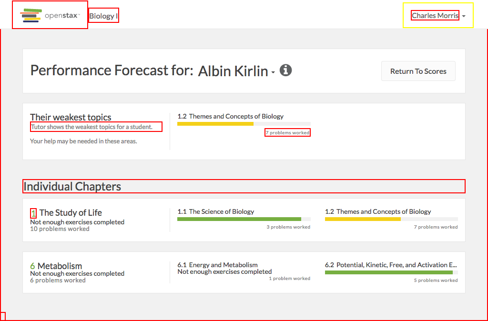

# https://tutor-{env}.openstax.org/courses/{courseId}/t/guide/student/{roleId}



# AJAX Calls

## GET /api/courses/1/guide/role/2

```json
{
  "children": [
    {
      "chapter_section": [
        1
      ],
      "children": [
        {
          "chapter_section": [
            1,
            1
          ],
          "clue": {
            "confidence_interval": [
              0,
              1
            ],
            "confidence_interval_interpretation": "bad",
            "sample_size": 0,
            "sample_size_interpretation": "below",
            "unique_learner_count": 1,
            "value": 0.5,
            "value_interpretation": "medium"
          },
          "page_ids": [
            "313"
          ],
          "practice_count": 0,
          "questions_answered_count": 3,
          "title": "The Science of Biology"
        },
        {
          "chapter_section": [
            1,
            2
          ],
          "clue": {
            "confidence_interval": [
              0,
              0.179141276527925
            ],
            "confidence_interval_interpretation": "good",
            "sample_size": 4,
            "sample_size_interpretation": "above",
            "unique_learner_count": 1,
            "value": 0.0518106848332736,
            "value_interpretation": "low"
          },
          "page_ids": [
            "314"
          ],
          "practice_count": 0,
          "questions_answered_count": 7,
          "title": "Themes and Concepts of Biology"
        }
      ],
      "clue": {
        "confidence_interval": [
          0,
          0.179141276527925
        ],
        "confidence_interval_interpretation": "good",
        "sample_size": 4,
        "sample_size_interpretation": "above",
        "unique_learner_count": 1,
        "value": 0.0518106848332736,
        "value_interpretation": "low"
      },
      "page_ids": [
        "313",
        "314"
      ],
      "practice_count": 0,
      "questions_answered_count": 10,
      "title": "The Study of Life"
    },
    {
      "chapter_section": [
        6
      ],
      "children": [
        {
          "chapter_section": [
            6,
            1
          ],
          "clue": {
            "confidence_interval": [
              0,
              1
            ],
            "confidence_interval_interpretation": "bad",
            "sample_size": 0,
            "sample_size_interpretation": "below",
            "unique_learner_count": 1,
            "value": 0.5,
            "value_interpretation": "medium"
          },
          "page_ids": [
            "338"
          ],
          "practice_count": 0,
          "questions_answered_count": 1,
          "title": "Energy and Metabolism"
        },
        {
          "chapter_section": [
            6,
            2
          ],
          "clue": {
            "confidence_interval": [
              0,
              1
            ],
            "confidence_interval_interpretation": "bad",
            "sample_size": 0,
            "sample_size_interpretation": "below",
            "unique_learner_count": 1,
            "value": 0.5,
            "value_interpretation": "medium"
          },
          "page_ids": [
            "339"
          ],
          "practice_count": 0,
          "questions_answered_count": 5,
          "title": "Potential, Kinetic, Free, and Activation Energy"
        }
      ],
      "clue": {
        "confidence_interval": [
          0,
          1
        ],
        "confidence_interval_interpretation": "bad",
        "sample_size": 0,
        "sample_size_interpretation": "below",
        "unique_learner_count": 1,
        "value": 0.5,
        "value_interpretation": "medium"
      },
      "page_ids": [
        "338",
        "339"
      ],
      "practice_count": 0,
      "questions_answered_count": 6,
      "title": "Metabolism"
    }
  ],
  "page_ids": [
    "338",
    "339",
    "... skipped 2"
  ],
  "period_id": "1",
  "title": "Biology For AP® Courses"
}
```

