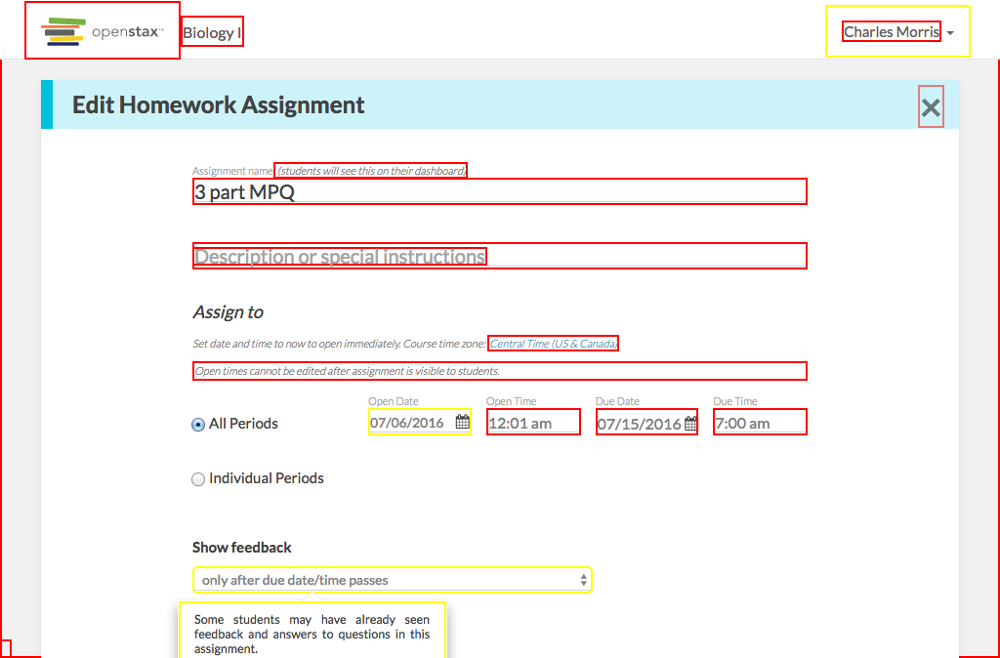

# https://tutor-{env}.openstax.org/courses/{courseId}/t/homeworks/{homeworkId}



# AJAX Calls

## GET /api/courses/1/exercises/homework_core?page_ids%5B%5D=314&ecosystem_id=4

```json
{
  "items": [
    {
      "content": {
        "attachments": [],
        "authors": [
          {
            "name": "OpenStax",
            "user_id": 1
          }
        ],
        "copyright_holders": [
          {
            "name": "Rice University",
            "user_id": 2
          }
        ],
        "derived_from": [],
        "editors": [],
        "is_vocab": false,
        "number": 40,
        "published_at": "2015-09-16T20:13:33.260Z",
        "questions": [
          {
            "answers": [
              {
                "content_html": "Lithops are succulent plants and show a heterotrophic mode of nutrition.",
                "correctness": "0.0",
                "feedback_html": "Lithops are succulent plants, but they do not show a heterotrophic mode of nutrition.",
                "id": 159
              },
              {
                "content_html": "Lithops are autotrophic. They show growth and reproduction.",
                "correctness": "1.0",
                "feedback_html": "Lithops are succulent plants which can photosynthesize their own food and produce seeds.",
                "id": 160
              },
              "... skipped 2"
            ],
            "collaborator_solutions": [
              {
                "attachments": [],
                "content_html": "Lithops grow, perform photosynthesis, and produce seeds.",
                "solution_type": "detailed"
              }
            ],
            "combo_choices": [],
            "community_solutions": [],
            "formats": [
              "multiple-choice",
              "free-response"
            ],
            "hints": [],
            "id": 40,
            "is_answer_order_important": true,
            "stem_html": "Some plants called lithops grow in the South African desert and look like stones. How were scientists able to determine they are living organisms?",
            "stimulus_html": ""
          }
        ],
        "stimulus_html": "",
        "tags": [
          "book:stax-apbio",
          "filter-type:import:hs",
          "... skipped 17"
        ],
        "uid": "40@1",
        "version": 1
      },
      "has_interactive": false,
      "has_video": false,
      "id": "3021",
      "is_excluded": false,
      "page_uuid": "cb7cf05b-7e16-4a53-a498-003b01ec3d7f",
      "pool_types": [
        "homework_core"
      ],
      "tags": [
        {
          "id": "tutor-only",
          "is_visible": false,
          "type": "generic"
        },
        {
          "id": "apbio-ch01-ot014",
          "is_visible": false,
          "type": "generic"
        },
        "... skipped 17"
      ],
      "url": "https://exercises-dev.openstax.org/exercises/40@1"
    },
    {
      "content": {
        "attachments": [],
        "authors": [
          {
            "name": "OpenStax",
            "user_id": 1
          }
        ],
        "copyright_holders": [
          {
            "name": "Rice University",
            "user_id": 2
          }
        ],
        "derived_from": [],
        "editors": [],
        "is_vocab": false,
        "number": 41,
        "published_at": "2015-09-16T20:13:33.270Z",
        "questions": [
          {
            "answers": [
              {
                "content_html": "red blood cells, hemoglobin, blood, veins, capillaries, cardiovascular system",
                "correctness": "0.0",
                "feedback_html": "Red blood cells have higher complexity than hemoglobin.",
                "id": 163
              },
              {
                "content_html": "oxygen, carbon dioxide, red blood cells, hemoglobin, blood, artery, cardiovascular system.",
                "correctness": "0.0",
                "feedback_html": "Oxygen and carbon dioxide are not part of the cardiovascular system.",
                "id": 164
              },
              "... skipped 2"
            ],
            "collaborator_solutions": [
              {
                "attachments": [],
                "content_html": "One example: hemoglobin, red blood cells, blood, artery, veins, capillaries, cardiovascular system.",
                "solution_type": "detailed"
              }
            ],
            "combo_choices": [],
            "community_solutions": [],
            "formats": [
              "multiple-choice",
              "free-response"
            ],
            "hints": [],
            "id": 41,
            "is_answer_order_important": true,
            "stem_html": "Consider the cardiovascular system. Rank in order of increasing complexity all its levels of organization starting with the hemoglobin.",
            "stimulus_html": ""
          }
        ],
        "stimulus_html": "",
        "tags": [
          "book:stax-apbio",
          "filter-type:import:hs",
          "... skipped 17"
        ],
        "uid": "41@1",
        "version": 1
      },
      "has_interactive": false,
      "has_video": false,
      "id": "3022",
      "is_excluded": false,
      "page_uuid": "cb7cf05b-7e16-4a53-a498-003b01ec3d7f",
      "pool_types": [
        "homework_core"
      ],
      "tags": [
        {
          "id": "tutor-only",
          "is_visible": false,
          "type": "generic"
        },
        {
          "id": "apbio-ch01-ot015",
          "is_visible": false,
          "type": "generic"
        },
        "... skipped 17"
      ],
      "url": "https://exercises-dev.openstax.org/exercises/41@1"
    },
    "... skipped 21"
  ],
  "total_count": 23
}
```


# WCAG2AAA Errors

Showing first 50 of 82 errors

```
ERROR input[type='text'][disabled=''][readonly=''].form-control WCAG2AAA.Principle4.Guideline4_1.4_1_2.H91.InputText.Name
ERROR input[type='text'][disabled=''][readonly=''].form-control WCAG2AAA.Principle1.Guideline1_3.1_3_1.F68
warning div.floating-label WCAG2AAA.Principle1.Guideline1_4.1_4_6.G17.Abs
ERROR div.floating-label WCAG2AAA.Principle1.Guideline1_4.1_4_6.G17.Fail
ERROR input[type='text'][value='07/15/2016'].form-control[readonly=''] WCAG2AAA.Principle4.Guideline4_1.4_1_2.H91.InputText.Name
ERROR input[type='text'][value='07/15/2016'].form-control[readonly=''] WCAG2AAA.Principle1.Guideline1_3.1_3_1.F68
ERROR input[required=''][min='2016-08-04'][value='7:00 am'][name='time'][type='text'].form-control[maxlength='6'][placeholder='_:__ _'][size='8'] WCAG2AAA.Principle4.Guideline4_1.4_1_2.H91.InputText.Name
ERROR input[required=''][min='2016-08-04'][value='7:00 am'][name='time'][type='text'].form-control[maxlength='6'][placeholder='_:__ _'][size='8'] WCAG2AAA.Principle1.Guideline1_3.1_3_1.F68
warning div.floating-label WCAG2AAA.Principle1.Guideline1_4.1_4_6.G17.Abs
ERROR div.floating-label WCAG2AAA.Principle1.Guideline1_4.1_4_6.G17.Fail
warning select#feedback-select.form-control WCAG2AAA.Principle4.Guideline4_1.4_1_2.H91.Select.Value
warning select#feedback-select.form-control WCAG2AAA.Principle1.Guideline1_3.1_3_1.H85.2
warning option[value='immediate'] WCAG2AAA.Principle1.Guideline1_4.1_4_6.G17.BgImage
warning option[value='due_at'] WCAG2AAA.Principle1.Guideline1_4.1_4_6.G17.BgImage
warning div.popover-content WCAG2AAA.Principle1.Guideline1_4.1_4_6.G17.Abs
ERROR span WCAG2AAA.Principle1.Guideline1_4.1_4_6.G17.Fail
ERROR button.footer-instructions.btn.btn-link[aria-describedby='plan-footer-popover'][type='button'] WCAG2AAA.Principle4.Guideline4_1.4_1_2.H91.Button.Name
ERROR h2 WCAG2AAA.Principle1.Guideline1_3.1_3_1_AAA.G141
ERROR h2 WCAG2AAA.Principle1.Guideline1_4.1_4_6.G18.Fail
ERROR span WCAG2AAA.Principle1.Guideline1_4.1_4_6.G17.Fail
ERROR td.exercise-number WCAG2AAA.Principle1.Guideline1_4.1_4_6.G17.Fail
ERROR span.chapter-section[data-chapter-section='1.2'] WCAG2AAA.Principle1.Guideline1_4.1_4_6.G17.Fail
ERROR td.exercise-number WCAG2AAA.Principle1.Guideline1_4.1_4_6.G17.Fail
ERROR td.exercise-number WCAG2AAA.Principle1.Guideline1_4.1_4_6.G17.Fail
ERROR td.exercise-number WCAG2AAA.Principle1.Guideline1_4.1_4_6.G17.Fail
ERROR span.exercise-number WCAG2AAA.Principle1.Guideline1_4.1_4_6.G18.Fail
ERROR span WCAG2AAA.Principle1.Guideline1_4.1_4_6.G17.Fail
ERROR span WCAG2AAA.Principle1.Guideline1_4.1_4_6.G17.Fail
warning div.preview.interactive WCAG2AAA.Principle1.Guideline1_4.1_4_6.G17.BgImage
warning label[for='6408-option-0'].answer-label WCAG2AAA.Principle1.Guideline1_3.1_3_1.H44.NonExistentFragment
ERROR span.openstax-has-html.answer-content WCAG2AAA.Principle1.Guideline1_4.1_4_6.G17.Fail
warning label[for='6408-option-1'].answer-label WCAG2AAA.Principle1.Guideline1_3.1_3_1.H44.NonExistentFragment
warning label[for='6408-option-2'].answer-label WCAG2AAA.Principle1.Guideline1_3.1_3_1.H44.NonExistentFragment
warning label[for='6408-option-3'].answer-label WCAG2AAA.Principle1.Guideline1_3.1_3_1.H44.NonExistentFragment
warning label[for='6409-option-0'].answer-label WCAG2AAA.Principle1.Guideline1_3.1_3_1.H44.NonExistentFragment
ERROR span.openstax-has-html.answer-content WCAG2AAA.Principle1.Guideline1_4.1_4_6.G17.Fail
warning label[for='6409-option-1'].answer-label WCAG2AAA.Principle1.Guideline1_3.1_3_1.H44.NonExistentFragment
warning label[for='6410-option-0'].answer-label WCAG2AAA.Principle1.Guideline1_3.1_3_1.H44.NonExistentFragment
ERROR span.openstax-has-html.answer-content WCAG2AAA.Principle1.Guideline1_4.1_4_6.G17.Fail
warning label[for='6410-option-1'].answer-label WCAG2AAA.Principle1.Guideline1_3.1_3_1.H44.NonExistentFragment
ERROR span WCAG2AAA.Principle1.Guideline1_4.1_4_6.G17.Fail
ERROR span WCAG2AAA.Principle1.Guideline1_4.1_4_6.G17.Fail
ERROR span.exercise-tag WCAG2AAA.Principle1.Guideline1_4.1_4_6.G17.Fail
ERROR span.exercise-tag WCAG2AAA.Principle1.Guideline1_4.1_4_6.G17.Fail
ERROR span.exercise-tag WCAG2AAA.Principle1.Guideline1_4.1_4_6.G17.Fail
ERROR span.exercise-tag WCAG2AAA.Principle1.Guideline1_4.1_4_6.G17.Fail
ERROR span.exercise-tag WCAG2AAA.Principle1.Guideline1_4.1_4_6.G17.Fail
ERROR span.exercise-tag WCAG2AAA.Principle1.Guideline1_4.1_4_6.G17.Fail
ERROR span.lo-tag WCAG2AAA.Principle1.Guideline1_4.1_4_6.G17.Fail
ERROR a[href='#spy'].debug-toggle-link WCAG2AAA.Principle2.Guideline2_4.2_4_1.G1,G123,G124.NoSuchID
undefined undefined undefined
```

