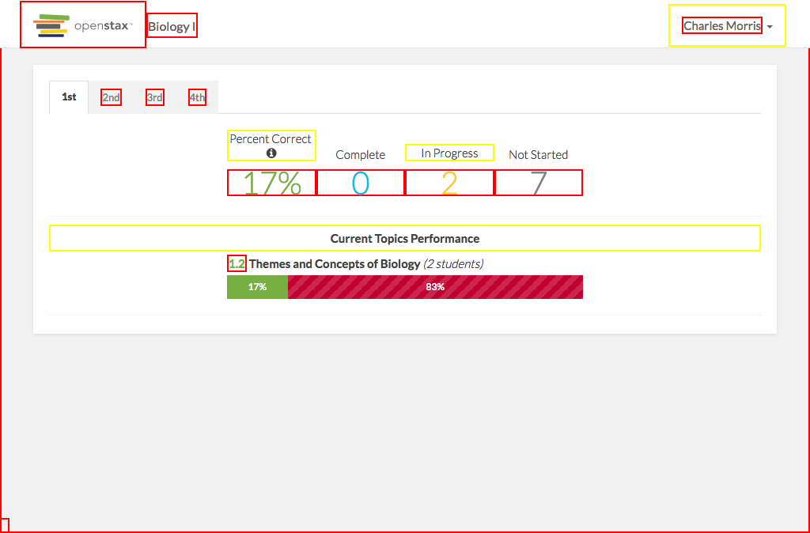

# https://tutor-{env}.openstax.org/courses/{courseId}/t/plans/{planId}



# AJAX Calls


# WCAG2AAA Errors

Showing first 50 of 27 errors

```
ERROR html WCAG2AAA.Principle3.Guideline3_1.3_1_1.H57.2
ERROR a.navbar-brand.navbar-brand[href='/dashboard/'] WCAG2AAA.Principle4.Guideline4_1.4_1_2.H91.A.NoContent
ERROR div.course-name WCAG2AAA.Principle1.Guideline1_4.1_4_6.G17.Fail
warning a#navbar-dropdown.dropdown-toggle[type='button'][aria-haspopup='true'][aria-expanded='false'][href=''] WCAG2AAA.Principle4.Guideline4_1.4_1_2.H91.A.NoHref
ERROR span WCAG2AAA.Principle1.Guideline1_4.1_4_6.G17.Fail
warning a.view-reference-guide[target='_blank'][href='/books/1/'] WCAG2AAA.Principle3.Guideline3_2.3_2_5.H83.3
warning a[href='https://accounts-dev.openstax.org/profile'][target='_blank'] WCAG2AAA.Principle3.Guideline3_2.3_2_5.H83.3
warning a[role='menuitem'][tabindex='-1'][target='_blank'][href='http://openstax.force.com/support?l=en_US&c=Products%3ATutor'] WCAG2AAA.Principle3.Guideline3_2.3_2_5.H83.3
ERROR a[href='#'] WCAG2AAA.Principle4.Guideline4_1.4_1_2.H91.A.NoContent
warning a[role='tab'][href=''][aria-selected='true'] WCAG2AAA.Principle4.Guideline4_1.4_1_2.H91.A.Placeholder
warning a[role='tab'][href=''][aria-selected='false'] WCAG2AAA.Principle4.Guideline4_1.4_1_2.H91.A.Placeholder
ERROR span.tab-item-period-name[aria-describedby='course-periods-nav-tab-1'] WCAG2AAA.Principle1.Guideline1_4.1_4_6.G17.Fail
warning a[role='tab'][href=''][aria-selected='false'] WCAG2AAA.Principle4.Guideline4_1.4_1_2.H91.A.Placeholder
ERROR span.tab-item-period-name[aria-describedby='course-periods-nav-tab-2'] WCAG2AAA.Principle1.Guideline1_4.1_4_6.G17.Fail
warning a[role='tab'][href=''][aria-selected='false'] WCAG2AAA.Principle4.Guideline4_1.4_1_2.H91.A.Placeholder
ERROR span.tab-item-period-name[aria-describedby='course-periods-nav-tab-3'] WCAG2AAA.Principle1.Guideline1_4.1_4_6.G17.Fail
warning label WCAG2AAA.Principle1.Guideline1_3.1_3_1.H44.NonExistentFragment
ERROR div.data-container-value.text-average WCAG2AAA.Principle1.Guideline1_4.1_4_6.G18.Fail
ERROR div.data-container-value.text-complete WCAG2AAA.Principle1.Guideline1_4.1_4_6.G18.Fail
warning label WCAG2AAA.Principle1.Guideline1_3.1_3_1.H44.NonExistentFragment
ERROR div.data-container-value.text-in-progress WCAG2AAA.Principle1.Guideline1_4.1_4_6.G18.Fail
ERROR div.data-container-value.text-not-started WCAG2AAA.Principle1.Guideline1_4.1_4_6.G18.Fail
warning label WCAG2AAA.Principle1.Guideline1_3.1_3_1.H44.NonExistentFragment
ERROR span.text-success WCAG2AAA.Principle1.Guideline1_4.1_4_6.G17.Fail
ERROR span WCAG2AAA.Principle1.Guideline1_4.1_4_6.G17.Fail
warning span WCAG2AAA.Principle1.Guideline1_4.1_4_6.G17.BgImage
ERROR a[href='#spy'].debug-toggle-link WCAG2AAA.Principle2.Guideline2_4.2_4_1.G1,G123,G124.NoSuchID
```

