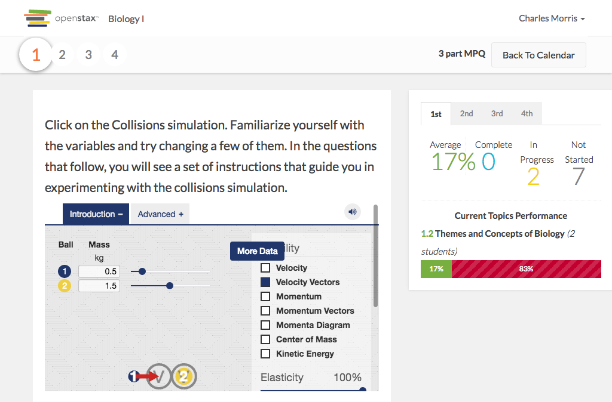

# https://tutor-{env}.openstax.org/courses/{courseId}/t/plans/{planId}/summary



# AJAX Calls

## GET /api/plans/69/stats

```json
{
  "id": "69",
  "type": "homework",
  "title": "3 part MPQ",
  "stats": [
    {
      "period_id": "3",
      "name": "3rd",
      "mean_grade_percent": 33,
      "total_count": 11,
      "complete_count": 0,
      "partially_complete_count": 1,
      "current_pages": [
        {
          "id": "314",
          "title": "Themes and Concepts of Biology",
          "student_count": 1,
          "correct_count": 1,
          "incorrect_count": 2,
          "chapter_section": [
            1,
            2
          ],
          "is_trouble": false
        }
      ],
      "spaced_pages": [],
      "is_trouble": false
    },
    {
      "period_id": "1",
      "name": "1st",
      "mean_grade_percent": 17,
      "total_count": 9,
      "complete_count": 0,
      "partially_complete_count": 2,
      "current_pages": [
        {
          "id": "314",
          "title": "Themes and Concepts of Biology",
          "student_count": 2,
          "correct_count": 1,
          "incorrect_count": 5,
          "chapter_section": [
            1,
            2
          ],
          "is_trouble": false
        }
      ],
      "spaced_pages": [],
      "is_trouble": false
    },
    {
      "period_id": "2",
      "name": "2nd",
      "mean_grade_percent": 50,
      "total_count": 10,
      "complete_count": 1,
      "partially_complete_count": 0,
      "current_pages": [
        {
          "id": "314",
          "title": "Themes and Concepts of Biology",
          "student_count": 1,
          "correct_count": 2,
          "incorrect_count": 2,
          "chapter_section": [
            1,
            2
          ],
          "is_trouble": false
        }
      ],
      "spaced_pages": [],
      "is_trouble": false
    },
    {
      "period_id": "4",
      "name": "4th",
      "mean_grade_percent": 50,
      "total_count": 11,
      "complete_count": 1,
      "partially_complete_count": 0,
      "current_pages": [
        {
          "id": "314",
          "title": "Themes and Concepts of Biology",
          "student_count": 1,
          "correct_count": 1,
          "incorrect_count": 3,
          "chapter_section": [
            1,
            2
          ],
          "is_trouble": false
        }
      ],
      "spaced_pages": [],
      "is_trouble": false
    }
  ],
  "shareable_url": "/@/kEyX0d/3-part-mpq"
}
```

## GET /api/plans/69/review

```json
{
  "id": "69",
  "type": "homework",
  "title": "3 part MPQ",
  "stats": [
    {
      "period_id": "3",
      "name": "3rd",
      "mean_grade_percent": 33,
      "total_count": 11,
      "complete_count": 0,
      "partially_complete_count": 1,
      "current_pages": [
        {
          "id": "314",
          "title": "Themes and Concepts of Biology",
          "student_count": 1,
          "correct_count": 1,
          "incorrect_count": 2,
          "chapter_section": [
            1,
            2
          ],
          "exercises": [
            {
              "content": "{\"attachments\":[],\"tags\":[\"apbio\",\"apbio-ch01\",\"ost-chapter-review\",\"review\",\"dok1\",\"time-short\",\"blooms-3\",\"apbio-ch01-s02\",\"apbio-ch01-s02-lo01\",\"apbio-ch01-ex013\",\"book:stax-bio\",\"time:short\",\"blooms:3\",\"dok:1\",\"context-cnxmod:cb7cf05b-7e16-4a53-a498-003b01ec3d7f\",\"type:practice\",\"book:stax-apbio\",\"exid:apbio-ch01-ex013\",\"filter-type:import:hs\"],\"uid\":\"13@6\",\"number\":13,\"version\":6,\"published_at\":\"2016-07-05T19:13:06.732Z\",\"editors\":[],\"authors\":[{\"user_id\":1,\"name\":\"OpenStax\"}],\"copyright_holders\":[{\"user_id\":2,\"name\":\"Rice University\"}],\"derived_from\":[],\"is_vocab\":false,\"stimulus_html\":\"Click on the Collisions simulation. Familiarize yourself with the variables and try changing a few of them. In the questions that follow, you will see a set of instructions that guide you in experimenting with the collisions simulation. \\n<iframe src=\\\"https://archive.cnx.org/specials/2c7acb3c-2fbd-11e5-b2d9-e7f92291703c/collision-lab/\\\"></iframe>\",\"questions\":[{\"id\":6408,\"is_answer_order_important\":true,\"stimulus_html\":\"\",\"stem_html\":\"Why are viruses not considered living? Is it because they're not real?\",\"answers\":[{\"id\":24965,\"content_html\":\"They are not made of cells.\",\"correctness\":\"1.0\",\"feedback_html\":\"Viruses are not made up of cells. They are made up of DNA or RNA surrounded by a protein coat.\"},{\"id\":24966,\"content_html\":\"They cannot replicate.\",\"correctness\":\"0.0\",\"feedback_html\":\"Viruses cannot replicate without a host. They are not considered living because they are not made up of cells.\"},{\"id\":24967,\"content_html\":\"They do not contain DNA or RNA.\",\"correctness\":\"0.0\",\"feedback_html\":\"Viruses are made up of DNA or RNA.\"},{\"id\":24968,\"content_html\":\"They lack a cell membrane.\",\"correctness\":\"0.0\",\"feedback_html\":\"Many viruses have lipid envelopes, which is not the same as lacking a cell membrane. Viruses are not made up of living cells and this differentiates them from living beings.\"}],\"collaborator_solutions\":[{\"attachments\":[],\"solution_type\":\"detailed\",\"content_html\":\"They are not made of cells.\"}],\"community_solutions\":[],\"hints\":[],\"formats\":[\"free-response\",\"multiple-choice\"],\"combo_choices\":[]},{\"id\":6409,\"is_answer_order_important\":false,\"stimulus_html\":\"\",\"stem_html\":\"Where do virii go when they're old?\",\"answers\":[{\"id\":24969,\"content_html\":\"To the Head\",\"correctness\":\"1.0\",\"feedback_html\":\"really?\"},{\"id\":24970,\"content_html\":\"To the Feet\",\"correctness\":\"0.0\",\"feedback_html\":\"Really?  Really, really?\"}],\"collaborator_solutions\":[{\"attachments\":[],\"solution_type\":\"detailed\",\"content_html\":\"what do you men by your answer?\"}],\"community_solutions\":[],\"hints\":[],\"formats\":[\"free-response\",\"multiple-choice\"],\"combo_choices\":[]},{\"id\":6410,\"is_answer_order_important\":false,\"stimulus_html\":\"\",\"stem_html\":\"What was wrong in question # 2?\",\"answers\":[{\"id\":24971,\"content_html\":\"It was undefined\",\"correctness\":\"1.0\",\"feedback_html\":\"like a tortise\"},{\"id\":24972,\"content_html\":\"It didn't have any sense\",\"correctness\":\"0.0\",\"feedback_html\":\"\"}],\"collaborator_solutions\":[{\"attachments\":[],\"solution_type\":\"detailed\",\"content_html\":\"RNA / DNA\"}],\"community_solutions\":[],\"hints\":[],\"formats\":[\"multiple-choice\",\"free-response\"],\"combo_choices\":[]}]}",
              "question_stats": [
                {
                  "question_id": "6408",
                  "answered_count": 1,
                  "answers": [
                    {
                      "student_names": [
                        "Alden Pyle"
                      ],
                      "free_response": "test",
                      "answer_id": "24965"
                    }
                  ],
                  "answer_stats": [
                    {
                      "answer_id": "24965",
                      "selected_count": 1
                    },
                    {
                      "answer_id": "24966",
                      "selected_count": 0
                    },
                    {
                      "answer_id": "24967",
                      "selected_count": 0
                    },
                    {
                      "answer_id": "24968",
                      "selected_count": 0
                    }
                  ]
                },
                {
                  "question_id": "6409",
                  "answered_count": 1,
                  "answers": [
                    {
                      "student_names": [
                        "Alden Pyle"
                      ],
                      "free_response": "rea",
                      "answer_id": "24970"
                    }
                  ],
                  "answer_stats": [
                    {
                      "answer_id": "24969",
                      "selected_count": 0
                    },
                    {
                      "answer_id": "24970",
                      "selected_count": 1
                    }
                  ]
                },
                {
                  "question_id": "6410",
                  "answered_count": 1,
                  "answers": [
                    {
                      "student_names": [
                        "Alden Pyle"
                      ],
                      "free_response": "ae",
                      "answer_id": "24972"
                    }
                  ],
                  "answer_stats": [
                    {
                      "answer_id": "24971",
                      "selected_count": 0
                    },
                    {
                      "answer_id": "24972",
                      "selected_count": 1
                    }
                  ]
                }
              ],
              "average_step_number": 2
            },
            {
              "content": "{\"attachments\":[],\"tags\":[\"apbio\",\"apbio-ch01\",\"blooms-4\",\"ost-chapter-review\",\"time-long\",\"critical-thinking\",\"dok4\",\"apbio-ch01-s02\",\"apbio-ch01-s02-lo01\",\"apbio-ch01-ex021\",\"book:stax-bio\",\"time:long\",\"blooms:4\",\"dok:4\",\"context-cnxmod:cb7cf05b-7e16-4a53-a498-003b01ec3d7f\",\"type:practice\",\"book:stax-apbio\",\"exid:apbio-ch01-ex021\",\"filter-type:import:hs\"],\"uid\":\"21@1\",\"number\":21,\"version\":1,\"published_at\":\"2015-09-16T20:13:32.991Z\",\"editors\":[],\"authors\":[{\"user_id\":1,\"name\":\"OpenStax\"}],\"copyright_holders\":[{\"user_id\":2,\"name\":\"Rice University\"}],\"derived_from\":[],\"is_vocab\":false,\"stimulus_html\":\"\",\"questions\":[{\"id\":21,\"is_answer_order_important\":true,\"stimulus_html\":\"\",\"stem_html\":\"Both astronomy and astrology study the stars. Which one is considered a natural science? Explain your reasoning.\",\"answers\":[{\"id\":81,\"content_html\":\"Astrology is a natural science as it indirectly influences human affairs and the natural world.\",\"correctness\":\"0.0\",\"feedback_html\":\"Astrology is not natural science.\"},{\"id\":82,\"content_html\":\"Astronomy is a natural science as it deals with observations and prediction of events in the sky, which is based on the laws of physics.\",\"correctness\":\"1.0\",\"feedback_html\":\"Astronomy is a natural science that deals with the study of celestial objects such as stars, galaxies, planets, moons, asteroids, comets and nebulae. It helps in the prediction of events in the sky and encompasses the laws of physics.\"},{\"id\":83,\"content_html\":\"Astrology is a natural science as it deals with observations and prediction of events in the sky, influences human affairs and the natural world.\",\"correctness\":\"0.0\",\"feedback_html\":\"Astrology does not deal with the prediction of events in the sky.\"},{\"id\":84,\"content_html\":\"Astrology is a natural science as it deals with the study of asteroids and comets, which is based on the laws of natural sciences.\",\"correctness\":\"0.0\",\"feedback_html\":\"Astronomy is a natural science not astrology.\"}],\"collaborator_solutions\":[{\"attachments\":[],\"solution_type\":\"detailed\",\"content_html\":\"Astrology does involve observations of celestial bodies, but is a way to predict human affairs based on astronomical data not supported by tested hypothesis backed by that data. Astronomy is the science of observing, measuring, and making prediction of events in the sky based on past observations and laws of physics.\"}],\"community_solutions\":[],\"hints\":[],\"formats\":[\"multiple-choice\",\"free-response\"],\"combo_choices\":[]}]}",
              "question_stats": [
                {
                  "question_id": "21",
                  "answered_count": 0,
                  "answers": [],
                  "answer_stats": [
                    {
                      "answer_id": "81",
                      "selected_count": 0
                    },
                    {
                      "answer_id": "82",
                      "selected_count": 0
                    },
                    {
                      "answer_id": "83",
                      "selected_count": 0
                    },
                    {
                      "answer_id": "84",
                      "selected_count": 0
                    }
                  ]
                }
              ],
              "average_step_number": 4
            }
          ],
          "is_trouble": false
        }
      ],
      "spaced_pages": [],
      "is_trouble": false
    },
    {
      "period_id": "1",
      "name": "1st",
      "mean_grade_percent": 17,
      "total_count": 9,
      "complete_count": 0,
      "partially_complete_count": 2,
      "current_pages": [
        {
          "id": "314",
          "title": "Themes and Concepts of Biology",
          "student_count": 2,
          "correct_count": 1,
          "incorrect_count": 5,
          "chapter_section": [
            1,
            2
          ],
          "exercises": [
            {
              "content": "{\"attachments\":[],\"tags\":[\"apbio\",\"apbio-ch01\",\"ost-chapter-review\",\"review\",\"dok1\",\"time-short\",\"blooms-3\",\"apbio-ch01-s02\",\"apbio-ch01-s02-lo01\",\"apbio-ch01-ex013\",\"book:stax-bio\",\"time:short\",\"blooms:3\",\"dok:1\",\"context-cnxmod:cb7cf05b-7e16-4a53-a498-003b01ec3d7f\",\"type:practice\",\"book:stax-apbio\",\"exid:apbio-ch01-ex013\",\"filter-type:import:hs\"],\"uid\":\"13@6\",\"number\":13,\"version\":6,\"published_at\":\"2016-07-05T19:13:06.732Z\",\"editors\":[],\"authors\":[{\"user_id\":1,\"name\":\"OpenStax\"}],\"copyright_holders\":[{\"user_id\":2,\"name\":\"Rice University\"}],\"derived_from\":[],\"is_vocab\":false,\"stimulus_html\":\"Click on the Collisions simulation. Familiarize yourself with the variables and try changing a few of them. In the questions that follow, you will see a set of instructions that guide you in experimenting with the collisions simulation. \\n<iframe src=\\\"https://archive.cnx.org/specials/2c7acb3c-2fbd-11e5-b2d9-e7f92291703c/collision-lab/\\\"></iframe>\",\"questions\":[{\"id\":6408,\"is_answer_order_important\":true,\"stimulus_html\":\"\",\"stem_html\":\"Why are viruses not considered living? Is it because they're not real?\",\"answers\":[{\"id\":24965,\"content_html\":\"They are not made of cells.\",\"correctness\":\"1.0\",\"feedback_html\":\"Viruses are not made up of cells. They are made up of DNA or RNA surrounded by a protein coat.\"},{\"id\":24966,\"content_html\":\"They cannot replicate.\",\"correctness\":\"0.0\",\"feedback_html\":\"Viruses cannot replicate without a host. They are not considered living because they are not made up of cells.\"},{\"id\":24967,\"content_html\":\"They do not contain DNA or RNA.\",\"correctness\":\"0.0\",\"feedback_html\":\"Viruses are made up of DNA or RNA.\"},{\"id\":24968,\"content_html\":\"They lack a cell membrane.\",\"correctness\":\"0.0\",\"feedback_html\":\"Many viruses have lipid envelopes, which is not the same as lacking a cell membrane. Viruses are not made up of living cells and this differentiates them from living beings.\"}],\"collaborator_solutions\":[{\"attachments\":[],\"solution_type\":\"detailed\",\"content_html\":\"They are not made of cells.\"}],\"community_solutions\":[],\"hints\":[],\"formats\":[\"free-response\",\"multiple-choice\"],\"combo_choices\":[]},{\"id\":6409,\"is_answer_order_important\":false,\"stimulus_html\":\"\",\"stem_html\":\"Where do virii go when they're old?\",\"answers\":[{\"id\":24969,\"content_html\":\"To the Head\",\"correctness\":\"1.0\",\"feedback_html\":\"really?\"},{\"id\":24970,\"content_html\":\"To the Feet\",\"correctness\":\"0.0\",\"feedback_html\":\"Really?  Really, really?\"}],\"collaborator_solutions\":[{\"attachments\":[],\"solution_type\":\"detailed\",\"content_html\":\"what do you men by your answer?\"}],\"community_solutions\":[],\"hints\":[],\"formats\":[\"free-response\",\"multiple-choice\"],\"combo_choices\":[]},{\"id\":6410,\"is_answer_order_important\":false,\"stimulus_html\":\"\",\"stem_html\":\"What was wrong in question # 2?\",\"answers\":[{\"id\":24971,\"content_html\":\"It was undefined\",\"correctness\":\"1.0\",\"feedback_html\":\"like a tortise\"},{\"id\":24972,\"content_html\":\"It didn't have any sense\",\"correctness\":\"0.0\",\"feedback_html\":\"\"}],\"collaborator_solutions\":[{\"attachments\":[],\"solution_type\":\"detailed\",\"content_html\":\"RNA / DNA\"}],\"community_solutions\":[],\"hints\":[],\"formats\":[\"multiple-choice\",\"free-response\"],\"combo_choices\":[]}]}",
              "question_stats": [
                {
                  "question_id": "6408",
                  "answered_count": 2,
                  "answers": [
                    {
                      "student_names": [
                        "Albin Kirlin"
                      ],
                      "free_response": "lkj",
                      "answer_id": "24966"
                    },
                    {
                      "student_names": [
                        "Alyce Tromp"
                      ],
                      "free_response": "one",
                      "answer_id": "24965"
                    }
                  ],
                  "answer_stats": [
                    {
                      "answer_id": "24965",
                      "selected_count": 1
                    },
                    {
                      "answer_id": "24966",
                      "selected_count": 1
                    },
                    {
                      "answer_id": "24967",
                      "selected_count": 0
                    },
                    {
                      "answer_id": "24968",
                      "selected_count": 0
                    }
                  ]
                },
                {
                  "question_id": "6409",
                  "answered_count": 2,
                  "answers": [
                    {
                      "student_names": [
                        "Albin Kirlin"
                      ],
                      "free_response": "asdf",
                      "answer_id": "24970"
                    },
                    {
                      "student_names": [
                        "Alyce Tromp"
                      ],
                      "free_response": "k",
                      "answer_id": "24970"
                    }
                  ],
                  "answer_stats": [
                    {
                      "answer_id": "24969",
                      "selected_count": 0
                    },
                    {
                      "answer_id": "24970",
                      "selected_count": 2
                    }
                  ]
                },
                {
                  "question_id": "6410",
                  "answered_count": 2,
                  "answers": [
                    {
                      "student_names": [
                        "Albin Kirlin"
                      ],
                      "free_response": "asdf",
                      "answer_id": "24972"
                    },
                    {
                      "student_names": [
                        "Alyce Tromp"
                      ],
                      "free_response": "red",
                      "answer_id": "24972"
                    }
                  ],
                  "answer_stats": [
                    {
                      "answer_id": "24971",
                      "selected_count": 0
                    },
                    {
                      "answer_id": "24972",
                      "selected_count": 2
                    }
                  ]
                }
              ],
              "average_step_number": 2
            },
            {
              "content": "{\"attachments\":[],\"tags\":[\"apbio\",\"apbio-ch01\",\"ost-chapter-review\",\"dok1\",\"time-short\",\"blooms-3\",\"apbio-ch01-s02\",\"apbio-ch01-s02-aplo-1-14\",\"apbio-ch01-ex022\",\"ap-test-prep\",\"book:stax-bio\",\"time:short\",\"blooms:3\",\"dok:1\",\"context-cnxmod:cb7cf05b-7e16-4a53-a498-003b01ec3d7f\",\"type:practice\",\"book:stax-apbio\",\"exid:apbio-ch01-ex022\",\"filter-type:import:hs\"],\"uid\":\"22@1\",\"number\":22,\"version\":1,\"published_at\":\"2015-09-16T20:13:33.013Z\",\"editors\":[],\"authors\":[{\"user_id\":1,\"name\":\"OpenStax\"}],\"copyright_holders\":[{\"user_id\":2,\"name\":\"Rice University\"}],\"derived_from\":[],\"is_vocab\":false,\"stimulus_html\":\"\",\"questions\":[{\"id\":22,\"is_answer_order_important\":true,\"stimulus_html\":\"\",\"stem_html\":\"Which of the following structures is conserved in all living organisms and points to a common origin?\",\"answers\":[{\"id\":85,\"content_html\":\"All living organisms have mitochondria that produce energy.\",\"correctness\":\"0.0\",\"feedback_html\":\"All living organisms do not have mitochondria.\"},{\"id\":86,\"content_html\":\"All living organisms store genetic material in DNA/RNA.\",\"correctness\":\"1.0\",\"feedback_html\":\"Correct! All living organisms store genetic information using the same molecules: DNA and RNA.\"},{\"id\":87,\"content_html\":\"All living organisms use the energy from sunlight\",\"correctness\":\"0.0\",\"feedback_html\":\"All living organisms do not obtain energy from sunlight.\"},{\"id\":88,\"content_html\":\"All living organisms have a nucleus.\",\"correctness\":\"0.0\",\"feedback_html\":\"All living organisms do not have a nucleus.\"}],\"collaborator_solutions\":[{\"attachments\":[],\"solution_type\":\"detailed\",\"content_html\":\"All living organisms store genetic material in DNA/RNA.\"}],\"community_solutions\":[],\"hints\":[],\"formats\":[\"multiple-choice\"],\"combo_choices\":[]}]}",
              "question_stats": [
                {
                  "question_id": "22",
                  "answered_count": 0,
                  "answers": [],
                  "answer_stats": [
                    {
                      "answer_id": "85",
                      "selected_count": 0
                    },
                    {
                      "answer_id": "86",
                      "selected_count": 0
                    },
                    {
                      "answer_id": "87",
                      "selected_count": 0
                    },
                    {
                      "answer_id": "88",
                      "selected_count": 0
                    }
                  ]
                }
              ],
              "average_step_number": 4
            }
          ],
          "is_trouble": false
        }
      ],
      "spaced_pages": [],
      "is_trouble": false
    },
    {
      "period_id": "2",
      "name": "2nd",
      "mean_grade_percent": 50,
      "total_count": 10,
      "complete_count": 1,
      "partially_complete_count": 0,
      "current_pages": [
        {
          "id": "314",
          "title": "Themes and Concepts of Biology",
          "student_count": 1,
          "correct_count": 2,
          "incorrect_count": 2,
          "chapter_section": [
            1,
            2
          ],
          "exercises": [
            {
              "content": "{\"attachments\":[],\"tags\":[\"apbio\",\"apbio-ch01\",\"ost-chapter-review\",\"review\",\"dok1\",\"time-short\",\"blooms-3\",\"apbio-ch01-s02\",\"apbio-ch01-s02-lo01\",\"apbio-ch01-ex013\",\"book:stax-bio\",\"time:short\",\"blooms:3\",\"dok:1\",\"context-cnxmod:cb7cf05b-7e16-4a53-a498-003b01ec3d7f\",\"type:practice\",\"book:stax-apbio\",\"exid:apbio-ch01-ex013\",\"filter-type:import:hs\"],\"uid\":\"13@6\",\"number\":13,\"version\":6,\"published_at\":\"2016-07-05T19:13:06.732Z\",\"editors\":[],\"authors\":[{\"user_id\":1,\"name\":\"OpenStax\"}],\"copyright_holders\":[{\"user_id\":2,\"name\":\"Rice University\"}],\"derived_from\":[],\"is_vocab\":false,\"stimulus_html\":\"Click on the Collisions simulation. Familiarize yourself with the variables and try changing a few of them. In the questions that follow, you will see a set of instructions that guide you in experimenting with the collisions simulation. \\n<iframe src=\\\"https://archive.cnx.org/specials/2c7acb3c-2fbd-11e5-b2d9-e7f92291703c/collision-lab/\\\"></iframe>\",\"questions\":[{\"id\":6408,\"is_answer_order_important\":true,\"stimulus_html\":\"\",\"stem_html\":\"Why are viruses not considered living? Is it because they're not real?\",\"answers\":[{\"id\":24965,\"content_html\":\"They are not made of cells.\",\"correctness\":\"1.0\",\"feedback_html\":\"Viruses are not made up of cells. They are made up of DNA or RNA surrounded by a protein coat.\"},{\"id\":24966,\"content_html\":\"They cannot replicate.\",\"correctness\":\"0.0\",\"feedback_html\":\"Viruses cannot replicate without a host. They are not considered living because they are not made up of cells.\"},{\"id\":24967,\"content_html\":\"They do not contain DNA or RNA.\",\"correctness\":\"0.0\",\"feedback_html\":\"Viruses are made up of DNA or RNA.\"},{\"id\":24968,\"content_html\":\"They lack a cell membrane.\",\"correctness\":\"0.0\",\"feedback_html\":\"Many viruses have lipid envelopes, which is not the same as lacking a cell membrane. Viruses are not made up of living cells and this differentiates them from living beings.\"}],\"collaborator_solutions\":[{\"attachments\":[],\"solution_type\":\"detailed\",\"content_html\":\"They are not made of cells.\"}],\"community_solutions\":[],\"hints\":[],\"formats\":[\"free-response\",\"multiple-choice\"],\"combo_choices\":[]},{\"id\":6409,\"is_answer_order_important\":false,\"stimulus_html\":\"\",\"stem_html\":\"Where do virii go when they're old?\",\"answers\":[{\"id\":24969,\"content_html\":\"To the Head\",\"correctness\":\"1.0\",\"feedback_html\":\"really?\"},{\"id\":24970,\"content_html\":\"To the Feet\",\"correctness\":\"0.0\",\"feedback_html\":\"Really?  Really, really?\"}],\"collaborator_solutions\":[{\"attachments\":[],\"solution_type\":\"detailed\",\"content_html\":\"what do you men by your answer?\"}],\"community_solutions\":[],\"hints\":[],\"formats\":[\"free-response\",\"multiple-choice\"],\"combo_choices\":[]},{\"id\":6410,\"is_answer_order_important\":false,\"stimulus_html\":\"\",\"stem_html\":\"What was wrong in question # 2?\",\"answers\":[{\"id\":24971,\"content_html\":\"It was undefined\",\"correctness\":\"1.0\",\"feedback_html\":\"like a tortise\"},{\"id\":24972,\"content_html\":\"It didn't have any sense\",\"correctness\":\"0.0\",\"feedback_html\":\"\"}],\"collaborator_solutions\":[{\"attachments\":[],\"solution_type\":\"detailed\",\"content_html\":\"RNA / DNA\"}],\"community_solutions\":[],\"hints\":[],\"formats\":[\"multiple-choice\",\"free-response\"],\"combo_choices\":[]}]}",
              "question_stats": [
                {
                  "question_id": "6408",
                  "answered_count": 1,
                  "answers": [
                    {
                      "student_names": [
                        "Augie March"
                      ],
                      "free_response": "asdf",
                      "answer_id": "24967"
                    }
                  ],
                  "answer_stats": [
                    {
                      "answer_id": "24965",
                      "selected_count": 0
                    },
                    {
                      "answer_id": "24966",
                      "selected_count": 0
                    },
                    {
                      "answer_id": "24967",
                      "selected_count": 1
                    },
                    {
                      "answer_id": "24968",
                      "selected_count": 0
                    }
                  ]
                },
                {
                  "question_id": "6409",
                  "answered_count": 1,
                  "answers": [
                    {
                      "student_names": [
                        "Augie March"
                      ],
                      "free_response": "j",
                      "answer_id": "24969"
                    }
                  ],
                  "answer_stats": [
                    {
                      "answer_id": "24969",
                      "selected_count": 1
                    },
                    {
                      "answer_id": "24970",
                      "selected_count": 0
                    }
                  ]
                },
                {
                  "question_id": "6410",
                  "answered_count": 1,
                  "answers": [
                    {
                      "student_names": [
                        "Augie March"
                      ],
                      "free_response": "asdf",
                      "answer_id": "24972"
                    }
                  ],
                  "answer_stats": [
                    {
                      "answer_id": "24971",
                      "selected_count": 0
                    },
                    {
                      "answer_id": "24972",
                      "selected_count": 1
                    }
                  ]
                }
              ],
              "average_step_number": 2
            },
            {
              "content": "{\"attachments\":[],\"tags\":[\"apbio\",\"apbio-ch01\",\"ost-chapter-review\",\"dok1\",\"time-short\",\"blooms-3\",\"apbio-ch01-s02\",\"apbio-ch01-s02-aplo-1-14\",\"apbio-ch01-ex022\",\"ap-test-prep\",\"book:stax-bio\",\"time:short\",\"blooms:3\",\"dok:1\",\"context-cnxmod:cb7cf05b-7e16-4a53-a498-003b01ec3d7f\",\"type:practice\",\"book:stax-apbio\",\"exid:apbio-ch01-ex022\",\"filter-type:import:hs\"],\"uid\":\"22@1\",\"number\":22,\"version\":1,\"published_at\":\"2015-09-16T20:13:33.013Z\",\"editors\":[],\"authors\":[{\"user_id\":1,\"name\":\"OpenStax\"}],\"copyright_holders\":[{\"user_id\":2,\"name\":\"Rice University\"}],\"derived_from\":[],\"is_vocab\":false,\"stimulus_html\":\"\",\"questions\":[{\"id\":22,\"is_answer_order_important\":true,\"stimulus_html\":\"\",\"stem_html\":\"Which of the following structures is conserved in all living organisms and points to a common origin?\",\"answers\":[{\"id\":85,\"content_html\":\"All living organisms have mitochondria that produce energy.\",\"correctness\":\"0.0\",\"feedback_html\":\"All living organisms do not have mitochondria.\"},{\"id\":86,\"content_html\":\"All living organisms store genetic material in DNA/RNA.\",\"correctness\":\"1.0\",\"feedback_html\":\"Correct! All living organisms store genetic information using the same molecules: DNA and RNA.\"},{\"id\":87,\"content_html\":\"All living organisms use the energy from sunlight\",\"correctness\":\"0.0\",\"feedback_html\":\"All living organisms do not obtain energy from sunlight.\"},{\"id\":88,\"content_html\":\"All living organisms have a nucleus.\",\"correctness\":\"0.0\",\"feedback_html\":\"All living organisms do not have a nucleus.\"}],\"collaborator_solutions\":[{\"attachments\":[],\"solution_type\":\"detailed\",\"content_html\":\"All living organisms store genetic material in DNA/RNA.\"}],\"community_solutions\":[],\"hints\":[],\"formats\":[\"multiple-choice\"],\"combo_choices\":[]}]}",
              "question_stats": [
                {
                  "question_id": "22",
                  "answered_count": 1,
                  "answers": [
                    {
                      "student_names": [
                        "Augie March"
                      ],
                      "answer_id": "86"
                    }
                  ],
                  "answer_stats": [
                    {
                      "answer_id": "85",
                      "selected_count": 0
                    },
                    {
                      "answer_id": "86",
                      "selected_count": 1
                    },
                    {
                      "answer_id": "87",
                      "selected_count": 0
                    },
                    {
                      "answer_id": "88",
                      "selected_count": 0
                    }
                  ]
                }
              ],
              "average_step_number": 4
            }
          ],
          "is_trouble": false
        }
      ],
      "spaced_pages": [],
      "is_trouble": false
    },
    {
      "period_id": "4",
      "name": "4th",
      "mean_grade_percent": 50,
      "total_count": 11,
      "complete_count": 1,
      "partially_complete_count": 0,
      "current_pages": [
        {
          "id": "314",
          "title": "Themes and Concepts of Biology",
          "student_count": 1,
          "correct_count": 1,
          "incorrect_count": 3,
          "chapter_section": [
            1,
            2
          ],
          "exercises": [
            {
              "content": "{\"attachments\":[],\"tags\":[\"apbio\",\"apbio-ch01\",\"ost-chapter-review\",\"review\",\"dok1\",\"time-short\",\"blooms-3\",\"apbio-ch01-s02\",\"apbio-ch01-s02-lo01\",\"apbio-ch01-ex013\",\"book:stax-bio\",\"time:short\",\"blooms:3\",\"dok:1\",\"context-cnxmod:cb7cf05b-7e16-4a53-a498-003b01ec3d7f\",\"type:practice\",\"book:stax-apbio\",\"exid:apbio-ch01-ex013\",\"filter-type:import:hs\"],\"uid\":\"13@6\",\"number\":13,\"version\":6,\"published_at\":\"2016-07-05T19:13:06.732Z\",\"editors\":[],\"authors\":[{\"user_id\":1,\"name\":\"OpenStax\"}],\"copyright_holders\":[{\"user_id\":2,\"name\":\"Rice University\"}],\"derived_from\":[],\"is_vocab\":false,\"stimulus_html\":\"Click on the Collisions simulation. Familiarize yourself with the variables and try changing a few of them. In the questions that follow, you will see a set of instructions that guide you in experimenting with the collisions simulation. \\n<iframe src=\\\"https://archive.cnx.org/specials/2c7acb3c-2fbd-11e5-b2d9-e7f92291703c/collision-lab/\\\"></iframe>\",\"questions\":[{\"id\":6408,\"is_answer_order_important\":true,\"stimulus_html\":\"\",\"stem_html\":\"Why are viruses not considered living? Is it because they're not real?\",\"answers\":[{\"id\":24965,\"content_html\":\"They are not made of cells.\",\"correctness\":\"1.0\",\"feedback_html\":\"Viruses are not made up of cells. They are made up of DNA or RNA surrounded by a protein coat.\"},{\"id\":24966,\"content_html\":\"They cannot replicate.\",\"correctness\":\"0.0\",\"feedback_html\":\"Viruses cannot replicate without a host. They are not considered living because they are not made up of cells.\"},{\"id\":24967,\"content_html\":\"They do not contain DNA or RNA.\",\"correctness\":\"0.0\",\"feedback_html\":\"Viruses are made up of DNA or RNA.\"},{\"id\":24968,\"content_html\":\"They lack a cell membrane.\",\"correctness\":\"0.0\",\"feedback_html\":\"Many viruses have lipid envelopes, which is not the same as lacking a cell membrane. Viruses are not made up of living cells and this differentiates them from living beings.\"}],\"collaborator_solutions\":[{\"attachments\":[],\"solution_type\":\"detailed\",\"content_html\":\"They are not made of cells.\"}],\"community_solutions\":[],\"hints\":[],\"formats\":[\"free-response\",\"multiple-choice\"],\"combo_choices\":[]},{\"id\":6409,\"is_answer_order_important\":false,\"stimulus_html\":\"\",\"stem_html\":\"Where do virii go when they're old?\",\"answers\":[{\"id\":24969,\"content_html\":\"To the Head\",\"correctness\":\"1.0\",\"feedback_html\":\"really?\"},{\"id\":24970,\"content_html\":\"To the Feet\",\"correctness\":\"0.0\",\"feedback_html\":\"Really?  Really, really?\"}],\"collaborator_solutions\":[{\"attachments\":[],\"solution_type\":\"detailed\",\"content_html\":\"what do you men by your answer?\"}],\"community_solutions\":[],\"hints\":[],\"formats\":[\"free-response\",\"multiple-choice\"],\"combo_choices\":[]},{\"id\":6410,\"is_answer_order_important\":false,\"stimulus_html\":\"\",\"stem_html\":\"What was wrong in question # 2?\",\"answers\":[{\"id\":24971,\"content_html\":\"It was undefined\",\"correctness\":\"1.0\",\"feedback_html\":\"like a tortise\"},{\"id\":24972,\"content_html\":\"It didn't have any sense\",\"correctness\":\"0.0\",\"feedback_html\":\"\"}],\"collaborator_solutions\":[{\"attachments\":[],\"solution_type\":\"detailed\",\"content_html\":\"RNA / DNA\"}],\"community_solutions\":[],\"hints\":[],\"formats\":[\"multiple-choice\",\"free-response\"],\"combo_choices\":[]}]}",
              "question_stats": [
                {
                  "question_id": "6408",
                  "answered_count": 1,
                  "answers": [
                    {
                      "student_names": [
                        "Alene Macejkovic"
                      ],
                      "free_response": "lakh",
                      "answer_id": "24966"
                    }
                  ],
                  "answer_stats": [
                    {
                      "answer_id": "24965",
                      "selected_count": 0
                    },
                    {
                      "answer_id": "24966",
                      "selected_count": 1
                    },
                    {
                      "answer_id": "24967",
                      "selected_count": 0
                    },
                    {
                      "answer_id": "24968",
                      "selected_count": 0
                    }
                  ]
                },
                {
                  "question_id": "6409",
                  "answered_count": 1,
                  "answers": [
                    {
                      "student_names": [
                        "Alene Macejkovic"
                      ],
                      "free_response": "asdfasd",
                      "answer_id": "24969"
                    }
                  ],
                  "answer_stats": [
                    {
                      "answer_id": "24969",
                      "selected_count": 1
                    },
                    {
                      "answer_id": "24970",
                      "selected_count": 0
                    }
                  ]
                },
                {
                  "question_id": "6410",
                  "answered_count": 1,
                  "answers": [
                    {
                      "student_names": [
                        "Alene Macejkovic"
                      ],
                      "free_response": "asdfa",
                      "answer_id": "24972"
                    }
                  ],
                  "answer_stats": [
                    {
                      "answer_id": "24971",
                      "selected_count": 0
                    },
                    {
                      "answer_id": "24972",
                      "selected_count": 1
                    }
                  ]
                }
              ],
              "average_step_number": 2
            },
            {
              "content": "{\"attachments\":[],\"tags\":[\"apbio\",\"apbio-ch01\",\"ost-chapter-review\",\"dok1\",\"time-short\",\"blooms-3\",\"apbio-ch01-s02\",\"apbio-ch01-s02-aplo-1-14\",\"apbio-ch01-ex022\",\"ap-test-prep\",\"book:stax-bio\",\"time:short\",\"blooms:3\",\"dok:1\",\"context-cnxmod:cb7cf05b-7e16-4a53-a498-003b01ec3d7f\",\"type:practice\",\"book:stax-apbio\",\"exid:apbio-ch01-ex022\",\"filter-type:import:hs\"],\"uid\":\"22@1\",\"number\":22,\"version\":1,\"published_at\":\"2015-09-16T20:13:33.013Z\",\"editors\":[],\"authors\":[{\"user_id\":1,\"name\":\"OpenStax\"}],\"copyright_holders\":[{\"user_id\":2,\"name\":\"Rice University\"}],\"derived_from\":[],\"is_vocab\":false,\"stimulus_html\":\"\",\"questions\":[{\"id\":22,\"is_answer_order_important\":true,\"stimulus_html\":\"\",\"stem_html\":\"Which of the following structures is conserved in all living organisms and points to a common origin?\",\"answers\":[{\"id\":85,\"content_html\":\"All living organisms have mitochondria that produce energy.\",\"correctness\":\"0.0\",\"feedback_html\":\"All living organisms do not have mitochondria.\"},{\"id\":86,\"content_html\":\"All living organisms store genetic material in DNA/RNA.\",\"correctness\":\"1.0\",\"feedback_html\":\"Correct! All living organisms store genetic information using the same molecules: DNA and RNA.\"},{\"id\":87,\"content_html\":\"All living organisms use the energy from sunlight\",\"correctness\":\"0.0\",\"feedback_html\":\"All living organisms do not obtain energy from sunlight.\"},{\"id\":88,\"content_html\":\"All living organisms have a nucleus.\",\"correctness\":\"0.0\",\"feedback_html\":\"All living organisms do not have a nucleus.\"}],\"collaborator_solutions\":[{\"attachments\":[],\"solution_type\":\"detailed\",\"content_html\":\"All living organisms store genetic material in DNA/RNA.\"}],\"community_solutions\":[],\"hints\":[],\"formats\":[\"multiple-choice\"],\"combo_choices\":[]}]}",
              "question_stats": [
                {
                  "question_id": "22",
                  "answered_count": 1,
                  "answers": [
                    {
                      "student_names": [
                        "Alene Macejkovic"
                      ],
                      "answer_id": "87"
                    }
                  ],
                  "answer_stats": [
                    {
                      "answer_id": "85",
                      "selected_count": 0
                    },
                    {
                      "answer_id": "86",
                      "selected_count": 0
                    },
                    {
                      "answer_id": "87",
                      "selected_count": 1
                    },
                    {
                      "answer_id": "88",
                      "selected_count": 0
                    }
                  ]
                }
              ],
              "average_step_number": 4
            }
          ],
          "is_trouble": false
        }
      ],
      "spaced_pages": [],
      "is_trouble": false
    }
  ],
  "shareable_url": "/@/kEyX0d/3-part-mpq"
}
```

