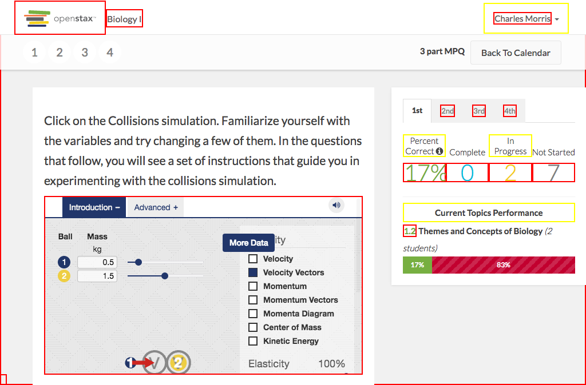

# https://tutor-{env}.openstax.org/courses/{courseId}/t/plans/{planId}/summary



# AJAX Calls


# WCAG2AAA Errors

Showing first 50 of 59 errors

```
ERROR iframe[src='https://archive.cnx.org/specials/2c7acb3c-2fbd-11e5-b2d9-e7f92291703c/collision-lab/'] WCAG2AAA.Principle2.Guideline2_4.2_4_1.H64.1
ERROR h4.panel-title[role='presentation'] WCAG2AAA.Principle1.Guideline1_3.1_3_1_AAA.G141
warning label[for='6408-option-0'].answer-label WCAG2AAA.Principle1.Guideline1_3.1_3_1.H44.NonExistentFragment
ERROR span.openstax-has-html.answer-content WCAG2AAA.Principle1.Guideline1_4.1_4_6.G17.Fail
warning label[for='6408-option-1'].answer-label WCAG2AAA.Principle1.Guideline1_3.1_3_1.H44.NonExistentFragment
ERROR span.openstax-has-html.answer-content WCAG2AAA.Principle1.Guideline1_4.1_4_6.G17.Fail
warning label[for='6408-option-2'].answer-label WCAG2AAA.Principle1.Guideline1_3.1_3_1.H44.NonExistentFragment
ERROR span.openstax-has-html.answer-content WCAG2AAA.Principle1.Guideline1_4.1_4_6.G17.Fail
warning label[for='6408-option-3'].answer-label WCAG2AAA.Principle1.Guideline1_3.1_3_1.H44.NonExistentFragment
ERROR span.openstax-has-html.answer-content WCAG2AAA.Principle1.Guideline1_4.1_4_6.G17.Fail
ERROR div.openstax-has-html.solution WCAG2AAA.Principle1.Guideline1_4.1_4_6.G17.Fail
warning label[for='6409-option-0'].answer-label WCAG2AAA.Principle1.Guideline1_3.1_3_1.H44.NonExistentFragment
ERROR span.openstax-has-html.answer-content WCAG2AAA.Principle1.Guideline1_4.1_4_6.G17.Fail
warning label[for='6409-option-1'].answer-label WCAG2AAA.Principle1.Guideline1_3.1_3_1.H44.NonExistentFragment
ERROR span.openstax-has-html.answer-content WCAG2AAA.Principle1.Guideline1_4.1_4_6.G17.Fail
ERROR div.openstax-has-html.solution WCAG2AAA.Principle1.Guideline1_4.1_4_6.G17.Fail
warning label[for='6410-option-0'].answer-label WCAG2AAA.Principle1.Guideline1_3.1_3_1.H44.NonExistentFragment
ERROR span.openstax-has-html.answer-content WCAG2AAA.Principle1.Guideline1_4.1_4_6.G17.Fail
warning label[for='6410-option-1'].answer-label WCAG2AAA.Principle1.Guideline1_3.1_3_1.H44.NonExistentFragment
ERROR span.openstax-has-html.answer-content WCAG2AAA.Principle1.Guideline1_4.1_4_6.G17.Fail
ERROR div.openstax-has-html.solution WCAG2AAA.Principle1.Guideline1_4.1_4_6.G17.Fail
warning div.panel-heading WCAG2AAA.Principle1.Guideline1_3.1_3_1.H42
ERROR i.panel-title WCAG2AAA.Principle1.Guideline1_4.1_4_6.G17.Fail
warning label[for='21-option-0'].answer-label WCAG2AAA.Principle1.Guideline1_3.1_3_1.H44.NonExistentFragment
ERROR span.openstax-has-html.answer-content WCAG2AAA.Principle1.Guideline1_4.1_4_6.G17.Fail
warning label[for='21-option-1'].answer-label WCAG2AAA.Principle1.Guideline1_3.1_3_1.H44.NonExistentFragment
ERROR span.openstax-has-html.answer-content WCAG2AAA.Principle1.Guideline1_4.1_4_6.G17.Fail
warning label[for='21-option-2'].answer-label WCAG2AAA.Principle1.Guideline1_3.1_3_1.H44.NonExistentFragment
ERROR span.openstax-has-html.answer-content WCAG2AAA.Principle1.Guideline1_4.1_4_6.G17.Fail
warning label[for='21-option-3'].answer-label WCAG2AAA.Principle1.Guideline1_3.1_3_1.H44.NonExistentFragment
ERROR span.openstax-has-html.answer-content WCAG2AAA.Principle1.Guideline1_4.1_4_6.G17.Fail
ERROR div.openstax-has-html.solution WCAG2AAA.Principle1.Guideline1_4.1_4_6.G17.Fail
warning a[role='tab'][href=''][aria-selected='true'] WCAG2AAA.Principle4.Guideline4_1.4_1_2.H91.A.Placeholder
warning a[role='tab'][href=''][aria-selected='false'] WCAG2AAA.Principle4.Guideline4_1.4_1_2.H91.A.Placeholder
ERROR span.tab-item-period-name[aria-describedby='course-periods-nav-tab-1'] WCAG2AAA.Principle1.Guideline1_4.1_4_6.G17.Fail
warning a[role='tab'][href=''][aria-selected='false'] WCAG2AAA.Principle4.Guideline4_1.4_1_2.H91.A.Placeholder
ERROR span.tab-item-period-name[aria-describedby='course-periods-nav-tab-2'] WCAG2AAA.Principle1.Guideline1_4.1_4_6.G17.Fail
warning a[role='tab'][href=''][aria-selected='false'] WCAG2AAA.Principle4.Guideline4_1.4_1_2.H91.A.Placeholder
ERROR span.tab-item-period-name[aria-describedby='course-periods-nav-tab-3'] WCAG2AAA.Principle1.Guideline1_4.1_4_6.G17.Fail
warning label WCAG2AAA.Principle1.Guideline1_3.1_3_1.H44.NonExistentFragment
ERROR div.data-container-value.text-average WCAG2AAA.Principle1.Guideline1_4.1_4_6.G18.Fail
ERROR div.data-container-value.text-complete WCAG2AAA.Principle1.Guideline1_4.1_4_6.G18.Fail
warning label WCAG2AAA.Principle1.Guideline1_3.1_3_1.H44.NonExistentFragment
ERROR div.data-container-value.text-in-progress WCAG2AAA.Principle1.Guideline1_4.1_4_6.G18.Fail
ERROR div.data-container-value.text-not-started WCAG2AAA.Principle1.Guideline1_4.1_4_6.G18.Fail
warning label WCAG2AAA.Principle1.Guideline1_3.1_3_1.H44.NonExistentFragment
ERROR span.text-success WCAG2AAA.Principle1.Guideline1_4.1_4_6.G17.Fail
ERROR span WCAG2AAA.Principle1.Guideline1_4.1_4_6.G17.Fail
warning span WCAG2AAA.Principle1.Guideline1_4.1_4_6.G17.BgImage
ERROR a[href='#spy'].debug-toggle-link WCAG2AAA.Principle2.Guideline2_4.2_4_1.G1,G123,G124.NoSuchID
undefined undefined undefined
```

