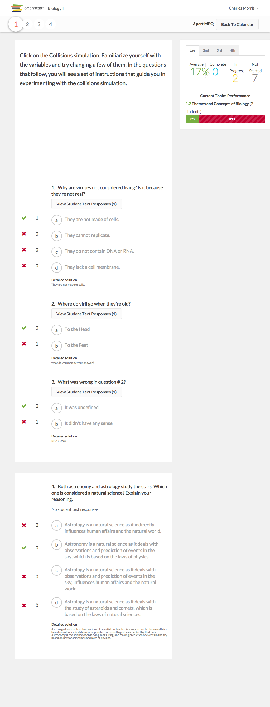

# https://tutor-{env}.openstax.org/courses/{courseId}/t/plans/{planId}/summary/periods/{periodIndex}



# AJAX Calls

## GET /api/plans/69/stats

```json
{
  "id": "69",
  "type": "homework",
  "title": "3 part MPQ",
  "stats": [
    {
      "period_id": "2",
      "name": "2nd",
      "mean_grade_percent": 50,
      "total_count": 10,
      "complete_count": 1,
      "partially_complete_count": 0,
      "current_pages": [
        {
          "id": "314",
          "title": "Themes and Concepts of Biology",
          "student_count": 1,
          "correct_count": 2,
          "incorrect_count": 2,
          "chapter_section": [
            1,
            2
          ],
          "is_trouble": false
        }
      ],
      "spaced_pages": [],
      "is_trouble": false
    },
    {
      "period_id": "4",
      "name": "4th",
      "mean_grade_percent": 50,
      "total_count": 11,
      "complete_count": 1,
      "partially_complete_count": 0,
      "current_pages": [
        {
          "id": "314",
          "title": "Themes and Concepts of Biology",
          "student_count": 1,
          "correct_count": 1,
          "incorrect_count": 3,
          "chapter_section": [
            1,
            2
          ],
          "is_trouble": false
        }
      ],
      "spaced_pages": [],
      "is_trouble": false
    },
    "... skipped 2"
  ],
  "shareable_url": "/@/kEyX0d/3-part-mpq"
}
```

## GET /api/plans/69/review

```json
{
  "id": "69",
  "type": "homework",
  "title": "3 part MPQ",
  "stats": [
    {
      "period_id": "2",
      "name": "2nd",
      "mean_grade_percent": 50,
      "total_count": 10,
      "complete_count": 1,
      "partially_complete_count": 0,
      "current_pages": [
        {
          "id": "314",
          "title": "Themes and Concepts of Biology",
          "student_count": 1,
          "correct_count": 2,
          "incorrect_count": 2,
          "chapter_section": [
            1,
            2
          ],
          "exercises": [
            {
              "content": "{\"attachments\":[],\"tags\":[\"apbio\",\"apbio-ch01\",\"ost-chapter-review\",\"review\",\"dok1\",\"time-short\",\"blooms-3\",\"apbio-ch01-s02\",\"apbio-ch01-s02-lo01\",\"ap ... 3053 more",
              "question_stats": [
                {
                  "question_id": "6409",
                  "answered_count": 1,
                  "answers": [
                    {
                      "student_names": [
                        "Augie March"
                      ],
                      "free_response": "j",
                      "answer_id": "24969"
                    }
                  ],
                  "answer_stats": [
                    {
                      "answer_id": "24969",
                      "selected_count": 1
                    },
                    {
                      "answer_id": "24970",
                      "selected_count": 0
                    }
                  ]
                },
                {
                  "question_id": "6410",
                  "answered_count": 1,
                  "answers": [
                    {
                      "student_names": [
                        "Augie March"
                      ],
                      "free_response": "asdf",
                      "answer_id": "24972"
                    }
                  ],
                  "answer_stats": [
                    {
                      "answer_id": "24971",
                      "selected_count": 0
                    },
                    {
                      "answer_id": "24972",
                      "selected_count": 1
                    }
                  ]
                },
                "... skipped 1"
              ],
              "average_step_number": 2
            },
            {
              "content": "{\"attachments\":[],\"tags\":[\"apbio\",\"apbio-ch01\",\"ost-chapter-review\",\"dok1\",\"time-short\",\"blooms-3\",\"apbio-ch01-s02\",\"apbio-ch01-s02-aplo-1-14\",\"apbio- ... 1604 more",
              "question_stats": [
                {
                  "question_id": "22",
                  "answered_count": 1,
                  "answers": [
                    {
                      "student_names": [
                        "Augie March"
                      ],
                      "answer_id": "86"
                    }
                  ],
                  "answer_stats": [
                    {
                      "answer_id": "87",
                      "selected_count": 0
                    },
                    {
                      "answer_id": "88",
                      "selected_count": 0
                    },
                    "... skipped 2"
                  ]
                }
              ],
              "average_step_number": 4
            }
          ],
          "is_trouble": false
        }
      ],
      "spaced_pages": [],
      "is_trouble": false
    },
    {
      "period_id": "4",
      "name": "4th",
      "mean_grade_percent": 50,
      "total_count": 11,
      "complete_count": 1,
      "partially_complete_count": 0,
      "current_pages": [
        {
          "id": "314",
          "title": "Themes and Concepts of Biology",
          "student_count": 1,
          "correct_count": 1,
          "incorrect_count": 3,
          "chapter_section": [
            1,
            2
          ],
          "exercises": [
            {
              "content": "{\"attachments\":[],\"tags\":[\"apbio\",\"apbio-ch01\",\"ost-chapter-review\",\"review\",\"dok1\",\"time-short\",\"blooms-3\",\"apbio-ch01-s02\",\"apbio-ch01-s02-lo01\",\"ap ... 3053 more",
              "question_stats": [
                {
                  "question_id": "6409",
                  "answered_count": 1,
                  "answers": [
                    {
                      "student_names": [
                        "Alene Macejkovic"
                      ],
                      "free_response": "asdfasd",
                      "answer_id": "24969"
                    }
                  ],
                  "answer_stats": [
                    {
                      "answer_id": "24969",
                      "selected_count": 1
                    },
                    {
                      "answer_id": "24970",
                      "selected_count": 0
                    }
                  ]
                },
                {
                  "question_id": "6410",
                  "answered_count": 1,
                  "answers": [
                    {
                      "student_names": [
                        "Alene Macejkovic"
                      ],
                      "free_response": "asdfa",
                      "answer_id": "24972"
                    }
                  ],
                  "answer_stats": [
                    {
                      "answer_id": "24971",
                      "selected_count": 0
                    },
                    {
                      "answer_id": "24972",
                      "selected_count": 1
                    }
                  ]
                },
                "... skipped 1"
              ],
              "average_step_number": 2
            },
            {
              "content": "{\"attachments\":[],\"tags\":[\"apbio\",\"apbio-ch01\",\"ost-chapter-review\",\"dok1\",\"time-short\",\"blooms-3\",\"apbio-ch01-s02\",\"apbio-ch01-s02-aplo-1-14\",\"apbio- ... 1604 more",
              "question_stats": [
                {
                  "question_id": "22",
                  "answered_count": 1,
                  "answers": [
                    {
                      "student_names": [
                        "Alene Macejkovic"
                      ],
                      "answer_id": "87"
                    }
                  ],
                  "answer_stats": [
                    {
                      "answer_id": "87",
                      "selected_count": 1
                    },
                    {
                      "answer_id": "88",
                      "selected_count": 0
                    },
                    "... skipped 2"
                  ]
                }
              ],
              "average_step_number": 4
            }
          ],
          "is_trouble": false
        }
      ],
      "spaced_pages": [],
      "is_trouble": false
    },
    "... skipped 2"
  ],
  "shareable_url": "/@/kEyX0d/3-part-mpq"
}
```

