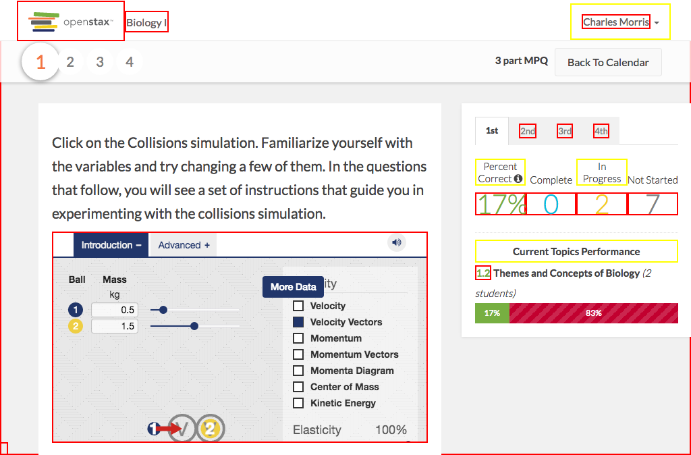

# https://tutor-{env}.openstax.org/courses/{courseId}/t/plans/{planId}/summary/periods/{periodIndex}/sections/{bookSection}



# AJAX Calls


# WCAG2A Errors

Showing first 50 of 27 errors

```
ERROR html WCAG2A.Principle3.Guideline3_1.3_1_1.H57.2
ERROR a.navbar-brand.navbar-brand[href='/dashboard/'] WCAG2A.Principle4.Guideline4_1.4_1_2.H91.A.NoContent
warning a#navbar-dropdown.dropdown-toggle[type='button'][aria-haspopup='true'][aria-expanded='false'][href=''] WCAG2A.Principle4.Guideline4_1.4_1_2.H91.A.NoHref
ERROR a[href='#'] WCAG2A.Principle4.Guideline4_1.4_1_2.H91.A.NoContent
ERROR iframe[src='https://archive.cnx.org/specials/2c7acb3c-2fbd-11e5-b2d9-e7f92291703c/collision-lab/'] WCAG2A.Principle2.Guideline2_4.2_4_1.H64.1
warning h4.panel-title[role='presentation'] WCAG2A.Principle1.Guideline1_3.1_3_1_A.G141
warning label[for='6408-option-0'].answer-label WCAG2A.Principle1.Guideline1_3.1_3_1.H44.NonExistentFragment
warning label[for='6408-option-1'].answer-label WCAG2A.Principle1.Guideline1_3.1_3_1.H44.NonExistentFragment
warning label[for='6408-option-2'].answer-label WCAG2A.Principle1.Guideline1_3.1_3_1.H44.NonExistentFragment
warning label[for='6408-option-3'].answer-label WCAG2A.Principle1.Guideline1_3.1_3_1.H44.NonExistentFragment
warning label[for='6409-option-0'].answer-label WCAG2A.Principle1.Guideline1_3.1_3_1.H44.NonExistentFragment
warning label[for='6409-option-1'].answer-label WCAG2A.Principle1.Guideline1_3.1_3_1.H44.NonExistentFragment
warning label[for='6410-option-0'].answer-label WCAG2A.Principle1.Guideline1_3.1_3_1.H44.NonExistentFragment
warning label[for='6410-option-1'].answer-label WCAG2A.Principle1.Guideline1_3.1_3_1.H44.NonExistentFragment
warning div.panel-heading WCAG2A.Principle1.Guideline1_3.1_3_1.H42
warning label[for='21-option-0'].answer-label WCAG2A.Principle1.Guideline1_3.1_3_1.H44.NonExistentFragment
warning label[for='21-option-1'].answer-label WCAG2A.Principle1.Guideline1_3.1_3_1.H44.NonExistentFragment
warning label[for='21-option-2'].answer-label WCAG2A.Principle1.Guideline1_3.1_3_1.H44.NonExistentFragment
warning label[for='21-option-3'].answer-label WCAG2A.Principle1.Guideline1_3.1_3_1.H44.NonExistentFragment
warning a[role='tab'][href=''][aria-selected='true'] WCAG2A.Principle4.Guideline4_1.4_1_2.H91.A.Placeholder
warning a[role='tab'][href=''][aria-selected='false'] WCAG2A.Principle4.Guideline4_1.4_1_2.H91.A.Placeholder
warning a[role='tab'][href=''][aria-selected='false'] WCAG2A.Principle4.Guideline4_1.4_1_2.H91.A.Placeholder
warning a[role='tab'][href=''][aria-selected='false'] WCAG2A.Principle4.Guideline4_1.4_1_2.H91.A.Placeholder
warning label WCAG2A.Principle1.Guideline1_3.1_3_1.H44.NonExistentFragment
warning label WCAG2A.Principle1.Guideline1_3.1_3_1.H44.NonExistentFragment
warning label WCAG2A.Principle1.Guideline1_3.1_3_1.H44.NonExistentFragment
ERROR a[href='#spy'].debug-toggle-link WCAG2A.Principle2.Guideline2_4.2_4_1.G1,G123,G124.NoSuchID
```

