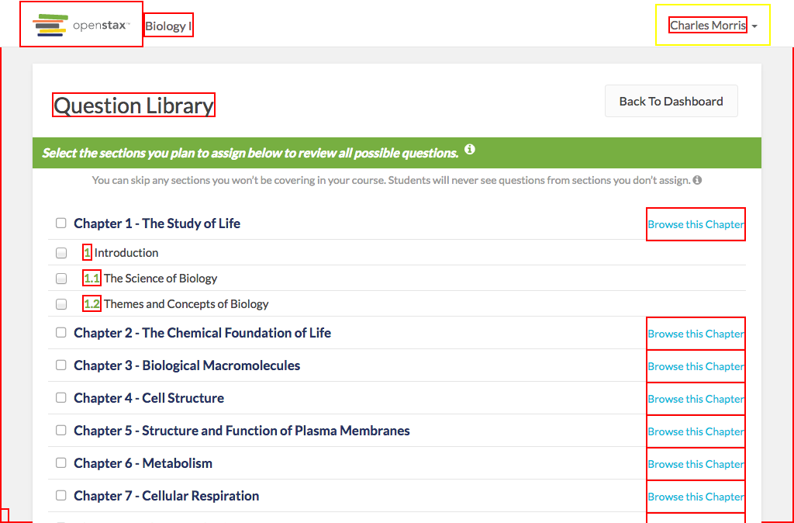

# https://tutor-{env}.openstax.org/courses/{courseId}/t/questions



# AJAX Calls


# WCAG2A Errors

Showing first 50 of 416 errors

```
ERROR input[type='checkbox'][readonly=''] WCAG2A.Principle1.Guideline1_3.1_3_1.F68
ERROR input[type='checkbox'][readonly=''] WCAG2A.Principle4.Guideline4_1.4_1_2.H91.InputCheckbox.Name
ERROR input[type='checkbox'][readonly=''] WCAG2A.Principle1.Guideline1_3.1_3_1.F68
ERROR input[type='checkbox'][readonly=''] WCAG2A.Principle4.Guideline4_1.4_1_2.H91.InputCheckbox.Name
ERROR input[type='checkbox'][readonly=''] WCAG2A.Principle1.Guideline1_3.1_3_1.F68
ERROR input[type='checkbox'][readonly=''] WCAG2A.Principle4.Guideline4_1.4_1_2.H91.InputCheckbox.Name
ERROR input[type='checkbox'][readonly=''] WCAG2A.Principle1.Guideline1_3.1_3_1.F68
ERROR input[type='checkbox'][readonly=''] WCAG2A.Principle4.Guideline4_1.4_1_2.H91.InputCheckbox.Name
ERROR input[type='checkbox'][readonly=''] WCAG2A.Principle1.Guideline1_3.1_3_1.F68
ERROR input[type='checkbox'][readonly=''] WCAG2A.Principle4.Guideline4_1.4_1_2.H91.InputCheckbox.Name
ERROR input[type='checkbox'][readonly=''] WCAG2A.Principle1.Guideline1_3.1_3_1.F68
ERROR input[type='checkbox'][readonly=''] WCAG2A.Principle4.Guideline4_1.4_1_2.H91.InputCheckbox.Name
ERROR input[type='checkbox'][readonly=''] WCAG2A.Principle1.Guideline1_3.1_3_1.F68
ERROR input[type='checkbox'][readonly=''] WCAG2A.Principle4.Guideline4_1.4_1_2.H91.InputCheckbox.Name
ERROR input[type='checkbox'][readonly=''] WCAG2A.Principle1.Guideline1_3.1_3_1.F68
ERROR input[type='checkbox'][readonly=''] WCAG2A.Principle4.Guideline4_1.4_1_2.H91.InputCheckbox.Name
ERROR input[type='checkbox'][readonly=''] WCAG2A.Principle1.Guideline1_3.1_3_1.F68
ERROR input[type='checkbox'][readonly=''] WCAG2A.Principle4.Guideline4_1.4_1_2.H91.InputCheckbox.Name
ERROR input[type='checkbox'][readonly=''] WCAG2A.Principle1.Guideline1_3.1_3_1.F68
ERROR input[type='checkbox'][readonly=''] WCAG2A.Principle4.Guideline4_1.4_1_2.H91.InputCheckbox.Name
ERROR input[type='checkbox'][readonly=''] WCAG2A.Principle1.Guideline1_3.1_3_1.F68
ERROR input[type='checkbox'][readonly=''] WCAG2A.Principle4.Guideline4_1.4_1_2.H91.InputCheckbox.Name
ERROR input[type='checkbox'][readonly=''] WCAG2A.Principle1.Guideline1_3.1_3_1.F68
ERROR input[type='checkbox'][readonly=''] WCAG2A.Principle4.Guideline4_1.4_1_2.H91.InputCheckbox.Name
ERROR input[type='checkbox'][readonly=''] WCAG2A.Principle1.Guideline1_3.1_3_1.F68
ERROR input[type='checkbox'][readonly=''] WCAG2A.Principle4.Guideline4_1.4_1_2.H91.InputCheckbox.Name
ERROR input[type='checkbox'][readonly=''] WCAG2A.Principle1.Guideline1_3.1_3_1.F68
ERROR input[type='checkbox'][readonly=''] WCAG2A.Principle4.Guideline4_1.4_1_2.H91.InputCheckbox.Name
ERROR input[type='checkbox'][readonly=''] WCAG2A.Principle1.Guideline1_3.1_3_1.F68
ERROR input[type='checkbox'][readonly=''] WCAG2A.Principle4.Guideline4_1.4_1_2.H91.InputCheckbox.Name
ERROR input[type='checkbox'][readonly=''] WCAG2A.Principle1.Guideline1_3.1_3_1.F68
ERROR input[type='checkbox'][readonly=''] WCAG2A.Principle4.Guideline4_1.4_1_2.H91.InputCheckbox.Name
ERROR input[type='checkbox'][readonly=''] WCAG2A.Principle1.Guideline1_3.1_3_1.F68
ERROR input[type='checkbox'][readonly=''] WCAG2A.Principle4.Guideline4_1.4_1_2.H91.InputCheckbox.Name
ERROR input[type='checkbox'][readonly=''] WCAG2A.Principle1.Guideline1_3.1_3_1.F68
ERROR input[type='checkbox'][readonly=''] WCAG2A.Principle4.Guideline4_1.4_1_2.H91.InputCheckbox.Name
ERROR input[type='checkbox'][readonly=''] WCAG2A.Principle1.Guideline1_3.1_3_1.F68
ERROR input[type='checkbox'][readonly=''] WCAG2A.Principle4.Guideline4_1.4_1_2.H91.InputCheckbox.Name
ERROR input[type='checkbox'][readonly=''] WCAG2A.Principle1.Guideline1_3.1_3_1.F68
ERROR input[type='checkbox'][readonly=''] WCAG2A.Principle4.Guideline4_1.4_1_2.H91.InputCheckbox.Name
ERROR input[type='checkbox'][readonly=''] WCAG2A.Principle1.Guideline1_3.1_3_1.F68
ERROR input[type='checkbox'][readonly=''] WCAG2A.Principle4.Guideline4_1.4_1_2.H91.InputCheckbox.Name
ERROR input[type='checkbox'][readonly=''] WCAG2A.Principle1.Guideline1_3.1_3_1.F68
ERROR input[type='checkbox'][readonly=''] WCAG2A.Principle4.Guideline4_1.4_1_2.H91.InputCheckbox.Name
ERROR input[type='checkbox'][readonly=''] WCAG2A.Principle1.Guideline1_3.1_3_1.F68
ERROR input[type='checkbox'][readonly=''] WCAG2A.Principle4.Guideline4_1.4_1_2.H91.InputCheckbox.Name
ERROR input[type='checkbox'][readonly=''] WCAG2A.Principle1.Guideline1_3.1_3_1.F68
ERROR input[type='checkbox'][readonly=''] WCAG2A.Principle4.Guideline4_1.4_1_2.H91.InputCheckbox.Name
ERROR input[type='checkbox'][readonly=''] WCAG2A.Principle1.Guideline1_3.1_3_1.F68
ERROR a[href='#spy'].debug-toggle-link WCAG2A.Principle2.Guideline2_4.2_4_1.G1,G123,G124.NoSuchID
undefined undefined undefined
```

