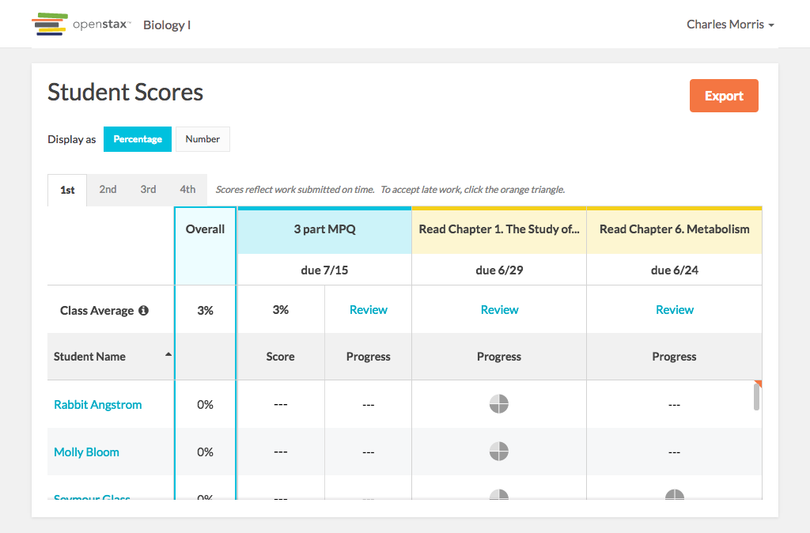

# https://tutor-{env}.openstax.org/courses/{courseId}/t/scores



# AJAX Calls

## GET /api/courses/1/performance

```json
[
  {
    "period_id": "3",
    "overall_average_score": 0.267561983471074,
    "data_headings": [
      {
        "title": "Read Chapter 1. The Study of Life",
        "plan_id": 1,
        "type": "reading",
        "due_at": "2016-06-28T12:00:00.000Z"
      },
      {
        "title": "HW Chapter 1 The Study of Life",
        "plan_id": 3,
        "type": "homework",
        "due_at": "2016-06-27T12:00:00.000Z",
        "average_score": 0.512396694214876
      },
      "... skipped 1"
    ],
    "students": [
      {
        "name": "Isobel Witting",
        "first_name": "Isobel",
        "last_name": "Witting",
        "role": 28,
        "student_identifier": "BMYQ68I17V",
        "average_score": 0.5,
        "data": [
          {
            "type": "reading",
            "id": 27,
            "status": "in_progress",
            "step_count": 25,
            "completed_step_count": 1,
            "completed_on_time_step_count": 1,
            "completed_accepted_late_step_count": 0,
            "exercise_count": 8,
            "completed_exercise_count": 0,
            "completed_on_time_exercise_count": 0,
            "completed_accepted_late_exercise_count": 0,
            "correct_exercise_count": 0,
            "correct_on_time_exercise_count": 0,
            "correct_accepted_late_exercise_count": 0,
            "score": 0,
            "recovered_exercise_count": 0,
            "due_at": "2016-06-28T12:00:00.000Z",
            "last_worked_at": "2016-06-28T11:59:00.000Z",
            "is_late_work_accepted": false,
            "is_included_in_averages": false
          },
          {
            "type": "homework",
            "id": 69,
            "status": "completed",
            "step_count": 11,
            "completed_step_count": 11,
            "completed_on_time_step_count": 11,
            "completed_accepted_late_step_count": 0,
            "exercise_count": 11,
            "completed_exercise_count": 11,
            "completed_on_time_exercise_count": 11,
            "completed_accepted_late_exercise_count": 0,
            "correct_exercise_count": 11,
            "correct_on_time_exercise_count": 11,
            "correct_accepted_late_exercise_count": 0,
            "score": 1,
            "recovered_exercise_count": 0,
            "due_at": "2016-06-27T12:00:00.000Z",
            "last_worked_at": "2016-06-27T11:59:00.000Z",
            "is_late_work_accepted": false,
            "is_included_in_averages": true
          },
          "... skipped 1"
        ]
      },
      {
        "name": "Nathan Zuckerman",
        "first_name": "Nathan",
        "last_name": "Zuckerman",
        "role": 29,
        "student_identifier": "IQU0FL48NP",
        "average_score": 0.227272727272727,
        "data": [
          {
            "type": "reading",
            "id": 28,
            "status": "in_progress",
            "step_count": 25,
            "completed_step_count": 24,
            "completed_on_time_step_count": 24,
            "completed_accepted_late_step_count": 0,
            "exercise_count": 8,
            "completed_exercise_count": 7,
            "completed_on_time_exercise_count": 7,
            "completed_accepted_late_exercise_count": 0,
            "correct_exercise_count": 6,
            "correct_on_time_exercise_count": 6,
            "correct_accepted_late_exercise_count": 0,
            "score": 0.75,
            "recovered_exercise_count": 0,
            "due_at": "2016-06-28T12:00:00.000Z",
            "last_worked_at": "2016-06-28T11:59:00.000Z",
            "is_late_work_accepted": false,
            "is_included_in_averages": false
          },
          {
            "type": "homework",
            "id": 70,
            "status": "completed",
            "step_count": 11,
            "completed_step_count": 11,
            "completed_on_time_step_count": 11,
            "completed_accepted_late_step_count": 0,
            "exercise_count": 11,
            "completed_exercise_count": 11,
            "completed_on_time_exercise_count": 11,
            "completed_accepted_late_exercise_count": 0,
            "correct_exercise_count": 5,
            "correct_on_time_exercise_count": 5,
            "correct_accepted_late_exercise_count": 0,
            "score": 0.454545454545455,
            "recovered_exercise_count": 0,
            "due_at": "2016-06-27T12:00:00.000Z",
            "last_worked_at": "2016-06-27T11:59:00.000Z",
            "is_late_work_accepted": false,
            "is_included_in_averages": true
          },
          "... skipped 1"
        ]
      },
      "... skipped 9"
    ]
  },
  {
    "period_id": "4",
    "overall_average_score": 0.287190082644628,
    "data_headings": [
      {
        "title": "Read Chapter 6. Metabolism",
        "plan_id": 2,
        "type": "reading",
        "due_at": "2016-06-28T12:00:00.000Z"
      },
      {
        "title": "Read Chapter 1. The Study of Life",
        "plan_id": 1,
        "type": "reading",
        "due_at": "2016-06-28T12:00:00.000Z"
      },
      "... skipped 2"
    ],
    "students": [
      {
        "name": "Myron Sauer",
        "first_name": "Myron",
        "last_name": "Sauer",
        "role": 40,
        "student_identifier": "0JO15HZWSL",
        "average_score": 0.181818181818182,
        "data": [
          {
            "type": "reading",
            "id": 59,
            "status": "in_progress",
            "step_count": 18,
            "completed_step_count": 2,
            "completed_on_time_step_count": 2,
            "completed_accepted_late_step_count": 0,
            "exercise_count": 6,
            "completed_exercise_count": 0,
            "completed_on_time_exercise_count": 0,
            "completed_accepted_late_exercise_count": 0,
            "correct_exercise_count": 0,
            "correct_on_time_exercise_count": 0,
            "correct_accepted_late_exercise_count": 0,
            "score": 0,
            "recovered_exercise_count": 0,
            "due_at": "2016-06-28T12:00:00.000Z",
            "last_worked_at": "2016-06-28T11:59:00.000Z",
            "is_late_work_accepted": false,
            "is_included_in_averages": false
          },
          {
            "type": "reading",
            "id": 39,
            "status": "in_progress",
            "step_count": 25,
            "completed_step_count": 24,
            "completed_on_time_step_count": 24,
            "completed_accepted_late_step_count": 0,
            "exercise_count": 8,
            "completed_exercise_count": 7,
            "completed_on_time_exercise_count": 7,
            "completed_accepted_late_exercise_count": 0,
            "correct_exercise_count": 6,
            "correct_on_time_exercise_count": 6,
            "correct_accepted_late_exercise_count": 0,
            "score": 0.75,
            "recovered_exercise_count": 0,
            "due_at": "2016-06-28T12:00:00.000Z",
            "last_worked_at": "2016-06-28T11:59:00.000Z",
            "is_late_work_accepted": false,
            "is_included_in_averages": false
          },
          "... skipped 2"
        ]
      },
      {
        "name": "Janelle Skiles",
        "first_name": "Janelle",
        "last_name": "Skiles",
        "role": 38,
        "student_identifier": "ZSWB7KN52D",
        "average_score": 0.136363636363636,
        "data": [
          {
            "type": "reading",
            "id": 57,
            "status": "completed",
            "step_count": 18,
            "completed_step_count": 18,
            "completed_on_time_step_count": 18,
            "completed_accepted_late_step_count": 0,
            "exercise_count": 6,
            "completed_exercise_count": 6,
            "completed_on_time_exercise_count": 6,
            "completed_accepted_late_exercise_count": 0,
            "correct_exercise_count": 3,
            "correct_on_time_exercise_count": 3,
            "correct_accepted_late_exercise_count": 0,
            "score": 0.5,
            "recovered_exercise_count": 0,
            "due_at": "2016-06-28T12:00:00.000Z",
            "last_worked_at": "2016-06-28T11:59:00.000Z",
            "is_late_work_accepted": false,
            "is_included_in_averages": false
          },
          {
            "type": "reading",
            "id": 37,
            "status": "in_progress",
            "step_count": 25,
            "completed_step_count": 2,
            "completed_on_time_step_count": 2,
            "completed_accepted_late_step_count": 0,
            "exercise_count": 8,
            "completed_exercise_count": 0,
            "completed_on_time_exercise_count": 0,
            "completed_accepted_late_exercise_count": 0,
            "correct_exercise_count": 0,
            "correct_on_time_exercise_count": 0,
            "correct_accepted_late_exercise_count": 0,
            "score": 0,
            "recovered_exercise_count": 0,
            "due_at": "2016-06-28T12:00:00.000Z",
            "last_worked_at": "2016-06-28T11:59:00.000Z",
            "is_late_work_accepted": false,
            "is_included_in_averages": false
          },
          "... skipped 2"
        ]
      },
      "... skipped 9"
    ]
  },
  "... skipped 2"
]
```

## GET /api/courses/1/performance/exports

```json
[]
```

## GET /api/courses/1

```json
{
  "id": "1",
  "name": "Biology I",
  "time_zone": "Central Time (US & Canada)",
  "default_open_time": "00:01",
  "default_due_time": "07:00",
  "salesforce_book_name": "Biology",
  "appearance_code": "biology",
  "ecosystem_id": "4",
  "book_pdf_url": "https://archive-staging-tutor.cnx.org/exports/d52e93f4-8653-4273-86da-3850001c0786@9.14.pdf",
  "webview_url": "https://archive-staging-tutor.cnx.org/contents/d52e93f4-8653-4273-86da-3850001c0786@9.14",
  "is_concept_coach": false,
  "is_college": false,
  "roles": [
    {
      "id": "1",
      "type": "teacher"
    }
  ],
  "periods": [
    {
      "id": "3",
      "name": "3rd",
      "enrollment_code": "059521",
      "enrollment_url": "https://tutor-dev.openstax.org/enroll/059521",
      "default_open_time": "00:01",
      "default_due_time": "07:00",
      "is_archived": false
    },
    {
      "id": "4",
      "name": "4th",
      "enrollment_code": "569426",
      "enrollment_url": "https://tutor-dev.openstax.org/enroll/569426",
      "default_open_time": "00:01",
      "default_due_time": "07:00",
      "is_archived": false
    },
    "... skipped 2"
  ],
  "students": []
}
```

