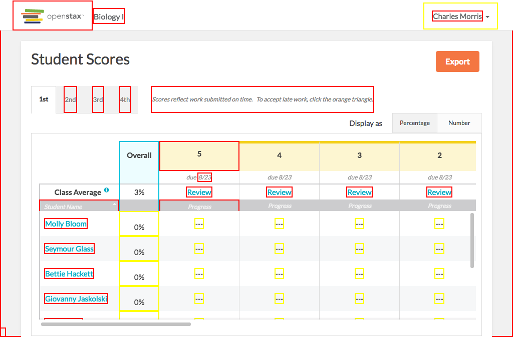

# https://tutor-{env}.openstax.org/courses/{courseId}/t/scores



# AJAX Calls

## GET /api/courses/1/performance/exports

```json
[]
```

## GET /api/courses/1

```json
{
  "appearance_code": "biology",
  "book_pdf_url": "https://archive-staging-tutor.cnx.org/exports/d52e93f4-8653-4273-86da-3850001c0786@9.14.pdf",
  "default_due_time": "07:00",
  "default_open_time": "00:01",
  "ecosystem_id": "4",
  "id": "1",
  "is_college": false,
  "is_concept_coach": false,
  "name": "Biology I",
  "periods": [
    {
      "default_due_time": "07:00",
      "default_open_time": "00:01",
      "enrollment_code": "059521",
      "enrollment_url": "https://tutor-dev.openstax.org/enroll/059521",
      "id": "3",
      "is_archived": false,
      "name": "3rd"
    },
    {
      "default_due_time": "07:00",
      "default_open_time": "00:01",
      "enrollment_code": "569426",
      "enrollment_url": "https://tutor-dev.openstax.org/enroll/569426",
      "id": "4",
      "is_archived": false,
      "name": "4th"
    },
    "... skipped 2"
  ],
  "roles": [
    {
      "id": "1",
      "type": "teacher"
    }
  ],
  "salesforce_book_name": "Biology",
  "students": [],
  "time_zone": "Central Time (US & Canada)",
  "webview_url": "https://archive-staging-tutor.cnx.org/contents/d52e93f4-8653-4273-86da-3850001c0786@9.14"
}
```

