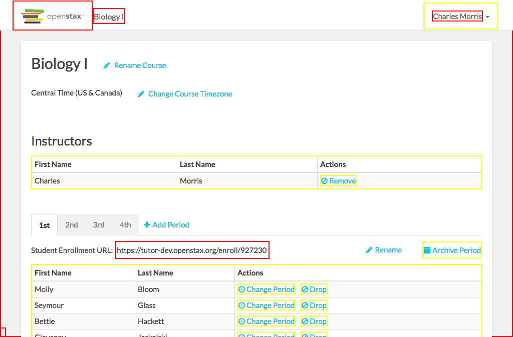

# https://tutor-{env}.openstax.org/courses/{courseId}/t/settings



# AJAX Calls


# WCAG2A Errors

Showing first 50 of 31 errors

```
ERROR html WCAG2A.Principle3.Guideline3_1.3_1_1.H57.2
ERROR a.navbar-brand.navbar-brand[href='/dashboard/'] WCAG2A.Principle4.Guideline4_1.4_1_2.H91.A.NoContent
warning a#navbar-dropdown.dropdown-toggle[type='button'][aria-haspopup='true'][aria-expanded='false'][href=''] WCAG2A.Principle4.Guideline4_1.4_1_2.H91.A.NoHref
ERROR a[href='#'] WCAG2A.Principle4.Guideline4_1.4_1_2.H91.A.NoContent
warning table.roster.table.table-striped.table-bordered.table-condensed.table-hover WCAG2A.Principle1.Guideline1_3.1_3_1.H39.3.NoCaption
warning a[aria-describedby='teacher-remove-popover-1'] WCAG2A.Principle4.Guideline4_1.4_1_2.H91.A.Placeholder
warning a[role='tab'][href=''][tabindex='-1'][aria-selected='true'] WCAG2A.Principle4.Guideline4_1.4_1_2.H91.A.Placeholder
warning a[role='tab'][href=''][tabindex='-1'] WCAG2A.Principle4.Guideline4_1.4_1_2.H91.A.Placeholder
warning a[role='tab'][href=''][tabindex='-1'] WCAG2A.Principle4.Guideline4_1.4_1_2.H91.A.Placeholder
warning a[role='tab'][href=''][tabindex='-1'] WCAG2A.Principle4.Guideline4_1.4_1_2.H91.A.Placeholder
ERROR input[type='text'][value='https://tutor-dev.openstax.org/enroll/927230'][readonly=''] WCAG2A.Principle4.Guideline4_1.4_1_2.H91.InputText.Name
ERROR input[type='text'][value='https://tutor-dev.openstax.org/enroll/927230'][readonly=''] WCAG2A.Principle1.Guideline1_3.1_3_1.F68
warning a.control.archive-period[aria-describedby='archive-period'] WCAG2A.Principle4.Guideline4_1.4_1_2.H91.A.Placeholder
warning table.roster.table.table-striped.table-bordered.table-condensed.table-hover WCAG2A.Principle1.Guideline1_3.1_3_1.H39.3.NoCaption
warning a[aria-describedby='change-period'] WCAG2A.Principle4.Guideline4_1.4_1_2.H91.A.Placeholder
warning a[aria-describedby='drop-student'] WCAG2A.Principle4.Guideline4_1.4_1_2.H91.A.Placeholder
warning a[aria-describedby='change-period'] WCAG2A.Principle4.Guideline4_1.4_1_2.H91.A.Placeholder
warning a[aria-describedby='drop-student'] WCAG2A.Principle4.Guideline4_1.4_1_2.H91.A.Placeholder
warning a[aria-describedby='change-period'] WCAG2A.Principle4.Guideline4_1.4_1_2.H91.A.Placeholder
warning a[aria-describedby='drop-student'] WCAG2A.Principle4.Guideline4_1.4_1_2.H91.A.Placeholder
warning a[aria-describedby='change-period'] WCAG2A.Principle4.Guideline4_1.4_1_2.H91.A.Placeholder
warning a[aria-describedby='drop-student'] WCAG2A.Principle4.Guideline4_1.4_1_2.H91.A.Placeholder
warning a[aria-describedby='change-period'] WCAG2A.Principle4.Guideline4_1.4_1_2.H91.A.Placeholder
warning a[aria-describedby='drop-student'] WCAG2A.Principle4.Guideline4_1.4_1_2.H91.A.Placeholder
warning a[aria-describedby='change-period'] WCAG2A.Principle4.Guideline4_1.4_1_2.H91.A.Placeholder
warning a[aria-describedby='drop-student'] WCAG2A.Principle4.Guideline4_1.4_1_2.H91.A.Placeholder
warning a[aria-describedby='change-period'] WCAG2A.Principle4.Guideline4_1.4_1_2.H91.A.Placeholder
warning a[aria-describedby='drop-student'] WCAG2A.Principle4.Guideline4_1.4_1_2.H91.A.Placeholder
warning a[aria-describedby='change-period'] WCAG2A.Principle4.Guideline4_1.4_1_2.H91.A.Placeholder
warning a[aria-describedby='drop-student'] WCAG2A.Principle4.Guideline4_1.4_1_2.H91.A.Placeholder
ERROR a[href='#spy'].debug-toggle-link WCAG2A.Principle2.Guideline2_4.2_4_1.G1,G123,G124.NoSuchID
```

