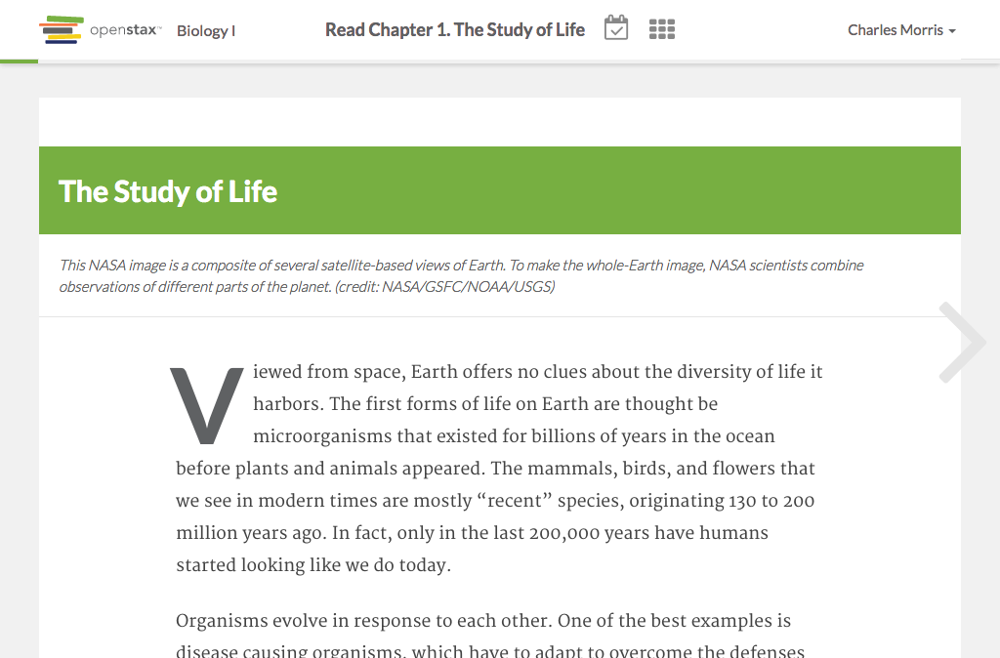

# https://tutor-{env}.openstax.org/courses/{courseId}/tasks/{taskId}/steps/{stepIndex}



# AJAX Calls

## GET /api/tasks/1

```json
{
  "id": "1",
  "type": "reading",
  "title": "Read Chapter 1. The Study of Life",
  "opens_at": "2016-06-24T05:01:00.000Z",
  "due_at": "2016-06-29T12:00:00.000Z",
  "last_worked_at": "2016-06-30T12:00:00.000Z",
  "is_shared": false,
  "steps": [
    {
      "id": "1",
      "task_id": "1",
      "type": "reading",
      "group": "core",
      "is_completed": true,
      "last_completed_at": "2016-06-30T12:00:00.000Z",
      "first_completed_at": "2016-06-30T12:00:00.000Z",
      "has_recovery": false,
      "related_content": [
        {
          "title": "The Study of Life",
          "chapter_section": [
            1,
            0
          ]
        }
      ],
      "labels": [],
      "content_url": "https://archive-staging-tutor.cnx.org/contents/dc74b6ed-d06a-4fef-8479-8eefd058b59a@23",
      "title": "The Study of Life",
      "chapter_section": [
        1,
        0
      ],
      "content_html": "<body xmlns=\"http://www.w3.org/1999/xhtml\" xmlns:c=\"http://cnx.rice.edu/cnxml\" xmlns:md=\"http://cnx.rice.edu/mdml\" xmlns:qml=\"http://cnx.rice.edu/qml/1.0\" xmlns:mod=\"http://cnx.rice.edu/#moduleIds\" xmlns:bib=\"http://bibtexml.sf.net/\" xmlns:data=\"http://dev.w3.org/html5/spec/#custom\">\n<div data-type=\"document-title\">Introduction</div>\n<cnx-pi data-type=\"cnx.flag.introduction\">\n        class=\"introduction\"\n      </cnx-pi>\n<cnx-pi data-type=\"cnx.eoc\">class=\"summary\" title=\"Chapter Summary\"</cnx-pi>\n<cnx-pi data-type=\"cnx.eoc\">class=\"ost-reading-discard ost-chapter-review review\" title=\"Review Questions\"</cnx-pi>\n<cnx-pi data-type=\"cnx.eoc\">class=\"ost-reading-discard ost-chapter-review critical-thinking\" title=\"Critical Thinking Questions\"</cnx-pi>\n<cnx-pi data-type=\"cnx.eoc\">class=\"ost-chapter-review ost-reading-discard ap-test-prep\" title=\"Test Prep for AP&lt;sup&gt;&amp;#174;&lt;/sup&gt; Courses\"</cnx-pi>\n\n<figure id=\"fig-ch01_00_00\" class=\"splash\"><figcaption>This NASA image is a composite of several satellite-based views of Earth. To make the whole-Earth image, NASA scientists combine observations of different parts of the planet. (credit: NASA/GSFC/NOAA/USGS)</figcaption><span data-type=\"media\" id=\"fs-id1600276\" data-alt=\"Photo depicts Earth from space.\">\n\n</span>\n\n</figure>\n\n<p id=\"fs-id1167065801289\">Viewed from space, Earth offers no clues about the diversity of life it harbors. The first forms of life on Earth are thought be microorganisms that existed for billions of years in the ocean before plants and animals appeared. The mammals, birds, and flowers that we see in modern times are mostly “recent” species, originating 130 to 200 million years ago. In fact, only in the last 200,000 years have humans started looking like we do today.</p>\n\n<p id=\"fs-id1167066095971\">Organisms evolve in response to each other. One of the best examples is disease causing organisms, which have to adapt to overcome the defenses of the organisms they infect. One such organism that has evolved to specialize in infection in humans is <em data-effect=\"italics\">Plasmodium</em>, the organism that causes malaria. Biologists use the process of science to learn about the world and the organisms living in it. For example, people have suspected for quite some time that people with blood type O are less likely to die from severe malaria. Now, a team of scientists have been able to explain why. By examining data from several experiments, and by using both inductive and deductive reasoning, the scientists concluded that A and B type blood reacts with a protein excreted by <em data-effect=\"italics\">Plasmodium</em>. This reaction causes severe illness. However, type O blood does not react with the protein. You can <a href=\"http://openstaxcollege.org/l/32plasmodium\">read more</a> about the response of type A and B blood groups to infection by <em data-effect=\"italics\">Plasmodium</em>.\n\n</p>\n\n\n</body>"
    },
    {
      "id": "2",
      "task_id": "1",
      "type": "reading",
      "group": "core",
      "is_completed": true,
      "last_completed_at": "2016-06-30T12:00:00.000Z",
      "first_completed_at": "2016-06-30T12:00:00.000Z",
      "has_recovery": false,
      "related_content": [
        {
          "title": "The Science of Biology",
          "chapter_section": [
            1,
            1
          ]
        }
      ],
      "labels": [],
      "content_url": "https://archive-staging-tutor.cnx.org/contents/4d5fc58c-cdea-4950-a91d-a5f141a38744@34",
      "title": "The Science of Biology",
      "chapter_section": [
        1,
        1
      ],
      "content_html": "<body xmlns=\"http://www.w3.org/1999/xhtml\" xmlns:c=\"http://cnx.rice.edu/cnxml\" xmlns:md=\"http://cnx.rice.edu/mdml\" xmlns:qml=\"http://cnx.rice.edu/qml/1.0\" xmlns:mod=\"http://cnx.rice.edu/#moduleIds\" xmlns:bib=\"http://bibtexml.sf.net/\" xmlns:data=\"http://dev.w3.org/html5/spec/#custom\">\n<div data-type=\"document-title\">The Science of Biology</div>\n\n<section data-depth=\"1\" id=\"fs-id1167067030556\" class=\"learning-objectives\">\n<p id=\"fs-id1167066793618\">In this section, you will explore the following questions:</p>\n<ul id=\"fs-id1167066827377\">\n<li class=\"ost-learning-objective-def ost-tag-lo-apbio-ch01-s01-lo01\">What are the characteristics shared by the natural sciences?</li>\n<li class=\"ost-learning-objective-def ost-tag-lo-apbio-ch01-s01-lo02\">What are the steps of the scientific method?</li>\n</ul>\n</section>\n\n<section data-depth=\"1\" id=\"fs-id1167065808198\" class=\"ap-connection\"><h1 data-type=\"title\">Connection for AP<sup>®</sup> courses</h1>\n<p id=\"fs-id1167065800783\">Biology is the science that studies living organisms and their interactions with one another and with their environment. The process of science attempts to describe and understand the nature of the universe by rational means. Science has many fields; those fields related to the physical world, including biology, are considered natural sciences. All of the natural sciences follow the laws of chemistry and physics. For example, when studying biology, you must remember living organisms obey the laws of thermodynamics while using free energy and matter from the environment to carry out life processes that are explored in later chapters, such as metabolism and reproduction.</p>\n<p id=\"fs-id1167065757854\">Two types of logical reasoning are used in science: inductive reasoning and deductive reasoning. <span data-type=\"term\">Inductive reasoning</span> uses particular results to produce general scientific principles. <span data-type=\"term\">Deductive reasoning</span> uses logical thinking to predict results by applying scientific principles or practices. The scientific method is a step-by-step process that consists of: making observations, defining a problem, posing hypotheses, testing these hypotheses by designing and conducting investigations, and drawing conclusions from data and results. Scientists then communicate their results to the scientific community. Scientific theories are subject to revision as new information is collected.</p>\n\n\n\n\n</section>\n\n\n\n\n\n\n<figure id=\"fs-id1167065707918\" class=\"ost-tag-lo-apbio-ch01-s01-lo01\"><figcaption>Formerly called blue-green algae, these (a) cyanobacteria, shown here at 300x magnification under a light microscope, are some of Earth’s oldest life forms. These (b) stromatolites along the shores of Lake Thetis in Western Australia are ancient structures formed by the layering of cyanobacteria in shallow waters. (credit a: modification of work by NASA; credit b: modification of work by Ruth Ellison; scale-bar data from Matt Russell)</figcaption>\n<figure id=\"fig-ch01_01_01a\">\n<span data-type=\"media\" id=\"fig-ch01-01_01a\" data-alt=\"Photo A depicts round colonies of blue-green algae. Each algae cell is about 5 microns across.\">\n\n</span>\n</figure>\n<figure id=\"fig-ch01_01_01b\">\n<span data-type=\"media\" id=\"fig-ch01-01_01b\" data-alt=\"Photo B depicts round fossil structures called stromatalites along a watery shoreline.\">\n\n</span>\n</figure>\n\n</figure>\n\n<p id=\"fs-id2299671\">What is biology? In simple terms, <span data-type=\"term\">biology</span> is the study of living organisms and their interactions with one another and their environments. This is a very broad definition because the scope of biology is vast. Biologists may study anything from the microscopic or submicroscopic view of a cell to ecosystems and the whole living planet (<a href=\"#fs-id1167065707918\" class=\"autogenerated-content\">[link]</a>). Listening to the daily news, you will quickly realize how many aspects of biology are discussed every day. For example, recent news topics include <em data-effect=\"italics\">Escherichia coli</em> (<a href=\"#fig-ch01_01_02\" class=\"autogenerated-content\">[link]</a>) outbreaks in spinach and <em data-effect=\"italics\">Salmonella</em> contamination in peanut butter. Other subjects include efforts toward finding a cure for AIDS, Alzheimer’s disease, and cancer. On a global scale, many researchers are committed to finding ways to protect the planet, solve environmental issues, and reduce the effects of climate change. All of these diverse endeavors are related to different facets of the discipline of biology.</p>\n<figure id=\"fig-ch01_01_02\"><figcaption><em data-effect=\"italics\">Escherichia coli</em> (<em data-effect=\"italics\">E. coli</em>) bacteria, seen in this scanning electron micrograph, are normal residents of our digestive tracts that aid in the absorption of vitamin K and other nutrients. However, virulent strains are sometimes responsible for disease outbreaks. (credit: Eric Erbe, digital colorization by Christopher Pooley, both of USDA, ARS, EMU)</figcaption>\n<span data-type=\"media\" id=\"fs-id2054143\" data-alt=\"Photo depicts E. coli bacteria aggregated together.\">\n\n</span>\n\n</figure>\n<section data-depth=\"1\" id=\"fs-id1167065772162\" class=\"ost-tag-lo-apbio-ch01-s01-lo01 ost-get-exercise\"><h1 data-type=\"title\">The Process of Science</h1>\n<p id=\"fs-id2739621\">Biology is a science, but what exactly is science? What does the study of biology share with other scientific disciplines? <span data-type=\"term\">Science</span> (from the Latin <em data-effect=\"italics\">scientia</em>, meaning “knowledge”) can be defined as knowledge that covers general truths or the operation of general laws, especially when acquired and tested by the scientific method. It becomes clear from this definition that the application of the scientific method plays a major role in science. The <span data-type=\"term\">scientific method</span> is a method of research with defined steps that include experiments and careful observation.</p>\n<p id=\"fs-id1787324\">The steps of the scientific method will be examined in detail later, but one of the most important aspects of this method is the testing of hypotheses by means of repeatable experiments. A <span data-type=\"term\">hypothesis</span> is a suggested explanation for an event, which can be tested. Although using the scientific method is inherent to science, it is inadequate in determining what science is. This is because it is relatively easy to apply the scientific method to disciplines such as physics and chemistry, but when it comes to disciplines like archaeology, psychology, and geology, the scientific method becomes less applicable as it becomes more difficult to repeat experiments.</p>\n<p id=\"fs-id2186987\">These areas of study are still sciences, however. Consider archeology—even though one cannot perform repeatable experiments, hypotheses may still be supported. For instance, an archeologist can hypothesize that an ancient culture existed based on finding a piece of pottery. Further hypotheses could be made about various characteristics of this culture, and these hypotheses may be found to be correct or false through continued support or contradictions from other findings. A hypothesis may become a verified theory. A <span data-type=\"term\">theory</span> is a tested and confirmed explanation for observations or phenomena. Science may be better defined as fields of study that attempt to comprehend the nature of the universe.</p>\n<section data-depth=\"2\" id=\"fs-id1167066094905\" class=\"ost-tag-lo-apbio-ch01-s01-lo01 ost-get-exercise\"><h2 data-type=\"title\">Natural Sciences</h2>\n<p id=\"fs-id1626542\">What would you expect to see in a museum of natural sciences? Frogs? Plants? Dinosaur skeletons? Exhibits about how the brain functions? A planetarium? Gems and minerals? Or, maybe all of the above? Science includes such diverse fields as astronomy, biology, computer sciences, geology, logic, physics, chemistry, and mathematics (<a href=\"#fs-id1167065891178\" class=\"autogenerated-content\">[link]</a>). However, those fields of science related to the physical world and its phenomena and processes are considered <span data-type=\"term\">natural sciences</span>. Thus, a museum of natural sciences might contain any of the items listed above.</p>\n\n<figure id=\"fs-id1167065891178\" class=\"ost-tag-lo-apbio-ch01-s01-lo01\"><figcaption>The diversity of scientific fields includes astronomy, biology, computer science, geology, logic, physics, chemistry, mathematics, and many other fields. (credit: “Image Editor”/Flickr)</figcaption>\n<span data-type=\"media\" id=\"fs-id3078523\" data-alt=\"A collage includes a photo of planets in our solar system, a DNA molecule, scientific equipment, a cross-section of the ocean floor, scientific symbols, a magnetic field, beakers of fluid, and a geometry problem.\">\n\n</span>\n\n</figure><p id=\"fs-id1879663\">There is no complete agreement when it comes to defining what the natural sciences include, however. For some experts, the natural sciences are astronomy, biology, chemistry, earth science, and physics. Other scholars choose to divide natural sciences into <span data-type=\"term\">life sciences</span>, which study living things and include biology, and <span data-type=\"term\">physical sciences</span>, which study nonliving matter and include astronomy, geology, physics, and chemistry. Some disciplines such as biophysics and biochemistry build on both life and physical sciences and are interdisciplinary. Natural sciences are sometimes referred to as “hard science” because they rely on the use of quantitative data; social sciences that study society and human behavior are more likely to use qualitative assessments to drive investigations and findings.</p>\n<p id=\"fs-id1780952\">Not surprisingly, the natural science of biology has many branches or subdisciplines. Cell biologists study cell structure and function, while biologists who study anatomy investigate the structure of an entire organism. Those biologists studying physiology, however, focus on the internal functioning of an organism. Some areas of biology focus on only particular types of living things. For example, botanists explore plants, while zoologists specialize in animals.</p>\n</section>\n\n<section data-depth=\"2\" id=\"fs-id1167066034517\" class=\"ost-tag-lo-apbio-ch01-s01-lo01 ost-get-exercise\"><h2 data-type=\"title\">Scientific Reasoning</h2>\n<p id=\"fs-id1422041\">One thing is common to all forms of science: an ultimate goal “to know.” Curiosity and inquiry are the driving forces for the development of science. Scientists seek to understand the world and the way it operates. To do this, they use two methods of logical thinking: inductive reasoning and deductive reasoning.</p>\n<p id=\"fs-id1727981\">Inductive reasoning is a form of logical thinking that uses related observations to arrive at a general conclusion. This type of reasoning is common in descriptive science. A life scientist such as a biologist makes observations and records them. These data can be qualitative or quantitative, and the raw data can be supplemented with drawings, pictures, photos, or videos. From many observations, the scientist can infer conclusions (inductions) based on evidence. Inductive reasoning involves formulating generalizations inferred from careful observation and the analysis of a large amount of data. Brain studies provide an example. In this type of research, many live brains are observed while people are doing a specific activity, such as viewing images of food. The part of the brain that “lights up” during this activity is then predicted to be the part controlling the response to the selected stimulus, in this case, images of food. The “lighting up” of the various areas of the brain is caused by excess absorption of radioactive sugar derivatives by active areas of the brain. The resultant increase in radioactivity is observed by a scanner. Then, researchers can stimulate that part of the brain to see if similar responses result.</p>\n<p id=\"fs-id2979121\">Deductive reasoning or deduction is the type of logic used in hypothesis-based science. In deductive reason, the pattern of thinking moves in the opposite direction as compared to inductive reasoning. Deductive reasoning is a form of logical thinking that uses a general principle or law to forecast specific results. From those general principles, a scientist can extrapolate and predict the specific results that would be valid as long as the general principles are valid. Studies in climate change can illustrate this type of reasoning. For example, scientists may predict that if the climate becomes warmer in a particular region, then the distribution of plants and animals should change. These predictions have been made and tested, and many such changes have been found, such as the modification of arable areas for agriculture, with change based on temperature averages.</p>\n<p id=\"fs-id1786661\">Both types of logical thinking are related to the two main pathways of scientific study: descriptive science and hypothesis-based science. <span data-type=\"term\">Descriptive (or discovery) science</span>, which is usually inductive, aims to observe, explore, and discover, while <span data-type=\"term\">hypothesis-based science</span>, which is usually deductive, begins with a specific question or problem and a potential answer or solution that can be tested. The boundary between these two forms of study is often blurred, and most scientific endeavors combine both approaches. The fuzzy boundary becomes apparent when thinking about how easily observation can lead to specific questions. For example, a gentleman in the 1940s observed that the burr seeds that stuck to his clothes and his dog’s fur had a tiny hook structure. On closer inspection, he discovered that the burrs’ gripping device was more reliable than a zipper. He eventually developed a company and produced the hook-and-loop fastener popularly known today as Velcro. Descriptive science and hypothesis-based science are in continuous dialogue.</p>\n</section>\n</section>\n<section data-depth=\"1\" id=\"fs-id1167065697886\" class=\"ost-tag-lo-apbio-ch01-s01-lo02 ost-get-exercise\"><h1 data-type=\"title\">The Scientific Method</h1>\n<p id=\"fs-id1870503\">Biologists study the living world by posing questions about it and seeking science-based responses. This approach is common to other sciences as well and is often referred to as the scientific method. The scientific method was used even in ancient times, but it was first documented by England’s Sir Francis Bacon (1561–1626) (<a href=\"#fig-ch01_01_04\" class=\"autogenerated-content\">[link]</a>), who set up inductive methods for scientific inquiry. The scientific method is not exclusively used by biologists but can be applied to almost all fields of study as a logical, rational problem-solving method.</p>\n<figure id=\"fig-ch01_01_04\"><figcaption>Sir Francis Bacon (1561–1626) is credited with being the first to define the scientific method. (credit: Paul van Somer)</figcaption><span data-type=\"media\" id=\"fs-id2569068\" data-alt=\"Painting depicts Sir Francis Bacon in a long robe.\">\n\n</span>\n\n</figure><p id=\"fs-id1695658\">The scientific process typically starts with an observation (often a problem to be solved) that leads to a question. Let’s think about a simple problem that starts with an observation and apply the scientific method to solve the problem. One Monday morning, a student arrives at class and quickly discovers that the classroom is too warm. That is an observation that also describes a problem: the classroom is too warm. The student then asks a question: “Why is the classroom so warm?”</p>\n<section data-depth=\"2\" id=\"fs-id1167065975433\" class=\"ost-tag-lo-apbio-ch01-s01-lo2 ost-get-exercise\"><h2 data-type=\"title\">Proposing a Hypothesis</h2>\n<p id=\"fs-id1812636\">Recall that a hypothesis is a suggested explanation that can be tested. To solve a problem, several hypotheses may be proposed. For example, one hypothesis might be, “The classroom is warm because no one turned on the air conditioning.” But there could be other responses to the question, and therefore other hypotheses may be proposed. A second hypothesis might be, “The classroom is warm because there is a power failure, and so the air conditioning doesn’t work.”</p>\n<p id=\"fs-id1966007\">Once a hypothesis has been selected, the student can make a prediction. A prediction is similar to a hypothesis but it typically has the format “If . . . then . . . .” For example, the prediction for the first hypothesis might be, “<em data-effect=\"italics\">If</em> the student turns on the air conditioning, <em data-effect=\"italics\">then</em> the classroom will no longer be too warm.”</p>\n</section>\n<section data-depth=\"2\" id=\"fs-id1167065680631\" class=\"ost-tag-lo-apbio-ch01-s01-lo02 ost-get-exercise\"><h2 data-type=\"title\">Testing a Hypothesis</h2>\n<p id=\"fs-id1428118\">A valid hypothesis must be testable. It should also be <span data-type=\"term\">falsifiable</span>, meaning that it can be disproven by experimental results. Importantly, science does not claim to “prove” anything because scientific understandings are always subject to modification with further information. This step—openness to disproving ideas—is what distinguishes sciences from non-sciences. The presence of the supernatural, for instance, is neither testable nor falsifiable. To test a hypothesis, a researcher will conduct one or more experiments designed to eliminate one or more of the hypotheses. Each experiment will have one or more variables and one or more controls. A <span data-type=\"term\">variable</span> is any part of the experiment that can vary or change during the experiment. The <span data-type=\"term\">control group</span> contains every feature of the experimental group except it is not given the manipulation that is hypothesized about. Therefore, if the results of the experimental group differ from the control group, the difference must be due to the hypothesized manipulation, rather than some outside factor. Look for the variables and controls in the examples that follow. To test the first hypothesis, the student would find out if the air conditioning is on. If the air conditioning is turned on but does not work, there should be another reason, and this hypothesis should be rejected. To test the second hypothesis, the student could check if the lights in the classroom are functional. If so, there is no power failure and this hypothesis should be rejected. Each hypothesis should be tested by carrying out appropriate experiments. Be aware that rejecting one hypothesis does not determine whether or not the other hypotheses can be accepted; it simply eliminates one hypothesis that is not valid (<a href=\"#fig-ch01_01_05\" class=\"has-default-text\">see this figure</a>). Using the scientific method, the hypotheses that are inconsistent with experimental data are rejected.</p>\n<p id=\"fs-id2000920\">While this “warm classroom” example is based on observational results, other hypotheses and experiments might have clearer controls. For instance, a student might attend class on Monday and realize she had difficulty concentrating on the lecture. One observation to explain this occurrence might be, “When I eat breakfast before class, I am better able to pay attention.” The student could then design an experiment with a control to test this hypothesis.</p>\n<p id=\"fs-id1473946\">In hypothesis-based science, specific results are predicted from a general premise. This type of reasoning is called deductive reasoning: deduction proceeds from the general to the particular. But the reverse of the process is also possible: sometimes, scientists reach a general conclusion from a number of specific observations. This type of reasoning is called inductive reasoning, and it proceeds from the particular to the general. Inductive and deductive reasoning are often used in tandem to advance scientific knowledge (<a href=\"#fig-ch01_01_06\" class=\"has-default-text\">see this figure</a>)</p>\n</section>\n\n</section>\n\n\n\n\n\n\n\n\n\n</body>"
    },
    {
      "id": "3",
      "task_id": "1",
      "type": "reading",
      "group": "core",
      "is_completed": true,
      "last_completed_at": "2016-06-30T12:00:00.000Z",
      "first_completed_at": "2016-06-30T12:00:00.000Z",
      "has_recovery": false,
      "related_content": [
        {
          "title": "The Science of Biology",
          "chapter_section": [
            1,
            1
          ]
        }
      ],
      "labels": [],
      "content_url": "https://archive-staging-tutor.cnx.org/contents/4d5fc58c-cdea-4950-a91d-a5f141a38744@34",
      "chapter_section": [
        1,
        1
      ],
      "content_html": "<div data-type=\"note\" data-has-label=\"true\" id=\"fs-id2215787\" class=\"note visual-connection ost-assessed-feature ost-tag-lo-apbio-ch01-s01-lo02\" data-label=\"Visual Connections\">\n<p id=\"fs-id2862440\">\n<figure id=\"fig-ch01_01_05\" class=\"ost-tag-lo-apbio-ch01-s01-lo02\"><figcaption>The scientific method consists of a series of well-defined steps. If a hypothesis is not supported by experimental data, a new hypothesis can be proposed.</figcaption>\n<span data-type=\"media\" id=\"fs-id1454763\" data-alt=\"A flow chart shows the steps in the scientific method. In step 1, an observation is made. In step 2, a question is asked about the observation. In step 3, an answer to the question, called a hypothesis, is proposed. In step 4, a prediction is made based on the hypothesis. In step 5, an experiment is done to test the prediction. In step 6, the results are analyzed to determine whether or not the hypothesis is correct. If the hypothesis is incorrect, another hypothesis is made. In either case, the results are reported.\">\n\n</span>\n\n</figure>\n</p>\n\n\n</div>"
    },
    {
      "id": "4",
      "task_id": "1",
      "type": "exercise",
      "group": "core",
      "is_completed": true,
      "last_completed_at": "2016-06-30T12:00:00.000Z",
      "first_completed_at": "2016-06-30T12:00:00.000Z",
      "has_recovery": false,
      "related_content": [
        {
          "title": "The Science of Biology",
          "chapter_section": [
            1,
            1
          ]
        }
      ],
      "labels": [],
      "content_url": "https://exercises-dev.openstax.org/exercises/1@34",
      "is_in_multipart": true,
      "question_id": "6283",
      "content": {
        "tags": [
          "apbio",
          "apbio-ch01",
          "apbio-ch01-s01",
          "apbio-ch01-s01-lo02",
          "apbio-ch01-ex001",
          "visual-connection",
          "dok3",
          "time-medium",
          "blooms-4",
          "book:stax-bio",
          "dok:3",
          "blooms:4",
          "time:medium",
          "context-cnxmod:4d5fc58c-cdea-4950-a91d-a5f141a38744",
          "grasp-check",
          "type:practice",
          "book:stax-apbio",
          "exid:apbio-ch01-ex001",
          "filter-type:import:hs",
          "filter-type:import:has-context"
        ],
        "uid": "1@34",
        "number": 1,
        "version": 34,
        "published_at": "2016-04-18T19:15:35.524Z",
        "editors": [],
        "authors": [
          {
            "user_id": "1",
            "name": "OpenStax"
          }
        ],
        "copyright_holders": [
          {
            "user_id": "2",
            "name": "Rice University"
          }
        ],
        "derived_from": [],
        "is_vocab": false,
        "stimulus_html": "ex simula",
        "questions": [
          {
            "id": "6283",
            "is_answer_order_important": true,
            "stimulus_html": "q simul",
            "stem_html": "<p>In the example below, the scientific method is used to solve an everyday problem. \n</p><div data-math=\"\\lim_{x\\to\\infty}f(x)=0\">\n\nOrder the scientific method steps (numbered items) with the process of solving the everyday problem (lettered items). Based on the results of the experiment, is the hypothesis correct? If it is incorrect, propose some alternative hypotheses.<p></p>\n\n<table>\n  <thead>\n    <tr>\n      <th style=\"text-align: center;\"> </th>\n      <th style=\"text-align: left;\">Scientific Method</th>\n      <th style=\"text-align: left;\"> </th>\n      <th style=\"text-align: left;\">Everyday process</th>\n    </tr>\n  </thead>\n  <tbody>\n    <tr>\n      <td style=\"text-align: center;\">1</td>\n      <td style=\"text-align: left;\">Observation</td>\n      <td style=\"text-align: left;\">A</td>\n      <td style=\"text-align: left;\">There is something wrong with the electrical outlet.</td>\n    </tr>\n    <tr>\n      <td style=\"text-align: center;\">2</td>\n      <td style=\"text-align: left;\">Question</td>\n      <td style=\"text-align: left;\">B</td>\n      <td style=\"text-align: left;\">If something is wrong with the outlet, my coffeemaker also won’t work when plugged into it.</td>\n    </tr>\n    <tr>\n      <td style=\"text-align: center;\">3</td>\n      <td style=\"text-align: left;\">Hypothesis (answer)</td>\n      <td style=\"text-align: left;\">C</td>\n      <td style=\"text-align: left;\">My toaster doesn’t toast my bread.</td>\n    </tr>\n    <tr>\n      <td style=\"text-align: center;\">4</td>\n      <td style=\"text-align: left;\">Prediction</td>\n      <td style=\"text-align: left;\">D</td>\n      <td style=\"text-align: left;\">I plug my coffee maker into the outlet.</td>\n    </tr>\n    <tr>\n      <td style=\"text-align: center;\">5</td>\n      <td style=\"text-align: left;\">Experiment</td>\n      <td style=\"text-align: left;\">E</td>\n      <td style=\"text-align: left;\">My coffeemaker works.</td>\n    </tr>\n    <tr>\n      <td style=\"text-align: center;\">6</td>\n      <td style=\"text-align: left;\">Result</td>\n      <td style=\"text-align: left;\">F</td>\n      <td style=\"text-align: left;\">What is preventing my coffeemaker from working?</td>\n    </tr>\n  </tbody>\n</table>\n</div>",
            "answers": [
              {
                "id": "24577",
                "content_html": "The original hypothesis is correct. The coffee maker and the toaster do not work when plugged into the outlet."
              },
              {
                "id": "24578",
                "content_html": "The original hypothesis is correct. There is something wrong with the electrical outlet and therefore the toaster doesn’t work."
              },
              {
                "id": "24579",
                "content_html": "The original hypothesis is incorrect. Alternative hypotheses includes that both coffee maker and toaster were broken."
              },
              {
                "id": "24580",
                "content_html": "The original hypothesis is incorrect. Alternative hypothesis includes that toaster wasn’t turned on."
              }
            ],
            "hints": [],
            "formats": [
              "multiple-choice"
            ],
            "combo_choices": []
          }
        ]
      },
      "answer_id": "24580",
      "free_response": "A sentence explaining all the things!",
      "feedback_html": "The original hypothesis is incorrect because when the coffee maker was plugged in it worked. Therefore, it is incorrect to hypothesize that there is something wrong with the outlet. Alternative hypothesis includes that the toaster wasn’t turned on.",
      "correct_answer_id": "24580",
      "is_correct": true
    },
    {
      "id": "5",
      "task_id": "1",
      "type": "exercise",
      "group": "core",
      "is_completed": true,
      "last_completed_at": "2016-06-30T12:00:00.000Z",
      "first_completed_at": "2016-06-30T12:00:00.000Z",
      "has_recovery": false,
      "related_content": [
        {
          "title": "The Science of Biology",
          "chapter_section": [
            1,
            1
          ]
        }
      ],
      "labels": [],
      "content_url": "https://exercises-dev.openstax.org/exercises/1@34",
      "is_in_multipart": true,
      "question_id": "6284",
      "content": {
        "tags": [
          "apbio",
          "apbio-ch01",
          "apbio-ch01-s01",
          "apbio-ch01-s01-lo02",
          "apbio-ch01-ex001",
          "visual-connection",
          "dok3",
          "time-medium",
          "blooms-4",
          "book:stax-bio",
          "dok:3",
          "blooms:4",
          "time:medium",
          "context-cnxmod:4d5fc58c-cdea-4950-a91d-a5f141a38744",
          "grasp-check",
          "type:practice",
          "book:stax-apbio",
          "exid:apbio-ch01-ex001",
          "filter-type:import:hs",
          "filter-type:import:has-context"
        ],
        "uid": "1@34",
        "number": 1,
        "version": 34,
        "published_at": "2016-04-18T19:15:35.524Z",
        "editors": [],
        "authors": [
          {
            "user_id": "1",
            "name": "OpenStax"
          }
        ],
        "copyright_holders": [
          {
            "user_id": "2",
            "name": "Rice University"
          }
        ],
        "derived_from": [],
        "is_vocab": false,
        "stimulus_html": "ex simula",
        "questions": [
          {
            "id": "6284",
            "is_answer_order_important": false,
            "stimulus_html": "",
            "stem_html": "This is the second question",
            "answers": [
              {
                "id": "24581",
                "content_html": "True"
              },
              {
                "id": "24582",
                "content_html": "False"
              }
            ],
            "hints": [],
            "formats": [
              "true-false"
            ],
            "combo_choices": []
          }
        ]
      },
      "answer_id": "24581",
      "free_response": "A sentence explaining all the things!",
      "feedback_html": "(if this is false then we've got problems)",
      "correct_answer_id": "24581",
      "is_correct": true
    },
    {
      "id": "6",
      "task_id": "1",
      "type": "reading",
      "group": "core",
      "is_completed": true,
      "last_completed_at": "2016-06-30T12:00:00.000Z",
      "first_completed_at": "2016-06-30T12:00:00.000Z",
      "has_recovery": false,
      "related_content": [
        {
          "title": "The Science of Biology",
          "chapter_section": [
            1,
            1
          ]
        }
      ],
      "labels": [],
      "content_url": "https://archive-staging-tutor.cnx.org/contents/4d5fc58c-cdea-4950-a91d-a5f141a38744@34",
      "chapter_section": [
        1,
        1
      ],
      "content_html": "<div data-type=\"note\" data-has-label=\"true\" id=\"fs-id2348759\" class=\"note visual-connection ost-assessed-feature ost-tag-lo-apbio-ch01-s01-lo02\" data-label=\"Visual Connection\">\n<p id=\"fs-id1511076\">\n<figure id=\"fig-ch01_01_06\" class=\"ost-tag-lo-apbio-ch01-s01-lo02\"><figcaption>Scientists use two types of reasoning, inductive and deductive reasoning, to advance scientific knowledge. As is the case in this example, the conclusion from inductive reasoning can often become the premise for inductive reasoning.</figcaption><span data-type=\"media\" id=\"fs-id1712432\" data-alt=\"Diagram defines two types of reasoning. In inductive reasoning, a general conclusion is drawn from a number of observations. In deductive reasoning, specific results are predicted from a general premise. An example of inductive reasoning is given. In this example, three observations are made: (1) Members of a species are not all the same. (2) Individuals compete for resources. (3) Species are generally adapted to their environment. From these observations, the following conclusion is drawn: Individuals most adapted to their environment are more likely to survive and pass their traits on to the next generation. An example of deductive reasoning is also given. In this example, the general premise is that individuals most adapted to their environment are more likely to survive and pass their traits on to the next generation. From this premise, it is predicted that, if global climate change causes the temperature in an ecosystem to increase, those individuals better adapted to a warmer climate will outcompete those that are not.\">\n\n</span>\n\n</figure>\n</p>\n\n</div>"
    },
    {
      "id": "7",
      "task_id": "1",
      "type": "exercise",
      "group": "core",
      "is_completed": true,
      "last_completed_at": "2016-06-30T12:00:00.000Z",
      "first_completed_at": "2016-06-30T12:00:00.000Z",
      "has_recovery": false,
      "related_content": [
        {
          "title": "The Science of Biology",
          "chapter_section": [
            1,
            1
          ]
        }
      ],
      "labels": [],
      "content_url": "https://exercises-dev.openstax.org/exercises/2@2",
      "is_in_multipart": false,
      "question_id": "3357",
      "content": {
        "tags": [
          "apbio",
          "apbio-ch01",
          "apbio-ch01-s01",
          "apbio-ch01-s01-lo02",
          "visual-connection",
          "time-medium",
          "blooms-4",
          "apbio-ch01-ex002",
          "dok2",
          "book:stax-bio",
          "dok:2",
          "blooms:4",
          "time:medium",
          "context-cnxmod:4d5fc58c-cdea-4950-a91d-a5f141a38744",
          "grasp-check",
          "type:practice",
          "book:stax-apbio",
          "exid:apbio-ch01-ex002",
          "filter-type:import:hs",
          "filter-type:import:has-context"
        ],
        "uid": "2@2",
        "number": 2,
        "version": 2,
        "published_at": "2015-12-16T20:46:58.856Z",
        "editors": [],
        "authors": [
          {
            "user_id": "1",
            "name": "OpenStax"
          }
        ],
        "copyright_holders": [
          {
            "user_id": "2",
            "name": "Rice University"
          }
        ],
        "derived_from": [],
        "is_vocab": false,
        "stimulus_html": "",
        "questions": [
          {
            "id": "3357",
            "is_answer_order_important": true,
            "stimulus_html": "",
            "stem_html": "<p>Decide if each of the following is an example of inductive or deductive reasoning.</p>\n\n<ol>\n  <li>All flying birds and insects have wings. Birds and insects flap their wings as they move through the air. Therefore, wings enable flight.</li>\n  <li>Insects generally survive mild winters better than harsh ones. Therefore, insect pests will become more problematic if global temperatures increase.</li>\n  <li>Chromosomes, the carriers of DNA, separate into daughter cells during cell division. Therefore, DNA is the genetic material.</li>\n  <li>Animals as diverse as insects and wolves all exhibit social behavior. Therefore, social behavior must have an evolutionary advantage for humans.</li>\n</ol>\n",
            "answers": [
              {
                "id": "13139",
                "content_html": "1- Inductive, 2- Deductive, 3- Deductive, 4- Inductive"
              },
              {
                "id": "13138",
                "content_html": "2- Inductive, 1- Deductive, 3- Deductive, 4- Inductive"
              },
              {
                "id": "13137",
                "content_html": "1- Inductive, 2- Deductive, 3- Inductive, 4- Deductive"
              },
              {
                "id": "13136",
                "content_html": "1- Inductive, 2-Inductive, 3- Inductive, 4- Deductive"
              }
            ],
            "hints": [],
            "formats": [
              "free-response",
              "multiple-choice"
            ],
            "combo_choices": []
          }
        ]
      },
      "answer_id": "13139",
      "free_response": "A sentence explaining all the things!",
      "feedback_html": "1- Inductive, 2- Deductive, 3- Deductive, 4- Inductive",
      "correct_answer_id": "13139",
      "is_correct": true
    },
    {
      "id": "8",
      "task_id": "1",
      "type": "reading",
      "group": "core",
      "is_completed": true,
      "last_completed_at": "2016-06-30T12:00:00.000Z",
      "first_completed_at": "2016-06-30T12:00:00.000Z",
      "has_recovery": false,
      "related_content": [
        {
          "title": "The Science of Biology",
          "chapter_section": [
            1,
            1
          ]
        }
      ],
      "labels": [],
      "content_url": "https://archive-staging-tutor.cnx.org/contents/4d5fc58c-cdea-4950-a91d-a5f141a38744@34",
      "chapter_section": [
        1,
        1
      ],
      "content_html": "<body xmlns=\"http://www.w3.org/1999/xhtml\" xmlns:c=\"http://cnx.rice.edu/cnxml\" xmlns:md=\"http://cnx.rice.edu/mdml\" xmlns:qml=\"http://cnx.rice.edu/qml/1.0\" xmlns:mod=\"http://cnx.rice.edu/#moduleIds\" xmlns:bib=\"http://bibtexml.sf.net/\" xmlns:data=\"http://dev.w3.org/html5/spec/#custom\">\n\n\n\n\n\n<p id=\"fs-id1386450\">The scientific method may seem too rigid and structured. It is important to keep in mind that, although scientists often follow this sequence, there is flexibility. Sometimes an experiment leads to conclusions that favor a change in approach; often, an experiment brings entirely new scientific questions to the puzzle. Many times, science does not operate in a linear fashion; instead, scientists continually draw inferences and make generalizations, finding patterns as their research proceeds. Scientific reasoning is more complex than the scientific method alone suggests. Notice, too, that the scientific method can be applied to solving problems that aren’t necessarily scientific in nature.</p>\n\n<section data-depth=\"1\" id=\"fs-id1167065737612\" class=\"ost-tag-lo-apbio-ch01-s01-lo02 ost-get-exercise\"><h1 data-type=\"title\">Two Types of Science: Basic Science and Applied Science</h1>\n<p id=\"fs-id1983427\">The scientific community has been debating for the last few decades about the value of different types of science. Is it valuable to pursue science for the sake of simply gaining knowledge, or does scientific knowledge only have worth if we can apply it to solving a specific problem or to bettering our lives? This question focuses on the differences between two types of science: basic science and applied science.</p>\n<p id=\"fs-id1980540\"><span data-type=\"term\">Basic science</span> or “pure” science seeks to expand knowledge regardless of the short-term application of that knowledge. It is not focused on developing a product or a service of immediate public or commercial value. The immediate goal of basic science is knowledge for knowledge’s sake, though this does not mean that, in the end, it may not result in a practical application.</p>\n<p id=\"fs-id2164078\">In contrast, <span data-type=\"term\">applied science</span> or “technology,” aims to use science to solve real-world problems, making it possible, for example, to improve a crop yield, find a cure for a particular disease, or save animals threatened by a natural disaster (<a href=\"#fs-id1167066104676\" class=\"autogenerated-content\">[link]</a>). In applied science, the problem is usually defined for the researcher.</p>\n\n<figure id=\"fs-id1167066104676\" class=\"ost-tag-lo-apbio-ch01-s01-lo02\"><figcaption>After Hurricane Ike struck the Gulf Coast in 2008, the U.S. Fish and Wildlife Service rescued this brown pelican. Thanks to applied science, scientists knew how to rehabilitate the bird. (credit: FEMA)</figcaption>\n<span data-type=\"media\" id=\"fs-id2317257\" data-alt=\"A photo shows a rescue worker holding a brown pelican with a broken wing wrapped in a red cast.\">\n\n</span>\n\n</figure>\n<p id=\"fs-id3662284\">Some individuals may perceive applied science as “useful” and basic science as “useless.” A question these people might pose to a scientist advocating knowledge acquisition would be, “What for?” A careful look at the history of science, however, reveals that basic knowledge has resulted in many remarkable applications of great value. Many scientists think that a basic understanding of science is necessary before an application is developed; therefore, applied science relies on the results generated through basic science. Other scientists think that it is time to move on from basic science and instead to find solutions to actual problems. Both approaches are valid. It is true that there are problems that demand immediate attention; however, few solutions would be found without the help of the wide knowledge foundation generated through basic science.</p>\n<p id=\"fs-id1803917\">One example of how basic and applied science can work together to solve practical problems occurred after the discovery of DNA structure led to an understanding of the molecular mechanisms governing DNA replication. Strands of DNA, unique in every human, are found in our cells, where they provide the instructions necessary for life. During DNA replication, DNA makes new copies of itself, shortly before a cell divides. Understanding the mechanisms of DNA replication enabled scientists to develop laboratory techniques that are now used to identify genetic diseases, pinpoint individuals who were at a crime scene, and determine paternity. Without basic science, it is unlikely that applied science would exist.</p>\n<p id=\"fs-id2690084\">Another example of the link between basic and applied research is the Human Genome Project, a study in which each human chromosome was analyzed and mapped to determine the precise sequence of DNA subunits and the exact location of each gene. (The gene is the basic unit of heredity; an individual’s complete collection of genes is his or her genome.) Other less complex organisms have also been studied as part of this project in order to gain a better understanding of human chromosomes. The Human Genome Project (<a href=\"#fs-id1167065800110\" class=\"autogenerated-content\">[link]</a>) relied on basic research carried out with simple organisms and, later, with the human genome. An important end goal eventually became using the data for applied research, seeking cures and early diagnoses for genetically related diseases.</p>\n<figure id=\"fs-id1167065800110\" class=\"ost-tag-lo-apbio-ch01-s01-lo02\"><figcaption>The Human Genome Project was a 13-year collaborative effort among researchers working in several different fields of science. The project, which sequenced the entire human genome, was completed in 2003. (credit: the U.S. Department of Energy Genome Programs (http://genomics.energy.gov))</figcaption>\n<span data-type=\"media\" id=\"fs-id1396854\" data-alt=\"The human genome project’s logo is shown, depicting a human being inside a DNA double helix. The words chemistry, biology, physics, ethics, informatics, and engineering surround the circular image.\">\n\n</span>\n\n</figure><p id=\"fs-id3241178\">While research efforts in both basic science and applied science are usually carefully planned, it is important to note that some discoveries are made by <span data-type=\"term\">serendipity</span>, that is, by means of a fortunate accident or a lucky surprise. Penicillin was discovered when biologist Alexander Fleming accidentally left a petri dish of <em data-effect=\"italics\">Staphylococcus</em> bacteria open. An unwanted mold grew on the dish, killing the bacteria. The mold turned out to be <em data-effect=\"italics\">Penicillium</em>, and a new antibiotic was discovered. Even in the highly organized world of science, luck—when combined with an observant, curious mind—can lead to unexpected breakthroughs.</p>\n</section>\n<section data-depth=\"1\" id=\"fs-id1167065877344\" class=\"ost-tag-lo-apbio-ch01-s01-lo02 ost-get-exercise\"><h1 data-type=\"title\">Reporting Scientific Work</h1>\n<p id=\"fs-id3019610\">Whether scientific research is basic science or applied science, scientists must share their findings in order for other researchers to expand and build upon their discoveries. Collaboration with other scientists—when planning, conducting, and analyzing results—are all important for scientific research. For this reason, important aspects of a scientist’s work are communicating with peers and disseminating results to peers. Scientists can share results by presenting them at a scientific meeting or conference, but this approach can reach only the select few who are present. Instead, most scientists present their results in peer-reviewed manuscripts that are published in scientific journals. <span data-type=\"term\">Peer-reviewed manuscripts</span> are scientific papers that are reviewed by a scientist’s colleagues, or peers. These colleagues are qualified individuals, often experts in the same research area, who judge whether or not the scientist’s work is suitable for publication. The process of peer review helps to ensure that the research described in a scientific paper or grant proposal is original, significant, logical, and thorough. Grant proposals, which are requests for research funding, are also subject to peer review. Scientists publish their work so other scientists can reproduce their experiments under similar or different conditions to expand on the findings. The experimental results must be consistent with the findings of other scientists.</p>\n<p id=\"fs-id2979084\">A scientific paper is very different from creative writing. Although creativity is required to design experiments, there are fixed guidelines when it comes to presenting scientific results. First, scientific writing must be brief, concise, and accurate. A scientific paper needs to be succinct but detailed enough to allow peers to reproduce the experiments.</p>\n<p id=\"fs-id2954730\">The scientific paper consists of several specific sections—introduction, materials and methods, results, and discussion. This structure is sometimes called the “IMRaD” format. There are usually acknowledgment and reference sections as well as an <span data-type=\"term\">abstract</span> (a concise summary) at the beginning of the paper. There might be additional sections depending on the type of paper and the journal where it will be published; for example, some review papers require an outline.</p>\n<p id=\"fs-id1292278\">The <span data-type=\"term\">introduction</span> starts with brief, but broad, background information about what is known in the field. A good introduction also gives the rationale of the work; it justifies the work carried out and also briefly mentions the end of the paper, where the hypothesis or research question driving the research will be presented. The introduction refers to the published scientific work of others and therefore requires citations following the style of the journal. Using the work or ideas of others without proper citation is considered <span data-type=\"term\">plagiarism</span>.</p>\n<p id=\"fs-id2279649\">The <span data-type=\"term\">materials and methods</span> section includes a complete and accurate description of the substances used, and the method and techniques used by the researchers to gather data. The description should be thorough enough to allow another researcher to repeat the experiment and obtain similar results, but it does not have to be verbose. This section will also include information on how measurements were made and what types of calculations and statistical analyses were used to examine raw data. Although the materials and methods section gives an accurate description of the experiments, it does not discuss them.</p>\n<p id=\"fs-id1790931\">Some journals require a results section followed by a discussion section, but it is more common to combine both. If the journal does not allow the combination of both sections, the <span data-type=\"term\">results</span> section simply narrates the findings without any further interpretation. The results are presented by means of tables or graphs, but no duplicate information should be presented. In the <span data-type=\"term\">discussion</span> section, the researcher will interpret the results, describe how variables may be related, and attempt to explain the observations. It is indispensable to conduct an extensive literature search to put the results in the context of previously published scientific research. Therefore, proper citations are included in this section as well.</p>\n<p id=\"fs-id2967146\">Finally, the <span data-type=\"term\">conclusion</span> section summarizes the importance of the experimental findings. While the scientific paper almost certainly answered one or more scientific questions that were stated, any good research should lead to more questions. Therefore, a well-done scientific paper leaves doors open for the researcher and others to continue and expand on the findings.</p>\n<p id=\"fs-id1318474\"><span data-type=\"term\">Review articles</span> do not follow the IMRAD format because they do not present original scientific findings, or primary literature; instead, they summarize and comment on findings that were published as primary literature and typically include extensive reference sections.</p>\n</section>\n\n\n\n\n\n</body>"
    },
    {
      "id": "9",
      "task_id": "1",
      "type": "reading",
      "group": "core",
      "is_completed": true,
      "last_completed_at": "2016-06-30T12:00:00.000Z",
      "first_completed_at": "2016-06-30T12:00:00.000Z",
      "has_recovery": false,
      "related_content": [
        {
          "title": "Themes and Concepts of Biology",
          "chapter_section": [
            1,
            2
          ]
        }
      ],
      "labels": [],
      "content_url": "https://archive-staging-tutor.cnx.org/contents/cb7cf05b-7e16-4a53-a498-003b01ec3d7f@27",
      "title": "Themes and Concepts of Biology",
      "chapter_section": [
        1,
        2
      ],
      "content_html": "<body xmlns=\"http://www.w3.org/1999/xhtml\" xmlns:c=\"http://cnx.rice.edu/cnxml\" xmlns:md=\"http://cnx.rice.edu/mdml\" xmlns:qml=\"http://cnx.rice.edu/qml/1.0\" xmlns:mod=\"http://cnx.rice.edu/#moduleIds\" xmlns:bib=\"http://bibtexml.sf.net/\" xmlns:data=\"http://dev.w3.org/html5/spec/#custom\">\n<div data-type=\"document-title\">Themes and Concepts of Biology</div>\n<section data-depth=\"1\" id=\"fs-id1167066857224\" class=\"learning-objectives\">\n<p id=\"fs-id1167066808654\">By the end of this section, you will be able to:</p>\n<ul id=\"fs-id1167066852444\">\n<li class=\"ost-learning-objective-def ost-tag-lo-apbio-ch01-s02-lo01\">Identify and describe the properties of life</li>\n<li class=\"ost-learning-objective-def ost-tag-lo-apbio-ch01-s02-lo02\">Describe the levels of organization among living things</li>\n<li class=\"ost-learning-objective-def ost-tag-lo-apbio-ch01-s02-lo03\">Recognize and interpret a phylogenetic tree</li>\n</ul>\n</section>\n<section data-depth=\"1\" id=\"fs-id1167066854039\" class=\"ap-connection\"><h1 data-type=\"title\">Connection for AP<sup>®</sup> Courses</h1>\n<p id=\"fs-id1167066831692\">The AP<sup>®</sup> Biology curriculum is organized around four major themes called the Big Ideas that apply to all levels of biological organization—from molecules and cells to populations and ecosystems. Each Big Idea identifies key concepts called Enduring Understandings, and Essential Knowledges, along with supporting examples. Simple descriptions define the focus of each Big Idea: Big Idea 1, Evolution; Big Idea 2, Energy and Homeostasis; Big Idea 3, Information and Communication; and Big Idea 4, Systems and Interactions. Evolution explains both the unity and diversity of life, Big Idea 1, and all organisms require energy and molecules to carry out life functions, such as growth and reproduction, Big Idea 2. Living systems also store, transmit, and respond to information, from DNA sequences to nerve impulses and behaviors, Big Idea 3. All biological systems interact, and these interactions result in emergent properties and characteristics unique to life, Big Idea 4.</p>\n<p id=\"fs-id1167066856741\">The redesigned AP<sup>®</sup> Biology course also emphasizes the investigative practices that students should master. Scientific inquiry usually uses a series of steps to gain new knowledge. The scientific method begins with an observation and follows with a hypothesis to explain the observation; then experiments are conducted to test the hypothesis, gather results, and draw conclusions from data. The AP<sup>®</sup> program has identified seven major categories of Science Practices, which can be described by short phrases: using representations and models to communicate information and solve problems; using mathematics appropriately; engaging in questioning; planning and implementing data collection strategies; analyzing and evaluating data; justifying scientific explanations; and connecting concepts. A Learning Objective merges content with one or more of the seven Science Practices.</p>\n\n\n<p id=\"fs-id1167066953305\" class=\"ost-standards-discard ost-standards-def ost-standards-apbio ost-tag-std-apbio-1-b\">\n<span class=\"ost-standards-name\">\n<strong>Enduring Understanding 1B</strong></span>\n<span class=\"ost-standards-description\">Organisms are linked by lines of descent from common ancestry.</span>\n</p>\n\n\n\n</section><p id=\"fs-id1808646\">Biology is the science that studies life, but what exactly is life? This may sound like a silly question with an obvious response, but it is not always easy to define life. For example, a branch of biology called virology studies viruses, which exhibit some of the characteristics of living entities but lack others. It turns out that although viruses can attack living organisms, cause diseases, and even reproduce, they do not meet the criteria that biologists use to define life. Consequently, virologists are not biologists, strictly speaking. Similarly, some biologists study the early molecular evolution that gave rise to life; since the events that preceded life are not biological events, these scientists are also excluded from biology in the strict sense of the term.</p>\n<p id=\"fs-id2248548\">From its earliest beginnings, biology has wrestled with three questions: What are the shared properties that make something “alive”? And once we know something is alive, how do we find meaningful levels of organization in its structure? And, finally, when faced with the remarkable diversity of life, how do we organize the different kinds of organisms so that we can better understand them? As new organisms are discovered every day, biologists continue to seek answers to these and other questions.</p>\n<section data-depth=\"1\" id=\"fs-id1167066807179\" class=\"ost-tag-lo-apbio-ch01-s02-lo01 ost-tag-lo-apbio-ch01-s02-aplo-1-14 ost-get-exercise\"><h1 data-type=\"title\">Properties of Life</h1>\n<p id=\"fs-id2137494\">All living organisms share several key characteristics or functions: order, sensitivity or response to the environment, reproduction, adaptation, growth and development, regulation, homeostasis, energy processing, and evolution. When viewed together, these nine characteristics serve to define life.</p>\n<section data-depth=\"2\" id=\"fs-id2008387\" class=\"ost-get-exercise\"><h2 data-type=\"title\">Order</h2>\n<figure id=\"fs-id1167067216956\" class=\"ost-tag-lo-apbio-ch01-s02-lo01 ost-tag-lo-apbio-ch01-s02-aplo-1-14\"><figcaption>A toad represents a highly organized structure consisting of cells, tissues, organs, and organ systems. (credit: “Ivengo”/Wikimedia Commons)</figcaption>\n<span data-type=\"media\" id=\"fs-id1430603\" data-alt=\"A photo shows a light-colored toad covered in bright green spots.\">\n    \n</span>\n    </figure>\n<p id=\"fs-id1477381\">Organisms are highly organized, coordinated structures that consist of one or more cells. Even very simple, single-celled organisms are remarkably complex: inside each cell, atoms make up molecules; these in turn make up cell organelles and other cellular inclusions. In multicellular organisms (<a href=\"#fs-id1167067216956\" class=\"autogenerated-content\">[link]</a>), similar cells form tissues. Tissues, in turn, collaborate to create organs (body structures with a distinct function). Organs work together to form organ systems.</p>\n</section>\n<section data-depth=\"2\" id=\"fs-id2853936\" class=\"ost-get-exercise\"><h2 data-type=\"title\">Sensitivity or Response to Stimuli</h2>\n<figure id=\"fs-id1167066861418\" class=\"ost-tag-lo-apbio-ch01-s02-lo01 ost-tag-lo-apbio-ch01-s02-aplo-1-14\"><figcaption>The leaves of this sensitive plant (<em data-effect=\"italics\">Mimosa pudica</em>) will instantly droop and fold when touched. After a few minutes, the plant returns to normal. (credit: Alex Lomas)</figcaption>\n<span data-type=\"media\" id=\"fs-id3057254\" data-alt=\"A photograph of the Mimosa pudica shows a plant with many tiny leaves connected to a central stem. Four of these stems connect together.\">\n    \n</span>\n    </figure><p id=\"fs-id2144919\">Organisms respond to diverse stimuli. For example, plants can bend toward a source of light, climb on fences and walls, or respond to touch (<a href=\"#fs-id1167066861418\" class=\"autogenerated-content\">[link]</a>). Even tiny bacteria can move toward or away from chemicals (a process called <em data-effect=\"italics\">chemotaxis</em>) or light (<em data-effect=\"italics\">phototaxis</em>). Movement toward a stimulus is considered a positive response, while movement away from a stimulus is considered a negative response.</p>\n</section></section>\n</body>"
    },
    {
      "id": "10",
      "task_id": "1",
      "type": "reading",
      "group": "core",
      "is_completed": true,
      "last_completed_at": "2016-06-30T12:00:00.000Z",
      "first_completed_at": "2016-06-30T12:00:00.000Z",
      "has_recovery": false,
      "related_content": [
        {
          "title": "Themes and Concepts of Biology",
          "chapter_section": [
            1,
            2
          ]
        }
      ],
      "labels": [],
      "content_url": "https://archive-staging-tutor.cnx.org/contents/cb7cf05b-7e16-4a53-a498-003b01ec3d7f@27",
      "chapter_section": [
        1,
        2
      ],
      "content_html": "<div data-type=\"note\" data-has-label=\"true\" id=\"fs-id2890552\" class=\"note interactive ost-assessed-feature\" data-label=\"Link to Learning\">\n<span data-type=\"media\" id=\"fs-id1473369\" data-alt=\"QR Code representing a URL\">\n        \n    </span>\n    <p id=\"fs-id2638237\">Watch <a href=\"http://openstaxcollege.org/l/movement_plants\" target=\"_window\">this video</a> to see how plants respond to a stimulus—from opening to light, to wrapping a tendril around a branch, to capturing prey.</p>\n\n\n</div>"
    },
    {
      "id": "11",
      "task_id": "1",
      "type": "reading",
      "group": "core",
      "is_completed": true,
      "last_completed_at": "2016-06-30T12:00:00.000Z",
      "first_completed_at": "2016-06-30T12:00:00.000Z",
      "has_recovery": false,
      "related_content": [
        {
          "title": "Themes and Concepts of Biology",
          "chapter_section": [
            1,
            2
          ]
        }
      ],
      "labels": [],
      "content_url": "https://archive-staging-tutor.cnx.org/contents/cb7cf05b-7e16-4a53-a498-003b01ec3d7f@27",
      "chapter_section": [
        1,
        2
      ],
      "content_html": "<body xmlns=\"http://www.w3.org/1999/xhtml\" xmlns:c=\"http://cnx.rice.edu/cnxml\" xmlns:md=\"http://cnx.rice.edu/mdml\" xmlns:qml=\"http://cnx.rice.edu/qml/1.0\" xmlns:mod=\"http://cnx.rice.edu/#moduleIds\" xmlns:bib=\"http://bibtexml.sf.net/\" xmlns:data=\"http://dev.w3.org/html5/spec/#custom\">\n<section data-depth=\"1\" id=\"fs-id1167066807179\" class=\"ost-tag-lo-apbio-ch01-s02-lo01 ost-tag-lo-apbio-ch01-s02-aplo-1-14 ost-get-exercise\">\n<section data-depth=\"2\" id=\"fs-id1794075\" class=\"ost-get-exercise\"><h2 data-type=\"title\">Reproduction</h2>\n<p id=\"fs-id1397107\">Single-celled organisms reproduce by first duplicating their DNA, and then dividing it equally as the cell prepares to divide to form two new cells. Multicellular organisms often produce specialized reproductive germline cells that will form new individuals. When reproduction occurs, genes containing DNA are passed along to an organism’s offspring. These genes ensure that the offspring will belong to the same species and will have similar characteristics, such as size and shape.</p>\n</section>\n<section data-depth=\"2\" id=\"fs-id2890560\" class=\"ost-get-exercise\"><h2 data-type=\"title\">Growth and Development</h2>\n<p id=\"fs-id1962069\">Organisms grow and develop following specific instructions coded for by their genes. These genes provide instructions that will direct cellular growth and development, ensuring that a species’ young (<a href=\"#fs-id1167066863831\" class=\"autogenerated-content\">[link]</a>) will grow up to exhibit many of the same characteristics as its parents.</p>\n<figure id=\"fs-id1167066863831\" class=\"ost-tag-lo-apbio-ch01-s02-lo01 ost-tag-lo-apbio-ch01-s02-aplo-1-14\"><figcaption>Although no two look alike, these kittens have inherited genes from both parents and share many of the same characteristics. (credit: Rocky Mountain Feline Rescue)</figcaption>\n<span data-type=\"media\" id=\"fs-id1671968\" data-alt=\"A photograph depicts a mother cat nursing three kittens: one has an orange and white tabby coat, another is black with a white foot, while the third has a black and white tabby coat.\">\n    \n</span>\n    </figure></section>\n<section data-depth=\"2\" id=\"fs-id1470518\" class=\"ost-get-exercise\"><h2 data-type=\"title\">Regulation</h2>\n<p id=\"fs-id2195734\">Even the smallest organisms are complex and require multiple regulatory mechanisms to coordinate internal functions, respond to stimuli, and cope with environmental stresses. Two examples of internal functions regulated in an organism are nutrient transport and blood flow. Organs (groups of tissues working together) perform specific functions, such as carrying oxygen throughout the body, removing wastes, delivering nutrients to every cell, and cooling the body.</p>\n</section>\n<section data-depth=\"2\" id=\"fs-id2377700\" class=\"ost-get-exercise\"><h2 data-type=\"title\">Homeostasis</h2>\n<figure id=\"fs-id1167066810166\" class=\"ost-tag-lo-apbio-ch01-s02-lo01 ost-tag-lo-apbio-ch01-s02-aplo-1-14\"><figcaption>Polar bears (<em data-effect=\"italics\">Ursus maritimus</em>) and other mammals living in ice-covered regions maintain their body temperature by generating heat and reducing heat loss through thick fur and a dense layer of fat under their skin. (credit: “longhorndave”/Flickr)</figcaption>\n<span data-type=\"media\" id=\"fs-id1582545\" data-alt=\"The photo shows a white, furry polar bear.\">\n    \n</span>\n    </figure><p id=\"fs-id2853902\">In order to function properly, cells need to have appropriate conditions such as proper temperature, pH, and appropriate concentration of diverse chemicals. These conditions may, however, change from one moment to the next. Organisms are able to maintain internal conditions within a narrow range almost constantly, despite environmental changes, through <span data-type=\"term\">homeostasis</span> (literally, “steady state”)—the ability of an organism to maintain constant internal conditions. For example, an organism needs to regulate body temperature through a process known as thermoregulation. Organisms that live in cold climates, such as the polar bear (<a href=\"#fs-id1167066810166\" class=\"autogenerated-content\">[link]</a>), have body structures that help them withstand low temperatures and conserve body heat. Structures that aid in this type of insulation include fur, feathers, blubber, and fat. In hot climates, organisms have methods (such as perspiration in humans or panting in dogs) that help them to shed excess body heat.</p>\n</section>\n<section data-depth=\"2\" id=\"fs-id1695658\" class=\"ost-get-exercise\"><h2 data-type=\"title\">Energy Processing</h2>\n<figure id=\"fs-id1167067039052\" class=\"ost-tag-lo-apbio-ch01-s02-lo01 ost-tag-lo-apbio-ch01-s02-aplo-1-14\"><figcaption>The California condor (<em data-effect=\"italics\">Gymnogyps californianus</em>) uses chemical energy derived from food to power flight. California condors are an endangered species; this bird has a wing tag that helps biologists identify the individual. (credit: Pacific Southwest Region U.S. Fish and Wildlife Service)</figcaption>\n<span data-type=\"media\" id=\"fs-id2918795\" data-alt=\"Photo shows a California condor in flight with a tag on its wing.\">\n    \n</span>\n    </figure><p id=\"fs-id1471220\">All organisms use a source of energy for their metabolic activities. Some organisms capture energy from the sun and convert it into chemical energy in food; others use chemical energy in molecules they take in as food (<a href=\"#fs-id1167067039052\" class=\"autogenerated-content\">[link]</a>).</p>\n</section>\n</section>\n\n\n\n\n\n\n\n\n\n<section data-depth=\"1\" id=\"fs-id1167067050393\" class=\"ost-tag-lo-apbio-ch01-s02-lo02 ost-tag-lo-apbio-ch01-s02-aplo-1-14 ost-get-exercise\"><h1 data-type=\"title\">Levels of Organization of Living Things</h1>\n<p id=\"fs-id1850530\">Living things are highly organized and structured, following a hierarchy that can be examined on a scale from small to large. The <span data-type=\"term\">atom</span> is the smallest and most fundamental unit of matter. It consists of a nucleus surrounded by electrons. Atoms form molecules. A <span data-type=\"term\">molecule</span> is a chemical structure consisting of at least two atoms held together by one or more chemical bonds. Many molecules that are biologically important are <span data-type=\"term\">macromolecules</span>, large molecules that are typically formed by polymerization (a polymer is a large molecule that is made by combining smaller units called monomers, which are simpler than macromolecules). An example of a macromolecule is deoxyribonucleic acid (DNA) (<a href=\"#fs-id1167066848558\" class=\"autogenerated-content\">[link]</a>), which contains the instructions for the structure and functioning of all living organisms.</p>\n\n<figure id=\"fs-id1167066848558\" class=\"ost-tag-lo-apbio-ch01-s02-lo02 ost-tag-lo-apbio-ch01-s02-aplo-1-14\"><figcaption>All molecules, including this DNA molecule, are composed of atoms. (credit: “brian0918”/Wikimedia Commons)</figcaption>\n<span data-type=\"media\" id=\"fs-id1288287\" data-alt=\"Molecular model depicts a DNA molecule, showing its double helix structure.\">\n\n</span>\n</figure>\n</section>\n</body>"
    },
    {
      "id": "12",
      "task_id": "1",
      "type": "reading",
      "group": "core",
      "is_completed": true,
      "last_completed_at": "2016-06-30T12:00:00.000Z",
      "first_completed_at": "2016-06-30T12:00:00.000Z",
      "has_recovery": false,
      "related_content": [
        {
          "title": "Themes and Concepts of Biology",
          "chapter_section": [
            1,
            2
          ]
        }
      ],
      "labels": [],
      "content_url": "https://archive-staging-tutor.cnx.org/contents/cb7cf05b-7e16-4a53-a498-003b01ec3d7f@27",
      "chapter_section": [
        1,
        2
      ],
      "content_html": "<div data-type=\"note\" data-has-label=\"true\" id=\"fs-id2164548\" class=\"note interactive ost-assessed-feature ost-tag-lo-apbio-ch01-s02-lo02 ost-tag-lo-apbio-ch01-s02-aplo-1-14\" data-label=\"\">\n<div data-type=\"title\" class=\"title\">Link to Learning</div>\n<span data-type=\"media\" id=\"fs-id2897004\" data-alt=\"QR Code representing a URL\">\n        \n    </span>\n<p id=\"fs-id2927125\">Watch <a href=\"http://openstaxcollege.org/l/rotating_DNA\" target=\"_window\">this video</a> that animates the three-dimensional structure of the DNA molecule shown in <a href=\"#fs-id1167066848558\" class=\"has-default-text\">this figure</a>.</p>\n\n</div>"
    },
    {
      "id": "13",
      "task_id": "1",
      "type": "reading",
      "group": "core",
      "is_completed": true,
      "last_completed_at": "2016-06-30T12:00:00.000Z",
      "first_completed_at": "2016-06-30T12:00:00.000Z",
      "has_recovery": false,
      "related_content": [
        {
          "title": "Themes and Concepts of Biology",
          "chapter_section": [
            1,
            2
          ]
        }
      ],
      "labels": [],
      "content_url": "https://archive-staging-tutor.cnx.org/contents/cb7cf05b-7e16-4a53-a498-003b01ec3d7f@27",
      "chapter_section": [
        1,
        2
      ],
      "content_html": "<body xmlns=\"http://www.w3.org/1999/xhtml\" xmlns:c=\"http://cnx.rice.edu/cnxml\" xmlns:md=\"http://cnx.rice.edu/mdml\" xmlns:qml=\"http://cnx.rice.edu/qml/1.0\" xmlns:mod=\"http://cnx.rice.edu/#moduleIds\" xmlns:bib=\"http://bibtexml.sf.net/\" xmlns:data=\"http://dev.w3.org/html5/spec/#custom\">\n \n<p id=\"fs-id2074834\">Some cells contain aggregates of macromolecules surrounded by membranes; these are called <span data-type=\"term\">organelles</span>. Organelles are small structures that exist within cells. Examples of organelles include mitochondria and chloroplasts, which carry out indispensable functions: mitochondria produce energy to power the cell, while chloroplasts enable green plants to utilize the energy in sunlight to make sugars. All living things are made of cells; the <span data-type=\"term\">cell</span> itself is the smallest fundamental unit of structure and function in living organisms. (This requirement is why viruses are not considered living: they are not made of cells. To make new viruses, they have to invade and hijack the reproductive mechanism of a living cell; only then can they obtain the materials they need to reproduce.) Some organisms consist of a single cell and others are multicellular. Cells are classified as prokaryotic or eukaryotic. <span data-type=\"term\">Prokaryotes</span> are single-celled or colonial organisms that do not have membrane-bound nuclei; in contrast, the cells of <span data-type=\"term\">eukaryotes</span> do have membrane-bound organelles and a membrane-bound nucleus.</p>\n<p id=\"fs-id2155753\">In larger organisms, cells combine to make <span data-type=\"term\">tissues</span>, which are groups of similar cells carrying out similar or related functions. <span data-type=\"term\">Organs</span> are collections of tissues grouped together performing a common function. Organs are present not only in animals but also in plants. An <span data-type=\"term\">organ system</span> is a higher level of organization that consists of functionally related organs. Mammals have many organ systems. For instance, the circulatory system transports blood through the body and to and from the lungs; it includes organs such as the heart and blood vessels. <span data-type=\"term\">Organisms</span> are individual living entities. For example, each tree in a forest is an organism. Single-celled prokaryotes and single-celled eukaryotes are also considered organisms and are typically referred to as microorganisms.</p>\n<p id=\"eip-622\">All the individuals of a species living within a specific area are collectively called a <span data-type=\"term\">population</span>. For example, a forest may include many pine trees. All of these pine trees represent the population of pine trees in this forest. Different populations may live in the same specific area. For example, the forest with the pine trees includes populations of flowering plants and also insects and microbial populations. A <span data-type=\"term\">community</span> is the sum of populations inhabiting a particular area. For instance, all of the trees, flowers, insects, and other populations in a forest form the forest’s community. The forest itself is an ecosystem. An <span data-type=\"term\">ecosystem</span> consists of all the living things in a particular area together with the abiotic, non-living parts of that environment such as nitrogen in the soil or rain water. At the highest level of organization (<a href=\"#fs-id1167066971938\" class=\"has-default-text\">see this figure</a>), the <span data-type=\"term\">biosphere</span> is the collection of all ecosystems, and it represents the zones of life on earth. It includes land, water, and even the atmosphere to a certain extent.</p>\n\n</body>"
    },
    {
      "id": "14",
      "task_id": "1",
      "type": "reading",
      "group": "core",
      "is_completed": true,
      "last_completed_at": "2016-06-30T12:00:00.000Z",
      "first_completed_at": "2016-06-30T12:00:00.000Z",
      "has_recovery": false,
      "related_content": [
        {
          "title": "Themes and Concepts of Biology",
          "chapter_section": [
            1,
            2
          ]
        }
      ],
      "labels": [],
      "content_url": "https://archive-staging-tutor.cnx.org/contents/cb7cf05b-7e16-4a53-a498-003b01ec3d7f@27",
      "chapter_section": [
        1,
        2
      ],
      "content_html": "<div data-type=\"note\" data-has-label=\"true\" id=\"fs-id1429210\" class=\"note visual-connection ost-assessed-feature\" data-label=\"Visual Connections\">\n<div data-type=\"title\" class=\"title\"></div>\n<figure id=\"fs-id1167066971938\" class=\"ost-tag-lo-apbio-ch01-s02-lo02 ost-tag-lo-apbio-ch01-s02-aplo-1-16\"><figcaption>The biological levels of organization of living things are shown. From a single organelle to the entire biosphere, living organisms are parts of a highly structured hierarchy. (credit “organelles”: modification of work by  Umberto Salvagnin; credit “cells”: modification of work by Bruce Wetzel, Harry Schaefer/ National Cancer Institute; credit “tissues”: modification of work by Kilbad; Fama Clamosa; Mikael Häggström; credit “organs”: modification of work by Mariana Ruiz Villareal; credit “organisms”: modification of work by \"Crystal\"/Flickr; credit “ecosystems”: modification of work by US Fish and Wildlife Service Headquarters; credit “biosphere”: modification of work by NASA)</figcaption>\n<span data-type=\"media\" id=\"fs-id2409131\" data-alt=\"A flow chart shows the hierarchy of living organisms. From smallest to largest, this hierarchy includes: (1) Organelles, such as nuclei, that exist inside cells. (2) Cells, such as a red blood cell. (3) Tissues, such as human skin tissue. (4) Organs such as the stomach make up the human digestive system, an example of an organ system. (5) Organisms, populations, and communities. In a forest, each pine tree is an organism. Together, all the pine trees make up a population. All the plant and animal species in the forest comprise a community. (6) Ecosystems: the coastal ecosystem in the Southeastern United States includes living organisms and the environment in which they live. (7) The biosphere: encompasses all the ecosystems on Earth.\">\n    </span>\n    </figure>    \n\n</div>"
    },
    {
      "id": "15",
      "task_id": "1",
      "type": "exercise",
      "group": "core",
      "is_completed": true,
      "last_completed_at": "2016-06-30T12:00:00.000Z",
      "first_completed_at": "2016-06-30T12:00:00.000Z",
      "has_recovery": false,
      "related_content": [
        {
          "title": "Themes and Concepts of Biology",
          "chapter_section": [
            1,
            2
          ]
        }
      ],
      "labels": [],
      "content_url": "https://exercises-dev.openstax.org/exercises/11@1",
      "is_in_multipart": false,
      "question_id": "11",
      "content": {
        "tags": [
          "apbio",
          "apbio-ch01",
          "visual-connection",
          "dok2",
          "time-short",
          "blooms-2",
          "apbio-ch01-s02",
          "apbio-ch01-s02-lo02",
          "apbio-ch01-ex011",
          "book:stax-bio",
          "dok:2",
          "blooms:2",
          "time:short",
          "context-cnxmod:cb7cf05b-7e16-4a53-a498-003b01ec3d7f",
          "grasp-check",
          "type:practice",
          "book:stax-apbio",
          "exid:apbio-ch01-ex011",
          "filter-type:import:hs",
          "filter-type:import:has-context"
        ],
        "uid": "11@1",
        "number": 11,
        "version": 1,
        "published_at": "2015-09-16T20:13:32.812Z",
        "editors": [],
        "authors": [
          {
            "user_id": "1",
            "name": "OpenStax"
          }
        ],
        "copyright_holders": [
          {
            "user_id": "2",
            "name": "Rice University"
          }
        ],
        "derived_from": [],
        "is_vocab": false,
        "stimulus_html": "",
        "questions": [
          {
            "id": "11",
            "is_answer_order_important": true,
            "stimulus_html": "",
            "stem_html": "Which of the following statements is false?",
            "answers": [
              {
                "id": "41",
                "content_html": "Tissues exist within organs which exist within organ systems."
              },
              {
                "id": "42",
                "content_html": "Communities exist within populations which exist within ecosystems."
              },
              {
                "id": "43",
                "content_html": "Organelles exist within cells which exist within tissues."
              },
              {
                "id": "44",
                "content_html": "Communities exist within ecosystems which exist in the biosphere."
              }
            ],
            "hints": [],
            "formats": [
              "multiple-choice"
            ],
            "combo_choices": []
          }
        ]
      },
      "answer_id": "42",
      "free_response": "A sentence explaining all the things!",
      "feedback_html": "The statement is false because a community is the sum of the populations, not the other way around.",
      "correct_answer_id": "42",
      "is_correct": true
    },
    {
      "id": "16",
      "task_id": "1",
      "type": "reading",
      "group": "core",
      "is_completed": true,
      "last_completed_at": "2016-06-30T12:00:00.000Z",
      "first_completed_at": "2016-06-30T12:00:00.000Z",
      "has_recovery": false,
      "related_content": [
        {
          "title": "Themes and Concepts of Biology",
          "chapter_section": [
            1,
            2
          ]
        }
      ],
      "labels": [],
      "content_url": "https://archive-staging-tutor.cnx.org/contents/cb7cf05b-7e16-4a53-a498-003b01ec3d7f@27",
      "chapter_section": [
        1,
        2
      ],
      "content_html": "<body xmlns=\"http://www.w3.org/1999/xhtml\" xmlns:c=\"http://cnx.rice.edu/cnxml\" xmlns:md=\"http://cnx.rice.edu/mdml\" xmlns:qml=\"http://cnx.rice.edu/qml/1.0\" xmlns:mod=\"http://cnx.rice.edu/#moduleIds\" xmlns:bib=\"http://bibtexml.sf.net/\" xmlns:data=\"http://dev.w3.org/html5/spec/#custom\">\n\n\n<section data-depth=\"1\" id=\"fs-id1167066807448\" class=\"ost-tag-lo-apbio-ch01-s02-lo02 ost-tag-lo-apbio-ch01-s02-aplo-1-18 ost-get-exercise\"><h1 data-type=\"title\">The Diversity of Life</h1>\n<p id=\"fs-id1957422\">The fact that biology, as a science, has such a broad scope has to do with the tremendous diversity of life on earth. The source of this diversity is <span data-type=\"term\">evolution</span>, the process of gradual change during which new species arise from older species. Evolutionary biologists study the evolution of living things in everything from the microscopic world to ecosystems.</p>\n<p id=\"fs-id2199492\">The evolution of various life forms on Earth can be summarized in a phylogenetic tree (<a href=\"#fs-id1167066867652\" class=\"autogenerated-content\">[link]</a>). A <span data-type=\"term\">phylogenetic tree</span> is a diagram showing the evolutionary relationships among biological species based on similarities and differences in genetic or physical traits or both. A phylogenetic tree is composed of nodes and branches. The internal nodes represent ancestors and are points in evolution when, based on scientific evidence, an ancestor is thought to have diverged to form two new species. The length of each branch is proportional to the time elapsed since the split.</p>\n\n<figure id=\"fs-id1167066867652\" class=\"ost-tag-lo-apbio-ch01-s02-lo02 ost-tag-lo-apbio-ch01-s02-aplo-1-14\"><figcaption>This phylogenetic tree was constructed by microbiologist Carl Woese using data obtained from sequencing ribosomal RNA genes. The tree shows the separation of living organisms into three domains: Bacteria, Archaea, and Eukarya. Bacteria and Archaea are prokaryotes, single-celled organisms lacking intracellular organelles. (credit: Eric Gaba; NASA Astrobiology Institute)\n</figcaption>\n<span data-type=\"media\" id=\"fs-id2333080\" data-alt=\"This phylogenetic tree shows that the three domains of life, bacteria, archaea and eukarya, all arose from a common ancestor.\">\n\n</span>\n</figure></section>\n</body>"
    },
    {
      "id": "17",
      "task_id": "1",
      "type": "reading",
      "group": "core",
      "is_completed": true,
      "last_completed_at": "2016-06-30T12:00:00.000Z",
      "first_completed_at": "2016-06-30T12:00:00.000Z",
      "has_recovery": false,
      "related_content": [
        {
          "title": "Themes and Concepts of Biology",
          "chapter_section": [
            1,
            2
          ]
        }
      ],
      "labels": [],
      "content_url": "https://archive-staging-tutor.cnx.org/contents/cb7cf05b-7e16-4a53-a498-003b01ec3d7f@27",
      "chapter_section": [
        1,
        2
      ],
      "content_html": "<div data-type=\"note\" data-has-label=\"true\" id=\"fs-id2581806\" class=\"note evolution ost-assessed-feature\" data-label=\"Evolution Connection\"> \n    \n    <p id=\"fs-id2024686\"><span data-type=\"title\">Carl Woese and the Phylogenetic Tree</span>In the past, biologists grouped living organisms into five kingdoms: animals, plants, fungi, protists, and bacteria. The organizational scheme was based mainly on physical features, as opposed to physiology, biochemistry, or molecular biology, all of which are used by modern systematics. The pioneering work of American microbiologist Carl Woese in the early 1970s has shown, however, that life on Earth has evolved along three lineages, now called domains—Bacteria, Archaea, and Eukarya. The first two are prokaryotic cells with microbes that lack membrane-enclosed nuclei and organelles. The third domain contains the eukaryotes and includes unicellular microorganisms together with the four original kingdoms (excluding bacteria). Woese defined Archaea as a new domain, and this resulted in a new taxonomic tree (<a href=\"#fs-id1167066867652\" class=\"has-default-text\">see this figure</a>). Many organisms belonging to the Archaea domain live under extreme conditions and are called extremophiles. To construct his tree, Woese used genetic relationships rather than similarities based on morphology (shape).</p>\n    <p id=\"fs-id2956594\">Woese’s tree was constructed from comparative sequencing of the genes that are universally distributed, present in every organism, and conserved (meaning that these genes have remained essentially unchanged throughout evolution). Woese’s approach was revolutionary because comparisons of physical features are insufficient to differentiate between the prokaryotes that appear fairly similar in spite of their tremendous biochemical diversity and genetic variability (<a href=\"#fig-ch01_02_09\" class=\"autogenerated-content\">[link]</a>). The comparison of homologous DNA and RNA sequences provided Woese with a sensitive device that revealed the extensive variability of prokaryotes, and which justified the separation of the prokaryotes into two domains: bacteria and archaea.</p>\n<figure id=\"fig-ch01_02_09\" data-orient=\"vertical\" class=\"ost-tag-lo-apbio-ch01-s02-lo03 ost-tag-lo-apbio-ch01-s02-aplo-1-18\"><figcaption>These images represent different domains. The (a) bacteria in this micrograph belong to Domain Bacteria, while the (b) extremophiles (not visible) living in this hot vent belong to Domain Archaea. Both the (c) sunflower and (d) lion are part of Domain Eukarya. (credit a: modification of work by Drew March; credit b: modification of work by Steve Jurvetson; credit c: modification of work by Michael Arrighi; credit d: modification of work by Leszek Leszcynski)</figcaption><span data-type=\"media\" id=\"eip-idp79648976\" data-alt=\"Photo depict: A: bacterial cells. Photo depict: B: a natural hot vent. Photo depict: C: a sunflower. Photo depict: D: a lion.\">\n     \n</span>\n        </figure>\n\n\n</div>"
    },
    {
      "id": "18",
      "task_id": "1",
      "type": "exercise",
      "group": "core",
      "is_completed": true,
      "last_completed_at": "2016-06-30T12:00:00.000Z",
      "first_completed_at": "2016-06-30T12:00:00.000Z",
      "has_recovery": false,
      "related_content": [
        {
          "title": "Themes and Concepts of Biology",
          "chapter_section": [
            1,
            2
          ]
        }
      ],
      "labels": [],
      "content_url": "https://exercises-dev.openstax.org/exercises/12@1",
      "is_in_multipart": false,
      "question_id": "12",
      "content": {
        "tags": [
          "apbio",
          "apbio-ch01",
          "dok2",
          "time-short",
          "blooms-2",
          "apbio-ch01-s02",
          "apbio-ch01-s02-lo02",
          "apbio-ch01-ex012",
          "evolution",
          "book:stax-bio",
          "dok:2",
          "blooms:2",
          "time:short",
          "context-cnxmod:cb7cf05b-7e16-4a53-a498-003b01ec3d7f",
          "grasp-check",
          "type:practice",
          "book:stax-apbio",
          "exid:apbio-ch01-ex012",
          "filter-type:import:hs",
          "filter-type:import:has-context"
        ],
        "uid": "12@1",
        "number": 12,
        "version": 1,
        "published_at": "2015-09-16T20:13:32.842Z",
        "editors": [],
        "authors": [
          {
            "user_id": "1",
            "name": "OpenStax"
          }
        ],
        "copyright_holders": [
          {
            "user_id": "2",
            "name": "Rice University"
          }
        ],
        "derived_from": [],
        "is_vocab": false,
        "stimulus_html": "",
        "questions": [
          {
            "id": "12",
            "is_answer_order_important": true,
            "stimulus_html": "",
            "stem_html": "In which domain would a fish be classified? Why?",
            "answers": [
              {
                "id": "45",
                "content_html": "Archaea, because fish are multicellular."
              },
              {
                "id": "46",
                "content_html": "Eukarya, because fish are multicellular."
              },
              {
                "id": "47",
                "content_html": "Archaea, because fish are single-celled."
              },
              {
                "id": "48",
                "content_html": "Eukarya because fish are single-celled."
              }
            ],
            "hints": [],
            "formats": [
              "multiple-choice",
              "free-response"
            ],
            "combo_choices": []
          }
        ]
      },
      "answer_id": "46",
      "free_response": "A sentence explaining all the things!",
      "feedback_html": "Fish are multicellular, meaning they are classified in the domain that contains all multicellular organisms: Eukarya",
      "correct_answer_id": "46",
      "is_correct": true
    },
    {
      "id": "19",
      "task_id": "1",
      "type": "reading",
      "group": "core",
      "is_completed": true,
      "last_completed_at": "2016-06-30T12:00:00.000Z",
      "first_completed_at": "2016-06-30T12:00:00.000Z",
      "has_recovery": false,
      "related_content": [
        {
          "title": "Themes and Concepts of Biology",
          "chapter_section": [
            1,
            2
          ]
        }
      ],
      "labels": [],
      "content_url": "https://archive-staging-tutor.cnx.org/contents/cb7cf05b-7e16-4a53-a498-003b01ec3d7f@27",
      "chapter_section": [
        1,
        2
      ],
      "content_html": "<div data-type=\"note\" data-has-label=\"true\" id=\"fs-id1167066775168\" class=\"note ap-everyday ost-assessed-feature ost-tag-lo-apbio-ch01-s02-aplo-1-18 ost-tag-lo-apbio-ch01-s02-lo03\" data-label=\"Everyday Connection for AP® Courses\">\n<p id=\"fs-id1167066791379\">Phylogenetic trees can represent traits that are derived or lost due to evolution. One example is the absence of legs in some sea mammals. For example, Cetaceans are marine mammals that include toothed whales, such as dolphins and killer whales, and baleen whales, such as humpback whales. Cetaceans are descended from even-toed ungulates and share a common ancestry with the hippopotamus, cow, sheep, camel, and pig.</p>\n<figure id=\"fs-id1167066805885\">\n<span data-type=\"media\" id=\"fs-id1167067082957\" data-alt=\"A phylogenetic tree for mammals is illustrated. Most of the descendants of the common ancestor have legs except for the whale who shares a common ancestor with the camel, pig, deer, sheep and hippo; and manatee and dugong who share a common ancestor with the elephant.\">\n\n</span>\n</figure>\n\n</div>"
    },
    {
      "id": "20",
      "task_id": "1",
      "type": "exercise",
      "group": "core",
      "is_completed": true,
      "last_completed_at": "2016-06-30T12:00:00.000Z",
      "first_completed_at": "2016-06-30T12:00:00.000Z",
      "has_recovery": false,
      "related_content": [
        {
          "title": "Themes and Concepts of Biology",
          "chapter_section": [
            1,
            2
          ]
        }
      ],
      "labels": [],
      "content_url": "https://exercises-dev.openstax.org/exercises/28@4",
      "is_in_multipart": true,
      "question_id": "6394",
      "content": {
        "tags": [
          "apbio",
          "apbio-ch01",
          "dok1",
          "time-short",
          "blooms-3",
          "apbio-ch01-s02",
          "apbio-ch01-s02-aplo-1-18",
          "apbio-ch01-ex028",
          "ap-everyday",
          "book:stax-bio",
          "time:short",
          "blooms:3",
          "dok:1",
          "context-cnxmod:cb7cf05b-7e16-4a53-a498-003b01ec3d7f",
          "type:conceptual-or-recall",
          "book:stax-apbio",
          "exid:apbio-ch01-ex028",
          "filter-type:import:hs"
        ],
        "uid": "28@4",
        "number": 28,
        "version": 4,
        "published_at": "2016-05-19T03:03:04.346Z",
        "editors": [],
        "authors": [
          {
            "user_id": "1",
            "name": "OpenStax"
          }
        ],
        "copyright_holders": [
          {
            "user_id": "2",
            "name": "Rice University"
          }
        ],
        "derived_from": [],
        "is_vocab": false,
        "stimulus_html": "Watch this video about environmental racism. \n<a href=\"https://www.youtube.com/watch?v=OPB5RzReiIY\" rel=\"nofollow\" target=\"_blank\">https://www.youtube.com/watch?v=OPB5RzReiIY</a>\nBased on this presentation, all of the following are examples of different an racism, except: ",
        "questions": [
          {
            "id": "6394",
            "is_answer_order_important": true,
            "stimulus_html": "",
            "stem_html": "<p></p>\n\n<p>Phylogenetic trees can represent traits that are derived or lost due to evolution. One example is the absence of legs in some marine mammals. One such group is the Cetaceans, which includes toothed whales, such as dolphins and killer whales, and baleen whales, such as humpback whales. Cetaceans are descended from even-toed ungulates and share a common ancestry with the hippopotamus, cows, sheep, camel, and pig. Based on this phylogenetic tree, which of the following animal is the most closely related to a horse?</p>\n",
            "answers": [
              {
                "id": "24921",
                "content_html": "an armadillo"
              },
              {
                "id": "24922",
                "content_html": "a camel"
              },
              {
                "id": "24923",
                "content_html": "a bat"
              },
              {
                "id": "24924",
                "content_html": "a cat"
              }
            ],
            "hints": [],
            "formats": [
              "multiple-choice"
            ],
            "combo_choices": []
          }
        ]
      },
      "answer_id": "24924",
      "free_response": "A sentence explaining all the things!",
      "feedback_html": "Closely-related organisms share the smallest and right-most brackets on the tree. Of the animals listed, the horse is closest to a cat on the phylogenetic tree, as they are connected by the smallest of the brackets.",
      "correct_answer_id": "24924",
      "is_correct": true
    },
    {
      "id": "21",
      "task_id": "1",
      "type": "exercise",
      "group": "core",
      "is_completed": true,
      "last_completed_at": "2016-06-30T12:00:00.000Z",
      "first_completed_at": "2016-06-30T12:00:00.000Z",
      "has_recovery": false,
      "related_content": [
        {
          "title": "Themes and Concepts of Biology",
          "chapter_section": [
            1,
            2
          ]
        }
      ],
      "labels": [],
      "content_url": "https://exercises-dev.openstax.org/exercises/28@4",
      "is_in_multipart": true,
      "question_id": "6395",
      "content": {
        "tags": [
          "apbio",
          "apbio-ch01",
          "dok1",
          "time-short",
          "blooms-3",
          "apbio-ch01-s02",
          "apbio-ch01-s02-aplo-1-18",
          "apbio-ch01-ex028",
          "ap-everyday",
          "book:stax-bio",
          "time:short",
          "blooms:3",
          "dok:1",
          "context-cnxmod:cb7cf05b-7e16-4a53-a498-003b01ec3d7f",
          "type:conceptual-or-recall",
          "book:stax-apbio",
          "exid:apbio-ch01-ex028",
          "filter-type:import:hs"
        ],
        "uid": "28@4",
        "number": 28,
        "version": 4,
        "published_at": "2016-05-19T03:03:04.346Z",
        "editors": [],
        "authors": [
          {
            "user_id": "1",
            "name": "OpenStax"
          }
        ],
        "copyright_holders": [
          {
            "user_id": "2",
            "name": "Rice University"
          }
        ],
        "derived_from": [],
        "is_vocab": false,
        "stimulus_html": "Watch this video about environmental racism. \n<a href=\"https://www.youtube.com/watch?v=OPB5RzReiIY\" rel=\"nofollow\" target=\"_blank\">https://www.youtube.com/watch?v=OPB5RzReiIY</a>\nBased on this presentation, all of the following are examples of different an racism, except: ",
        "questions": [
          {
            "id": "6395",
            "is_answer_order_important": false,
            "stimulus_html": "",
            "stem_html": "<p>\nA phylogenetic tree for mammals is illustrated. Most of the descendants of the common ancestor have legs except for the whale who shares a common ancestor with the camel, pig, deer, sheep and hippo; and manatee and dugong who share a common ancestor with the elephant.\n</p>\n",
            "answers": [
              {
                "id": "24925",
                "content_html": "A camel"
              },
              {
                "id": "24926",
                "content_html": "An ostrich"
              }
            ],
            "hints": [],
            "formats": [
              "free-response",
              "multiple-choice"
            ],
            "combo_choices": []
          }
        ]
      },
      "answer_id": "24925",
      "free_response": "A sentence explaining all the things!",
      "feedback_html": "how many humps?",
      "correct_answer_id": "24925",
      "is_correct": true
    },
    {
      "id": "22",
      "task_id": "1",
      "type": "reading",
      "group": "core",
      "is_completed": true,
      "last_completed_at": "2016-06-30T12:00:00.000Z",
      "first_completed_at": "2016-06-30T12:00:00.000Z",
      "has_recovery": false,
      "related_content": [
        {
          "title": "Themes and Concepts of Biology",
          "chapter_section": [
            1,
            2
          ]
        }
      ],
      "labels": [],
      "content_url": "https://archive-staging-tutor.cnx.org/contents/cb7cf05b-7e16-4a53-a498-003b01ec3d7f@27",
      "chapter_section": [
        1,
        2
      ],
      "content_html": "<body xmlns=\"http://www.w3.org/1999/xhtml\" xmlns:c=\"http://cnx.rice.edu/cnxml\" xmlns:md=\"http://cnx.rice.edu/mdml\" xmlns:qml=\"http://cnx.rice.edu/qml/1.0\" xmlns:mod=\"http://cnx.rice.edu/#moduleIds\" xmlns:bib=\"http://bibtexml.sf.net/\" xmlns:data=\"http://dev.w3.org/html5/spec/#custom\"> \n\n\n\n\n\n\n\n\n\n<section data-depth=\"1\" id=\"fs-id1998058\" class=\"ost-get-exercise\"><h1 data-type=\"title\">Branches of Biological Study</h1>\n<p id=\"fs-id1908444\">The scope of biology is broad and therefore contains many branches and subdisciplines. Biologists may pursue one of those subdisciplines and work in a more focused field. For instance, <span data-type=\"term\">molecular biology</span> and <span data-type=\"term\">biochemistry</span> study biological processes at the molecular and chemical level, including interactions among molecules such as DNA, RNA, and proteins, as well as the way they are regulated. <span data-type=\"term\">Microbiology</span>, the study of microorganisms, is the study of the structure and function of organisms that cannot be seen with the naked eye. It is quite a broad branch itself, and depending on the subject of study, there are also microbial physiologists, ecologists, and geneticists, among others.</p>\n</section>\n</body>"
    },
    {
      "id": "23",
      "task_id": "1",
      "type": "reading",
      "group": "core",
      "is_completed": true,
      "last_completed_at": "2016-06-30T12:00:00.000Z",
      "first_completed_at": "2016-06-30T12:00:00.000Z",
      "has_recovery": false,
      "related_content": [
        {
          "title": "Themes and Concepts of Biology",
          "chapter_section": [
            1,
            2
          ]
        }
      ],
      "labels": [],
      "content_url": "https://archive-staging-tutor.cnx.org/contents/cb7cf05b-7e16-4a53-a498-003b01ec3d7f@27",
      "chapter_section": [
        1,
        2
      ],
      "content_html": "<div data-type=\"note\" data-has-label=\"true\" id=\"fs-id2681692\" class=\"note career ost-feature\" data-label=\"Career Connection\">\n<div data-type=\"title\" class=\"title\">Forensic Scientist</div>\n<p id=\"fs-id1808500\">Forensic science is the application of science to answer questions related to the law. Biologists as well as chemists and biochemists can be forensic scientists. Forensic scientists provide scientific evidence for use in courts, and their job involves examining trace materials associated with crimes. Interest in forensic science has increased in the last few years, possibly because of popular television shows that feature forensic scientists on the job. Also, the development of molecular techniques and the establishment of DNA databases have expanded the types of work that forensic scientists can do. Their job activities are primarily related to crimes against people such as murder, rape, and assault. Their work involves analyzing samples such as hair, blood, and other body fluids and also processing DNA (<a href=\"#fs-id1167067044694\" class=\"autogenerated-content\">[link]</a>) found in many different environments and materials. Forensic scientists also analyze other biological evidence left at crime scenes, such as insect larvae or pollen grains. Students who want to pursue careers in forensic science will most likely be required to take chemistry and biology courses as well as some intensive math courses.</p>\n<figure id=\"fs-id1167067044694\" class=\"ost-tag-lo-apbio-ch01-s02-lo02\"><figcaption>This forensic scientist works in a DNA extraction room at the U.S. Army Criminal Investigation Laboratory at Fort Gillem, GA. (credit: United States Army CID Command Public Affairs)</figcaption>\n<span data-type=\"media\" id=\"fs-id1403303\" data-alt=\"Photo depicts a scientist working in the lab.\">\n    \n</span>\n    </figure>\n</div>"
    },
    {
      "id": "24",
      "task_id": "1",
      "type": "reading",
      "group": "core",
      "is_completed": true,
      "last_completed_at": "2016-06-30T12:00:00.000Z",
      "first_completed_at": "2016-06-30T12:00:00.000Z",
      "has_recovery": false,
      "related_content": [
        {
          "title": "Themes and Concepts of Biology",
          "chapter_section": [
            1,
            2
          ]
        }
      ],
      "labels": [],
      "content_url": "https://archive-staging-tutor.cnx.org/contents/cb7cf05b-7e16-4a53-a498-003b01ec3d7f@27",
      "chapter_section": [
        1,
        2
      ],
      "content_html": "<body xmlns=\"http://www.w3.org/1999/xhtml\" xmlns:c=\"http://cnx.rice.edu/cnxml\" xmlns:md=\"http://cnx.rice.edu/mdml\" xmlns:qml=\"http://cnx.rice.edu/qml/1.0\" xmlns:mod=\"http://cnx.rice.edu/#moduleIds\" xmlns:bib=\"http://bibtexml.sf.net/\" xmlns:data=\"http://dev.w3.org/html5/spec/#custom\">\n<section data-depth=\"1\" id=\"fs-id1998058\" class=\"ost-get-exercise\">\n<p id=\"fs-id1461234\">Another field of biological study, <span data-type=\"term\">neurobiology</span>, studies the biology of the nervous system, and although it is considered a branch of biology, it is also recognized as an interdisciplinary field of study known as neuroscience. Because of its interdisciplinary nature, this subdiscipline studies different functions of the nervous system using molecular, cellular, developmental, medical, and computational approaches.</p>\n<figure id=\"fs-id1167066794530\" class=\"ost-tag-lo-apbio-ch01-s02-lo03 ost-tag-lo-apbio-ch01-s02-aplo-1-18\"><figcaption>Researchers work on excavating dinosaur fossils at a site in Castellón, Spain. (credit: Mario Modesto)</figcaption>\n<span data-type=\"media\" id=\"fs-id1957156\" data-alt=\"Photo depicts scientist digging fossils out of the dirt.\">\n\n</span>\n</figure><p id=\"fs-id1983427\"><span data-type=\"term\">Paleontology</span>, another branch of biology, uses fossils to study life’s history (<a href=\"#fs-id1167066794530\" class=\"autogenerated-content\">[link]</a>). <span data-type=\"term\">Zoology</span> and <span data-type=\"term\">botany</span> are the study of animals and plants, respectively. Biologists can also specialize as biotechnologists, ecologists, or physiologists, to name just a few areas. This is just a small sample of the many fields that biologists can pursue.</p>\n<p id=\"fs-id2117424\">Biology is the culmination of the achievements of the natural sciences from their inception to today. Excitingly, it is the cradle of emerging sciences, such as the biology of brain activity, genetic engineering of custom organisms, and the biology of evolution that uses the laboratory tools of molecular biology to retrace the earliest stages of life on earth. A scan of news headlines—whether reporting on immunizations, a newly discovered species, sports doping, or a genetically-modified food—demonstrates the way biology is active in and important to our everyday world.</p>\n</section>\n\n\n\n\n\n\n\n</body>"
    },
    {
      "id": "25",
      "task_id": "1",
      "type": "exercise",
      "group": "personalized",
      "is_completed": false,
      "has_recovery": false,
      "related_content": [],
      "labels": [],
      "content_url": "https://exercises-dev.openstax.org/exercises/34@1",
      "is_in_multipart": false,
      "question_id": "34",
      "content": {
        "tags": [
          "apbio",
          "apbio-ch01",
          "ost-chapter-review",
          "review",
          "dok1",
          "time-short",
          "apbio-ch01-s02",
          "apbio-ch01-s02-lo01",
          "tutor-only",
          "apbio-ch01-ot007",
          "blooms-1",
          "book:stax-bio",
          "time:short",
          "dok:1",
          "blooms:1",
          "context-cnxmod:cb7cf05b-7e16-4a53-a498-003b01ec3d7f",
          "type:practice",
          "book:stax-apbio",
          "filter-type:import:hs"
        ],
        "uid": "34@1",
        "number": 34,
        "version": 1,
        "published_at": "2015-09-16T20:13:33.198Z",
        "editors": [],
        "authors": [
          {
            "user_id": "1",
            "name": "OpenStax"
          }
        ],
        "copyright_holders": [
          {
            "user_id": "2",
            "name": "Rice University"
          }
        ],
        "derived_from": [],
        "is_vocab": false,
        "stimulus_html": "",
        "questions": [
          {
            "id": "34",
            "is_answer_order_important": true,
            "stimulus_html": "",
            "stem_html": "Which of the following statements does not represent a characteristic shared by all living organisms?",
            "answers": [
              {
                "id": "133",
                "content_html": "growth"
              },
              {
                "id": "134",
                "content_html": "metabolism"
              },
              {
                "id": "135",
                "content_html": "photosynthesis"
              },
              {
                "id": "136",
                "content_html": "reproduction"
              }
            ],
            "hints": [],
            "formats": [
              "multiple-choice"
            ],
            "combo_choices": []
          }
        ]
      }
    }
  ],
  "is_feedback_available": true,
  "spy": {
    "ecosystem_id": 1,
    "ecosystem_title": "Biology For AP® Courses (d52e93f4-8653-4273-86da-3850001c0786@9.14) - 2016-06-28 19:00:30 UTC"
  }
}
```

## GET /api/steps/1

```json
{
  "id": "1",
  "task_id": "1",
  "type": "reading",
  "group": "core",
  "is_completed": true,
  "last_completed_at": "2016-06-30T12:00:00.000Z",
  "first_completed_at": "2016-06-30T12:00:00.000Z",
  "has_recovery": false,
  "related_content": [
    {
      "title": "The Study of Life",
      "chapter_section": [
        1,
        0
      ]
    }
  ],
  "labels": [],
  "content_url": "https://archive-staging-tutor.cnx.org/contents/dc74b6ed-d06a-4fef-8479-8eefd058b59a@23",
  "title": "The Study of Life",
  "chapter_section": [
    1,
    0
  ],
  "content_html": "<body xmlns=\"http://www.w3.org/1999/xhtml\" xmlns:c=\"http://cnx.rice.edu/cnxml\" xmlns:md=\"http://cnx.rice.edu/mdml\" xmlns:qml=\"http://cnx.rice.edu/qml/1.0\" xmlns:mod=\"http://cnx.rice.edu/#moduleIds\" xmlns:bib=\"http://bibtexml.sf.net/\" xmlns:data=\"http://dev.w3.org/html5/spec/#custom\">\n<div data-type=\"document-title\">Introduction</div>\n<cnx-pi data-type=\"cnx.flag.introduction\">\n        class=\"introduction\"\n      </cnx-pi>\n<cnx-pi data-type=\"cnx.eoc\">class=\"summary\" title=\"Chapter Summary\"</cnx-pi>\n<cnx-pi data-type=\"cnx.eoc\">class=\"ost-reading-discard ost-chapter-review review\" title=\"Review Questions\"</cnx-pi>\n<cnx-pi data-type=\"cnx.eoc\">class=\"ost-reading-discard ost-chapter-review critical-thinking\" title=\"Critical Thinking Questions\"</cnx-pi>\n<cnx-pi data-type=\"cnx.eoc\">class=\"ost-chapter-review ost-reading-discard ap-test-prep\" title=\"Test Prep for AP&lt;sup&gt;&amp;#174;&lt;/sup&gt; Courses\"</cnx-pi>\n\n<figure id=\"fig-ch01_00_00\" class=\"splash\"><figcaption>This NASA image is a composite of several satellite-based views of Earth. To make the whole-Earth image, NASA scientists combine observations of different parts of the planet. (credit: NASA/GSFC/NOAA/USGS)</figcaption><span data-type=\"media\" id=\"fs-id1600276\" data-alt=\"Photo depicts Earth from space.\">\n\n</span>\n\n</figure>\n\n<p id=\"fs-id1167065801289\">Viewed from space, Earth offers no clues about the diversity of life it harbors. The first forms of life on Earth are thought be microorganisms that existed for billions of years in the ocean before plants and animals appeared. The mammals, birds, and flowers that we see in modern times are mostly “recent” species, originating 130 to 200 million years ago. In fact, only in the last 200,000 years have humans started looking like we do today.</p>\n\n<p id=\"fs-id1167066095971\">Organisms evolve in response to each other. One of the best examples is disease causing organisms, which have to adapt to overcome the defenses of the organisms they infect. One such organism that has evolved to specialize in infection in humans is <em data-effect=\"italics\">Plasmodium</em>, the organism that causes malaria. Biologists use the process of science to learn about the world and the organisms living in it. For example, people have suspected for quite some time that people with blood type O are less likely to die from severe malaria. Now, a team of scientists have been able to explain why. By examining data from several experiments, and by using both inductive and deductive reasoning, the scientists concluded that A and B type blood reacts with a protein excreted by <em data-effect=\"italics\">Plasmodium</em>. This reaction causes severe illness. However, type O blood does not react with the protein. You can <a href=\"http://openstaxcollege.org/l/32plasmodium\">read more</a> about the response of type A and B blood groups to infection by <em data-effect=\"italics\">Plasmodium</em>.\n\n</p>\n\n\n</body>"
}
```

