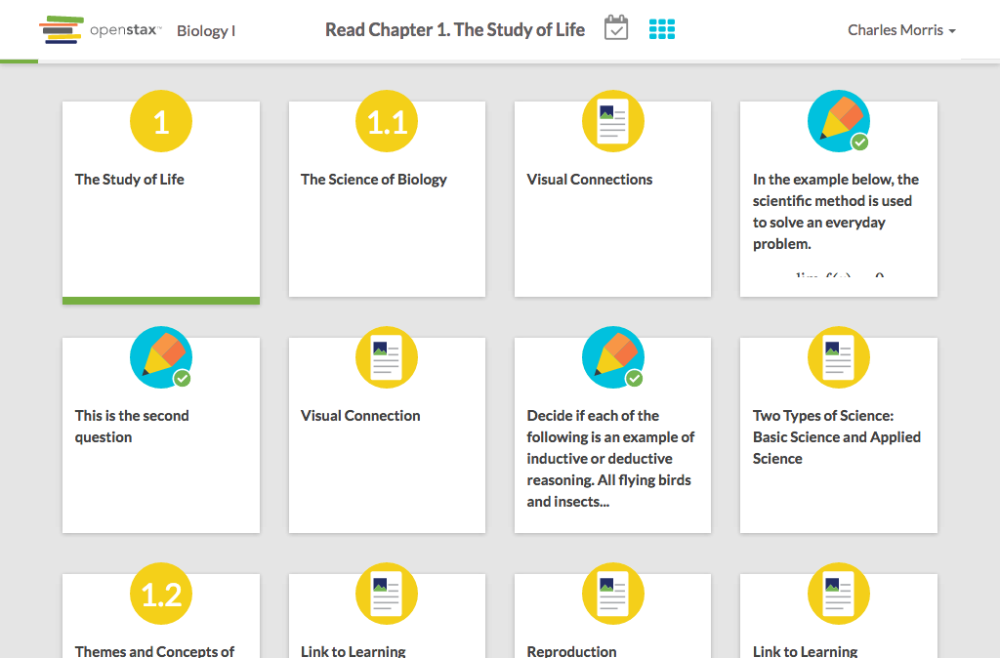

# https://tutor-{env}.openstax.org/courses/{courseId}/tasks/{taskId}/steps/{stepIndex}/{milestoneIndex}



# AJAX Calls

## GET /api/steps/1

```json
{
  "id": "1",
  "task_id": "1",
  "type": "reading",
  "group": "core",
  "is_completed": true,
  "last_completed_at": "2016-06-30T12:00:00.000Z",
  "first_completed_at": "2016-06-30T12:00:00.000Z",
  "has_recovery": false,
  "related_content": [
    {
      "title": "The Study of Life",
      "chapter_section": [
        1,
        0
      ]
    }
  ],
  "labels": [],
  "content_url": "https://archive-staging-tutor.cnx.org/contents/dc74b6ed-d06a-4fef-8479-8eefd058b59a@23",
  "title": "The Study of Life",
  "chapter_section": [
    1,
    0
  ],
  "content_html": "<body xmlns=\"http://www.w3.org/1999/xhtml\" xmlns:c=\"http://cnx.rice.edu/cnxml\" xmlns:md=\"http://cnx.rice.edu/mdml\" xmlns:qml=\"http://cnx.rice.edu/qml/ ... 2969 more"
}
```

