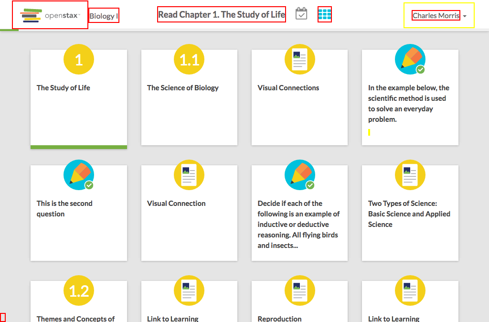

# https://tutor-{env}.openstax.org/courses/{courseId}/tasks/{taskId}/steps/{stepIndex}/{milestoneIndex}



# AJAX Calls

## GET /api/steps/1

```json
{
  "chapter_section": [
    1,
    0
  ],
  "content_html": "<body xmlns=\"http://www.w3.org/1999/xhtml\" xmlns:c=\"http://cnx.rice.edu/cnxml\" xmlns:md=\"http://cnx.rice.edu/mdml\" xmlns:qml=\"http://cnx.rice.edu/qml/ ... 2969 more",
  "content_url": "https://archive-staging-tutor.cnx.org/contents/dc74b6ed-d06a-4fef-8479-8eefd058b59a@23",
  "first_completed_at": "2016-06-30T12:00:00.000Z",
  "group": "core",
  "has_recovery": false,
  "id": "1",
  "is_completed": true,
  "labels": [],
  "last_completed_at": "2016-06-30T12:00:00.000Z",
  "related_content": [
    {
      "chapter_section": [
        1,
        0
      ],
      "title": "The Study of Life"
    }
  ],
  "task_id": "1",
  "title": "The Study of Life",
  "type": "reading"
}
```


# WCAG2AAA Errors

Showing first 50 of 36 errors

```
ERROR html WCAG2AAA.Principle3.Guideline3_1.3_1_1.H57.2
warning span.center-control-assignment WCAG2AAA.Principle1.Guideline1_4.1_4_6.G17.Abs
ERROR span.center-control-assignment WCAG2AAA.Principle1.Guideline1_4.1_4_6.G17.Fail
ERROR a.milestones-toggle.active.[href='/courses/1/tasks/1/steps/1/'] WCAG2AAA.Principle4.Guideline4_1.4_1_2.H91.A.NoContent
ERROR a.navbar-brand.navbar-brand[href='/dashboard/'] WCAG2AAA.Principle4.Guideline4_1.4_1_2.H91.A.NoContent
ERROR div.course-name WCAG2AAA.Principle1.Guideline1_4.1_4_6.G17.Fail
warning a#navbar-dropdown.dropdown-toggle[type='button'][aria-haspopup='true'][aria-expanded='false'][href=''] WCAG2AAA.Principle4.Guideline4_1.4_1_2.H91.A.NoHref
ERROR span WCAG2AAA.Principle1.Guideline1_4.1_4_6.G17.Fail
warning a.view-reference-guide[target='_blank'][href='/books/1/'] WCAG2AAA.Principle3.Guideline3_2.3_2_5.H83.3
warning a[href='https://accounts-dev.openstax.org/profile'][target='_blank'] WCAG2AAA.Principle3.Guideline3_2.3_2_5.H83.3
warning a[role='menuitem'][tabindex='-1'][target='_blank'][href='http://openstax.force.com/support?l=en_US&c=Products%3ATutor'] WCAG2AAA.Principle3.Guideline3_2.3_2_5.H83.3
ERROR a[href='#'] WCAG2AAA.Principle4.Guideline4_1.4_1_2.H91.A.NoContent
warning span.MathJax_Preview WCAG2AAA.Principle1.Guideline1_4.1_4_3_F24.F24.FGColour
warning span.mo#MathJax-Span-4 WCAG2AAA.Principle1.Guideline1_4.1_4_6.G17.Abs
warning span.mi#MathJax-Span-7 WCAG2AAA.Principle1.Guideline1_4.1_4_6.G17.Abs
warning span.mo#MathJax-Span-8 WCAG2AAA.Principle1.Guideline1_4.1_4_6.G17.Abs
warning span.mi#MathJax-Span-9 WCAG2AAA.Principle1.Guideline1_4.1_4_6.G17.Abs
warning span.mi#MathJax-Span-10 WCAG2AAA.Principle1.Guideline1_4.1_4_6.G17.Abs
warning span.mo#MathJax-Span-11 WCAG2AAA.Principle1.Guideline1_4.1_4_6.G17.Abs
warning span.mi#MathJax-Span-12 WCAG2AAA.Principle1.Guideline1_4.1_4_6.G17.Abs
warning span.mo#MathJax-Span-13 WCAG2AAA.Principle1.Guideline1_4.1_4_6.G17.Abs
warning span.mo#MathJax-Span-14 WCAG2AAA.Principle1.Guideline1_4.1_4_6.G17.Abs
warning span.mn#MathJax-Span-15 WCAG2AAA.Principle1.Guideline1_4.1_4_6.G17.Abs
warning mo[movablelimits='true'][form='prefix'] WCAG2AAA.Principle1.Guideline1_4.1_4_6.G17.Abs
warning mi WCAG2AAA.Principle1.Guideline1_4.1_4_6.G17.Abs
warning mo[stretchy='false'] WCAG2AAA.Principle1.Guideline1_4.1_4_6.G17.Abs
warning mi[mathvariant='normal'] WCAG2AAA.Principle1.Guideline1_4.1_4_6.G17.Abs
warning mi WCAG2AAA.Principle1.Guideline1_4.1_4_6.G17.Abs
warning mo[stretchy='false'] WCAG2AAA.Principle1.Guideline1_4.1_4_6.G17.Abs
warning mi WCAG2AAA.Principle1.Guideline1_4.1_4_6.G17.Abs
warning mo[stretchy='false'] WCAG2AAA.Principle1.Guideline1_4.1_4_6.G17.Abs
warning mo WCAG2AAA.Principle1.Guideline1_4.1_4_6.G17.Abs
warning mn WCAG2AAA.Principle1.Guideline1_4.1_4_6.G17.Abs
warning a[href='http://openstaxcollege.org/l/32plasmodium'][target='_blank'] WCAG2AAA.Principle3.Guideline3_2.3_2_5.H83.3
ERROR a.arrow.right[data-step='1'] WCAG2AAA.Principle4.Guideline4_1.4_1_2.H91.A.EmptyNoId
ERROR a[href='#spy'].debug-toggle-link WCAG2AAA.Principle2.Guideline2_4.2_4_1.G1,G123,G124.NoSuchID
```

