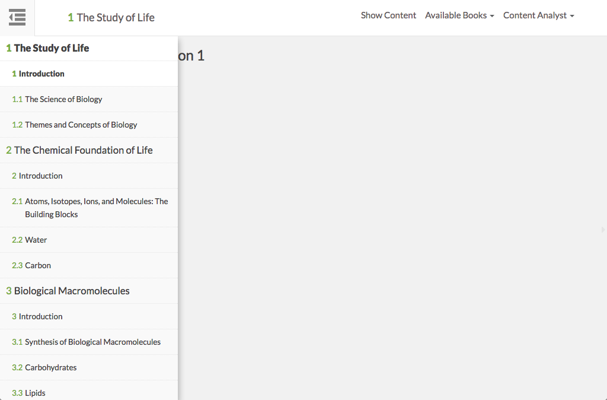

# https://tutor-{env}.openstax.org/qa



# AJAX Calls

## GET /api/ecosystems/5/readings

```json
[
  {
    "archive_url": "https://archive.cnx.org",
    "chapter_section": [],
    "children": [
      {
        "chapter_section": [
          33
        ],
        "children": [
          {
            "chapter_section": [
              33,
              5
            ],
            "cnx_id": "6cd5137c-4c27-4175-a5e7-caf448561fd7@2",
            "id": "785",
            "short_id": "bNUTfEwn",
            "title": "Quarks: Is That All There Is?",
            "type": "page",
            "uuid": "6cd5137c-4c27-4175-a5e7-caf448561fd7"
          },
          {
            "chapter_section": [
              33,
              6
            ],
            "cnx_id": "e304dd51-86de-4012-af91-8689a9eb4733@2",
            "id": "786",
            "short_id": "4wTdUYbe",
            "title": "GUTs: The Unification of Forces",
            "type": "page",
            "uuid": "e304dd51-86de-4012-af91-8689a9eb4733"
          },
          "... skipped 5"
        ],
        "id": "136",
        "title": "Particle Physics",
        "type": "part"
      },
      {
        "chapter_section": [
          34
        ],
        "children": [
          {
            "chapter_section": [
              34,
              6
            ],
            "cnx_id": "268333ac-bace-432d-9e5b-0c8a58bac4b5@2",
            "id": "793",
            "short_id": "JoMzrLrO",
            "title": "High-temperature Superconductors",
            "type": "page",
            "uuid": "268333ac-bace-432d-9e5b-0c8a58bac4b5"
          },
          {
            "chapter_section": [
              34,
              7
            ],
            "cnx_id": "3732ec62-7816-452c-b100-334a28464590@2",
            "id": "794",
            "short_id": "NzLsYngW",
            "title": "Some Questions We Know to Ask",
            "type": "page",
            "uuid": "3732ec62-7816-452c-b100-334a28464590"
          },
          "... skipped 6"
        ],
        "id": "137",
        "title": "Frontiers of Physics",
        "type": "part"
      },
      "... skipped 32"
    ],
    "cnx_id": "405335a3-7cff-4df2-a9ad-29062a4af261@6.97",
    "id": "5",
    "short_id": "QFM1o3z_",
    "title": "College Physics with Courseware",
    "type": "part",
    "uuid": "405335a3-7cff-4df2-a9ad-29062a4af261",
    "webview_url": "https://cnx.org"
  }
]
```

## GET /api/ecosystems/5/exercises/?page_ids%5B%5D=517

```json
{
  "items": [],
  "total_count": 0
}
```


# WCAG2A Errors

Showing first 50 of 9 errors

```
ERROR html WCAG2A.Principle3.Guideline3_1.3_1_1.H57.2
ERROR a[href=''][aria-selected='false'] WCAG2A.Principle4.Guideline4_1.4_1_2.H91.A.EmptyNoId
warning a[href=''][aria-selected='false'] WCAG2A.Principle4.Guideline4_1.4_1_2.H91.A.Placeholder
warning a#available-books.dropdown-toggle[type='button'][aria-haspopup='true'][aria-expanded='false'][href=''] WCAG2A.Principle4.Guideline4_1.4_1_2.H91.A.NoHref
warning a#navbar-dropdown.dropdown-toggle[type='button'][aria-haspopup='true'][aria-expanded='false'][href=''] WCAG2A.Principle4.Guideline4_1.4_1_2.H91.A.NoHref
ERROR a[href='#'] WCAG2A.Principle4.Guideline4_1.4_1_2.H91.A.NoContent
warning h3 WCAG2A.Principle1.Guideline1_3.1_3_1_A.G141
ERROR a.page-navigation.next[href='/qa/5/section/1.1'] WCAG2A.Principle4.Guideline4_1.4_1_2.H91.A.NoContent
ERROR a[href='#spy'].debug-toggle-link WCAG2A.Principle2.Guideline2_4.2_4_1.G1,G123,G124.NoSuchID
```

