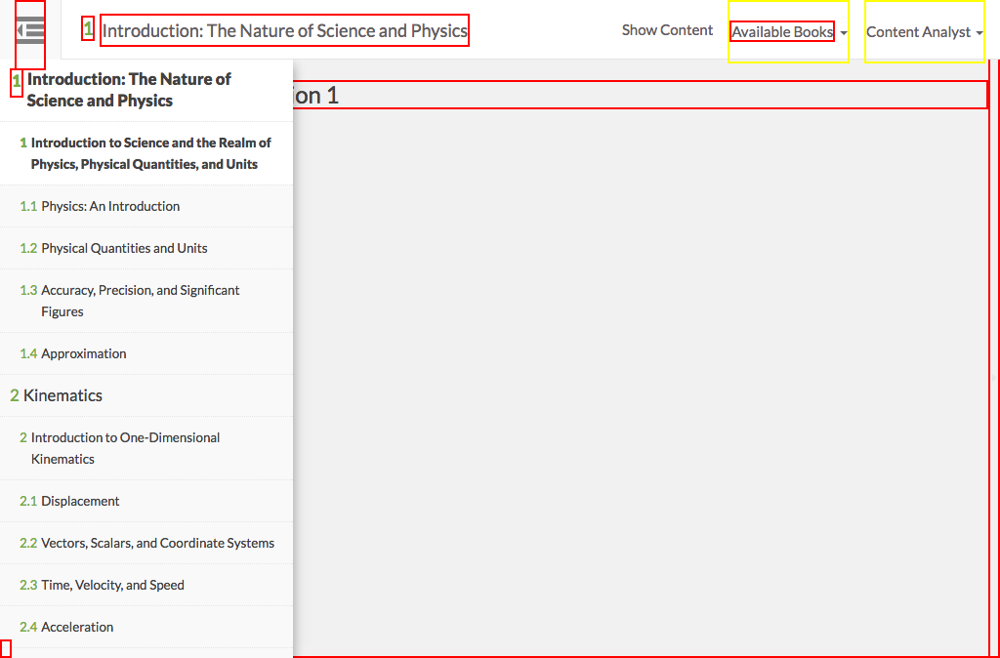

# https://tutor-{env}.openstax.org/qa



# AJAX Calls

## GET /api/ecosystems/4/readings

```json
[
  {
    "archive_url": "https://archive-staging-tutor.cnx.org",
    "chapter_section": [],
    "children": [
      {
        "chapter_section": [
          37
        ],
        "children": [
          {
            "chapter_section": [
              37,
              2
            ],
            "cnx_id": "81ba476c-4db2-47fe-a315-f63dba818a51@21",
            "id": "510",
            "title": "Energy Flow through Ecosystems",
            "type": "page",
            "uuid": "81ba476c-4db2-47fe-a315-f63dba818a51"
          },
          {
            "chapter_section": [
              37,
              3
            ],
            "cnx_id": "77e9b486-5d40-4fca-8a77-b049590ecb86@19",
            "id": "511",
            "title": "Biogeochemical Cycles",
            "type": "page",
            "uuid": "77e9b486-5d40-4fca-8a77-b049590ecb86"
          },
          "... skipped 2"
        ],
        "id": "102",
        "title": "Ecosystems",
        "type": "part"
      },
      {
        "chapter_section": [
          38
        ],
        "children": [
          {
            "chapter_section": [
              38,
              3
            ],
            "cnx_id": "1f383a77-28e1-4731-b53b-838f52ddc587@5",
            "id": "515",
            "title": "Threats to Biodiversity",
            "type": "page",
            "uuid": "1f383a77-28e1-4731-b53b-838f52ddc587"
          },
          {
            "chapter_section": [
              38,
              4
            ],
            "cnx_id": "d27666c2-d08e-4ca4-aa45-4af2263a07dd@4",
            "id": "516",
            "title": "Preserving Biodiversity",
            "type": "page",
            "uuid": "d27666c2-d08e-4ca4-aa45-4af2263a07dd"
          },
          "... skipped 3"
        ],
        "id": "103",
        "title": "Conservation Biology and Biodiversity",
        "type": "part"
      },
      "... skipped 36"
    ],
    "cnx_id": "d52e93f4-8653-4273-86da-3850001c0786@9.14",
    "id": "4",
    "title": "Biology For AP® Courses",
    "type": "part",
    "uuid": "d52e93f4-8653-4273-86da-3850001c0786",
    "webview_url": "https://archive-staging-tutor.cnx.org"
  }
]
```

## GET /api/ecosystems/4/exercises/?page_ids%5B%5D=312

```json
{
  "items": [],
  "total_count": 0
}
```

