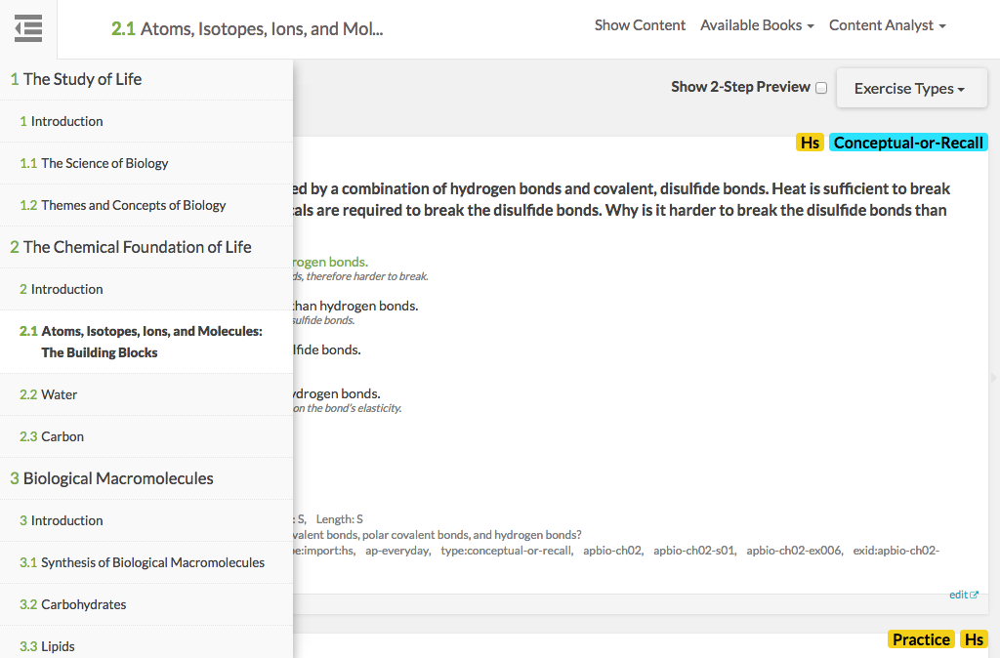

# https://tutor-{env}.openstax.org/qa/{ecosystemId}/section/{bookSection}



# AJAX Calls

## GET /api/ecosystems

```json
[
  {
    "id": 4,
    "comments": "7/6/2016 update exercises",
    "books": [
      {
        "id": 4,
        "uuid": "d52e93f4-8653-4273-86da-3850001c0786",
        "title": "Biology For AP® Courses",
        "version": "9.14"
      }
    ]
  },
  {
    "id": 3,
    "books": [
      {
        "id": 3,
        "uuid": "334f8b61-30eb-4475-8e05-5260a4866b4b",
        "title": "Physics",
        "version": "7.27"
      }
    ]
  },
  {
    "id": 2,
    "books": [
      {
        "id": 2,
        "uuid": "f10533ca-f803-490d-b935-88899941197f",
        "title": "Mini CC Biology Tes Coll",
        "version": "3.1"
      }
    ]
  },
  {
    "id": 1,
    "books": [
      {
        "id": 1,
        "uuid": "d52e93f4-8653-4273-86da-3850001c0786",
        "title": "Biology For AP® Courses",
        "version": "9.14"
      }
    ]
  }
]
```

## GET /api/ecosystems/1/readings

```json
[
  {
    "id": "1",
    "uuid": "d52e93f4-8653-4273-86da-3850001c0786",
    "cnx_id": "d52e93f4-8653-4273-86da-3850001c0786@9.14",
    "archive_url": "https://archive-staging-tutor.cnx.org",
    "webview_url": "https://archive-staging-tutor.cnx.org",
    "title": "Biology For AP® Courses",
    "type": "part",
    "chapter_section": [],
    "children": [
      {
        "id": "1",
        "title": "The Study of Life",
        "type": "part",
        "chapter_section": [
          1
        ],
        "children": [
          {
            "id": "1",
            "uuid": "dc74b6ed-d06a-4fef-8479-8eefd058b59a",
            "cnx_id": "dc74b6ed-d06a-4fef-8479-8eefd058b59a@23",
            "title": "Introduction",
            "type": "page",
            "chapter_section": [
              1,
              0
            ]
          },
          {
            "id": "2",
            "uuid": "4d5fc58c-cdea-4950-a91d-a5f141a38744",
            "cnx_id": "4d5fc58c-cdea-4950-a91d-a5f141a38744@34",
            "title": "The Science of Biology",
            "type": "page",
            "chapter_section": [
              1,
              1
            ]
          },
          {
            "id": "3",
            "uuid": "cb7cf05b-7e16-4a53-a498-003b01ec3d7f",
            "cnx_id": "cb7cf05b-7e16-4a53-a498-003b01ec3d7f@27",
            "title": "Themes and Concepts of Biology",
            "type": "page",
            "chapter_section": [
              1,
              2
            ]
          }
        ]
      },
      {
        "id": "2",
        "title": "The Chemical Foundation of Life",
        "type": "part",
        "chapter_section": [
          2
        ],
        "children": [
          {
            "id": "4",
            "uuid": "7172645f-ddb2-4062-a74b-873a609800d4",
            "cnx_id": "7172645f-ddb2-4062-a74b-873a609800d4@25",
            "title": "Introduction",
            "type": "page",
            "chapter_section": [
              2,
              0
            ]
          },
          {
            "id": "5",
            "uuid": "0c917d7d-0d1d-4a21-afbe-7d66bce2782c",
            "cnx_id": "0c917d7d-0d1d-4a21-afbe-7d66bce2782c@30",
            "title": "Atoms, Isotopes, Ions, and Molecules: The Building Blocks",
            "type": "page",
            "chapter_section": [
              2,
              1
            ]
          },
          {
            "id": "6",
            "uuid": "b57207bc-25b5-42d5-9ad3-86804e4774a2",
            "cnx_id": "b57207bc-25b5-42d5-9ad3-86804e4774a2@30",
            "title": "Water",
            "type": "page",
            "chapter_section": [
              2,
              2
            ]
          },
          {
            "id": "7",
            "uuid": "bbefeebe-61f3-47fc-8b51-0ccb8f1bb8cc",
            "cnx_id": "bbefeebe-61f3-47fc-8b51-0ccb8f1bb8cc@24",
            "title": "Carbon",
            "type": "page",
            "chapter_section": [
              2,
              3
            ]
          }
        ]
      },
      {
        "id": "3",
        "title": "Biological Macromolecules",
        "type": "part",
        "chapter_section": [
          3
        ],
        "children": [
          {
            "id": "8",
            "uuid": "d146e100-19c1-429d-9218-1ebb7325f594",
            "cnx_id": "d146e100-19c1-429d-9218-1ebb7325f594@15",
            "title": "Introduction",
            "type": "page",
            "chapter_section": [
              3,
              0
            ]
          },
          {
            "id": "9",
            "uuid": "85d6c500-9860-42e8-853a-e6940a50224f",
            "cnx_id": "85d6c500-9860-42e8-853a-e6940a50224f@23",
            "title": "Synthesis of Biological Macromolecules",
            "type": "page",
            "chapter_section": [
              3,
              1
            ]
          },
          {
            "id": "10",
            "uuid": "cb5052e5-d776-4570-8e4b-61171b792703",
            "cnx_id": "cb5052e5-d776-4570-8e4b-61171b792703@25",
            "title": "Carbohydrates",
            "type": "page",
            "chapter_section": [
              3,
              2
            ]
          },
          {
            "id": "11",
            "uuid": "84ab6fe4-c1c3-4d36-b4c8-6615d6100820",
            "cnx_id": "84ab6fe4-c1c3-4d36-b4c8-6615d6100820@19",
            "title": "Lipids",
            "type": "page",
            "chapter_section": [
              3,
              3
            ]
          },
          {
            "id": "12",
            "uuid": "cbbe54d1-c692-4405-a487-1c0f8ef8ea92",
            "cnx_id": "cbbe54d1-c692-4405-a487-1c0f8ef8ea92@22",
            "title": "Proteins",
            "type": "page",
            "chapter_section": [
              3,
              4
            ]
          },
          {
            "id": "13",
            "uuid": "c20c3501-a63c-4b40-aa6c-0bdafa8a2d33",
            "cnx_id": "c20c3501-a63c-4b40-aa6c-0bdafa8a2d33@20",
            "title": "Nucleic Acids",
            "type": "page",
            "chapter_section": [
              3,
              5
            ]
          }
        ]
      },
      {
        "id": "4",
        "title": "Cell Structure",
        "type": "part",
        "chapter_section": [
          4
        ],
        "children": [
          {
            "id": "14",
            "uuid": "abd6e32d-f4c4-4d08-bd59-3cef6eac4ad1",
            "cnx_id": "abd6e32d-f4c4-4d08-bd59-3cef6eac4ad1@22",
            "title": "Introduction",
            "type": "page",
            "chapter_section": [
              4,
              0
            ]
          },
          {
            "id": "15",
            "uuid": "d1448b4d-bf59-4b75-bf29-567a35c37444",
            "cnx_id": "d1448b4d-bf59-4b75-bf29-567a35c37444@23",
            "title": "Studying Cells",
            "type": "page",
            "chapter_section": [
              4,
              1
            ]
          },
          {
            "id": "16",
            "uuid": "e26d1433-f8e4-41db-a757-0e061d6d2737",
            "cnx_id": "e26d1433-f8e4-41db-a757-0e061d6d2737@29",
            "title": "Prokaryotic Cells",
            "type": "page",
            "chapter_section": [
              4,
              2
            ]
          },
          {
            "id": "17",
            "uuid": "f127c626-3065-43bc-b30f-cd71d536c45e",
            "cnx_id": "f127c626-3065-43bc-b30f-cd71d536c45e@22",
            "title": "Eukaryotic Cells",
            "type": "page",
            "chapter_section": [
              4,
              3
            ]
          },
          {
            "id": "18",
            "uuid": "b88d3526-9dc8-4849-9b81-a40a91552eac",
            "cnx_id": "b88d3526-9dc8-4849-9b81-a40a91552eac@22",
            "title": "The Endomembrane System and Proteins",
            "type": "page",
            "chapter_section": [
              4,
              4
            ]
          },
          {
            "id": "19",
            "uuid": "082c4d6c-162a-4a7c-884b-95cbdd3299eb",
            "cnx_id": "082c4d6c-162a-4a7c-884b-95cbdd3299eb@21",
            "title": "The Cytoskeleton",
            "type": "page",
            "chapter_section": [
              4,
              5
            ]
          },
          {
            "id": "20",
            "uuid": "89355770-2073-4c95-b2d3-af5be52dec14",
            "cnx_id": "89355770-2073-4c95-b2d3-af5be52dec14@23",
            "title": "Connections between Cells and Cellular Activities",
            "type": "page",
            "chapter_section": [
              4,
              6
            ]
          }
        ]
      },
      {
        "id": "5",
        "title": "Structure and Function of Plasma Membranes",
        "type": "part",
        "chapter_section": [
          5
        ],
        "children": [
          {
            "id": "21",
            "uuid": "c1be83c6-e4b4-47b1-b223-f188ee1f6d79",
            "cnx_id": "c1be83c6-e4b4-47b1-b223-f188ee1f6d79@26",
            "title": "Introduction",
            "type": "page",
            "chapter_section": [
              5,
              0
            ]
          },
          {
            "id": "22",
            "uuid": "2f288b4b-26e9-4767-a146-82a867190d6d",
            "cnx_id": "2f288b4b-26e9-4767-a146-82a867190d6d@30",
            "title": "Components and Structure",
            "type": "page",
            "chapter_section": [
              5,
              1
            ]
          },
          {
            "id": "23",
            "uuid": "3c6f2515-b50b-4232-8e43-1c36126f5af3",
            "cnx_id": "3c6f2515-b50b-4232-8e43-1c36126f5af3@31",
            "title": "Passive Transport",
            "type": "page",
            "chapter_section": [
              5,
              2
            ]
          },
          {
            "id": "24",
            "uuid": "d2d76716-8ddb-4026-873e-e6773be040a6",
            "cnx_id": "d2d76716-8ddb-4026-873e-e6773be040a6@28",
            "title": "Active Transport",
            "type": "page",
            "chapter_section": [
              5,
              3
            ]
          },
          {
            "id": "25",
            "uuid": "187d1294-567e-4eb6-a8c9-a73818d74aff",
            "cnx_id": "187d1294-567e-4eb6-a8c9-a73818d74aff@27",
            "title": "Bulk Transport",
            "type": "page",
            "chapter_section": [
              5,
              4
            ]
          }
        ]
      },
      {
        "id": "6",
        "title": "Metabolism",
        "type": "part",
        "chapter_section": [
          6
        ],
        "children": [
          {
            "id": "26",
            "uuid": "cc819477-32dc-425d-bdd6-f7a1279fdf29",
            "cnx_id": "cc819477-32dc-425d-bdd6-f7a1279fdf29@29",
            "title": "Introduction",
            "type": "page",
            "chapter_section": [
              6,
              0
            ]
          },
          {
            "id": "27",
            "uuid": "29d90913-172b-4684-bd7d-c62ec7f639a0",
            "cnx_id": "29d90913-172b-4684-bd7d-c62ec7f639a0@29",
            "title": "Energy and Metabolism",
            "type": "page",
            "chapter_section": [
              6,
              1
            ]
          },
          {
            "id": "28",
            "uuid": "0b06de0f-e78d-4e82-83cd-08b6a4ab32f9",
            "cnx_id": "0b06de0f-e78d-4e82-83cd-08b6a4ab32f9@23",
            "title": "Potential, Kinetic, Free, and Activation Energy",
            "type": "page",
            "chapter_section": [
              6,
              2
            ]
          },
          {
            "id": "29",
            "uuid": "bfa2b300-4b44-4111-b198-893b9aaa4eca",
            "cnx_id": "bfa2b300-4b44-4111-b198-893b9aaa4eca@25",
            "title": "The Laws of Thermodynamics",
            "type": "page",
            "chapter_section": [
              6,
              3
            ]
          },
          {
            "id": "30",
            "uuid": "31b3b6de-638f-4a95-8df3-d186e513bc16",
            "cnx_id": "31b3b6de-638f-4a95-8df3-d186e513bc16@28",
            "title": "ATP: Adenosine Triphosphate",
            "type": "page",
            "chapter_section": [
              6,
              4
            ]
          },
          {
            "id": "31",
            "uuid": "b5dc02e5-d7c7-42a2-bc32-de96f7272a82",
            "cnx_id": "b5dc02e5-d7c7-42a2-bc32-de96f7272a82@27",
            "title": "Enzymes",
            "type": "page",
            "chapter_section": [
              6,
              5
            ]
          }
        ]
      },
      {
        "id": "7",
        "title": "Cellular Respiration",
        "type": "part",
        "chapter_section": [
          7
        ],
        "children": [
          {
            "id": "32",
            "uuid": "24084129-4c0d-44ef-a6b0-94cf1242706f",
            "cnx_id": "24084129-4c0d-44ef-a6b0-94cf1242706f@18",
            "title": "Introduction",
            "type": "page",
            "chapter_section": [
              7,
              0
            ]
          },
          {
            "id": "33",
            "uuid": "9893750f-a757-4a95-8762-4cafbaeb0c8d",
            "cnx_id": "9893750f-a757-4a95-8762-4cafbaeb0c8d@22",
            "title": "Energy in Living Systems",
            "type": "page",
            "chapter_section": [
              7,
              1
            ]
          },
          {
            "id": "34",
            "uuid": "40c3cc68-e484-4d13-9119-e3c81cbbbdd4",
            "cnx_id": "40c3cc68-e484-4d13-9119-e3c81cbbbdd4@24",
            "title": "Glycolysis",
            "type": "page",
            "chapter_section": [
              7,
              2
            ]
          },
          {
            "id": "35",
            "uuid": "c0ee09a3-b2d0-4d43-bd87-0a0ffe59ff92",
            "cnx_id": "c0ee09a3-b2d0-4d43-bd87-0a0ffe59ff92@22",
            "title": "Oxidation of Pyruvate and the Citric Acid Cycle",
            "type": "page",
            "chapter_section": [
              7,
              3
            ]
          },
          {
            "id": "36",
            "uuid": "1657151b-6cad-4fe7-84d6-cadf3d92de95",
            "cnx_id": "1657151b-6cad-4fe7-84d6-cadf3d92de95@24",
            "title": "Oxidative Phosphorylation",
            "type": "page",
            "chapter_section": [
              7,
              4
            ]
          },
          {
            "id": "37",
            "uuid": "789c5a9e-2afb-4b29-b600-4659696b0b7e",
            "cnx_id": "789c5a9e-2afb-4b29-b600-4659696b0b7e@22",
            "title": "Metabolism without Oxygen",
            "type": "page",
            "chapter_section": [
              7,
              5
            ]
          },
          {
            "id": "38",
            "uuid": "347e037f-5ef9-414d-8e50-3a9100ae30c9",
            "cnx_id": "347e037f-5ef9-414d-8e50-3a9100ae30c9@22",
            "title": "Connections of Carbohydrate, Protein, and Lipid Metabolic Pathways",
            "type": "page",
            "chapter_section": [
              7,
              6
            ]
          },
          {
            "id": "39",
            "uuid": "e1836b1e-c69f-4ae5-b2e5-c16b93528ea8",
            "cnx_id": "e1836b1e-c69f-4ae5-b2e5-c16b93528ea8@24",
            "title": "Regulation of Cellular Respiration",
            "type": "page",
            "chapter_section": [
              7,
              7
            ]
          }
        ]
      },
      {
        "id": "8",
        "title": "Photosynthesis",
        "type": "part",
        "chapter_section": [
          8
        ],
        "children": [
          {
            "id": "40",
            "uuid": "ba957379-c3cd-486b-80a0-d6b9e205e8ae",
            "cnx_id": "ba957379-c3cd-486b-80a0-d6b9e205e8ae@21",
            "title": "Introduction",
            "type": "page",
            "chapter_section": [
              8,
              0
            ]
          },
          {
            "id": "41",
            "uuid": "fb960c69-753f-4c77-b092-d43043416506",
            "cnx_id": "fb960c69-753f-4c77-b092-d43043416506@28",
            "title": "Overview of Photosynthesis",
            "type": "page",
            "chapter_section": [
              8,
              1
            ]
          },
          {
            "id": "42",
            "uuid": "892e660c-80ea-4a57-9124-8cb4b06394d4",
            "cnx_id": "892e660c-80ea-4a57-9124-8cb4b06394d4@39",
            "title": "The Light-Dependent Reactions of Photosynthesis",
            "type": "page",
            "chapter_section": [
              8,
              2
            ]
          },
          {
            "id": "43",
            "uuid": "3c730455-18dc-4e62-85f7-34aeb7094b01",
            "cnx_id": "3c730455-18dc-4e62-85f7-34aeb7094b01@29",
            "title": "Using Light Energy to Make Organic Molecules",
            "type": "page",
            "chapter_section": [
              8,
              3
            ]
          }
        ]
      },
      {
        "id": "9",
        "title": "Cell Communication",
        "type": "part",
        "chapter_section": [
          9
        ],
        "children": [
          {
            "id": "44",
            "uuid": "752f501e-a351-4736-8e73-09d4a726e6be",
            "cnx_id": "752f501e-a351-4736-8e73-09d4a726e6be@16",
            "title": "Introduction",
            "type": "page",
            "chapter_section": [
              9,
              0
            ]
          },
          {
            "id": "45",
            "uuid": "2dc278a3-5a27-49d6-af15-9644f60b13e7",
            "cnx_id": "2dc278a3-5a27-49d6-af15-9644f60b13e7@20",
            "title": "Signaling Molecules and Cellular Receptors",
            "type": "page",
            "chapter_section": [
              9,
              1
            ]
          },
          {
            "id": "46",
            "uuid": "5efcdce0-2e7a-4d4e-bf6c-724773f4e349",
            "cnx_id": "5efcdce0-2e7a-4d4e-bf6c-724773f4e349@21",
            "title": "Propagation of the Signal",
            "type": "page",
            "chapter_section": [
              9,
              2
            ]
          },
          {
            "id": "47",
            "uuid": "6fffa473-32b6-4e49-b7bc-fa166a1503cc",
            "cnx_id": "6fffa473-32b6-4e49-b7bc-fa166a1503cc@21",
            "title": "Response to the Signal",
            "type": "page",
            "chapter_section": [
              9,
              3
            ]
          },
          {
            "id": "48",
            "uuid": "049cc64b-ebb0-410e-9907-c6a61fd4d54f",
            "cnx_id": "049cc64b-ebb0-410e-9907-c6a61fd4d54f@19",
            "title": "Signaling in Single-Celled Organisms",
            "type": "page",
            "chapter_section": [
              9,
              4
            ]
          }
        ]
      },
      {
        "id": "10",
        "title": "Cell Reproduction",
        "type": "part",
        "chapter_section": [
          10
        ],
        "children": [
          {
            "id": "49",
            "uuid": "6f9513b8-f41e-4764-b05c-860e33fdc8bc",
            "cnx_id": "6f9513b8-f41e-4764-b05c-860e33fdc8bc@13",
            "title": "Introduction",
            "type": "page",
            "chapter_section": [
              10,
              0
            ]
          },
          {
            "id": "50",
            "uuid": "a338b3a8-3c4f-489f-8b39-bbc801e662bc",
            "cnx_id": "a338b3a8-3c4f-489f-8b39-bbc801e662bc@15",
            "title": "Cell Division",
            "type": "page",
            "chapter_section": [
              10,
              1
            ]
          },
          {
            "id": "51",
            "uuid": "250d1c23-52df-4f1c-a0f5-5e0c7c221579",
            "cnx_id": "250d1c23-52df-4f1c-a0f5-5e0c7c221579@23",
            "title": "The Cell Cycle",
            "type": "page",
            "chapter_section": [
              10,
              2
            ]
          },
          {
            "id": "52",
            "uuid": "7ba64850-4a1d-4947-ba64-5dde5717bb25",
            "cnx_id": "7ba64850-4a1d-4947-ba64-5dde5717bb25@16",
            "title": "Control of the Cell Cycle",
            "type": "page",
            "chapter_section": [
              10,
              3
            ]
          },
          {
            "id": "53",
            "uuid": "52426e02-52ac-4dc5-8ff4-3a6ac9d3c0c3",
            "cnx_id": "52426e02-52ac-4dc5-8ff4-3a6ac9d3c0c3@19",
            "title": "Cancer and the Cell Cycle",
            "type": "page",
            "chapter_section": [
              10,
              4
            ]
          },
          {
            "id": "54",
            "uuid": "35eb7371-f148-4db5-9aea-ec1eabd4e260",
            "cnx_id": "35eb7371-f148-4db5-9aea-ec1eabd4e260@16",
            "title": "Prokaryotic Cell Division",
            "type": "page",
            "chapter_section": [
              10,
              5
            ]
          }
        ]
      },
      {
        "id": "11",
        "title": "Meiosis and Sexual Reproduction",
        "type": "part",
        "chapter_section": [
          11
        ],
        "children": [
          {
            "id": "55",
            "uuid": "63c5f688-896a-48f3-947f-6c52e0e2ac84",
            "cnx_id": "63c5f688-896a-48f3-947f-6c52e0e2ac84@17",
            "title": "Introduction",
            "type": "page",
            "chapter_section": [
              11,
              0
            ]
          },
          {
            "id": "56",
            "uuid": "82e22579-200b-4766-a30c-597cff8ad928",
            "cnx_id": "82e22579-200b-4766-a30c-597cff8ad928@28",
            "title": "The Process of Meiosis",
            "type": "page",
            "chapter_section": [
              11,
              1
            ]
          },
          {
            "id": "57",
            "uuid": "84f9f796-3f00-4ad8-880c-c2dd19182d79",
            "cnx_id": "84f9f796-3f00-4ad8-880c-c2dd19182d79@28",
            "title": "Sexual Reproduction",
            "type": "page",
            "chapter_section": [
              11,
              2
            ]
          }
        ]
      },
      {
        "id": "12",
        "title": "Mendel's Experiments and Heredity",
        "type": "part",
        "chapter_section": [
          12
        ],
        "children": [
          {
            "id": "58",
            "uuid": "be9d7a48-f71c-446a-a89b-d46665b2f988",
            "cnx_id": "be9d7a48-f71c-446a-a89b-d46665b2f988@18",
            "title": "Introduction",
            "type": "page",
            "chapter_section": [
              12,
              0
            ]
          },
          {
            "id": "59",
            "uuid": "dfafb6a8-c7d9-4064-8da9-b62979fcc34b",
            "cnx_id": "dfafb6a8-c7d9-4064-8da9-b62979fcc34b@22",
            "title": "Mendel’s Experiments and the Laws of Probability",
            "type": "page",
            "chapter_section": [
              12,
              1
            ]
          },
          {
            "id": "60",
            "uuid": "9d15ac23-a3d4-4181-b583-c2c5624aa7c0",
            "cnx_id": "9d15ac23-a3d4-4181-b583-c2c5624aa7c0@25",
            "title": "Characteristics and Traits",
            "type": "page",
            "chapter_section": [
              12,
              2
            ]
          },
          {
            "id": "61",
            "uuid": "d96732e5-3d37-4443-8214-2ce408b857ba",
            "cnx_id": "d96732e5-3d37-4443-8214-2ce408b857ba@29",
            "title": "Laws of Inheritance",
            "type": "page",
            "chapter_section": [
              12,
              3
            ]
          }
        ]
      },
      {
        "id": "13",
        "title": "Modern Understandings of Inheritance",
        "type": "part",
        "chapter_section": [
          13
        ],
        "children": [
          {
            "id": "62",
            "uuid": "d41a039c-f760-498b-a37f-1de90eb30142",
            "cnx_id": "d41a039c-f760-498b-a37f-1de90eb30142@12",
            "title": "Introduction",
            "type": "page",
            "chapter_section": [
              13,
              0
            ]
          },
          {
            "id": "63",
            "uuid": "7d76bdfe-06ce-4b7e-ac0c-0d781218e029",
            "cnx_id": "7d76bdfe-06ce-4b7e-ac0c-0d781218e029@28",
            "title": "Chromosomal Theory and Genetic Linkage",
            "type": "page",
            "chapter_section": [
              13,
              1
            ]
          },
          {
            "id": "64",
            "uuid": "09a00944-2fa3-449f-b0c3-cb112a990996",
            "cnx_id": "09a00944-2fa3-449f-b0c3-cb112a990996@24",
            "title": "Chromosomal Basis of Inherited Disorders",
            "type": "page",
            "chapter_section": [
              13,
              2
            ]
          }
        ]
      },
      {
        "id": "14",
        "title": "DNA Structure and Function",
        "type": "part",
        "chapter_section": [
          14
        ],
        "children": [
          {
            "id": "65",
            "uuid": "7835284a-4afe-4037-853c-11c4e23a3fd0",
            "cnx_id": "7835284a-4afe-4037-853c-11c4e23a3fd0@15",
            "title": "Introduction",
            "type": "page",
            "chapter_section": [
              14,
              0
            ]
          },
          {
            "id": "66",
            "uuid": "30ca9e2c-591b-4643-b2fa-31fbab13c789",
            "cnx_id": "30ca9e2c-591b-4643-b2fa-31fbab13c789@15",
            "title": "Historical Basis of Modern Understanding",
            "type": "page",
            "chapter_section": [
              14,
              1
            ]
          },
          {
            "id": "67",
            "uuid": "10be83d4-c760-4223-af28-5dc40d1360bd",
            "cnx_id": "10be83d4-c760-4223-af28-5dc40d1360bd@14",
            "title": "DNA Structure and Sequencing",
            "type": "page",
            "chapter_section": [
              14,
              2
            ]
          },
          {
            "id": "68",
            "uuid": "83d81284-3099-4bb3-896a-98628f61d58a",
            "cnx_id": "83d81284-3099-4bb3-896a-98628f61d58a@15",
            "title": "Basics of DNA Replication",
            "type": "page",
            "chapter_section": [
              14,
              3
            ]
          },
          {
            "id": "69",
            "uuid": "40810ad1-8559-4219-9415-cd47ba432660",
            "cnx_id": "40810ad1-8559-4219-9415-cd47ba432660@14",
            "title": "DNA Replication in Prokaryotes",
            "type": "page",
            "chapter_section": [
              14,
              4
            ]
          },
          {
            "id": "70",
            "uuid": "bf32bc50-e6c6-4291-b04a-fc0d04f4ff22",
            "cnx_id": "bf32bc50-e6c6-4291-b04a-fc0d04f4ff22@14",
            "title": "DNA Replication in Eukaryotes",
            "type": "page",
            "chapter_section": [
              14,
              5
            ]
          },
          {
            "id": "71",
            "uuid": "dcad9678-d461-43d3-8a42-bf2b91f42bea",
            "cnx_id": "dcad9678-d461-43d3-8a42-bf2b91f42bea@14",
            "title": "DNA Repair",
            "type": "page",
            "chapter_section": [
              14,
              6
            ]
          }
        ]
      },
      {
        "id": "15",
        "title": "Genes and Proteins",
        "type": "part",
        "chapter_section": [
          15
        ],
        "children": [
          {
            "id": "72",
            "uuid": "9bd063c8-cbc5-4800-8bbb-f68a526c8abb",
            "cnx_id": "9bd063c8-cbc5-4800-8bbb-f68a526c8abb@16",
            "title": "Introduction",
            "type": "page",
            "chapter_section": [
              15,
              0
            ]
          },
          {
            "id": "73",
            "uuid": "36bc4f88-20b4-4ffb-9a0b-db1b2371df41",
            "cnx_id": "36bc4f88-20b4-4ffb-9a0b-db1b2371df41@21",
            "title": "The Genetic Code",
            "type": "page",
            "chapter_section": [
              15,
              1
            ]
          },
          {
            "id": "74",
            "uuid": "afdd12a8-7d04-41bf-93ea-589094dc7b32",
            "cnx_id": "afdd12a8-7d04-41bf-93ea-589094dc7b32@20",
            "title": "Prokaryotic Transcription",
            "type": "page",
            "chapter_section": [
              15,
              2
            ]
          },
          {
            "id": "75",
            "uuid": "54a40955-3a08-4bec-b464-97ec2e9b4ba9",
            "cnx_id": "54a40955-3a08-4bec-b464-97ec2e9b4ba9@20",
            "title": "Eukaryotic Transcription",
            "type": "page",
            "chapter_section": [
              15,
              3
            ]
          },
          {
            "id": "76",
            "uuid": "fda258a0-decf-49e5-9192-e58cb0b896a8",
            "cnx_id": "fda258a0-decf-49e5-9192-e58cb0b896a8@20",
            "title": "RNA Processing in Eukaryotes",
            "type": "page",
            "chapter_section": [
              15,
              4
            ]
          },
          {
            "id": "77",
            "uuid": "b72c39e5-6b52-4df1-9282-168bd9e834ed",
            "cnx_id": "b72c39e5-6b52-4df1-9282-168bd9e834ed@19",
            "title": "Ribosomes and Protein Synthesis",
            "type": "page",
            "chapter_section": [
              15,
              5
            ]
          }
        ]
      },
      {
        "id": "16",
        "title": "Gene Regulation",
        "type": "part",
        "chapter_section": [
          16
        ],
        "children": [
          {
            "id": "78",
            "uuid": "28d89352-6630-4fe2-a7bf-f3c9fd4b42c8",
            "cnx_id": "28d89352-6630-4fe2-a7bf-f3c9fd4b42c8@11",
            "title": "Introduction",
            "type": "page",
            "chapter_section": [
              16,
              0
            ]
          },
          {
            "id": "79",
            "uuid": "56afc283-b3e2-4079-89b4-d6034bbc3128",
            "cnx_id": "56afc283-b3e2-4079-89b4-d6034bbc3128@12",
            "title": "Regulation of Gene Expression",
            "type": "page",
            "chapter_section": [
              16,
              1
            ]
          },
          {
            "id": "80",
            "uuid": "c78e5e22-f2f1-4914-8ad4-a6ca6db3ce2c",
            "cnx_id": "c78e5e22-f2f1-4914-8ad4-a6ca6db3ce2c@11",
            "title": "Prokaryotic Gene Regulation",
            "type": "page",
            "chapter_section": [
              16,
              2
            ]
          },
          {
            "id": "81",
            "uuid": "328eaf6c-1f3e-4948-afb5-5f91263a2d39",
            "cnx_id": "328eaf6c-1f3e-4948-afb5-5f91263a2d39@10",
            "title": "Eukaryotic Epigenetic Gene Regulation",
            "type": "page",
            "chapter_section": [
              16,
              3
            ]
          },
          {
            "id": "82",
            "uuid": "da350162-78e5-41f8-babf-b1ab2a09a46c",
            "cnx_id": "da350162-78e5-41f8-babf-b1ab2a09a46c@12",
            "title": "Eukaryotic Transcription Gene Regulation",
            "type": "page",
            "chapter_section": [
              16,
              4
            ]
          },
          {
            "id": "83",
            "uuid": "27e6a816-d107-4ba6-b771-cfb24c3d2a83",
            "cnx_id": "27e6a816-d107-4ba6-b771-cfb24c3d2a83@13",
            "title": "Eukaryotic Post-transcriptional Gene Regulation",
            "type": "page",
            "chapter_section": [
              16,
              5
            ]
          },
          {
            "id": "84",
            "uuid": "79fbb284-d06b-4183-baa9-3600341f76a7",
            "cnx_id": "79fbb284-d06b-4183-baa9-3600341f76a7@15",
            "title": "Eukaryotic Translational and Post-translational Gene Regulation",
            "type": "page",
            "chapter_section": [
              16,
              6
            ]
          },
          {
            "id": "85",
            "uuid": "3f686629-aa95-49b1-8c5d-855963fbc85f",
            "cnx_id": "3f686629-aa95-49b1-8c5d-855963fbc85f@15",
            "title": "Cancer and Gene Regulation",
            "type": "page",
            "chapter_section": [
              16,
              7
            ]
          }
        ]
      },
      {
        "id": "17",
        "title": "Biotechnology and Genomics",
        "type": "part",
        "chapter_section": [
          17
        ],
        "children": [
          {
            "id": "86",
            "uuid": "2297324f-aeb1-45a5-b72f-21ad1fae30d4",
            "cnx_id": "2297324f-aeb1-45a5-b72f-21ad1fae30d4@13",
            "title": "Introduction",
            "type": "page",
            "chapter_section": [
              17,
              0
            ]
          },
          {
            "id": "87",
            "uuid": "1366abed-ac86-4323-a724-d017a8c0176f",
            "cnx_id": "1366abed-ac86-4323-a724-d017a8c0176f@19",
            "title": "Biotechnology",
            "type": "page",
            "chapter_section": [
              17,
              1
            ]
          },
          {
            "id": "88",
            "uuid": "c45dc86a-6469-4d22-a66c-9a578d417f9f",
            "cnx_id": "c45dc86a-6469-4d22-a66c-9a578d417f9f@18",
            "title": "Mapping Genomes",
            "type": "page",
            "chapter_section": [
              17,
              2
            ]
          },
          {
            "id": "89",
            "uuid": "cf58eb28-a3b3-4d49-be08-dfdc7d7671db",
            "cnx_id": "cf58eb28-a3b3-4d49-be08-dfdc7d7671db@15",
            "title": "Whole-Genome Sequencing",
            "type": "page",
            "chapter_section": [
              17,
              3
            ]
          },
          {
            "id": "90",
            "uuid": "9ad46878-93cb-4f32-9c7e-b961d5a97f59",
            "cnx_id": "9ad46878-93cb-4f32-9c7e-b961d5a97f59@14",
            "title": "Applying Genomics",
            "type": "page",
            "chapter_section": [
              17,
              4
            ]
          },
          {
            "id": "91",
            "uuid": "3657b194-fe57-44f1-bfe3-5bfa6ee36e19",
            "cnx_id": "3657b194-fe57-44f1-bfe3-5bfa6ee36e19@13",
            "title": "Genomics and Proteomics",
            "type": "page",
            "chapter_section": [
              17,
              5
            ]
          }
        ]
      },
      {
        "id": "18",
        "title": "Evolution and Origin of Species",
        "type": "part",
        "chapter_section": [
          18
        ],
        "children": [
          {
            "id": "92",
            "uuid": "1d37139e-bf93-473f-9bda-cdd706b525d4",
            "cnx_id": "1d37139e-bf93-473f-9bda-cdd706b525d4@18",
            "title": "Introduction",
            "type": "page",
            "chapter_section": [
              18,
              0
            ]
          },
          {
            "id": "93",
            "uuid": "66674a7c-c9bb-4dd6-a529-8c755fe47506",
            "cnx_id": "66674a7c-c9bb-4dd6-a529-8c755fe47506@23",
            "title": "Understanding Evolution",
            "type": "page",
            "chapter_section": [
              18,
              1
            ]
          },
          {
            "id": "94",
            "uuid": "a0f1c7d8-bb67-41d4-a540-358970808e4d",
            "cnx_id": "a0f1c7d8-bb67-41d4-a540-358970808e4d@31",
            "title": "Formation of New Species",
            "type": "page",
            "chapter_section": [
              18,
              2
            ]
          },
          {
            "id": "95",
            "uuid": "c07ec8c2-949b-43d9-ad9a-89cea78d117e",
            "cnx_id": "c07ec8c2-949b-43d9-ad9a-89cea78d117e@22",
            "title": "Reconnection and Rates of Speciation",
            "type": "page",
            "chapter_section": [
              18,
              3
            ]
          }
        ]
      },
      {
        "id": "19",
        "title": "The Evolution of Populations",
        "type": "part",
        "chapter_section": [
          19
        ],
        "children": [
          {
            "id": "96",
            "uuid": "06c0dd07-80e0-4ba3-ab1e-25704ac012da",
            "cnx_id": "06c0dd07-80e0-4ba3-ab1e-25704ac012da@14",
            "title": "Introduction",
            "type": "page",
            "chapter_section": [
              19,
              0
            ]
          },
          {
            "id": "97",
            "uuid": "e9d0bcae-516d-49c1-8412-284725c0bad0",
            "cnx_id": "e9d0bcae-516d-49c1-8412-284725c0bad0@26",
            "title": "Population Evolution",
            "type": "page",
            "chapter_section": [
              19,
              1
            ]
          },
          {
            "id": "98",
            "uuid": "1fc6c96d-e18f-45e2-8f07-fae9fa65ef50",
            "cnx_id": "1fc6c96d-e18f-45e2-8f07-fae9fa65ef50@30",
            "title": "Population Genetics",
            "type": "page",
            "chapter_section": [
              19,
              2
            ]
          },
          {
            "id": "99",
            "uuid": "e8a46282-4ad0-4baf-8358-c2e685579294",
            "cnx_id": "e8a46282-4ad0-4baf-8358-c2e685579294@22",
            "title": "Adaptive Evolution",
            "type": "page",
            "chapter_section": [
              19,
              3
            ]
          }
        ]
      },
      {
        "id": "20",
        "title": "Evolutionary Relationships of Life on Earth",
        "type": "part",
        "chapter_section": [
          20
        ],
        "children": [
          {
            "id": "100",
            "uuid": "be0de223-fd8b-454f-a44c-38c18258d418",
            "cnx_id": "be0de223-fd8b-454f-a44c-38c18258d418@12",
            "title": "Introduction",
            "type": "page",
            "chapter_section": [
              20,
              0
            ]
          },
          {
            "id": "101",
            "uuid": "dea1a856-6120-4e01-a6ea-1194cc584c66",
            "cnx_id": "dea1a856-6120-4e01-a6ea-1194cc584c66@20",
            "title": "Organizing Life on Earth",
            "type": "page",
            "chapter_section": [
              20,
              1
            ]
          },
          {
            "id": "102",
            "uuid": "925ddc73-d492-4f14-94cc-0aea6ec941d2",
            "cnx_id": "925ddc73-d492-4f14-94cc-0aea6ec941d2@26",
            "title": "Determining Evolutionary Relationships",
            "type": "page",
            "chapter_section": [
              20,
              2
            ]
          },
          {
            "id": "103",
            "uuid": "0f4b7c52-5f77-42a8-86fa-b343b826fc29",
            "cnx_id": "0f4b7c52-5f77-42a8-86fa-b343b826fc29@21",
            "title": "Perspectives on the Phylogenetic Tree",
            "type": "page",
            "chapter_section": [
              20,
              3
            ]
          }
        ]
      },
      {
        "id": "21",
        "title": "Viruses",
        "type": "part",
        "chapter_section": [
          21
        ],
        "children": [
          {
            "id": "104",
            "uuid": "222f7705-eea1-49c0-9a2d-0e9b9e8f9659",
            "cnx_id": "222f7705-eea1-49c0-9a2d-0e9b9e8f9659@7",
            "title": "Introduction",
            "type": "page",
            "chapter_section": [
              21,
              0
            ]
          },
          {
            "id": "105",
            "uuid": "a00f83e3-2e92-49f3-8d8b-e1342ad4e136",
            "cnx_id": "a00f83e3-2e92-49f3-8d8b-e1342ad4e136@8",
            "title": "Viral Evolution, Morphology, and Classification",
            "type": "page",
            "chapter_section": [
              21,
              1
            ]
          },
          {
            "id": "106",
            "uuid": "5892f70a-cf43-40b4-8e63-28a5cc2e577d",
            "cnx_id": "5892f70a-cf43-40b4-8e63-28a5cc2e577d@10",
            "title": "Virus Infections and Hosts",
            "type": "page",
            "chapter_section": [
              21,
              2
            ]
          },
          {
            "id": "107",
            "uuid": "2a23c130-5708-441b-8ec2-43e9d4cb9207",
            "cnx_id": "2a23c130-5708-441b-8ec2-43e9d4cb9207@7",
            "title": "Prevention and Treatment of Viral Infections",
            "type": "page",
            "chapter_section": [
              21,
              3
            ]
          },
          {
            "id": "108",
            "uuid": "6e7c6a90-b7b8-4e7b-96ac-674cba38a5a7",
            "cnx_id": "6e7c6a90-b7b8-4e7b-96ac-674cba38a5a7@7",
            "title": "Other Acellular Entities: Prions and Viroids",
            "type": "page",
            "chapter_section": [
              21,
              4
            ]
          }
        ]
      },
      {
        "id": "22",
        "title": "Prokaryotes: Bacteria and Archaea",
        "type": "part",
        "chapter_section": [
          22
        ],
        "children": [
          {
            "id": "109",
            "uuid": "48bf1b94-a4ab-4667-9dd3-6505cb8d866d",
            "cnx_id": "48bf1b94-a4ab-4667-9dd3-6505cb8d866d@7",
            "title": "Introduction",
            "type": "page",
            "chapter_section": [
              22,
              0
            ]
          },
          {
            "id": "110",
            "uuid": "8f990d8f-d55b-4610-94f6-53fc5f40789f",
            "cnx_id": "8f990d8f-d55b-4610-94f6-53fc5f40789f@9",
            "title": "Prokaryotic Diversity",
            "type": "page",
            "chapter_section": [
              22,
              1
            ]
          },
          {
            "id": "111",
            "uuid": "784881c6-c8d4-43d5-a4a8-3b6ea19bbc37",
            "cnx_id": "784881c6-c8d4-43d5-a4a8-3b6ea19bbc37@10",
            "title": "Structure of Prokaryotes",
            "type": "page",
            "chapter_section": [
              22,
              2
            ]
          },
          {
            "id": "112",
            "uuid": "2d44678e-18d1-40fc-9a1d-8b62aef095c1",
            "cnx_id": "2d44678e-18d1-40fc-9a1d-8b62aef095c1@10",
            "title": "Prokaryotic Metabolism",
            "type": "page",
            "chapter_section": [
              22,
              3
            ]
          },
          {
            "id": "113",
            "uuid": "a040b206-055d-4da6-9e7c-e7e2c2c9a0e7",
            "cnx_id": "a040b206-055d-4da6-9e7c-e7e2c2c9a0e7@11",
            "title": "Bacterial Diseases in Humans",
            "type": "page",
            "chapter_section": [
              22,
              4
            ]
          },
          {
            "id": "114",
            "uuid": "fa93d9d2-0d81-42d9-a6b1-4031f7a549f5",
            "cnx_id": "fa93d9d2-0d81-42d9-a6b1-4031f7a549f5@9",
            "title": "Beneficial Prokaryotes",
            "type": "page",
            "chapter_section": [
              22,
              5
            ]
          }
        ]
      },
      {
        "id": "23",
        "title": "Plant Form and Physiology",
        "type": "part",
        "chapter_section": [
          23
        ],
        "children": [
          {
            "id": "115",
            "uuid": "bf4510c5-f72f-425d-bfad-b43912c9c159",
            "cnx_id": "bf4510c5-f72f-425d-bfad-b43912c9c159@4",
            "title": "Introduction",
            "type": "page",
            "chapter_section": [
              23,
              0
            ]
          },
          {
            "id": "116",
            "uuid": "2f191fcf-924e-4f9d-8bd1-29efa0c5c743",
            "cnx_id": "2f191fcf-924e-4f9d-8bd1-29efa0c5c743@4",
            "title": "The Plant Body",
            "type": "page",
            "chapter_section": [
              23,
              1
            ]
          },
          {
            "id": "117",
            "uuid": "36f2cb61-1cb8-44d7-8371-87f16eb750bb",
            "cnx_id": "36f2cb61-1cb8-44d7-8371-87f16eb750bb@5",
            "title": "Stems",
            "type": "page",
            "chapter_section": [
              23,
              2
            ]
          },
          {
            "id": "118",
            "uuid": "047044d5-54d1-4ede-b18f-0e3c176ded57",
            "cnx_id": "047044d5-54d1-4ede-b18f-0e3c176ded57@4",
            "title": "Roots",
            "type": "page",
            "chapter_section": [
              23,
              3
            ]
          },
          {
            "id": "119",
            "uuid": "3e08968e-ba36-48f8-9d53-f14a90b1bb17",
            "cnx_id": "3e08968e-ba36-48f8-9d53-f14a90b1bb17@5",
            "title": "Leaves",
            "type": "page",
            "chapter_section": [
              23,
              4
            ]
          },
          {
            "id": "120",
            "uuid": "dd377e96-7bd3-4ea7-88ba-28bb5cdb7d41",
            "cnx_id": "dd377e96-7bd3-4ea7-88ba-28bb5cdb7d41@7",
            "title": "Transport of Water and Solutes in Plants",
            "type": "page",
            "chapter_section": [
              23,
              5
            ]
          },
          {
            "id": "121",
            "uuid": "b3a728f9-4179-432a-b93b-a8f32f9f20a6",
            "cnx_id": "b3a728f9-4179-432a-b93b-a8f32f9f20a6@4",
            "title": "Plant Sensory Systems and Responses",
            "type": "page",
            "chapter_section": [
              23,
              6
            ]
          }
        ]
      },
      {
        "id": "24",
        "title": "The Animal Body: Basic Form and Function",
        "type": "part",
        "chapter_section": [
          24
        ],
        "children": [
          {
            "id": "122",
            "uuid": "dee8b747-41d3-4b3c-8483-f687559fe3df",
            "cnx_id": "dee8b747-41d3-4b3c-8483-f687559fe3df@4",
            "title": "Introduction",
            "type": "page",
            "chapter_section": [
              24,
              0
            ]
          },
          {
            "id": "123",
            "uuid": "2ee0997f-1571-42ff-af0b-946736780f47",
            "cnx_id": "2ee0997f-1571-42ff-af0b-946736780f47@6",
            "title": "Animal Form and Function",
            "type": "page",
            "chapter_section": [
              24,
              1
            ]
          },
          {
            "id": "124",
            "uuid": "ad860d36-aab8-49e0-9809-0ff866fea366",
            "cnx_id": "ad860d36-aab8-49e0-9809-0ff866fea366@5",
            "title": "Animal Primary Tissues",
            "type": "page",
            "chapter_section": [
              24,
              2
            ]
          },
          {
            "id": "125",
            "uuid": "61e1e692-b9c2-4b2c-8111-962d167cae56",
            "cnx_id": "61e1e692-b9c2-4b2c-8111-962d167cae56@5",
            "title": "Homeostasis",
            "type": "page",
            "chapter_section": [
              24,
              3
            ]
          }
        ]
      },
      {
        "id": "25",
        "title": "Animal Nutrition and the Digestive System",
        "type": "part",
        "chapter_section": [
          25
        ],
        "children": [
          {
            "id": "126",
            "uuid": "f3681f25-7c06-4207-a7b5-4dea88ff606d",
            "cnx_id": "f3681f25-7c06-4207-a7b5-4dea88ff606d@9",
            "title": "Introduction",
            "type": "page",
            "chapter_section": [
              25,
              0
            ]
          },
          {
            "id": "127",
            "uuid": "45dda021-e55a-40ed-a8cd-4cfdaf4015c2",
            "cnx_id": "45dda021-e55a-40ed-a8cd-4cfdaf4015c2@9",
            "title": "Digestive Systems",
            "type": "page",
            "chapter_section": [
              25,
              1
            ]
          },
          {
            "id": "128",
            "uuid": "e0e58fa1-f2c9-48b2-8625-b44f4c1e0ba7",
            "cnx_id": "e0e58fa1-f2c9-48b2-8625-b44f4c1e0ba7@7",
            "title": "Nutrition and Energy Production",
            "type": "page",
            "chapter_section": [
              25,
              2
            ]
          },
          {
            "id": "129",
            "uuid": "81d980ce-2075-40de-b45d-a2f5c8bd4592",
            "cnx_id": "81d980ce-2075-40de-b45d-a2f5c8bd4592@8",
            "title": "Digestive System Processes",
            "type": "page",
            "chapter_section": [
              25,
              3
            ]
          },
          {
            "id": "130",
            "uuid": "854ed47a-f908-49c8-bb8f-e81a779f10be",
            "cnx_id": "854ed47a-f908-49c8-bb8f-e81a779f10be@7",
            "title": "Digestive System Regulation",
            "type": "page",
            "chapter_section": [
              25,
              4
            ]
          }
        ]
      },
      {
        "id": "26",
        "title": "The Nervous System",
        "type": "part",
        "chapter_section": [
          26
        ],
        "children": [
          {
            "id": "131",
            "uuid": "10f0eb96-677a-4eca-9313-b40cf62765d6",
            "cnx_id": "10f0eb96-677a-4eca-9313-b40cf62765d6@6",
            "title": "Introduction",
            "type": "page",
            "chapter_section": [
              26,
              0
            ]
          },
          {
            "id": "132",
            "uuid": "cd354518-eff7-45c2-9a57-c85b691be5ca",
            "cnx_id": "cd354518-eff7-45c2-9a57-c85b691be5ca@7",
            "title": "Neurons and Glial Cells",
            "type": "page",
            "chapter_section": [
              26,
              1
            ]
          },
          {
            "id": "133",
            "uuid": "ebe0fbec-52b6-414e-990c-057dcbaa48cd",
            "cnx_id": "ebe0fbec-52b6-414e-990c-057dcbaa48cd@8",
            "title": "How Neurons Communicate",
            "type": "page",
            "chapter_section": [
              26,
              2
            ]
          },
          {
            "id": "134",
            "uuid": "9bee30f4-144a-4bb5-b253-97897ee10b24",
            "cnx_id": "9bee30f4-144a-4bb5-b253-97897ee10b24@11",
            "title": "The Central Nervous System",
            "type": "page",
            "chapter_section": [
              26,
              3
            ]
          },
          {
            "id": "135",
            "uuid": "d4e9e4fb-5473-4d8a-bb7f-b1a8bfaa3a6a",
            "cnx_id": "d4e9e4fb-5473-4d8a-bb7f-b1a8bfaa3a6a@6",
            "title": "The Peripheral Nervous System",
            "type": "page",
            "chapter_section": [
              26,
              4
            ]
          },
          {
            "id": "136",
            "uuid": "8fc1a616-9175-4035-8dbd-3fe18039629d",
            "cnx_id": "8fc1a616-9175-4035-8dbd-3fe18039629d@6",
            "title": "Nervous System Disorders",
            "type": "page",
            "chapter_section": [
              26,
              5
            ]
          }
        ]
      },
      {
        "id": "27",
        "title": "Sensory Systems",
        "type": "part",
        "chapter_section": [
          27
        ],
        "children": [
          {
            "id": "137",
            "uuid": "15fb3f5d-e740-4ccf-83d1-f6cd3b1f6ac6",
            "cnx_id": "15fb3f5d-e740-4ccf-83d1-f6cd3b1f6ac6@3",
            "title": "Introduction",
            "type": "page",
            "chapter_section": [
              27,
              0
            ]
          },
          {
            "id": "138",
            "uuid": "bc0e033e-3cf7-4fbf-a1f5-45674b5d902e",
            "cnx_id": "bc0e033e-3cf7-4fbf-a1f5-45674b5d902e@5",
            "title": "Sensory Processes",
            "type": "page",
            "chapter_section": [
              27,
              1
            ]
          },
          {
            "id": "139",
            "uuid": "3f3acf19-462f-45b1-bcbd-06f4a3174bee",
            "cnx_id": "3f3acf19-462f-45b1-bcbd-06f4a3174bee@5",
            "title": "Somatosensation",
            "type": "page",
            "chapter_section": [
              27,
              2
            ]
          },
          {
            "id": "140",
            "uuid": "663bc014-1ffc-405a-8e88-ea24d10aff22",
            "cnx_id": "663bc014-1ffc-405a-8e88-ea24d10aff22@5",
            "title": "Taste and Smell",
            "type": "page",
            "chapter_section": [
              27,
              3
            ]
          },
          {
            "id": "141",
            "uuid": "bde0c1b3-8fcc-4751-b047-5d816985deb2",
            "cnx_id": "bde0c1b3-8fcc-4751-b047-5d816985deb2@5",
            "title": "Hearing and Vestibular Sensation",
            "type": "page",
            "chapter_section": [
              27,
              4
            ]
          },
          {
            "id": "142",
            "uuid": "5311fc19-9f80-45ca-b456-72c9df14fda9",
            "cnx_id": "5311fc19-9f80-45ca-b456-72c9df14fda9@5",
            "title": "Vision",
            "type": "page",
            "chapter_section": [
              27,
              5
            ]
          }
        ]
      },
      {
        "id": "28",
        "title": "The Endocrine System",
        "type": "part",
        "chapter_section": [
          28
        ],
        "children": [
          {
            "id": "143",
            "uuid": "c3c56e60-05d1-490d-ac24-775ffbc90f06",
            "cnx_id": "c3c56e60-05d1-490d-ac24-775ffbc90f06@3",
            "title": "Introduction",
            "type": "page",
            "chapter_section": [
              28,
              0
            ]
          },
          {
            "id": "144",
            "uuid": "82f03e4c-b25a-4cd8-b48c-5fa2cef2bf28",
            "cnx_id": "82f03e4c-b25a-4cd8-b48c-5fa2cef2bf28@4",
            "title": "Types of Hormones",
            "type": "page",
            "chapter_section": [
              28,
              1
            ]
          },
          {
            "id": "145",
            "uuid": "dd53b558-f232-4e71-a14c-77d84040ec7b",
            "cnx_id": "dd53b558-f232-4e71-a14c-77d84040ec7b@4",
            "title": "How Hormones Work",
            "type": "page",
            "chapter_section": [
              28,
              2
            ]
          },
          {
            "id": "146",
            "uuid": "5bb99dd1-d5c8-406c-8ab4-781dccf2c1e1",
            "cnx_id": "5bb99dd1-d5c8-406c-8ab4-781dccf2c1e1@4",
            "title": "Regulation of Body Processes",
            "type": "page",
            "chapter_section": [
              28,
              3
            ]
          },
          {
            "id": "147",
            "uuid": "8dad66cd-67b8-4843-9bd4-5810c315b1cc",
            "cnx_id": "8dad66cd-67b8-4843-9bd4-5810c315b1cc@4",
            "title": "Regulation of Hormone Production",
            "type": "page",
            "chapter_section": [
              28,
              4
            ]
          },
          {
            "id": "148",
            "uuid": "1d3e49b9-ce1b-4928-8e18-4027b769938e",
            "cnx_id": "1d3e49b9-ce1b-4928-8e18-4027b769938e@5",
            "title": "Endocrine Glands",
            "type": "page",
            "chapter_section": [
              28,
              5
            ]
          }
        ]
      },
      {
        "id": "29",
        "title": "The Musculoskeletal System",
        "type": "part",
        "chapter_section": [
          29
        ],
        "children": [
          {
            "id": "149",
            "uuid": "a8abe160-1c25-4921-9381-71b3163438a0",
            "cnx_id": "a8abe160-1c25-4921-9381-71b3163438a0@4",
            "title": "Introduction",
            "type": "page",
            "chapter_section": [
              29,
              0
            ]
          },
          {
            "id": "150",
            "uuid": "638e5fd6-4875-4e25-b159-156b731dde25",
            "cnx_id": "638e5fd6-4875-4e25-b159-156b731dde25@5",
            "title": "Types of Skeletal Systems",
            "type": "page",
            "chapter_section": [
              29,
              1
            ]
          },
          {
            "id": "151",
            "uuid": "eb8092cc-2fd3-4dac-bd4b-a9db97954261",
            "cnx_id": "eb8092cc-2fd3-4dac-bd4b-a9db97954261@5",
            "title": "Bone",
            "type": "page",
            "chapter_section": [
              29,
              2
            ]
          },
          {
            "id": "152",
            "uuid": "d31fc440-5c61-44f2-9d4a-30172c1c1e80",
            "cnx_id": "d31fc440-5c61-44f2-9d4a-30172c1c1e80@4",
            "title": "Joints and Skeletal Movement",
            "type": "page",
            "chapter_section": [
              29,
              3
            ]
          },
          {
            "id": "153",
            "uuid": "3f2f9bf2-b3a5-4967-8acf-dea6b5dcde6c",
            "cnx_id": "3f2f9bf2-b3a5-4967-8acf-dea6b5dcde6c@6",
            "title": "Muscle Contraction and Locomotion",
            "type": "page",
            "chapter_section": [
              29,
              4
            ]
          }
        ]
      },
      {
        "id": "30",
        "title": "The Respiratory System",
        "type": "part",
        "chapter_section": [
          30
        ],
        "children": [
          {
            "id": "154",
            "uuid": "765ccc95-5746-444a-90b1-1da80892240f",
            "cnx_id": "765ccc95-5746-444a-90b1-1da80892240f@7",
            "title": "Introduction",
            "type": "page",
            "chapter_section": [
              30,
              0
            ]
          },
          {
            "id": "155",
            "uuid": "3506d370-7b8c-47cd-a2dd-c34ff9c56814",
            "cnx_id": "3506d370-7b8c-47cd-a2dd-c34ff9c56814@8",
            "title": "Systems of Gas Exchange",
            "type": "page",
            "chapter_section": [
              30,
              1
            ]
          },
          {
            "id": "156",
            "uuid": "f9ad6cbe-bd6d-4c9d-acd8-50a07cf66da6",
            "cnx_id": "f9ad6cbe-bd6d-4c9d-acd8-50a07cf66da6@9",
            "title": "Gas Exchange across Respiratory Surfaces",
            "type": "page",
            "chapter_section": [
              30,
              2
            ]
          },
          {
            "id": "157",
            "uuid": "08758c07-c2ee-45ce-9fd5-c53e0a96afac",
            "cnx_id": "08758c07-c2ee-45ce-9fd5-c53e0a96afac@7",
            "title": "Breathing",
            "type": "page",
            "chapter_section": [
              30,
              3
            ]
          },
          {
            "id": "158",
            "uuid": "00672270-ae95-4b79-ab10-70481363a238",
            "cnx_id": "00672270-ae95-4b79-ab10-70481363a238@7",
            "title": "Transport of Gases in Human Bodily Fluids",
            "type": "page",
            "chapter_section": [
              30,
              4
            ]
          }
        ]
      },
      {
        "id": "31",
        "title": "The Circulatory System",
        "type": "part",
        "chapter_section": [
          31
        ],
        "children": [
          {
            "id": "159",
            "uuid": "7c8e1644-7293-48ab-b421-9352cb8277e2",
            "cnx_id": "7c8e1644-7293-48ab-b421-9352cb8277e2@6",
            "title": "Introduction",
            "type": "page",
            "chapter_section": [
              31,
              0
            ]
          },
          {
            "id": "160",
            "uuid": "ca924044-4ae7-420b-a57b-33450dbfe11a",
            "cnx_id": "ca924044-4ae7-420b-a57b-33450dbfe11a@7",
            "title": "Overview of the Circulatory System",
            "type": "page",
            "chapter_section": [
              31,
              1
            ]
          },
          {
            "id": "161",
            "uuid": "adadbb2d-5b24-4638-a54e-bc1a9ec3f7ca",
            "cnx_id": "adadbb2d-5b24-4638-a54e-bc1a9ec3f7ca@8",
            "title": "Components of the Blood",
            "type": "page",
            "chapter_section": [
              31,
              2
            ]
          },
          {
            "id": "162",
            "uuid": "0c96da55-9cbf-465f-9944-4cad791be422",
            "cnx_id": "0c96da55-9cbf-465f-9944-4cad791be422@8",
            "title": "Mammalian Heart and Blood Vessels",
            "type": "page",
            "chapter_section": [
              31,
              3
            ]
          },
          {
            "id": "163",
            "uuid": "5bb41711-70ef-48d1-85db-79f79dfbf266",
            "cnx_id": "5bb41711-70ef-48d1-85db-79f79dfbf266@7",
            "title": "Blood Flow and Blood Pressure Regulation",
            "type": "page",
            "chapter_section": [
              31,
              4
            ]
          }
        ]
      },
      {
        "id": "32",
        "title": "Osmotic Regulation and Excretion",
        "type": "part",
        "chapter_section": [
          32
        ],
        "children": [
          {
            "id": "164",
            "uuid": "46487809-39bb-450e-b0d9-7dea83c003d7",
            "cnx_id": "46487809-39bb-450e-b0d9-7dea83c003d7@4",
            "title": "Introduction",
            "type": "page",
            "chapter_section": [
              32,
              0
            ]
          },
          {
            "id": "165",
            "uuid": "35b7f30a-544d-4201-922a-540eede18b59",
            "cnx_id": "35b7f30a-544d-4201-922a-540eede18b59@7",
            "title": "Osmoregulation and Osmotic Balance",
            "type": "page",
            "chapter_section": [
              32,
              1
            ]
          },
          {
            "id": "166",
            "uuid": "b30a9800-a03c-4f55-9b3c-f0f1ce25862c",
            "cnx_id": "b30a9800-a03c-4f55-9b3c-f0f1ce25862c@7",
            "title": "The Kidneys and Osmoregulatory Organs",
            "type": "page",
            "chapter_section": [
              32,
              2
            ]
          },
          {
            "id": "167",
            "uuid": "37aa1541-4368-44df-a2ad-4e3ffe2322b6",
            "cnx_id": "37aa1541-4368-44df-a2ad-4e3ffe2322b6@6",
            "title": "Excretion Systems",
            "type": "page",
            "chapter_section": [
              32,
              3
            ]
          },
          {
            "id": "168",
            "uuid": "79e40980-0c6e-4129-a80f-1eb0014033f1",
            "cnx_id": "79e40980-0c6e-4129-a80f-1eb0014033f1@5",
            "title": "Nitrogenous Wastes",
            "type": "page",
            "chapter_section": [
              32,
              4
            ]
          },
          {
            "id": "169",
            "uuid": "6cbae695-60ad-42c0-8a69-90a4cbae8f4e",
            "cnx_id": "6cbae695-60ad-42c0-8a69-90a4cbae8f4e@6",
            "title": "Hormonal Control of Osmoregulatory Functions",
            "type": "page",
            "chapter_section": [
              32,
              5
            ]
          }
        ]
      },
      {
        "id": "33",
        "title": "The Immune System",
        "type": "part",
        "chapter_section": [
          33
        ],
        "children": [
          {
            "id": "170",
            "uuid": "1d2ae386-57f9-4aeb-9992-c562a276e0e2",
            "cnx_id": "1d2ae386-57f9-4aeb-9992-c562a276e0e2@4",
            "title": "Introduction",
            "type": "page",
            "chapter_section": [
              33,
              0
            ]
          },
          {
            "id": "171",
            "uuid": "de87daff-3ed0-48bb-882a-bbb061914841",
            "cnx_id": "de87daff-3ed0-48bb-882a-bbb061914841@5",
            "title": "Innate Immune Response",
            "type": "page",
            "chapter_section": [
              33,
              1
            ]
          },
          {
            "id": "172",
            "uuid": "d2a1b225-04a0-49ce-b2df-49e7fbbbdbb3",
            "cnx_id": "d2a1b225-04a0-49ce-b2df-49e7fbbbdbb3@5",
            "title": "Adaptive Immune Response",
            "type": "page",
            "chapter_section": [
              33,
              2
            ]
          },
          {
            "id": "173",
            "uuid": "8c7a454e-4b34-430b-ba53-8ba34ca155b8",
            "cnx_id": "8c7a454e-4b34-430b-ba53-8ba34ca155b8@5",
            "title": "Antibodies",
            "type": "page",
            "chapter_section": [
              33,
              3
            ]
          },
          {
            "id": "174",
            "uuid": "05bbc797-7345-4f82-9fb8-ca0eccc621aa",
            "cnx_id": "05bbc797-7345-4f82-9fb8-ca0eccc621aa@7",
            "title": "Disruptions in the Immune System",
            "type": "page",
            "chapter_section": [
              33,
              4
            ]
          }
        ]
      },
      {
        "id": "34",
        "title": "Animal Reproduction and Development",
        "type": "part",
        "chapter_section": [
          34
        ],
        "children": [
          {
            "id": "175",
            "uuid": "98c791af-1ef3-4ab5-afcb-19ad6ead10f8",
            "cnx_id": "98c791af-1ef3-4ab5-afcb-19ad6ead10f8@6",
            "title": "Introduction",
            "type": "page",
            "chapter_section": [
              34,
              0
            ]
          },
          {
            "id": "176",
            "uuid": "4240c9af-70c9-4f49-b085-b37bf6a32df7",
            "cnx_id": "4240c9af-70c9-4f49-b085-b37bf6a32df7@11",
            "title": "Reproduction Methods",
            "type": "page",
            "chapter_section": [
              34,
              1
            ]
          },
          {
            "id": "177",
            "uuid": "5c91c53f-c276-4461-8cd3-ca7894128880",
            "cnx_id": "5c91c53f-c276-4461-8cd3-ca7894128880@11",
            "title": "Fertilization",
            "type": "page",
            "chapter_section": [
              34,
              2
            ]
          },
          {
            "id": "178",
            "uuid": "8fccc13f-420a-450b-951d-354164a958cb",
            "cnx_id": "8fccc13f-420a-450b-951d-354164a958cb@15",
            "title": "Human Reproductive Anatomy and Gametogenesis",
            "type": "page",
            "chapter_section": [
              34,
              3
            ]
          },
          {
            "id": "179",
            "uuid": "86fd927f-d87a-4a16-afd2-a9a42ed2e09d",
            "cnx_id": "86fd927f-d87a-4a16-afd2-a9a42ed2e09d@13",
            "title": "Hormonal Control of Human Reproduction",
            "type": "page",
            "chapter_section": [
              34,
              4
            ]
          },
          {
            "id": "180",
            "uuid": "58cf028f-51b0-4ece-924f-7d7a81aefc2d",
            "cnx_id": "58cf028f-51b0-4ece-924f-7d7a81aefc2d@8",
            "title": "Human Pregnancy and Birth",
            "type": "page",
            "chapter_section": [
              34,
              5
            ]
          },
          {
            "id": "181",
            "uuid": "7bc4868a-ee8e-4698-8b3e-e4ac3484be45",
            "cnx_id": "7bc4868a-ee8e-4698-8b3e-e4ac3484be45@10",
            "title": "Fertilization and Early Embryonic Development",
            "type": "page",
            "chapter_section": [
              34,
              6
            ]
          },
          {
            "id": "182",
            "uuid": "f92bded6-69e6-4714-909a-ea4bb12b99c0",
            "cnx_id": "f92bded6-69e6-4714-909a-ea4bb12b99c0@10",
            "title": "Organogenesis and Vertebrate Formation",
            "type": "page",
            "chapter_section": [
              34,
              7
            ]
          }
        ]
      },
      {
        "id": "35",
        "title": "Ecology and the Biosphere",
        "type": "part",
        "chapter_section": [
          35
        ],
        "children": [
          {
            "id": "183",
            "uuid": "e352aa66-31b1-4f02-86c5-064866570af7",
            "cnx_id": "e352aa66-31b1-4f02-86c5-064866570af7@4",
            "title": "Introduction",
            "type": "page",
            "chapter_section": [
              35,
              0
            ]
          },
          {
            "id": "184",
            "uuid": "a85ab969-e63c-4164-a565-3325a85dba1a",
            "cnx_id": "a85ab969-e63c-4164-a565-3325a85dba1a@6",
            "title": "The Scope of Ecology",
            "type": "page",
            "chapter_section": [
              35,
              1
            ]
          },
          {
            "id": "185",
            "uuid": "424e96cc-a6f5-46c0-939d-b48e8d58fb7f",
            "cnx_id": "424e96cc-a6f5-46c0-939d-b48e8d58fb7f@6",
            "title": "Biogeography",
            "type": "page",
            "chapter_section": [
              35,
              2
            ]
          },
          {
            "id": "186",
            "uuid": "9dbb3db9-88e0-410c-a906-b4a5bc2866bc",
            "cnx_id": "9dbb3db9-88e0-410c-a906-b4a5bc2866bc@7",
            "title": "Terrestrial Biomes",
            "type": "page",
            "chapter_section": [
              35,
              3
            ]
          },
          {
            "id": "187",
            "uuid": "c76dbc1f-fda9-4607-9795-207b06057a91",
            "cnx_id": "c76dbc1f-fda9-4607-9795-207b06057a91@6",
            "title": "Aquatic Biomes",
            "type": "page",
            "chapter_section": [
              35,
              4
            ]
          },
          {
            "id": "188",
            "uuid": "49a2289b-b4d0-4d80-bc90-a3c4177f6b35",
            "cnx_id": "49a2289b-b4d0-4d80-bc90-a3c4177f6b35@7",
            "title": "Climate and the Effects of Global Climate Change",
            "type": "page",
            "chapter_section": [
              35,
              5
            ]
          }
        ]
      },
      {
        "id": "36",
        "title": "Population and Community Ecology",
        "type": "part",
        "chapter_section": [
          36
        ],
        "children": [
          {
            "id": "189",
            "uuid": "7d776d78-c9b4-44bb-bd9c-69d34dc68389",
            "cnx_id": "7d776d78-c9b4-44bb-bd9c-69d34dc68389@3",
            "title": "Introduction",
            "type": "page",
            "chapter_section": [
              36,
              0
            ]
          },
          {
            "id": "190",
            "uuid": "e5f5ae27-625b-448a-ba52-0d6f287b6595",
            "cnx_id": "e5f5ae27-625b-448a-ba52-0d6f287b6595@5",
            "title": "Population Demography",
            "type": "page",
            "chapter_section": [
              36,
              1
            ]
          },
          {
            "id": "191",
            "uuid": "2a9854ef-40ea-4d1c-8dbe-24ca21ce9154",
            "cnx_id": "2a9854ef-40ea-4d1c-8dbe-24ca21ce9154@5",
            "title": "Life Histories and Natural Selection",
            "type": "page",
            "chapter_section": [
              36,
              2
            ]
          },
          {
            "id": "192",
            "uuid": "315e6bd0-15ba-44b3-b2a5-cb15b2ddea55",
            "cnx_id": "315e6bd0-15ba-44b3-b2a5-cb15b2ddea55@6",
            "title": "Environmental Limits to Population Growth",
            "type": "page",
            "chapter_section": [
              36,
              3
            ]
          },
          {
            "id": "193",
            "uuid": "e51fb41f-6880-44c6-bb36-88aac6e273fb",
            "cnx_id": "e51fb41f-6880-44c6-bb36-88aac6e273fb@5",
            "title": "Population Dynamics and Regulation",
            "type": "page",
            "chapter_section": [
              36,
              4
            ]
          },
          {
            "id": "194",
            "uuid": "786f09b4-8e1d-4da8-90ea-9284d6678e02",
            "cnx_id": "786f09b4-8e1d-4da8-90ea-9284d6678e02@5",
            "title": "Human Population Growth",
            "type": "page",
            "chapter_section": [
              36,
              5
            ]
          },
          {
            "id": "195",
            "uuid": "56aa613a-446b-4e4b-a9f7-79c3754b831d",
            "cnx_id": "56aa613a-446b-4e4b-a9f7-79c3754b831d@5",
            "title": "Community Ecology",
            "type": "page",
            "chapter_section": [
              36,
              6
            ]
          },
          {
            "id": "196",
            "uuid": "5f436782-bbc7-4d0e-bb96-7a3840dedff4",
            "cnx_id": "5f436782-bbc7-4d0e-bb96-7a3840dedff4@6",
            "title": "Behavioral Biology: Proximate and Ultimate Causes of Behavior",
            "type": "page",
            "chapter_section": [
              36,
              7
            ]
          }
        ]
      },
      {
        "id": "37",
        "title": "Ecosystems",
        "type": "part",
        "chapter_section": [
          37
        ],
        "children": [
          {
            "id": "197",
            "uuid": "5b17c87a-ba7d-439a-9a9c-3f2324823720",
            "cnx_id": "5b17c87a-ba7d-439a-9a9c-3f2324823720@10",
            "title": "Introduction",
            "type": "page",
            "chapter_section": [
              37,
              0
            ]
          },
          {
            "id": "198",
            "uuid": "13235a89-8d0d-448c-9ee2-939a83589c9a",
            "cnx_id": "13235a89-8d0d-448c-9ee2-939a83589c9a@22",
            "title": "Ecology of Ecosystems",
            "type": "page",
            "chapter_section": [
              37,
              1
            ]
          },
          {
            "id": "199",
            "uuid": "81ba476c-4db2-47fe-a315-f63dba818a51",
            "cnx_id": "81ba476c-4db2-47fe-a315-f63dba818a51@21",
            "title": "Energy Flow through Ecosystems",
            "type": "page",
            "chapter_section": [
              37,
              2
            ]
          },
          {
            "id": "200",
            "uuid": "77e9b486-5d40-4fca-8a77-b049590ecb86",
            "cnx_id": "77e9b486-5d40-4fca-8a77-b049590ecb86@19",
            "title": "Biogeochemical Cycles",
            "type": "page",
            "chapter_section": [
              37,
              3
            ]
          }
        ]
      },
      {
        "id": "38",
        "title": "Conservation Biology and Biodiversity",
        "type": "part",
        "chapter_section": [
          38
        ],
        "children": [
          {
            "id": "201",
            "uuid": "03cc120c-47b0-4231-b4fd-bb3f1aa755bd",
            "cnx_id": "03cc120c-47b0-4231-b4fd-bb3f1aa755bd@3",
            "title": "Introduction",
            "type": "page",
            "chapter_section": [
              38,
              0
            ]
          },
          {
            "id": "202",
            "uuid": "b6c3028b-c1c7-4aaf-9e5c-7722436ac091",
            "cnx_id": "b6c3028b-c1c7-4aaf-9e5c-7722436ac091@5",
            "title": "The Biodiversity Crisis",
            "type": "page",
            "chapter_section": [
              38,
              1
            ]
          },
          {
            "id": "203",
            "uuid": "8cd038a8-5399-4506-a92c-4ce154e0b196",
            "cnx_id": "8cd038a8-5399-4506-a92c-4ce154e0b196@5",
            "title": "The Importance of Biodiversity to Human Life",
            "type": "page",
            "chapter_section": [
              38,
              2
            ]
          },
          {
            "id": "204",
            "uuid": "1f383a77-28e1-4731-b53b-838f52ddc587",
            "cnx_id": "1f383a77-28e1-4731-b53b-838f52ddc587@5",
            "title": "Threats to Biodiversity",
            "type": "page",
            "chapter_section": [
              38,
              3
            ]
          },
          {
            "id": "205",
            "uuid": "d27666c2-d08e-4ca4-aa45-4af2263a07dd",
            "cnx_id": "d27666c2-d08e-4ca4-aa45-4af2263a07dd@4",
            "title": "Preserving Biodiversity",
            "type": "page",
            "chapter_section": [
              38,
              4
            ]
          }
        ]
      }
    ]
  }
]
```

## GET /api/ecosystems/1/exercises/?page_ids%5B%5D=5

```json
{
  "total_count": 18,
  "items": [
    {
      "id": "47",
      "url": "https://exercises-dev.openstax.org/exercises/47@1",
      "content": {
        "attachments": [],
        "tags": [
          "apbio",
          "dok2",
          "time-short",
          "blooms-2",
          "ap-everyday",
          "apbio-ch02",
          "apbio-ch02-s01",
          "apbio-ch02-s01-lo02",
          "apbio-ch02-ex006",
          "book:stax-bio",
          "dok:2",
          "blooms:2",
          "time:short",
          "context-cnxmod:0c917d7d-0d1d-4a21-afbe-7d66bce2782c",
          "type:conceptual-or-recall",
          "book:stax-apbio",
          "exid:apbio-ch02-ex006",
          "filter-type:import:hs"
        ],
        "uid": "47@1",
        "number": 47,
        "version": 1,
        "published_at": "2015-09-16T20:13:33.336Z",
        "editors": [],
        "authors": [
          {
            "user_id": 1,
            "name": "OpenStax"
          }
        ],
        "copyright_holders": [
          {
            "user_id": 2,
            "name": "Rice University"
          }
        ],
        "derived_from": [],
        "is_vocab": false,
        "stimulus_html": "",
        "questions": [
          {
            "id": 47,
            "is_answer_order_important": true,
            "stimulus_html": "",
            "stem_html": "The shape of hair proteins is maintained by a combination of hydrogen bonds and covalent, disulfide bonds. Heat is sufficient to break the hydrogen bonds, but harsh chemicals are required to break the disulfide bonds. Why is it harder to break the disulfide bonds than the hydrogen bonds?",
            "answers": [
              {
                "id": 185,
                "content_html": "Covalent bonds are stronger than hydrogen bonds.",
                "correctness": "1.0",
                "feedback_html": "Covalent bonds are stronger than hydrogen bonds, therefore harder to break."
              },
              {
                "id": 186,
                "content_html": "There are many more disulfide bonds than hydrogen bonds.",
                "correctness": "0.0",
                "feedback_html": "There are actually more hydrogen bonds than disulfide bonds."
              },
              {
                "id": 187,
                "content_html": "Covalent bonds are stronger than disulfide bonds.",
                "correctness": "0.0",
                "feedback_html": "Disulfide bonds are a type of covalent bond."
              },
              {
                "id": 188,
                "content_html": "Covalent bonds are less elastic than hydrogen bonds.",
                "correctness": "0.0",
                "feedback_html": "The ability to break bonds does not depend only on the bond’s elasticity."
              }
            ],
            "collaborator_solutions": [
              {
                "attachments": [],
                "solution_type": "detailed",
                "content_html": "Covalent bonds are stronger than hydrogen bonds."
              }
            ],
            "community_solutions": [],
            "hints": [],
            "formats": [
              "multiple-choice",
              "free-response"
            ],
            "combo_choices": []
          }
        ]
      },
      "tags": [
        {
          "id": "context-cnxmod:0c917d7d-0d1d-4a21-afbe-7d66bce2782c",
          "type": "cnxmod",
          "is_visible": false,
          "data": "0c917d7d-0d1d-4a21-afbe-7d66bce2782c"
        },
        {
          "id": "apbio-ch02-s01-lo02",
          "type": "lo",
          "description": "What are the differences among ionic bonds, covalent bonds, polar covalent bonds, and hydrogen bonds?",
          "chapter_section": [
            2,
            1
          ],
          "is_visible": true
        },
        {
          "id": "apbio",
          "type": "generic",
          "is_visible": false
        },
        {
          "id": "book:stax-bio",
          "type": "generic",
          "is_visible": false
        },
        {
          "id": "book:stax-apbio",
          "type": "generic",
          "is_visible": false
        },
        {
          "id": "filter-type:import:hs",
          "type": "generic",
          "is_visible": false
        },
        {
          "id": "dok2",
          "type": "dok",
          "name": "DOK: 2",
          "is_visible": true,
          "data": "2"
        },
        {
          "id": "dok:2",
          "type": "dok",
          "name": "DOK: 2",
          "is_visible": true,
          "data": "2"
        },
        {
          "id": "time-short",
          "type": "length",
          "name": "Length: S",
          "is_visible": true,
          "data": "short"
        },
        {
          "id": "blooms-2",
          "type": "blooms",
          "name": "Blooms: 2",
          "is_visible": true,
          "data": "2"
        },
        {
          "id": "blooms:2",
          "type": "blooms",
          "name": "Blooms: 2",
          "is_visible": true,
          "data": "2"
        },
        {
          "id": "time:short",
          "type": "length",
          "name": "Length: S",
          "is_visible": true,
          "data": "short"
        },
        {
          "id": "ap-everyday",
          "type": "generic",
          "is_visible": false
        },
        {
          "id": "type:conceptual-or-recall",
          "type": "generic",
          "is_visible": false
        },
        {
          "id": "apbio-ch02",
          "type": "generic",
          "is_visible": false
        },
        {
          "id": "apbio-ch02-s01",
          "type": "generic",
          "chapter_section": [
            2,
            1
          ],
          "is_visible": false
        },
        {
          "id": "apbio-ch02-ex006",
          "type": "generic",
          "is_visible": false
        },
        {
          "id": "exid:apbio-ch02-ex006",
          "type": "generic",
          "is_visible": false
        }
      ],
      "pool_types": [
        "reading_dynamic",
        "practice_widget",
        "all_exercises"
      ],
      "has_interactive": false,
      "has_video": false
    },
    {
      "id": "49",
      "url": "https://exercises-dev.openstax.org/exercises/49@1",
      "content": {
        "attachments": [],
        "tags": [
          "apbio",
          "ost-chapter-review",
          "review",
          "dok1",
          "time-short",
          "blooms-1",
          "apbio-ch02",
          "apbio-ch02-s01",
          "apbio-ch02-s01-lo01",
          "apbio-ch02-ex008",
          "book:stax-bio",
          "time:short",
          "dok:1",
          "blooms:1",
          "context-cnxmod:0c917d7d-0d1d-4a21-afbe-7d66bce2782c",
          "type:practice",
          "book:stax-apbio",
          "exid:apbio-ch02-ex008",
          "filter-type:import:hs"
        ],
        "uid": "49@1",
        "number": 49,
        "version": 1,
        "published_at": "2015-09-16T20:13:33.358Z",
        "editors": [],
        "authors": [
          {
            "user_id": 1,
            "name": "OpenStax"
          }
        ],
        "copyright_holders": [
          {
            "user_id": 2,
            "name": "Rice University"
          }
        ],
        "derived_from": [],
        "is_vocab": false,
        "stimulus_html": "",
        "questions": [
          {
            "id": 49,
            "is_answer_order_important": true,
            "stimulus_html": "",
            "stem_html": "What are atoms that vary in the number of neutrons found in their nuclei called?",
            "answers": [
              {
                "id": 193,
                "content_html": "Ions",
                "correctness": "0.0",
                "feedback_html": "Ions are charged particles and not a neutral molecules."
              },
              {
                "id": 194,
                "content_html": "Isotopes",
                "correctness": "1.0",
                "feedback_html": "Isotopes are atoms that have the same number of protons, but differ in the number of neutrons."
              },
              {
                "id": 195,
                "content_html": "Isobars",
                "correctness": "0.0",
                "feedback_html": "Isobars are elements which have the same number of neutrons."
              },
              {
                "id": 196,
                "content_html": "Neutral atoms",
                "correctness": "0.0",
                "feedback_html": "Neutral atoms do not have different number of neutrons."
              }
            ],
            "collaborator_solutions": [
              {
                "attachments": [],
                "solution_type": "detailed",
                "content_html": "Isotopes are variants of an element which differ in the total number of neutrons found within the nucleus."
              }
            ],
            "community_solutions": [],
            "hints": [],
            "formats": [
              "multiple-choice",
              "free-response"
            ],
            "combo_choices": []
          }
        ]
      },
      "tags": [
        {
          "id": "context-cnxmod:0c917d7d-0d1d-4a21-afbe-7d66bce2782c",
          "type": "cnxmod",
          "is_visible": false,
          "data": "0c917d7d-0d1d-4a21-afbe-7d66bce2782c"
        },
        {
          "id": "apbio-ch02-s01-lo01",
          "type": "lo",
          "description": "How does atomic structure determine the properties of elements, molecules, and matter?",
          "chapter_section": [
            2,
            1
          ],
          "is_visible": true
        },
        {
          "id": "apbio",
          "type": "generic",
          "is_visible": false
        },
        {
          "id": "book:stax-bio",
          "type": "generic",
          "is_visible": false
        },
        {
          "id": "type:practice",
          "type": "generic",
          "is_visible": false
        },
        {
          "id": "book:stax-apbio",
          "type": "generic",
          "is_visible": false
        },
        {
          "id": "filter-type:import:hs",
          "type": "generic",
          "is_visible": false
        },
        {
          "id": "ost-chapter-review",
          "type": "generic",
          "is_visible": false
        },
        {
          "id": "review",
          "type": "generic",
          "is_visible": false
        },
        {
          "id": "dok1",
          "type": "dok",
          "name": "DOK: 1",
          "is_visible": true,
          "data": "1"
        },
        {
          "id": "time-short",
          "type": "length",
          "name": "Length: S",
          "is_visible": true,
          "data": "short"
        },
        {
          "id": "time:short",
          "type": "length",
          "name": "Length: S",
          "is_visible": true,
          "data": "short"
        },
        {
          "id": "dok:1",
          "type": "dok",
          "name": "DOK: 1",
          "is_visible": true,
          "data": "1"
        },
        {
          "id": "blooms-1",
          "type": "blooms",
          "name": "Blooms: 1",
          "is_visible": true,
          "data": "1"
        },
        {
          "id": "blooms:1",
          "type": "blooms",
          "name": "Blooms: 1",
          "is_visible": true,
          "data": "1"
        },
        {
          "id": "apbio-ch02",
          "type": "generic",
          "is_visible": false
        },
        {
          "id": "apbio-ch02-s01",
          "type": "generic",
          "chapter_section": [
            2,
            1
          ],
          "is_visible": false
        },
        {
          "id": "apbio-ch02-ex008",
          "type": "generic",
          "is_visible": false
        },
        {
          "id": "exid:apbio-ch02-ex008",
          "type": "generic",
          "is_visible": false
        }
      ],
      "pool_types": [
        "reading_dynamic",
        "homework_core",
        "practice_widget",
        "all_exercises"
      ],
      "has_interactive": false,
      "has_video": false
    },
    {
      "id": "50",
      "url": "https://exercises-dev.openstax.org/exercises/50@1",
      "content": {
        "attachments": [],
        "tags": [
          "apbio",
          "dok2",
          "ost-chapter-review",
          "review",
          "time-short",
          "blooms-2",
          "apbio-ch02",
          "apbio-ch02-s01",
          "apbio-ch02-s01-lo01",
          "apbio-ch02-ex009",
          "book:stax-bio",
          "dok:2",
          "blooms:2",
          "time:short",
          "context-cnxmod:0c917d7d-0d1d-4a21-afbe-7d66bce2782c",
          "type:practice",
          "book:stax-apbio",
          "exid:apbio-ch02-ex009",
          "filter-type:import:hs"
        ],
        "uid": "50@1",
        "number": 50,
        "version": 1,
        "published_at": "2015-09-16T20:13:33.369Z",
        "editors": [],
        "authors": [
          {
            "user_id": 1,
            "name": "OpenStax"
          }
        ],
        "copyright_holders": [
          {
            "user_id": 2,
            "name": "Rice University"
          }
        ],
        "derived_from": [],
        "is_vocab": false,
        "stimulus_html": "",
        "questions": [
          {
            "id": 50,
            "is_answer_order_important": true,
            "stimulus_html": "",
            "stem_html": "Potassium has an atomic number of 19. What is its electron configuration?",
            "answers": [
              {
                "id": 197,
                "content_html": "Shells 1 and 2 are full, and shell 3 has nine electrons.",
                "correctness": "0.0",
                "feedback_html": "Only 8 electrons can be accommodated in the 3rd shell of potassium."
              },
              {
                "id": 198,
                "content_html": "Shells 1, 2 and 3 are full, and shell 4 has three electrons.",
                "correctness": "0.0",
                "feedback_html": "This electronic configuration does not justify the atomic number <span data-math=\"19\">19</span>."
              },
              {
                "id": 199,
                "content_html": "Shells 1, 2 and 3 are full, and shell 4 has one electron.",
                "correctness": "1.0",
                "feedback_html": "The shells 1, 2 and 3 of potassium are full, while the 4th shell contains 1 electron. The electronic configuration of potassium is, <span data-math=\"1\\text{s}^2\\;2\\text{s}^2\\;2\\text{p}^6\\;3\\text{s}^2\\;3\\text{p}^6\\;4\\text{s}^1\\!\">1\\text{s}^2\\;2\\text{s}^2\\;2\\text{p}^6\\;3\\text{s}^2\\;3\\text{p}^6\\;4\\text{s}^1\\!</span>."
              },
              {
                "id": 200,
                "content_html": "Shells 1, 2 and 3 are full, and no other electrons are present.",
                "correctness": "0.0",
                "feedback_html": "An electron is present in the 4th shell of potassium."
              }
            ],
            "collaborator_solutions": [
              {
                "attachments": [],
                "solution_type": "detailed",
                "content_html": "Shells 1, 2 and 3 are full, and shell 4 has one electron."
              }
            ],
            "community_solutions": [],
            "hints": [],
            "formats": [
              "multiple-choice",
              "free-response"
            ],
            "combo_choices": []
          }
        ]
      },
      "tags": [
        {
          "id": "context-cnxmod:0c917d7d-0d1d-4a21-afbe-7d66bce2782c",
          "type": "cnxmod",
          "is_visible": false,
          "data": "0c917d7d-0d1d-4a21-afbe-7d66bce2782c"
        },
        {
          "id": "apbio-ch02-s01-lo01",
          "type": "lo",
          "description": "How does atomic structure determine the properties of elements, molecules, and matter?",
          "chapter_section": [
            2,
            1
          ],
          "is_visible": true
        },
        {
          "id": "apbio",
          "type": "generic",
          "is_visible": false
        },
        {
          "id": "book:stax-bio",
          "type": "generic",
          "is_visible": false
        },
        {
          "id": "type:practice",
          "type": "generic",
          "is_visible": false
        },
        {
          "id": "book:stax-apbio",
          "type": "generic",
          "is_visible": false
        },
        {
          "id": "filter-type:import:hs",
          "type": "generic",
          "is_visible": false
        },
        {
          "id": "dok2",
          "type": "dok",
          "name": "DOK: 2",
          "is_visible": true,
          "data": "2"
        },
        {
          "id": "dok:2",
          "type": "dok",
          "name": "DOK: 2",
          "is_visible": true,
          "data": "2"
        },
        {
          "id": "ost-chapter-review",
          "type": "generic",
          "is_visible": false
        },
        {
          "id": "review",
          "type": "generic",
          "is_visible": false
        },
        {
          "id": "time-short",
          "type": "length",
          "name": "Length: S",
          "is_visible": true,
          "data": "short"
        },
        {
          "id": "blooms-2",
          "type": "blooms",
          "name": "Blooms: 2",
          "is_visible": true,
          "data": "2"
        },
        {
          "id": "blooms:2",
          "type": "blooms",
          "name": "Blooms: 2",
          "is_visible": true,
          "data": "2"
        },
        {
          "id": "time:short",
          "type": "length",
          "name": "Length: S",
          "is_visible": true,
          "data": "short"
        },
        {
          "id": "apbio-ch02",
          "type": "generic",
          "is_visible": false
        },
        {
          "id": "apbio-ch02-s01",
          "type": "generic",
          "chapter_section": [
            2,
            1
          ],
          "is_visible": false
        },
        {
          "id": "apbio-ch02-ex009",
          "type": "generic",
          "is_visible": false
        },
        {
          "id": "exid:apbio-ch02-ex009",
          "type": "generic",
          "is_visible": false
        }
      ],
      "pool_types": [
        "reading_dynamic",
        "homework_core",
        "practice_widget",
        "all_exercises"
      ],
      "has_interactive": false,
      "has_video": false
    },
    {
      "id": "51",
      "url": "https://exercises-dev.openstax.org/exercises/51@1",
      "content": {
        "attachments": [],
        "tags": [
          "apbio",
          "ost-chapter-review",
          "review",
          "dok1",
          "time-short",
          "blooms-1",
          "apbio-ch02",
          "apbio-ch02-s01",
          "apbio-ch02-s01-lo02",
          "apbio-ch02-ex010",
          "book:stax-bio",
          "time:short",
          "dok:1",
          "blooms:1",
          "context-cnxmod:0c917d7d-0d1d-4a21-afbe-7d66bce2782c",
          "type:practice",
          "book:stax-apbio",
          "exid:apbio-ch02-ex010",
          "filter-type:import:hs"
        ],
        "uid": "51@1",
        "number": 51,
        "version": 1,
        "published_at": "2015-09-16T20:13:33.385Z",
        "editors": [],
        "authors": [
          {
            "user_id": 1,
            "name": "OpenStax"
          }
        ],
        "copyright_holders": [
          {
            "user_id": 2,
            "name": "Rice University"
          }
        ],
        "derived_from": [],
        "is_vocab": false,
        "stimulus_html": "",
        "questions": [
          {
            "id": 51,
            "is_answer_order_important": true,
            "stimulus_html": "",
            "stem_html": "Which type of bond exemplifies a weak chemical bond?",
            "answers": [
              {
                "id": 201,
                "content_html": "Covalent bond",
                "correctness": "0.0",
                "feedback_html": "Covalent bonds are stronger due to the sharing of electrons and do not break easily."
              },
              {
                "id": 202,
                "content_html": "Hydrogen bond",
                "correctness": "1.0",
                "feedback_html": "Hydrogen bonds form between hydrogen and an electronegative atom. It is weak because electrons are not shared as they are in a covalent bond nor are they transferred to form opposite, attracting charges, as they are in ionic bonds. Instead, hydrogen has a slight positive charge when covalently bonded to a more electronegative atom, as that atom draws the hydrogen’s electron away from it, causing it to become attracted to nearby electronegative atoms with unpaired electrons."
              },
              {
                "id": 203,
                "content_html": "Ionic bond",
                "correctness": "0.0",
                "feedback_html": "Recall if any other type of atomic bonding is weaker than ionic bonding (involves the transfer of electrons)."
              },
              {
                "id": 204,
                "content_html": "Nonpolar covalent bond",
                "correctness": "0.0",
                "feedback_html": "Nonpolar covalent bonds are not weak bonds, since they involve the sharing of electrons."
              }
            ],
            "collaborator_solutions": [
              {
                "attachments": [],
                "solution_type": "detailed",
                "content_html": "The hydrogen bond is weaker than covalent or ionic bonds."
              }
            ],
            "community_solutions": [],
            "hints": [],
            "formats": [
              "multiple-choice",
              "free-response"
            ],
            "combo_choices": []
          }
        ]
      },
      "tags": [
        {
          "id": "context-cnxmod:0c917d7d-0d1d-4a21-afbe-7d66bce2782c",
          "type": "cnxmod",
          "is_visible": false,
          "data": "0c917d7d-0d1d-4a21-afbe-7d66bce2782c"
        },
        {
          "id": "apbio-ch02-s01-lo02",
          "type": "lo",
          "description": "What are the differences among ionic bonds, covalent bonds, polar covalent bonds, and hydrogen bonds?",
          "chapter_section": [
            2,
            1
          ],
          "is_visible": true
        },
        {
          "id": "apbio",
          "type": "generic",
          "is_visible": false
        },
        {
          "id": "book:stax-bio",
          "type": "generic",
          "is_visible": false
        },
        {
          "id": "type:practice",
          "type": "generic",
          "is_visible": false
        },
        {
          "id": "book:stax-apbio",
          "type": "generic",
          "is_visible": false
        },
        {
          "id": "filter-type:import:hs",
          "type": "generic",
          "is_visible": false
        },
        {
          "id": "ost-chapter-review",
          "type": "generic",
          "is_visible": false
        },
        {
          "id": "review",
          "type": "generic",
          "is_visible": false
        },
        {
          "id": "dok1",
          "type": "dok",
          "name": "DOK: 1",
          "is_visible": true,
          "data": "1"
        },
        {
          "id": "time-short",
          "type": "length",
          "name": "Length: S",
          "is_visible": true,
          "data": "short"
        },
        {
          "id": "time:short",
          "type": "length",
          "name": "Length: S",
          "is_visible": true,
          "data": "short"
        },
        {
          "id": "dok:1",
          "type": "dok",
          "name": "DOK: 1",
          "is_visible": true,
          "data": "1"
        },
        {
          "id": "blooms-1",
          "type": "blooms",
          "name": "Blooms: 1",
          "is_visible": true,
          "data": "1"
        },
        {
          "id": "blooms:1",
          "type": "blooms",
          "name": "Blooms: 1",
          "is_visible": true,
          "data": "1"
        },
        {
          "id": "apbio-ch02",
          "type": "generic",
          "is_visible": false
        },
        {
          "id": "apbio-ch02-s01",
          "type": "generic",
          "chapter_section": [
            2,
            1
          ],
          "is_visible": false
        },
        {
          "id": "apbio-ch02-ex010",
          "type": "generic",
          "is_visible": false
        },
        {
          "id": "exid:apbio-ch02-ex010",
          "type": "generic",
          "is_visible": false
        }
      ],
      "pool_types": [
        "reading_dynamic",
        "homework_core",
        "practice_widget",
        "all_exercises"
      ],
      "has_interactive": false,
      "has_video": false
    },
    {
      "id": "52",
      "url": "https://exercises-dev.openstax.org/exercises/52@1",
      "content": {
        "attachments": [],
        "tags": [
          "apbio",
          "dok2",
          "ost-chapter-review",
          "review",
          "time-short",
          "blooms-2",
          "apbio-ch02",
          "apbio-ch02-s01",
          "apbio-ch02-s01-lo02",
          "apbio-ch02-ex011",
          "book:stax-bio",
          "dok:2",
          "blooms:2",
          "time:short",
          "context-cnxmod:0c917d7d-0d1d-4a21-afbe-7d66bce2782c",
          "type:practice",
          "book:stax-apbio",
          "exid:apbio-ch02-ex011",
          "filter-type:import:hs"
        ],
        "uid": "52@1",
        "number": 52,
        "version": 1,
        "published_at": "2015-09-16T20:13:33.390Z",
        "editors": [],
        "authors": [
          {
            "user_id": 1,
            "name": "OpenStax"
          }
        ],
        "copyright_holders": [
          {
            "user_id": 2,
            "name": "Rice University"
          }
        ],
        "derived_from": [],
        "is_vocab": false,
        "stimulus_html": "",
        "questions": [
          {
            "id": 52,
            "is_answer_order_important": true,
            "stimulus_html": "",
            "stem_html": "Which of the following statements is false?",
            "answers": [
              {
                "id": 205,
                "content_html": "Electrons are unequally shared in polar covalent bonds.",
                "correctness": "0.0",
                "feedback_html": "Electrons are not equally shared in polar covalent bonds."
              },
              {
                "id": 206,
                "content_html": "Electrons are equally shared in nonpolar covalent bonds.",
                "correctness": "0.0",
                "feedback_html": "Nonpolar covalent bonds share electrons equally."
              },
              {
                "id": 207,
                "content_html": "Hydrogen bonds are weak bonds based on electrostatic forces.",
                "correctness": "0.0",
                "feedback_html": "Recall if hydrogen bonds are considered strong bonds."
              },
              {
                "id": 208,
                "content_html": "Ionic bonds are generally stronger than covalent bonds.",
                "correctness": "1.0",
                "feedback_html": "The transfer of electrons forms ionic bonds while the sharing of electrons forms covalent bonds. Thus, ionic bonds readily dissociate into constituent ions, while covalent bonds have higher bond dissociation energy."
              }
            ],
            "collaborator_solutions": [
              {
                "attachments": [],
                "solution_type": "detailed",
                "content_html": "Ionic bonds are generally weaker than covalent bonds."
              }
            ],
            "community_solutions": [],
            "hints": [],
            "formats": [
              "multiple-choice"
            ],
            "combo_choices": []
          }
        ]
      },
      "tags": [
        {
          "id": "context-cnxmod:0c917d7d-0d1d-4a21-afbe-7d66bce2782c",
          "type": "cnxmod",
          "is_visible": false,
          "data": "0c917d7d-0d1d-4a21-afbe-7d66bce2782c"
        },
        {
          "id": "apbio-ch02-s01-lo02",
          "type": "lo",
          "description": "What are the differences among ionic bonds, covalent bonds, polar covalent bonds, and hydrogen bonds?",
          "chapter_section": [
            2,
            1
          ],
          "is_visible": true
        },
        {
          "id": "apbio",
          "type": "generic",
          "is_visible": false
        },
        {
          "id": "book:stax-bio",
          "type": "generic",
          "is_visible": false
        },
        {
          "id": "type:practice",
          "type": "generic",
          "is_visible": false
        },
        {
          "id": "book:stax-apbio",
          "type": "generic",
          "is_visible": false
        },
        {
          "id": "filter-type:import:hs",
          "type": "generic",
          "is_visible": false
        },
        {
          "id": "dok2",
          "type": "dok",
          "name": "DOK: 2",
          "is_visible": true,
          "data": "2"
        },
        {
          "id": "dok:2",
          "type": "dok",
          "name": "DOK: 2",
          "is_visible": true,
          "data": "2"
        },
        {
          "id": "ost-chapter-review",
          "type": "generic",
          "is_visible": false
        },
        {
          "id": "review",
          "type": "generic",
          "is_visible": false
        },
        {
          "id": "time-short",
          "type": "length",
          "name": "Length: S",
          "is_visible": true,
          "data": "short"
        },
        {
          "id": "blooms-2",
          "type": "blooms",
          "name": "Blooms: 2",
          "is_visible": true,
          "data": "2"
        },
        {
          "id": "blooms:2",
          "type": "blooms",
          "name": "Blooms: 2",
          "is_visible": true,
          "data": "2"
        },
        {
          "id": "time:short",
          "type": "length",
          "name": "Length: S",
          "is_visible": true,
          "data": "short"
        },
        {
          "id": "apbio-ch02",
          "type": "generic",
          "is_visible": false
        },
        {
          "id": "apbio-ch02-s01",
          "type": "generic",
          "chapter_section": [
            2,
            1
          ],
          "is_visible": false
        },
        {
          "id": "apbio-ch02-ex011",
          "type": "generic",
          "is_visible": false
        },
        {
          "id": "exid:apbio-ch02-ex011",
          "type": "generic",
          "is_visible": false
        }
      ],
      "pool_types": [
        "reading_dynamic",
        "homework_core",
        "practice_widget",
        "all_exercises"
      ],
      "has_interactive": false,
      "has_video": false
    },
    {
      "id": "75",
      "url": "https://exercises-dev.openstax.org/exercises/75@1",
      "content": {
        "attachments": [],
        "tags": [
          "apbio",
          "ost-chapter-review",
          "review",
          "dok1",
          "time-short",
          "tutor-only",
          "blooms-1",
          "apbio-ch02",
          "apbio-ch02-s01",
          "apbio-ch02-s01-lo01",
          "apbio-ch02-ot001",
          "book:stax-bio",
          "time:short",
          "dok:1",
          "blooms:1",
          "context-cnxmod:0c917d7d-0d1d-4a21-afbe-7d66bce2782c",
          "type:practice",
          "book:stax-apbio",
          "filter-type:import:hs"
        ],
        "uid": "75@1",
        "number": 75,
        "version": 1,
        "published_at": "2015-09-16T20:13:33.649Z",
        "editors": [],
        "authors": [
          {
            "user_id": 1,
            "name": "OpenStax"
          }
        ],
        "copyright_holders": [
          {
            "user_id": 2,
            "name": "Rice University"
          }
        ],
        "derived_from": [],
        "is_vocab": false,
        "stimulus_html": "",
        "questions": [
          {
            "id": 75,
            "is_answer_order_important": true,
            "stimulus_html": "",
            "stem_html": "If xenon has an atomic number of <span data-math=\"54\">54</span> and a mass number of <span data-math=\"108\">108</span>, how many neutrons does it have?",
            "answers": [
              {
                "id": 297,
                "content_html": "<span data-math=\"27\">27</span>",
                "correctness": "0.0",
                "feedback_html": "This number is too low. The number of neutrons can be calculated by subtracting the element’s atomic number from its mass number."
              },
              {
                "id": 298,
                "content_html": "<span data-math=\"54\">54</span>",
                "correctness": "1.0",
                "feedback_html": "The number of neutrons can be calculated by subtracting the element’s atomic number from its mass number. When you subtract <span data-math=\"54\">54</span> out of <span data-math=\"108\">108</span>, the number of neutron comes out to be <span data-math=\"54\">54</span>."
              },
              {
                "id": 299,
                "content_html": "<span data-math=\"100\">100</span>",
                "correctness": "0.0",
                "feedback_html": "This number is too high. The number of neutrons can be calculated by subtracting the element’s atomic number from its mass number."
              },
              {
                "id": 300,
                "content_html": "<span data-math=\"108\">108</span>",
                "correctness": "0.0",
                "feedback_html": "This number is too high. The number of neutrons can be calculated by subtracting the element’s atomic number from its mass number."
              }
            ],
            "collaborator_solutions": [
              {
                "attachments": [],
                "solution_type": "detailed",
                "content_html": "The number of neutrons can be calculated by subtracting the element’s atomic number from its mass number. When you subtract <span data-math=\"54\">54</span> out of <span data-math=\"108\">108</span>, the number of neutron comes out to be <span data-math=\"54\">54</span>."
              }
            ],
            "community_solutions": [],
            "hints": [],
            "formats": [
              "multiple-choice",
              "free-response"
            ],
            "combo_choices": []
          }
        ]
      },
      "tags": [
        {
          "id": "context-cnxmod:0c917d7d-0d1d-4a21-afbe-7d66bce2782c",
          "type": "cnxmod",
          "is_visible": false,
          "data": "0c917d7d-0d1d-4a21-afbe-7d66bce2782c"
        },
        {
          "id": "apbio-ch02-s01-lo01",
          "type": "lo",
          "description": "How does atomic structure determine the properties of elements, molecules, and matter?",
          "chapter_section": [
            2,
            1
          ],
          "is_visible": true
        },
        {
          "id": "apbio",
          "type": "generic",
          "is_visible": false
        },
        {
          "id": "book:stax-bio",
          "type": "generic",
          "is_visible": false
        },
        {
          "id": "type:practice",
          "type": "generic",
          "is_visible": false
        },
        {
          "id": "book:stax-apbio",
          "type": "generic",
          "is_visible": false
        },
        {
          "id": "filter-type:import:hs",
          "type": "generic",
          "is_visible": false
        },
        {
          "id": "ost-chapter-review",
          "type": "generic",
          "is_visible": false
        },
        {
          "id": "review",
          "type": "generic",
          "is_visible": false
        },
        {
          "id": "dok1",
          "type": "dok",
          "name": "DOK: 1",
          "is_visible": true,
          "data": "1"
        },
        {
          "id": "time-short",
          "type": "length",
          "name": "Length: S",
          "is_visible": true,
          "data": "short"
        },
        {
          "id": "time:short",
          "type": "length",
          "name": "Length: S",
          "is_visible": true,
          "data": "short"
        },
        {
          "id": "dok:1",
          "type": "dok",
          "name": "DOK: 1",
          "is_visible": true,
          "data": "1"
        },
        {
          "id": "tutor-only",
          "type": "generic",
          "is_visible": false
        },
        {
          "id": "blooms-1",
          "type": "blooms",
          "name": "Blooms: 1",
          "is_visible": true,
          "data": "1"
        },
        {
          "id": "blooms:1",
          "type": "blooms",
          "name": "Blooms: 1",
          "is_visible": true,
          "data": "1"
        },
        {
          "id": "apbio-ch02",
          "type": "generic",
          "is_visible": false
        },
        {
          "id": "apbio-ch02-s01",
          "type": "generic",
          "chapter_section": [
            2,
            1
          ],
          "is_visible": false
        },
        {
          "id": "apbio-ch02-ot001",
          "type": "generic",
          "is_visible": false
        }
      ],
      "pool_types": [
        "reading_dynamic",
        "homework_core",
        "practice_widget",
        "all_exercises"
      ],
      "has_interactive": false,
      "has_video": false
    },
    {
      "id": "76",
      "url": "https://exercises-dev.openstax.org/exercises/76@1",
      "content": {
        "attachments": [],
        "tags": [
          "apbio",
          "dok2",
          "ost-chapter-review",
          "review",
          "time-short",
          "blooms-2",
          "tutor-only",
          "apbio-ch02",
          "apbio-ch02-s01",
          "apbio-ch02-s01-lo01",
          "apbio-ch02-ot002",
          "book:stax-bio",
          "dok:2",
          "blooms:2",
          "time:short",
          "context-cnxmod:0c917d7d-0d1d-4a21-afbe-7d66bce2782c",
          "type:practice",
          "book:stax-apbio",
          "filter-type:import:hs"
        ],
        "uid": "76@1",
        "number": 76,
        "version": 1,
        "published_at": "2015-09-16T20:13:33.660Z",
        "editors": [],
        "authors": [
          {
            "user_id": 1,
            "name": "OpenStax"
          }
        ],
        "copyright_holders": [
          {
            "user_id": 2,
            "name": "Rice University"
          }
        ],
        "derived_from": [],
        "is_vocab": false,
        "stimulus_html": "",
        "questions": [
          {
            "id": 76,
            "is_answer_order_important": true,
            "stimulus_html": "",
            "stem_html": "Calcium has an atomic number of <span data-math=\"20\">20</span>. What is its electron configuration?",
            "answers": [
              {
                "id": 301,
                "content_html": "Shells 1 and 2 are full, and shell 3 has ten electrons",
                "correctness": "0.0",
                "feedback_html": "The 3<span data-math=\"^\\text{rd}\">^\\text{rd}</span> shell of calcium has fewer than ten electrons."
              },
              {
                "id": 302,
                "content_html": "Shells 1, 2, and 3 are full, and shell 4 has two electrons",
                "correctness": "1.0",
                "feedback_html": "The electron configuration of calcium is <span data-math=\"1\\text{s}^2\\;2\\text{s}^2\\;2\\text{p}^6\\;3\\text{s}^2\\;3\\text{p}^6\\;4\\text{s}^2\\!\">1\\text{s}^2\\;2\\text{s}^2\\;2\\text{p}^6\\;3\\text{s}^2\\;3\\text{p}^6\\;4\\text{s}^2\\!</span>. Thus, shells 1, 2 and 3 are full and shell 4 has two electrons in its s-orbital."
              },
              {
                "id": 303,
                "content_html": "Shells 1, 2, and 3 are full, and shell 4 has one electron",
                "correctness": "0.0",
                "feedback_html": "There is more than one electron in the 4th shell."
              },
              {
                "id": 304,
                "content_html": "Shells 1, 2, 3, and 4 are full",
                "correctness": "0.0",
                "feedback_html": "The 4th shell is not entirely filled up."
              }
            ],
            "collaborator_solutions": [
              {
                "attachments": [],
                "solution_type": "detailed",
                "content_html": "The electron configuration of calcium is <span data-math=\"1\\text{s}^2\\;2\\text{s}^2\\;2\\text{p}^6\\;3\\text{s}^2\\;3\\text{p}^6\\;4\\text{s}^2{\\!}\">1\\text{s}^2\\;2\\text{s}^2\\;2\\text{p}^6\\;3\\text{s}^2\\;3\\text{p}^6\\;4\\text{s}^2{\\!}</span>. Thus, shells 1, 2 and 3 are full and shell 4 has two electrons in its s-orbital."
              }
            ],
            "community_solutions": [],
            "hints": [],
            "formats": [
              "multiple-choice",
              "free-response"
            ],
            "combo_choices": []
          }
        ]
      },
      "tags": [
        {
          "id": "context-cnxmod:0c917d7d-0d1d-4a21-afbe-7d66bce2782c",
          "type": "cnxmod",
          "is_visible": false,
          "data": "0c917d7d-0d1d-4a21-afbe-7d66bce2782c"
        },
        {
          "id": "apbio-ch02-s01-lo01",
          "type": "lo",
          "description": "How does atomic structure determine the properties of elements, molecules, and matter?",
          "chapter_section": [
            2,
            1
          ],
          "is_visible": true
        },
        {
          "id": "apbio",
          "type": "generic",
          "is_visible": false
        },
        {
          "id": "book:stax-bio",
          "type": "generic",
          "is_visible": false
        },
        {
          "id": "type:practice",
          "type": "generic",
          "is_visible": false
        },
        {
          "id": "book:stax-apbio",
          "type": "generic",
          "is_visible": false
        },
        {
          "id": "filter-type:import:hs",
          "type": "generic",
          "is_visible": false
        },
        {
          "id": "dok2",
          "type": "dok",
          "name": "DOK: 2",
          "is_visible": true,
          "data": "2"
        },
        {
          "id": "dok:2",
          "type": "dok",
          "name": "DOK: 2",
          "is_visible": true,
          "data": "2"
        },
        {
          "id": "ost-chapter-review",
          "type": "generic",
          "is_visible": false
        },
        {
          "id": "review",
          "type": "generic",
          "is_visible": false
        },
        {
          "id": "time-short",
          "type": "length",
          "name": "Length: S",
          "is_visible": true,
          "data": "short"
        },
        {
          "id": "blooms-2",
          "type": "blooms",
          "name": "Blooms: 2",
          "is_visible": true,
          "data": "2"
        },
        {
          "id": "blooms:2",
          "type": "blooms",
          "name": "Blooms: 2",
          "is_visible": true,
          "data": "2"
        },
        {
          "id": "time:short",
          "type": "length",
          "name": "Length: S",
          "is_visible": true,
          "data": "short"
        },
        {
          "id": "tutor-only",
          "type": "generic",
          "is_visible": false
        },
        {
          "id": "apbio-ch02",
          "type": "generic",
          "is_visible": false
        },
        {
          "id": "apbio-ch02-s01",
          "type": "generic",
          "chapter_section": [
            2,
            1
          ],
          "is_visible": false
        },
        {
          "id": "apbio-ch02-ot002",
          "type": "generic",
          "is_visible": false
        }
      ],
      "pool_types": [
        "reading_dynamic",
        "homework_core",
        "practice_widget",
        "all_exercises"
      ],
      "has_interactive": false,
      "has_video": false
    },
    {
      "id": "77",
      "url": "https://exercises-dev.openstax.org/exercises/77@1",
      "content": {
        "attachments": [],
        "tags": [
          "apbio",
          "ost-chapter-review",
          "review",
          "dok1",
          "time-short",
          "tutor-only",
          "blooms-1",
          "apbio-ch02",
          "apbio-ch02-s01",
          "apbio-ch02-s01-lo02",
          "apbio-ch02-ot003",
          "book:stax-bio",
          "time:short",
          "dok:1",
          "blooms:1",
          "context-cnxmod:0c917d7d-0d1d-4a21-afbe-7d66bce2782c",
          "type:practice",
          "book:stax-apbio",
          "filter-type:import:hs"
        ],
        "uid": "77@1",
        "number": 77,
        "version": 1,
        "published_at": "2015-09-16T20:13:33.671Z",
        "editors": [],
        "authors": [
          {
            "user_id": 1,
            "name": "OpenStax"
          }
        ],
        "copyright_holders": [
          {
            "user_id": 2,
            "name": "Rice University"
          }
        ],
        "derived_from": [],
        "is_vocab": false,
        "stimulus_html": "",
        "questions": [
          {
            "id": 77,
            "is_answer_order_important": true,
            "stimulus_html": "",
            "stem_html": "What forms ionic bonds?",
            "answers": [
              {
                "id": 305,
                "content_html": "atoms by the equal sharing of electrons",
                "correctness": "0.0",
                "feedback_html": "The sharing of electrons does not form ionic bonds."
              },
              {
                "id": 306,
                "content_html": "atoms by the unequal sharing of electrons",
                "correctness": "0.0",
                "feedback_html": "Unequal sharing would result in a polar molecule."
              },
              {
                "id": 307,
                "content_html": "ions with similar charges",
                "correctness": "0.0",
                "feedback_html": "Ions with similar charges will not likely come together to form ionic bonds; they must be oppositely charged."
              },
              {
                "id": 308,
                "content_html": "ions with opposite charges",
                "correctness": "1.0",
                "feedback_html": "Ionic bonds are formed by ions having opposite charges. The positively charged ion, called a cation, and negatively charged ion, called an anion, create a molecule with zero net charge."
              }
            ],
            "collaborator_solutions": [
              {
                "attachments": [],
                "solution_type": "detailed",
                "content_html": "Ionic bonds are formed by ions with opposite charges."
              }
            ],
            "community_solutions": [],
            "hints": [],
            "formats": [
              "multiple-choice",
              "free-response"
            ],
            "combo_choices": []
          }
        ]
      },
      "tags": [
        {
          "id": "context-cnxmod:0c917d7d-0d1d-4a21-afbe-7d66bce2782c",
          "type": "cnxmod",
          "is_visible": false,
          "data": "0c917d7d-0d1d-4a21-afbe-7d66bce2782c"
        },
        {
          "id": "apbio-ch02-s01-lo02",
          "type": "lo",
          "description": "What are the differences among ionic bonds, covalent bonds, polar covalent bonds, and hydrogen bonds?",
          "chapter_section": [
            2,
            1
          ],
          "is_visible": true
        },
        {
          "id": "apbio",
          "type": "generic",
          "is_visible": false
        },
        {
          "id": "book:stax-bio",
          "type": "generic",
          "is_visible": false
        },
        {
          "id": "type:practice",
          "type": "generic",
          "is_visible": false
        },
        {
          "id": "book:stax-apbio",
          "type": "generic",
          "is_visible": false
        },
        {
          "id": "filter-type:import:hs",
          "type": "generic",
          "is_visible": false
        },
        {
          "id": "ost-chapter-review",
          "type": "generic",
          "is_visible": false
        },
        {
          "id": "review",
          "type": "generic",
          "is_visible": false
        },
        {
          "id": "dok1",
          "type": "dok",
          "name": "DOK: 1",
          "is_visible": true,
          "data": "1"
        },
        {
          "id": "time-short",
          "type": "length",
          "name": "Length: S",
          "is_visible": true,
          "data": "short"
        },
        {
          "id": "time:short",
          "type": "length",
          "name": "Length: S",
          "is_visible": true,
          "data": "short"
        },
        {
          "id": "dok:1",
          "type": "dok",
          "name": "DOK: 1",
          "is_visible": true,
          "data": "1"
        },
        {
          "id": "tutor-only",
          "type": "generic",
          "is_visible": false
        },
        {
          "id": "blooms-1",
          "type": "blooms",
          "name": "Blooms: 1",
          "is_visible": true,
          "data": "1"
        },
        {
          "id": "blooms:1",
          "type": "blooms",
          "name": "Blooms: 1",
          "is_visible": true,
          "data": "1"
        },
        {
          "id": "apbio-ch02",
          "type": "generic",
          "is_visible": false
        },
        {
          "id": "apbio-ch02-s01",
          "type": "generic",
          "chapter_section": [
            2,
            1
          ],
          "is_visible": false
        },
        {
          "id": "apbio-ch02-ot003",
          "type": "generic",
          "is_visible": false
        }
      ],
      "pool_types": [
        "reading_dynamic",
        "homework_core",
        "practice_widget",
        "all_exercises"
      ],
      "has_interactive": false,
      "has_video": false
    },
    {
      "id": "78",
      "url": "https://exercises-dev.openstax.org/exercises/78@1",
      "content": {
        "attachments": [
          {
            "id": 6,
            "asset": {
              "url": "https://s3-us-west-2.amazonaws.com/openstax-assets/pxorif9287q9er-dev/exercises/attachments/60ddc187c159cee8d57890e45cc23d80cd66b4acc381832bcef879d149aca934.png",
              "large": {
                "url": "https://s3-us-west-2.amazonaws.com/openstax-assets/pxorif9287q9er-dev/exercises/attachments/large_60ddc187c159cee8d57890e45cc23d80cd66b4acc381832bcef879d149aca934.png"
              },
              "medium": {
                "url": "https://s3-us-west-2.amazonaws.com/openstax-assets/pxorif9287q9er-dev/exercises/attachments/medium_60ddc187c159cee8d57890e45cc23d80cd66b4acc381832bcef879d149aca934.png"
              },
              "small": {
                "url": "https://s3-us-west-2.amazonaws.com/openstax-assets/pxorif9287q9er-dev/exercises/attachments/small_60ddc187c159cee8d57890e45cc23d80cd66b4acc381832bcef879d149aca934.png"
              }
            }
          }
        ],
        "tags": [
          "apbio",
          "dok2",
          "ost-chapter-review",
          "review",
          "time-short",
          "blooms-2",
          "tutor-only",
          "apbio-ch02",
          "apbio-ch02-s01",
          "apbio-ch02-s01-lo02",
          "apbio-ch02-ot004",
          "book:stax-bio",
          "dok:2",
          "blooms:2",
          "time:short",
          "context-cnxmod:0c917d7d-0d1d-4a21-afbe-7d66bce2782c",
          "type:practice",
          "book:stax-apbio",
          "filter-type:import:hs"
        ],
        "uid": "78@1",
        "number": 78,
        "version": 1,
        "published_at": "2015-09-16T20:13:33.682Z",
        "editors": [],
        "authors": [
          {
            "user_id": 1,
            "name": "OpenStax"
          }
        ],
        "copyright_holders": [
          {
            "user_id": 2,
            "name": "Rice University"
          }
        ],
        "derived_from": [],
        "is_vocab": false,
        "stimulus_html": "",
        "questions": [
          {
            "id": 78,
            "is_answer_order_important": true,
            "stimulus_html": "",
            "stem_html": "<p></p>\n\n<p>Based on the information provided, which of the following statements is true?</p>\n",
            "answers": [
              {
                "id": 309,
                "content_html": "In <span data-math=\"\\text{NH}^2\\!\">\\text{NH}^2\\!</span>, the nitrogen atom acquires a partial positive charge, and the hydrogen atoms acquire a partial negative charge.",
                "correctness": "0.0",
                "feedback_html": "Nitrogen, being an electronegative atom, acquires a partial negative charge."
              },
              {
                "id": 310,
                "content_html": "In <span data-math=\"\\text{H}_2\\text{O}\">\\text{H}_2\\text{O}</span>, the hydrogen atoms acquire a partial negative charge, and the oxygen atom acquires a partial positive charge.",
                "correctness": "0.0",
                "feedback_html": "A hydrogen atom would acquire a negative charge, since it is electropositive in nature."
              },
              {
                "id": 311,
                "content_html": "In <span data-math=\"\\text{HCl}(\\text{aq})\">\\text{HCl}(\\text{aq})</span>, the hydrogen atom acquires a partial positive charge, and the chlorine atom acquires a partial negative charge.",
                "correctness": "1.0",
                "feedback_html": "HCl is ionic in nature. Therefore, it does not share electrons and will not show partial charges on its atoms related to unequal electron sharing, as polar covalent compounds can."
              },
              {
                "id": 312,
                "content_html": "In <span data-math=\"\\text{LiF}\">\\text{LiF}</span>, the lithium atom acquires a partial negative charge, and the fluorine atom acquires a partial positive charge.",
                "correctness": "0.0",
                "feedback_html": "Recall if lithium acquires partial negative charge or fluorine atom acquires positive charge and it’s not vice-versa."
              }
            ],
            "collaborator_solutions": [
              {
                "attachments": [],
                "solution_type": "detailed",
                "content_html": "In HCl (aq), the hydrogen atom acquires a partial positive charge, and the chlorine atom acquires a partial negative charge."
              }
            ],
            "community_solutions": [],
            "hints": [],
            "formats": [
              "multiple-choice"
            ],
            "combo_choices": []
          }
        ]
      },
      "tags": [
        {
          "id": "context-cnxmod:0c917d7d-0d1d-4a21-afbe-7d66bce2782c",
          "type": "cnxmod",
          "is_visible": false,
          "data": "0c917d7d-0d1d-4a21-afbe-7d66bce2782c"
        },
        {
          "id": "apbio-ch02-s01-lo02",
          "type": "lo",
          "description": "What are the differences among ionic bonds, covalent bonds, polar covalent bonds, and hydrogen bonds?",
          "chapter_section": [
            2,
            1
          ],
          "is_visible": true
        },
        {
          "id": "apbio",
          "type": "generic",
          "is_visible": false
        },
        {
          "id": "book:stax-bio",
          "type": "generic",
          "is_visible": false
        },
        {
          "id": "type:practice",
          "type": "generic",
          "is_visible": false
        },
        {
          "id": "book:stax-apbio",
          "type": "generic",
          "is_visible": false
        },
        {
          "id": "filter-type:import:hs",
          "type": "generic",
          "is_visible": false
        },
        {
          "id": "dok2",
          "type": "dok",
          "name": "DOK: 2",
          "is_visible": true,
          "data": "2"
        },
        {
          "id": "dok:2",
          "type": "dok",
          "name": "DOK: 2",
          "is_visible": true,
          "data": "2"
        },
        {
          "id": "ost-chapter-review",
          "type": "generic",
          "is_visible": false
        },
        {
          "id": "review",
          "type": "generic",
          "is_visible": false
        },
        {
          "id": "time-short",
          "type": "length",
          "name": "Length: S",
          "is_visible": true,
          "data": "short"
        },
        {
          "id": "blooms-2",
          "type": "blooms",
          "name": "Blooms: 2",
          "is_visible": true,
          "data": "2"
        },
        {
          "id": "blooms:2",
          "type": "blooms",
          "name": "Blooms: 2",
          "is_visible": true,
          "data": "2"
        },
        {
          "id": "time:short",
          "type": "length",
          "name": "Length: S",
          "is_visible": true,
          "data": "short"
        },
        {
          "id": "tutor-only",
          "type": "generic",
          "is_visible": false
        },
        {
          "id": "apbio-ch02",
          "type": "generic",
          "is_visible": false
        },
        {
          "id": "apbio-ch02-s01",
          "type": "generic",
          "chapter_section": [
            2,
            1
          ],
          "is_visible": false
        },
        {
          "id": "apbio-ch02-ot004",
          "type": "generic",
          "is_visible": false
        }
      ],
      "pool_types": [
        "reading_dynamic",
        "homework_core",
        "practice_widget",
        "all_exercises"
      ],
      "has_interactive": false,
      "has_video": false
    },
    {
      "id": "53",
      "url": "https://exercises-dev.openstax.org/exercises/53@1",
      "content": {
        "attachments": [],
        "tags": [
          "apbio",
          "dok3",
          "time-medium",
          "ost-chapter-review",
          "blooms-3",
          "critical-thinking",
          "apbio-ch02",
          "apbio-ch02-s01",
          "apbio-ch02-s01-lo01",
          "apbio-ch02-ex012",
          "book:stax-bio",
          "blooms:3",
          "dok:3",
          "time:medium",
          "context-cnxmod:0c917d7d-0d1d-4a21-afbe-7d66bce2782c",
          "type:practice",
          "book:stax-apbio",
          "exid:apbio-ch02-ex012",
          "filter-type:import:hs"
        ],
        "uid": "53@1",
        "number": 53,
        "version": 1,
        "published_at": "2015-09-16T20:13:33.401Z",
        "editors": [],
        "authors": [
          {
            "user_id": 1,
            "name": "OpenStax"
          }
        ],
        "copyright_holders": [
          {
            "user_id": 2,
            "name": "Rice University"
          }
        ],
        "derived_from": [],
        "is_vocab": false,
        "stimulus_html": "",
        "questions": [
          {
            "id": 53,
            "is_answer_order_important": true,
            "stimulus_html": "",
            "stem_html": "List the mass number, atomic number of carbon-12 and carbon-13, respectively.",
            "answers": [
              {
                "id": 209,
                "content_html": "The mass number and atomic number of carbon-13 is <span data-math=\"13\">13</span> and <span data-math=\"6\">6</span>, while that of carbon-12 is <span data-math=\"12\">12</span> and <span data-math=\"6\">6</span>, respectively.",
                "correctness": "1.0",
                "feedback_html": "The mass number and atomic number of carbon-13 is <span data-math=\"13\">13</span> and <span data-math=\"6\">6</span>, respectively. While, that of carbon-12 is <span data-math=\"12\">12</span> and <span data-math=\"6\">6</span>, respectively."
              },
              {
                "id": 210,
                "content_html": "The mass number and atomic number of carbon-13 is <span data-math=\"13\">13</span> and <span data-math=\"12\">12</span>, while that of carbon-12 is <span data-math=\"12\">12</span> and <span data-math=\"6\">6</span>, respectively.",
                "correctness": "0.0",
                "feedback_html": "The atomic number of carbon-13 is not <span data-math=\"12\">12</span>."
              },
              {
                "id": 211,
                "content_html": "The mass number and atomic number of carbon-13 is <span data-math=\"13\">13</span> and <span data-math=\"13\">13</span>, while that of carbon-12 is <span data-math=\"12\">12</span> and <span data-math=\"6\">6</span>, respectively.",
                "correctness": "0.0",
                "feedback_html": "The mass number and atomic number of carbon-13 are not the same for this isotope of carbon."
              },
              {
                "id": 212,
                "content_html": "The mass number and atomic number of carbon-13 is <span data-math=\"13\">13</span> and <span data-math=\"12\">12</span>, while that of carbon-12 is <span data-math=\"12\">12</span> and <span data-math=\"12\">12</span>, respectively.",
                "correctness": "0.0",
                "feedback_html": "The atomic number of carbon, and all of its isotopes, is not <span data-math=\"12\">12</span>."
              }
            ],
            "collaborator_solutions": [
              {
                "attachments": [],
                "solution_type": "detailed",
                "content_html": "The mass number and atomic number of carbon-12 is <span data-math=\"12\">12</span> and <span data-math=\"6\">6</span>, while that of carbon-13 is <span data-math=\"13\">13</span> and <span data-math=\"6\">6</span> respectively."
              }
            ],
            "community_solutions": [],
            "hints": [],
            "formats": [
              "multiple-choice",
              "free-response"
            ],
            "combo_choices": []
          }
        ]
      },
      "tags": [
        {
          "id": "context-cnxmod:0c917d7d-0d1d-4a21-afbe-7d66bce2782c",
          "type": "cnxmod",
          "is_visible": false,
          "data": "0c917d7d-0d1d-4a21-afbe-7d66bce2782c"
        },
        {
          "id": "apbio-ch02-s01-lo01",
          "type": "lo",
          "description": "How does atomic structure determine the properties of elements, molecules, and matter?",
          "chapter_section": [
            2,
            1
          ],
          "is_visible": true
        },
        {
          "id": "apbio",
          "type": "generic",
          "is_visible": false
        },
        {
          "id": "dok3",
          "type": "dok",
          "name": "DOK: 3",
          "is_visible": true,
          "data": "3"
        },
        {
          "id": "time-medium",
          "type": "length",
          "name": "Length: M",
          "is_visible": true,
          "data": "medium"
        },
        {
          "id": "book:stax-bio",
          "type": "generic",
          "is_visible": false
        },
        {
          "id": "dok:3",
          "type": "dok",
          "name": "DOK: 3",
          "is_visible": true,
          "data": "3"
        },
        {
          "id": "time:medium",
          "type": "length",
          "name": "Length: M",
          "is_visible": true,
          "data": "medium"
        },
        {
          "id": "type:practice",
          "type": "generic",
          "is_visible": false
        },
        {
          "id": "book:stax-apbio",
          "type": "generic",
          "is_visible": false
        },
        {
          "id": "filter-type:import:hs",
          "type": "generic",
          "is_visible": false
        },
        {
          "id": "ost-chapter-review",
          "type": "generic",
          "is_visible": false
        },
        {
          "id": "blooms-3",
          "type": "blooms",
          "name": "Blooms: 3",
          "is_visible": true,
          "data": "3"
        },
        {
          "id": "blooms:3",
          "type": "blooms",
          "name": "Blooms: 3",
          "is_visible": true,
          "data": "3"
        },
        {
          "id": "critical-thinking",
          "type": "generic",
          "is_visible": false
        },
        {
          "id": "apbio-ch02",
          "type": "generic",
          "is_visible": false
        },
        {
          "id": "apbio-ch02-s01",
          "type": "generic",
          "chapter_section": [
            2,
            1
          ],
          "is_visible": false
        },
        {
          "id": "apbio-ch02-ex012",
          "type": "generic",
          "is_visible": false
        },
        {
          "id": "exid:apbio-ch02-ex012",
          "type": "generic",
          "is_visible": false
        }
      ],
      "pool_types": [
        "homework_core",
        "homework_dynamic",
        "practice_widget",
        "all_exercises"
      ],
      "has_interactive": false,
      "has_video": false
    },
    {
      "id": "54",
      "url": "https://exercises-dev.openstax.org/exercises/54@1",
      "content": {
        "attachments": [],
        "tags": [
          "apbio",
          "dok3",
          "ost-chapter-review",
          "time-short",
          "blooms-3",
          "critical-thinking",
          "apbio-ch02",
          "apbio-ch02-s01",
          "apbio-ch02-s01-lo02",
          "apbio-ch02-ex013",
          "book:stax-bio",
          "time:short",
          "blooms:3",
          "dok:3",
          "context-cnxmod:0c917d7d-0d1d-4a21-afbe-7d66bce2782c",
          "type:practice",
          "book:stax-apbio",
          "exid:apbio-ch02-ex013",
          "filter-type:import:hs"
        ],
        "uid": "54@1",
        "number": 54,
        "version": 1,
        "published_at": "2015-09-16T20:13:33.417Z",
        "editors": [],
        "authors": [
          {
            "user_id": 1,
            "name": "OpenStax"
          }
        ],
        "copyright_holders": [
          {
            "user_id": 2,
            "name": "Rice University"
          }
        ],
        "derived_from": [],
        "is_vocab": false,
        "stimulus_html": "",
        "questions": [
          {
            "id": 54,
            "is_answer_order_important": true,
            "stimulus_html": "",
            "stem_html": "Why are hydrogen bonds and van der Waals interactions necessary for cells?",
            "answers": [
              {
                "id": 213,
                "content_html": "Hydrogen bonds and van der Waals interactions form weak associations between molecules, providing the necessary shape and structure for DNA to function in the body.",
                "correctness": "1.0",
                "feedback_html": "Hydrogen bonds and van der Waals interactions form weak associations between different molecules or within different regions of same molecule. It provides shape and structure essential for proteins and DNA to function properly within cells."
              },
              {
                "id": 214,
                "content_html": "Hydrogen bonds and van der Waals interactions form strong associations between molecules, providing the necessary shape and structure for DNA to function in the body.",
                "correctness": "0.0",
                "feedback_html": "Hydrogen bonds and van der Waals interactions do not form strong associations."
              },
              {
                "id": 215,
                "content_html": "Hydrogen bonds and van der Waals interactions form weak associations between different molecules, providing the necessary shape and structure for acids to function in the body.",
                "correctness": "0.0",
                "feedback_html": "Hydrogen bonds and van der Waals interactions generally do not cause acids to malfunction within the body."
              },
              {
                "id": 216,
                "content_html": "Hydrogen bonds and van der Waals interactions form strong associations between same molecules, providing the necessary shape and structure for acids to function in the body.",
                "correctness": "0.0",
                "feedback_html": "Hydrogen bonds and van der Waals interactions generally do not cause acids to malfunction within the body."
              }
            ],
            "collaborator_solutions": [
              {
                "attachments": [],
                "solution_type": "detailed",
                "content_html": "Hydrogen bonds and van der Waals interactions form weak associations between different molecules or within different regions of the same molecule. They provide the structure and shape necessary for proteins and DNA within cells so that they function properly."
              }
            ],
            "community_solutions": [],
            "hints": [],
            "formats": [
              "multiple-choice",
              "free-response"
            ],
            "combo_choices": []
          }
        ]
      },
      "tags": [
        {
          "id": "context-cnxmod:0c917d7d-0d1d-4a21-afbe-7d66bce2782c",
          "type": "cnxmod",
          "is_visible": false,
          "data": "0c917d7d-0d1d-4a21-afbe-7d66bce2782c"
        },
        {
          "id": "apbio-ch02-s01-lo02",
          "type": "lo",
          "description": "What are the differences among ionic bonds, covalent bonds, polar covalent bonds, and hydrogen bonds?",
          "chapter_section": [
            2,
            1
          ],
          "is_visible": true
        },
        {
          "id": "apbio",
          "type": "generic",
          "is_visible": false
        },
        {
          "id": "dok3",
          "type": "dok",
          "name": "DOK: 3",
          "is_visible": true,
          "data": "3"
        },
        {
          "id": "book:stax-bio",
          "type": "generic",
          "is_visible": false
        },
        {
          "id": "dok:3",
          "type": "dok",
          "name": "DOK: 3",
          "is_visible": true,
          "data": "3"
        },
        {
          "id": "type:practice",
          "type": "generic",
          "is_visible": false
        },
        {
          "id": "book:stax-apbio",
          "type": "generic",
          "is_visible": false
        },
        {
          "id": "filter-type:import:hs",
          "type": "generic",
          "is_visible": false
        },
        {
          "id": "ost-chapter-review",
          "type": "generic",
          "is_visible": false
        },
        {
          "id": "time-short",
          "type": "length",
          "name": "Length: S",
          "is_visible": true,
          "data": "short"
        },
        {
          "id": "time:short",
          "type": "length",
          "name": "Length: S",
          "is_visible": true,
          "data": "short"
        },
        {
          "id": "blooms-3",
          "type": "blooms",
          "name": "Blooms: 3",
          "is_visible": true,
          "data": "3"
        },
        {
          "id": "blooms:3",
          "type": "blooms",
          "name": "Blooms: 3",
          "is_visible": true,
          "data": "3"
        },
        {
          "id": "critical-thinking",
          "type": "generic",
          "is_visible": false
        },
        {
          "id": "apbio-ch02",
          "type": "generic",
          "is_visible": false
        },
        {
          "id": "apbio-ch02-s01",
          "type": "generic",
          "chapter_section": [
            2,
            1
          ],
          "is_visible": false
        },
        {
          "id": "apbio-ch02-ex013",
          "type": "generic",
          "is_visible": false
        },
        {
          "id": "exid:apbio-ch02-ex013",
          "type": "generic",
          "is_visible": false
        }
      ],
      "pool_types": [
        "homework_core",
        "homework_dynamic",
        "practice_widget",
        "all_exercises"
      ],
      "has_interactive": false,
      "has_video": false
    },
    {
      "id": "79",
      "url": "https://exercises-dev.openstax.org/exercises/79@1",
      "content": {
        "attachments": [
          {
            "id": 7,
            "asset": {
              "url": "https://s3-us-west-2.amazonaws.com/openstax-assets/pxorif9287q9er-dev/exercises/attachments/181dfebc75c530fd0869288e36aea7165bead4c4b07b25997bff51573399bf90.png",
              "large": {
                "url": "https://s3-us-west-2.amazonaws.com/openstax-assets/pxorif9287q9er-dev/exercises/attachments/large_181dfebc75c530fd0869288e36aea7165bead4c4b07b25997bff51573399bf90.png"
              },
              "medium": {
                "url": "https://s3-us-west-2.amazonaws.com/openstax-assets/pxorif9287q9er-dev/exercises/attachments/medium_181dfebc75c530fd0869288e36aea7165bead4c4b07b25997bff51573399bf90.png"
              },
              "small": {
                "url": "https://s3-us-west-2.amazonaws.com/openstax-assets/pxorif9287q9er-dev/exercises/attachments/small_181dfebc75c530fd0869288e36aea7165bead4c4b07b25997bff51573399bf90.png"
              }
            }
          }
        ],
        "tags": [
          "apbio",
          "dok3",
          "ost-chapter-review",
          "time-short",
          "blooms-3",
          "critical-thinking",
          "tutor-only",
          "apbio-ch02",
          "apbio-ch02-s01",
          "apbio-ch02-s01-lo01",
          "apbio-ch02-ot005",
          "book:stax-bio",
          "time:short",
          "blooms:3",
          "dok:3",
          "context-cnxmod:0c917d7d-0d1d-4a21-afbe-7d66bce2782c",
          "type:practice",
          "book:stax-apbio",
          "filter-type:import:hs"
        ],
        "uid": "79@1",
        "number": 79,
        "version": 1,
        "published_at": "2015-09-16T20:13:33.687Z",
        "editors": [],
        "authors": [
          {
            "user_id": 1,
            "name": "OpenStax"
          }
        ],
        "copyright_holders": [
          {
            "user_id": 2,
            "name": "Rice University"
          }
        ],
        "derived_from": [],
        "is_vocab": false,
        "stimulus_html": "",
        "questions": [
          {
            "id": 79,
            "is_answer_order_important": true,
            "stimulus_html": "",
            "stem_html": "<p></p>\n\n<p>Looking at the above figure, can you infer which two groups together will form a strong ionic bond?</p>\n",
            "answers": [
              {
                "id": 313,
                "content_html": "Group 1 and Group 17",
                "correctness": "1.0",
                "feedback_html": "Group 1 and group 17 would form strong ionic bonds. Group 1 will give an electron easily and group 17 will accept an electron to attain a more stable configuration. Therefore, compounds like NaCl and LiF will be formed."
              },
              {
                "id": 314,
                "content_html": "Group 1 and Group 14",
                "correctness": "0.0",
                "feedback_html": "Group 1 elements are likely to form ionic bonds by giving up the one electron in its valence shell. However, group 14 elements are missing 4 electrons, and are more likely to share electrons with other elements through covalent bonds."
              },
              {
                "id": 315,
                "content_html": "Group 14 and Group 18",
                "correctness": "0.0",
                "feedback_html": "Group 18 elements have a filled valence shell and will not likely form any bonds."
              },
              {
                "id": 316,
                "content_html": "Group 1 and Group 18",
                "correctness": "0.0",
                "feedback_html": "Group18 elements have a filled valence shell and will not likely form any bonds."
              }
            ],
            "collaborator_solutions": [
              {
                "attachments": [],
                "solution_type": "detailed",
                "content_html": "Group 1 and group 17 will form strong ionic bond. Group 1 has one valence electron so, to obtain a stable configuration, it will donate the electron readily. Group 17 has 7 electrons in its valence shell. In order to obtain stable configuration, it will accept one electron readily"
              }
            ],
            "community_solutions": [],
            "hints": [],
            "formats": [
              "multiple-choice",
              "free-response"
            ],
            "combo_choices": []
          }
        ]
      },
      "tags": [
        {
          "id": "context-cnxmod:0c917d7d-0d1d-4a21-afbe-7d66bce2782c",
          "type": "cnxmod",
          "is_visible": false,
          "data": "0c917d7d-0d1d-4a21-afbe-7d66bce2782c"
        },
        {
          "id": "apbio-ch02-s01-lo01",
          "type": "lo",
          "description": "How does atomic structure determine the properties of elements, molecules, and matter?",
          "chapter_section": [
            2,
            1
          ],
          "is_visible": true
        },
        {
          "id": "apbio",
          "type": "generic",
          "is_visible": false
        },
        {
          "id": "dok3",
          "type": "dok",
          "name": "DOK: 3",
          "is_visible": true,
          "data": "3"
        },
        {
          "id": "book:stax-bio",
          "type": "generic",
          "is_visible": false
        },
        {
          "id": "dok:3",
          "type": "dok",
          "name": "DOK: 3",
          "is_visible": true,
          "data": "3"
        },
        {
          "id": "type:practice",
          "type": "generic",
          "is_visible": false
        },
        {
          "id": "book:stax-apbio",
          "type": "generic",
          "is_visible": false
        },
        {
          "id": "filter-type:import:hs",
          "type": "generic",
          "is_visible": false
        },
        {
          "id": "ost-chapter-review",
          "type": "generic",
          "is_visible": false
        },
        {
          "id": "time-short",
          "type": "length",
          "name": "Length: S",
          "is_visible": true,
          "data": "short"
        },
        {
          "id": "time:short",
          "type": "length",
          "name": "Length: S",
          "is_visible": true,
          "data": "short"
        },
        {
          "id": "blooms-3",
          "type": "blooms",
          "name": "Blooms: 3",
          "is_visible": true,
          "data": "3"
        },
        {
          "id": "blooms:3",
          "type": "blooms",
          "name": "Blooms: 3",
          "is_visible": true,
          "data": "3"
        },
        {
          "id": "critical-thinking",
          "type": "generic",
          "is_visible": false
        },
        {
          "id": "tutor-only",
          "type": "generic",
          "is_visible": false
        },
        {
          "id": "apbio-ch02",
          "type": "generic",
          "is_visible": false
        },
        {
          "id": "apbio-ch02-s01",
          "type": "generic",
          "chapter_section": [
            2,
            1
          ],
          "is_visible": false
        },
        {
          "id": "apbio-ch02-ot005",
          "type": "generic",
          "is_visible": false
        }
      ],
      "pool_types": [
        "homework_core",
        "homework_dynamic",
        "practice_widget",
        "all_exercises"
      ],
      "has_interactive": false,
      "has_video": false
    },
    {
      "id": "42",
      "url": "https://exercises-dev.openstax.org/exercises/42@1",
      "content": {
        "attachments": [],
        "tags": [
          "apbio",
          "visual-connection",
          "dok1",
          "time-short",
          "blooms-2",
          "apbio-ch02",
          "apbio-ch02-s01",
          "apbio-ch02-s01-lo01",
          "apbio-ch02-ex001",
          "book:stax-bio",
          "blooms:2",
          "time:short",
          "dok:1",
          "context-cnxmod:0c917d7d-0d1d-4a21-afbe-7d66bce2782c",
          "grasp-check",
          "type:practice",
          "book:stax-apbio",
          "exid:apbio-ch02-ex001",
          "filter-type:import:hs",
          "filter-type:import:has-context"
        ],
        "uid": "42@1",
        "number": 42,
        "version": 1,
        "published_at": "2015-09-16T20:13:33.287Z",
        "editors": [],
        "authors": [
          {
            "user_id": 1,
            "name": "OpenStax"
          }
        ],
        "copyright_holders": [
          {
            "user_id": 2,
            "name": "Rice University"
          }
        ],
        "derived_from": [],
        "is_vocab": false,
        "stimulus_html": "",
        "questions": [
          {
            "id": 42,
            "is_answer_order_important": true,
            "stimulus_html": "",
            "stem_html": "How many neutrons do carbon-12 and carbon-13 have, respectively?",
            "answers": [
              {
                "id": 165,
                "content_html": "Carbon-12 contains <span data-math=\"6\">6</span> neutrons while carbon-13 contains <span data-math=\"7\">7</span> neutrons.",
                "correctness": "1.0",
                "feedback_html": "Carbon has two stable isotopes with mass numbers twelve and thirteen. The atomic number of carbon is <span data-math=\"6\">6</span>. Number of neutrons can be calculated by deducting number of protons from mass number. Therefore, carbon-12 contains <span data-math=\"6\">6</span> neutrons, while carbon-13 contains <span data-math=\"7\">7</span> neutrons."
              },
              {
                "id": 166,
                "content_html": "Carbon-12 contains <span data-math=\"7\">7</span> neutrons while carbon-13 contains <span data-math=\"6\">6</span> neutrons.",
                "correctness": "0.0",
                "feedback_html": "Carbon-12 does not contain <span data-math=\"7\">7</span> neutrons, nor does carbon-13 contain <span data-math=\"6\">6</span> neutrons."
              },
              {
                "id": 167,
                "content_html": "Carbon-12 contains <span data-math=\"12\">12</span> neutrons while carbon-13 contains <span data-math=\"13\">13</span> neutrons.",
                "correctness": "0.0",
                "feedback_html": "It is the mass number and not the number of neutrons in carbon atom."
              },
              {
                "id": 168,
                "content_html": "Carbon-12 contains <span data-math=\"13\">13</span> neutrons while carbon-13 contains <span data-math=\"12\">12</span> neutrons.",
                "correctness": "0.0",
                "feedback_html": "Recall the mass number of carbon-12 and carbon 13. Also, calculate their number of neutrons."
              }
            ],
            "collaborator_solutions": [
              {
                "attachments": [],
                "solution_type": "detailed",
                "content_html": "Carbon-12 has six neutrons. Carbon-13 has seven neutrons."
              }
            ],
            "community_solutions": [],
            "hints": [],
            "formats": [
              "multiple-choice",
              "free-response"
            ],
            "combo_choices": []
          }
        ]
      },
      "tags": [
        {
          "id": "context-cnxmod:0c917d7d-0d1d-4a21-afbe-7d66bce2782c",
          "type": "cnxmod",
          "is_visible": false,
          "data": "0c917d7d-0d1d-4a21-afbe-7d66bce2782c"
        },
        {
          "id": "apbio-ch02-s01-lo01",
          "type": "lo",
          "description": "How does atomic structure determine the properties of elements, molecules, and matter?",
          "chapter_section": [
            2,
            1
          ],
          "is_visible": true
        },
        {
          "id": "apbio",
          "type": "generic",
          "is_visible": false
        },
        {
          "id": "visual-connection",
          "type": "generic",
          "is_visible": false
        },
        {
          "id": "book:stax-bio",
          "type": "generic",
          "is_visible": false
        },
        {
          "id": "grasp-check",
          "type": "generic",
          "is_visible": false
        },
        {
          "id": "type:practice",
          "type": "generic",
          "is_visible": false
        },
        {
          "id": "book:stax-apbio",
          "type": "generic",
          "is_visible": false
        },
        {
          "id": "filter-type:import:hs",
          "type": "generic",
          "is_visible": false
        },
        {
          "id": "filter-type:import:has-context",
          "type": "generic",
          "is_visible": false
        },
        {
          "id": "dok1",
          "type": "dok",
          "name": "DOK: 1",
          "is_visible": true,
          "data": "1"
        },
        {
          "id": "time-short",
          "type": "length",
          "name": "Length: S",
          "is_visible": true,
          "data": "short"
        },
        {
          "id": "blooms-2",
          "type": "blooms",
          "name": "Blooms: 2",
          "is_visible": true,
          "data": "2"
        },
        {
          "id": "blooms:2",
          "type": "blooms",
          "name": "Blooms: 2",
          "is_visible": true,
          "data": "2"
        },
        {
          "id": "time:short",
          "type": "length",
          "name": "Length: S",
          "is_visible": true,
          "data": "short"
        },
        {
          "id": "dok:1",
          "type": "dok",
          "name": "DOK: 1",
          "is_visible": true,
          "data": "1"
        },
        {
          "id": "apbio-ch02",
          "type": "generic",
          "is_visible": false
        },
        {
          "id": "apbio-ch02-s01",
          "type": "generic",
          "chapter_section": [
            2,
            1
          ],
          "is_visible": false
        },
        {
          "id": "apbio-ch02-ex001",
          "type": "generic",
          "is_visible": false
        },
        {
          "id": "exid:apbio-ch02-ex001",
          "type": "generic",
          "is_visible": false
        }
      ],
      "pool_types": [
        "practice_widget",
        "all_exercises"
      ],
      "has_interactive": false,
      "has_video": false
    },
    {
      "id": "43",
      "url": "https://exercises-dev.openstax.org/exercises/43@1",
      "content": {
        "attachments": [],
        "tags": [
          "apbio",
          "time-medium",
          "dok2",
          "blooms-3",
          "evolution",
          "apbio-ch02",
          "apbio-ch02-s01",
          "apbio-ch02-s01-lo01",
          "apbio-ch02-ex002",
          "book:stax-bio",
          "dok:2",
          "blooms:3",
          "time:medium",
          "context-cnxmod:0c917d7d-0d1d-4a21-afbe-7d66bce2782c",
          "grasp-check",
          "type:practice",
          "book:stax-apbio",
          "exid:apbio-ch02-ex002",
          "filter-type:import:hs",
          "filter-type:import:has-context"
        ],
        "uid": "43@1",
        "number": 43,
        "version": 1,
        "published_at": "2015-09-16T20:13:33.292Z",
        "editors": [],
        "authors": [
          {
            "user_id": 1,
            "name": "OpenStax"
          }
        ],
        "copyright_holders": [
          {
            "user_id": 2,
            "name": "Rice University"
          }
        ],
        "derived_from": [],
        "is_vocab": false,
        "stimulus_html": "",
        "questions": [
          {
            "id": 43,
            "is_answer_order_important": true,
            "stimulus_html": "",
            "stem_html": "Based on carbon dating, scientists estimate this pygmy mammoth died <span data-math=\"11\\text{,}000\\,\\text{years}\">11\\text{,}000\\,\\text{years}</span> ago. How would the ratio of <span data-math=\"^{14}\\text{C}\">^{14}\\text{C}</span> to <span data-math=\"^{12}\\text{C}\">^{12}\\text{C}</span> in a living elephant compare to the <span data-math=\"^{14}\\text{C}\">^{14}\\text{C}</span> to <span data-math=\"^{12}\\text{C}\">^{12}\\text{C}</span> ratio found in the mammoth?",
            "answers": [
              {
                "id": 169,
                "content_html": "The ratio would be the same in the elephant and the mammoth.",
                "correctness": "0.0",
                "feedback_html": "In living organisms the ratio of <span data-math=\"^{14}\\text{C}\">^{14}\\text{C}</span> to <span data-math=\"^{12}\\text{C}\">^{12}\\text{C}</span> is in equilibrium with the ratio in the atmosphere. After death, no new <span data-math=\"^{14}\\text{C}\">^{14}\\text{C}</span> is taken in, and, as this radioisotope decays, the ratio of <span data-math=\"^{14}\\text{C}\">^{14}\\text{C}</span> to <span data-math=\"^{12}\\text{C}\">^{12}\\text{C}</span> changes."
              },
              {
                "id": 170,
                "content_html": "The ratio would be lower in the elephant than the mammoth.",
                "correctness": "0.0",
                "feedback_html": "Living organisms take in <span data-math=\"^{14}\\text{C}\">^{14}\\text{C}</span>, so the ratio of <span data-math=\"^{14}\\text{C}\">^{14}\\text{C}</span> to <span data-math=\"^{12}\\text{C}\">^{12}\\text{C}</span> is high in living organisms compared to dead organisms."
              },
              {
                "id": 171,
                "content_html": "The ratio would be higher in the elephant than the mammoth.",
                "correctness": "1.0",
                "feedback_html": "In living organisms, the ratio of <span data-math=\"^{14}\\text{C}\">^{14}\\text{C}</span> to <span data-math=\"^{12}\\text{C}\">^{12}\\text{C}</span> is in equilibrium with the ratio in the atmosphere. After death, no new <span data-math=\"^{14}\\text{C}\">^{14}\\text{C}</span> is taken in, and as this radioisotope decays, the ratio of <span data-math=\"^{14}\\text{C}\">^{14}\\text{C}</span> to <span data-math=\"^{12}\\text{C}\">^{12}\\text{C}</span> decreases."
              },
              {
                "id": 172,
                "content_html": "The ratio would depend on the diet of each animal.",
                "correctness": "0.0",
                "feedback_html": "The ratio of <span data-math=\"^{14}\\text{C}\">^{14}\\text{C}</span> to <span data-math=\"^{12}\\text{C}\">^{12}\\text{C}</span> does not depend on diet."
              }
            ],
            "collaborator_solutions": [
              {
                "attachments": [],
                "solution_type": "detailed",
                "content_html": "In living organisms, the ratio of <span data-math=\"^{14}\\text{C}\">^{14}\\text{C}</span> to <span data-math=\"^{12}\\text{C}\">^{12}\\text{C}</span> is in equilibrium with the ratio in the atmosphere. After death, no new <span data-math=\"^{14}\\text{C}\">^{14}\\text{C}</span> is taken in, and as this radioisotope decays, the ratio of <span data-math=\"^{14}\\text{C}\">^{14}\\text{C}</span> to <span data-math=\"^{12}\\text{C}\">^{12}\\text{C}</span> decreases."
              }
            ],
            "community_solutions": [],
            "hints": [],
            "formats": [
              "multiple-choice",
              "free-response"
            ],
            "combo_choices": []
          }
        ]
      },
      "tags": [
        {
          "id": "context-cnxmod:0c917d7d-0d1d-4a21-afbe-7d66bce2782c",
          "type": "cnxmod",
          "is_visible": false,
          "data": "0c917d7d-0d1d-4a21-afbe-7d66bce2782c"
        },
        {
          "id": "apbio-ch02-s01-lo01",
          "type": "lo",
          "description": "How does atomic structure determine the properties of elements, molecules, and matter?",
          "chapter_section": [
            2,
            1
          ],
          "is_visible": true
        },
        {
          "id": "apbio",
          "type": "generic",
          "is_visible": false
        },
        {
          "id": "time-medium",
          "type": "length",
          "name": "Length: M",
          "is_visible": true,
          "data": "medium"
        },
        {
          "id": "book:stax-bio",
          "type": "generic",
          "is_visible": false
        },
        {
          "id": "time:medium",
          "type": "length",
          "name": "Length: M",
          "is_visible": true,
          "data": "medium"
        },
        {
          "id": "grasp-check",
          "type": "generic",
          "is_visible": false
        },
        {
          "id": "type:practice",
          "type": "generic",
          "is_visible": false
        },
        {
          "id": "book:stax-apbio",
          "type": "generic",
          "is_visible": false
        },
        {
          "id": "filter-type:import:hs",
          "type": "generic",
          "is_visible": false
        },
        {
          "id": "filter-type:import:has-context",
          "type": "generic",
          "is_visible": false
        },
        {
          "id": "dok2",
          "type": "dok",
          "name": "DOK: 2",
          "is_visible": true,
          "data": "2"
        },
        {
          "id": "dok:2",
          "type": "dok",
          "name": "DOK: 2",
          "is_visible": true,
          "data": "2"
        },
        {
          "id": "blooms-3",
          "type": "blooms",
          "name": "Blooms: 3",
          "is_visible": true,
          "data": "3"
        },
        {
          "id": "blooms:3",
          "type": "blooms",
          "name": "Blooms: 3",
          "is_visible": true,
          "data": "3"
        },
        {
          "id": "evolution",
          "type": "generic",
          "is_visible": false
        },
        {
          "id": "apbio-ch02",
          "type": "generic",
          "is_visible": false
        },
        {
          "id": "apbio-ch02-s01",
          "type": "generic",
          "chapter_section": [
            2,
            1
          ],
          "is_visible": false
        },
        {
          "id": "apbio-ch02-ex002",
          "type": "generic",
          "is_visible": false
        },
        {
          "id": "exid:apbio-ch02-ex002",
          "type": "generic",
          "is_visible": false
        }
      ],
      "pool_types": [
        "practice_widget",
        "all_exercises"
      ],
      "has_interactive": false,
      "has_video": false
    },
    {
      "id": "44",
      "url": "https://exercises-dev.openstax.org/exercises/44@1",
      "content": {
        "attachments": [],
        "tags": [
          "apbio",
          "time-medium",
          "dok2",
          "blooms-2",
          "interactive",
          "apbio-ch02",
          "apbio-ch02-s01",
          "apbio-ch02-s01-lo01",
          "apbio-ch02-ex003",
          "book:stax-bio",
          "dok:2",
          "blooms:2",
          "time:medium",
          "context-cnxmod:0c917d7d-0d1d-4a21-afbe-7d66bce2782c",
          "grasp-check",
          "type:practice",
          "book:stax-apbio",
          "exid:apbio-ch02-ex003",
          "filter-type:import:hs",
          "filter-type:import:has-context"
        ],
        "uid": "44@1",
        "number": 44,
        "version": 1,
        "published_at": "2015-09-16T20:13:33.303Z",
        "editors": [],
        "authors": [
          {
            "user_id": 1,
            "name": "OpenStax"
          }
        ],
        "copyright_holders": [
          {
            "user_id": 2,
            "name": "Rice University"
          }
        ],
        "derived_from": [],
        "is_vocab": false,
        "stimulus_html": "",
        "questions": [
          {
            "id": 44,
            "is_answer_order_important": true,
            "stimulus_html": "",
            "stem_html": "K-41 is one of the naturally occurring isotopes of potassium. Use the periodic table to explain how the structure of K-41 differs from the normal K atom.",
            "answers": [
              {
                "id": 173,
                "content_html": "K-41 has a total of <span data-math=\"24\">24</span> neutrons and normal K atom has <span data-math=\"22\">22</span> neutrons",
                "correctness": "0.0",
                "feedback_html": "K-41 does not have <span data-math=\"24\">24</span> neutrons."
              },
              {
                "id": 174,
                "content_html": "K-41 has a total of <span data-math=\"22\">22</span> neutrons and normal K atom has <span data-math=\"20\">20</span> neutrons",
                "correctness": "1.0",
                "feedback_html": "K-41 has two more neutrons than that in normal K atom."
              },
              {
                "id": 175,
                "content_html": "K-41 has one more neutron than the normal K atom",
                "correctness": "0.0",
                "feedback_html": "K-41 does not have one extra neutron than that in normal K atom."
              },
              {
                "id": 176,
                "content_html": "K-41 has one less neutron than normal K atom",
                "correctness": "0.0",
                "feedback_html": "The number of neutrons in K-41 is greater than that present in normal K atom."
              }
            ],
            "collaborator_solutions": [
              {
                "attachments": [],
                "solution_type": "detailed",
                "content_html": "The potassium atom has an atomic number of <span data-math=\"19\">19</span> and an atomic mass of <span data-math=\"39\">39</span>, so it has <span data-math=\"20\">20</span> neutrons. The K-41 isotope has two more neutrons, for a total of <span data-math=\"22\">22</span>."
              }
            ],
            "community_solutions": [],
            "hints": [],
            "formats": [
              "multiple-choice",
              "free-response"
            ],
            "combo_choices": []
          }
        ]
      },
      "tags": [
        {
          "id": "context-cnxmod:0c917d7d-0d1d-4a21-afbe-7d66bce2782c",
          "type": "cnxmod",
          "is_visible": false,
          "data": "0c917d7d-0d1d-4a21-afbe-7d66bce2782c"
        },
        {
          "id": "apbio-ch02-s01-lo01",
          "type": "lo",
          "description": "How does atomic structure determine the properties of elements, molecules, and matter?",
          "chapter_section": [
            2,
            1
          ],
          "is_visible": true
        },
        {
          "id": "apbio",
          "type": "generic",
          "is_visible": false
        },
        {
          "id": "time-medium",
          "type": "length",
          "name": "Length: M",
          "is_visible": true,
          "data": "medium"
        },
        {
          "id": "book:stax-bio",
          "type": "generic",
          "is_visible": false
        },
        {
          "id": "time:medium",
          "type": "length",
          "name": "Length: M",
          "is_visible": true,
          "data": "medium"
        },
        {
          "id": "grasp-check",
          "type": "generic",
          "is_visible": false
        },
        {
          "id": "type:practice",
          "type": "generic",
          "is_visible": false
        },
        {
          "id": "book:stax-apbio",
          "type": "generic",
          "is_visible": false
        },
        {
          "id": "filter-type:import:hs",
          "type": "generic",
          "is_visible": false
        },
        {
          "id": "filter-type:import:has-context",
          "type": "generic",
          "is_visible": false
        },
        {
          "id": "dok2",
          "type": "dok",
          "name": "DOK: 2",
          "is_visible": true,
          "data": "2"
        },
        {
          "id": "dok:2",
          "type": "dok",
          "name": "DOK: 2",
          "is_visible": true,
          "data": "2"
        },
        {
          "id": "blooms-2",
          "type": "blooms",
          "name": "Blooms: 2",
          "is_visible": true,
          "data": "2"
        },
        {
          "id": "blooms:2",
          "type": "blooms",
          "name": "Blooms: 2",
          "is_visible": true,
          "data": "2"
        },
        {
          "id": "interactive",
          "type": "generic",
          "is_visible": false
        },
        {
          "id": "apbio-ch02",
          "type": "generic",
          "is_visible": false
        },
        {
          "id": "apbio-ch02-s01",
          "type": "generic",
          "chapter_section": [
            2,
            1
          ],
          "is_visible": false
        },
        {
          "id": "apbio-ch02-ex003",
          "type": "generic",
          "is_visible": false
        },
        {
          "id": "exid:apbio-ch02-ex003",
          "type": "generic",
          "is_visible": false
        }
      ],
      "pool_types": [
        "practice_widget",
        "all_exercises"
      ],
      "has_interactive": false,
      "has_video": false
    },
    {
      "id": "45",
      "url": "https://exercises-dev.openstax.org/exercises/45@1",
      "content": {
        "attachments": [
          {
            "id": 4,
            "asset": {
              "url": "https://s3-us-west-2.amazonaws.com/openstax-assets/pxorif9287q9er-dev/exercises/attachments/181dfebc75c530fd0869288e36aea7165bead4c4b07b25997bff51573399bf90.png",
              "large": {
                "url": "https://s3-us-west-2.amazonaws.com/openstax-assets/pxorif9287q9er-dev/exercises/attachments/large_181dfebc75c530fd0869288e36aea7165bead4c4b07b25997bff51573399bf90.png"
              },
              "medium": {
                "url": "https://s3-us-west-2.amazonaws.com/openstax-assets/pxorif9287q9er-dev/exercises/attachments/medium_181dfebc75c530fd0869288e36aea7165bead4c4b07b25997bff51573399bf90.png"
              },
              "small": {
                "url": "https://s3-us-west-2.amazonaws.com/openstax-assets/pxorif9287q9er-dev/exercises/attachments/small_181dfebc75c530fd0869288e36aea7165bead4c4b07b25997bff51573399bf90.png"
              }
            }
          }
        ],
        "tags": [
          "apbio",
          "visual-connection",
          "time-medium",
          "dok2",
          "blooms-3",
          "apbio-ch02",
          "apbio-ch02-s01",
          "apbio-ch02-s01-lo01",
          "apbio-ch02-ex004",
          "book:stax-bio",
          "dok:2",
          "blooms:3",
          "time:medium",
          "context-cnxmod:0c917d7d-0d1d-4a21-afbe-7d66bce2782c",
          "grasp-check",
          "type:practice",
          "book:stax-apbio",
          "exid:apbio-ch02-ex004",
          "filter-type:import:hs",
          "filter-type:import:has-context"
        ],
        "uid": "45@1",
        "number": 45,
        "version": 1,
        "published_at": "2015-09-16T20:13:33.314Z",
        "editors": [],
        "authors": [
          {
            "user_id": 1,
            "name": "OpenStax"
          }
        ],
        "copyright_holders": [
          {
            "user_id": 2,
            "name": "Rice University"
          }
        ],
        "derived_from": [],
        "is_vocab": false,
        "stimulus_html": "",
        "questions": [
          {
            "id": 45,
            "is_answer_order_important": true,
            "stimulus_html": "",
            "stem_html": "<p></p>\n\n<p>An atom may give, take, or share electrons with another atom to achieve a full valence shell, the most stable electron configuration. Looking at this figure, how many electrons do elements in group 1 need to lose in order to achieve a stable electron configuration? How many electrons do elements in groups 14 and 17 need to gain to achieve a stable configuration?</p>\n",
            "answers": [
              {
                "id": 177,
                "content_html": "Elements of group 1 need to lose one electron, elements of group 14 need to gain 4 electrons, and elements of group 17 need to gain 1 electron",
                "correctness": "1.0",
                "feedback_html": "Elements of group 1 have one valence electron, so in order to attain the stable configuration they need to lose one electron. Group 14 and 17 have four and seven electrons, respectively, in their valence shell. To attain stable configuration, they need to gain four and one electron respectively."
              },
              {
                "id": 178,
                "content_html": "Elements of group 1 need to lose 4 electrons while elements of group 14 and 17 need to gain 1 electron each.",
                "correctness": "0.0",
                "feedback_html": "Elements of group 1 do not need to lose four electrons and elements of group 14 do not need to gain one electron to attain stable configuration."
              },
              {
                "id": 179,
                "content_html": "Elements of group 1 need to lose 2 electrons, elements of group 14 need to gain 4 electrons and elements of group 17 need to gain 1 electron.",
                "correctness": "0.0",
                "feedback_html": "Elements of group 1 cannot lose 2 electrons because they have only 1 electron in their valence shell."
              },
              {
                "id": 180,
                "content_html": "Elements of group 1 need to gain 1 electron while, elements of group 14 need to lose 4 electrons and elements of group 17 need to lose 1 electron.",
                "correctness": "0.0",
                "feedback_html": "Check the valence electrons present in elements of group 14 and group 17. Also, calculate the number of electrons each should gain to attain stable configuration."
              }
            ],
            "collaborator_solutions": [
              {
                "attachments": [],
                "solution_type": "detailed",
                "content_html": "Elements in group 1 need to lose one electron to achieve a stable electron configuration. Elements in groups 14 and 17 need to gain four and one electrons, respectively, to achieve a stable configuration."
              }
            ],
            "community_solutions": [],
            "hints": [],
            "formats": [
              "multiple-choice",
              "free-response"
            ],
            "combo_choices": []
          }
        ]
      },
      "tags": [
        {
          "id": "context-cnxmod:0c917d7d-0d1d-4a21-afbe-7d66bce2782c",
          "type": "cnxmod",
          "is_visible": false,
          "data": "0c917d7d-0d1d-4a21-afbe-7d66bce2782c"
        },
        {
          "id": "apbio-ch02-s01-lo01",
          "type": "lo",
          "description": "How does atomic structure determine the properties of elements, molecules, and matter?",
          "chapter_section": [
            2,
            1
          ],
          "is_visible": true
        },
        {
          "id": "apbio",
          "type": "generic",
          "is_visible": false
        },
        {
          "id": "visual-connection",
          "type": "generic",
          "is_visible": false
        },
        {
          "id": "time-medium",
          "type": "length",
          "name": "Length: M",
          "is_visible": true,
          "data": "medium"
        },
        {
          "id": "book:stax-bio",
          "type": "generic",
          "is_visible": false
        },
        {
          "id": "time:medium",
          "type": "length",
          "name": "Length: M",
          "is_visible": true,
          "data": "medium"
        },
        {
          "id": "grasp-check",
          "type": "generic",
          "is_visible": false
        },
        {
          "id": "type:practice",
          "type": "generic",
          "is_visible": false
        },
        {
          "id": "book:stax-apbio",
          "type": "generic",
          "is_visible": false
        },
        {
          "id": "filter-type:import:hs",
          "type": "generic",
          "is_visible": false
        },
        {
          "id": "filter-type:import:has-context",
          "type": "generic",
          "is_visible": false
        },
        {
          "id": "dok2",
          "type": "dok",
          "name": "DOK: 2",
          "is_visible": true,
          "data": "2"
        },
        {
          "id": "dok:2",
          "type": "dok",
          "name": "DOK: 2",
          "is_visible": true,
          "data": "2"
        },
        {
          "id": "blooms-3",
          "type": "blooms",
          "name": "Blooms: 3",
          "is_visible": true,
          "data": "3"
        },
        {
          "id": "blooms:3",
          "type": "blooms",
          "name": "Blooms: 3",
          "is_visible": true,
          "data": "3"
        },
        {
          "id": "apbio-ch02",
          "type": "generic",
          "is_visible": false
        },
        {
          "id": "apbio-ch02-s01",
          "type": "generic",
          "chapter_section": [
            2,
            1
          ],
          "is_visible": false
        },
        {
          "id": "apbio-ch02-ex004",
          "type": "generic",
          "is_visible": false
        },
        {
          "id": "exid:apbio-ch02-ex004",
          "type": "generic",
          "is_visible": false
        }
      ],
      "pool_types": [
        "practice_widget",
        "all_exercises"
      ],
      "has_interactive": false,
      "has_video": false
    },
    {
      "id": "46",
      "url": "https://exercises-dev.openstax.org/exercises/46@1",
      "content": {
        "attachments": [],
        "tags": [
          "apbio",
          "time-medium",
          "dok2",
          "blooms-2",
          "interactive",
          "apbio-ch02",
          "apbio-ch02-s01",
          "apbio-ch02-s01-lo01",
          "apbio-ch02-ex005",
          "book:stax-bio",
          "dok:2",
          "blooms:2",
          "time:medium",
          "context-cnxmod:0c917d7d-0d1d-4a21-afbe-7d66bce2782c",
          "grasp-check",
          "type:practice",
          "book:stax-apbio",
          "exid:apbio-ch02-ex005",
          "filter-type:import:hs",
          "filter-type:import:has-context"
        ],
        "uid": "46@1",
        "number": 46,
        "version": 1,
        "published_at": "2015-09-16T20:13:33.325Z",
        "editors": [],
        "authors": [
          {
            "user_id": 1,
            "name": "OpenStax"
          }
        ],
        "copyright_holders": [
          {
            "user_id": 2,
            "name": "Rice University"
          }
        ],
        "derived_from": [],
        "is_vocab": false,
        "stimulus_html": "",
        "questions": [
          {
            "id": 46,
            "is_answer_order_important": true,
            "stimulus_html": "",
            "stem_html": "Use the periodic table to describe what a Bohr model of Fluorine (F) would look like and explain why the Bohr model is not an accurate representation of the electron orbitals in fluorine.",
            "answers": [
              {
                "id": 181,
                "content_html": "Bohr model would have 2 electron rings, Bohr model would not give information about atomic mass",
                "correctness": "0.0",
                "feedback_html": "Bohr model would show that atomic mass of fluorine is <span data-math=\"19\">19</span>."
              },
              {
                "id": 182,
                "content_html": "Bohr model would have one electron ring, Bohr model would not show the sub-shells of first ring",
                "correctness": "0.0",
                "feedback_html": "Bohr model would show two electron rings."
              },
              {
                "id": 183,
                "content_html": "Bohr model would have 2 electron rings, Bohr model would not show the sub-shell of second ring",
                "correctness": "1.0",
                "feedback_html": "Bohr model would not show the sub-shells of the second ring."
              },
              {
                "id": 184,
                "content_html": "Bohr model would have one electron ring, Bohr model would not give information about number of electron in each ring",
                "correctness": "0.0",
                "feedback_html": "Bohr model would have two electron rings. The first ring has two electrons and second has seven electrons."
              }
            ],
            "collaborator_solutions": [
              {
                "attachments": [],
                "solution_type": "detailed",
                "content_html": "The nucleus of fluorine in the Bohr model would show <span data-math=\"9\">9</span> protons and <span data-math=\"10\">10</span> neutrons, yielding its atomic mass of <span data-math=\"19\">19</span>. The Bohr model would show two rings of electrons. The one closest to the nucleus would have <span data-math=\"2\">2</span> electrons, and the second ring would have <span data-math=\"7\">7</span>. The Bohr model is limited because it would not show that the second ring of electrons has both an <span data-math=\"s\">s</span> and <span data-math=\"p\">p</span> sub-shell."
              }
            ],
            "community_solutions": [],
            "hints": [],
            "formats": [
              "multiple-choice",
              "free-response"
            ],
            "combo_choices": []
          }
        ]
      },
      "tags": [
        {
          "id": "context-cnxmod:0c917d7d-0d1d-4a21-afbe-7d66bce2782c",
          "type": "cnxmod",
          "is_visible": false,
          "data": "0c917d7d-0d1d-4a21-afbe-7d66bce2782c"
        },
        {
          "id": "apbio-ch02-s01-lo01",
          "type": "lo",
          "description": "How does atomic structure determine the properties of elements, molecules, and matter?",
          "chapter_section": [
            2,
            1
          ],
          "is_visible": true
        },
        {
          "id": "apbio",
          "type": "generic",
          "is_visible": false
        },
        {
          "id": "time-medium",
          "type": "length",
          "name": "Length: M",
          "is_visible": true,
          "data": "medium"
        },
        {
          "id": "book:stax-bio",
          "type": "generic",
          "is_visible": false
        },
        {
          "id": "time:medium",
          "type": "length",
          "name": "Length: M",
          "is_visible": true,
          "data": "medium"
        },
        {
          "id": "grasp-check",
          "type": "generic",
          "is_visible": false
        },
        {
          "id": "type:practice",
          "type": "generic",
          "is_visible": false
        },
        {
          "id": "book:stax-apbio",
          "type": "generic",
          "is_visible": false
        },
        {
          "id": "filter-type:import:hs",
          "type": "generic",
          "is_visible": false
        },
        {
          "id": "filter-type:import:has-context",
          "type": "generic",
          "is_visible": false
        },
        {
          "id": "dok2",
          "type": "dok",
          "name": "DOK: 2",
          "is_visible": true,
          "data": "2"
        },
        {
          "id": "dok:2",
          "type": "dok",
          "name": "DOK: 2",
          "is_visible": true,
          "data": "2"
        },
        {
          "id": "blooms-2",
          "type": "blooms",
          "name": "Blooms: 2",
          "is_visible": true,
          "data": "2"
        },
        {
          "id": "blooms:2",
          "type": "blooms",
          "name": "Blooms: 2",
          "is_visible": true,
          "data": "2"
        },
        {
          "id": "interactive",
          "type": "generic",
          "is_visible": false
        },
        {
          "id": "apbio-ch02",
          "type": "generic",
          "is_visible": false
        },
        {
          "id": "apbio-ch02-s01",
          "type": "generic",
          "chapter_section": [
            2,
            1
          ],
          "is_visible": false
        },
        {
          "id": "apbio-ch02-ex005",
          "type": "generic",
          "is_visible": false
        },
        {
          "id": "exid:apbio-ch02-ex005",
          "type": "generic",
          "is_visible": false
        }
      ],
      "pool_types": [
        "practice_widget",
        "all_exercises"
      ],
      "has_interactive": false,
      "has_video": false
    },
    {
      "id": "48",
      "url": "https://exercises-dev.openstax.org/exercises/48@1",
      "content": {
        "attachments": [],
        "tags": [
          "apbio",
          "time-medium",
          "dok1",
          "blooms-2",
          "interactive",
          "apbio-ch02",
          "apbio-ch02-s01",
          "apbio-ch02-s01-lo02",
          "apbio-ch02-ex007",
          "book:stax-bio",
          "blooms:2",
          "dok:1",
          "time:medium",
          "context-cnxmod:0c917d7d-0d1d-4a21-afbe-7d66bce2782c",
          "grasp-check",
          "type:practice",
          "book:stax-apbio",
          "exid:apbio-ch02-ex007",
          "filter-type:import:hs",
          "filter-type:import:has-context"
        ],
        "uid": "48@1",
        "number": 48,
        "version": 1,
        "published_at": "2015-09-16T20:13:33.353Z",
        "editors": [],
        "authors": [
          {
            "user_id": 1,
            "name": "OpenStax"
          }
        ],
        "copyright_holders": [
          {
            "user_id": 2,
            "name": "Rice University"
          }
        ],
        "derived_from": [],
        "is_vocab": false,
        "stimulus_html": "",
        "questions": [
          {
            "id": 48,
            "is_answer_order_important": true,
            "stimulus_html": "",
            "stem_html": "What makes ionic bonds different from covalent bonds?",
            "answers": [
              {
                "id": 189,
                "content_html": "Ionic bond involves the transfer of electrons whereas covalent bond involves the sharing of electrons.",
                "correctness": "1.0",
                "feedback_html": "Electrons are completely transferred in ionic bonds but covalent bonds share electrons between the atoms."
              },
              {
                "id": 190,
                "content_html": "Ionic bond involves the van der Waals force of interaction whereas covalent bond involves the sharing of electrons.",
                "correctness": "0.0",
                "feedback_html": "Ionic bond does not involve the van der Waals force. The van der Waals force is weaker than an ionic bond."
              },
              {
                "id": 191,
                "content_html": "Ionic bond involves the sharing of electrons whereas a covalent bond involves the transfer of electrons.",
                "correctness": "0.0",
                "feedback_html": "The sharing of electrons occurs in covalent bonding. The transfer of electrons occurs in an ionic bond."
              },
              {
                "id": 192,
                "content_html": "An ionic bond involves the transfer of electrons whereas a covalent bond involves the van der Waals force of interaction.",
                "correctness": "0.0",
                "feedback_html": "The covalent bond is entirely different from the van der Waals force of interaction."
              }
            ],
            "collaborator_solutions": [
              {
                "attachments": [],
                "solution_type": "detailed",
                "content_html": "Ionic bonds occur when one atom transfers one or more electrons to the other, resulting in positively and negatively charged ions. The oppositely charged ions are attracted to each other, forming the ion bond. Covalently bonded atoms share electrons with each other."
              }
            ],
            "community_solutions": [],
            "hints": [],
            "formats": [
              "multiple-choice",
              "free-response"
            ],
            "combo_choices": []
          }
        ]
      },
      "tags": [
        {
          "id": "context-cnxmod:0c917d7d-0d1d-4a21-afbe-7d66bce2782c",
          "type": "cnxmod",
          "is_visible": false,
          "data": "0c917d7d-0d1d-4a21-afbe-7d66bce2782c"
        },
        {
          "id": "apbio-ch02-s01-lo02",
          "type": "lo",
          "description": "What are the differences among ionic bonds, covalent bonds, polar covalent bonds, and hydrogen bonds?",
          "chapter_section": [
            2,
            1
          ],
          "is_visible": true
        },
        {
          "id": "apbio",
          "type": "generic",
          "is_visible": false
        },
        {
          "id": "time-medium",
          "type": "length",
          "name": "Length: M",
          "is_visible": true,
          "data": "medium"
        },
        {
          "id": "book:stax-bio",
          "type": "generic",
          "is_visible": false
        },
        {
          "id": "time:medium",
          "type": "length",
          "name": "Length: M",
          "is_visible": true,
          "data": "medium"
        },
        {
          "id": "grasp-check",
          "type": "generic",
          "is_visible": false
        },
        {
          "id": "type:practice",
          "type": "generic",
          "is_visible": false
        },
        {
          "id": "book:stax-apbio",
          "type": "generic",
          "is_visible": false
        },
        {
          "id": "filter-type:import:hs",
          "type": "generic",
          "is_visible": false
        },
        {
          "id": "filter-type:import:has-context",
          "type": "generic",
          "is_visible": false
        },
        {
          "id": "dok1",
          "type": "dok",
          "name": "DOK: 1",
          "is_visible": true,
          "data": "1"
        },
        {
          "id": "blooms-2",
          "type": "blooms",
          "name": "Blooms: 2",
          "is_visible": true,
          "data": "2"
        },
        {
          "id": "blooms:2",
          "type": "blooms",
          "name": "Blooms: 2",
          "is_visible": true,
          "data": "2"
        },
        {
          "id": "dok:1",
          "type": "dok",
          "name": "DOK: 1",
          "is_visible": true,
          "data": "1"
        },
        {
          "id": "interactive",
          "type": "generic",
          "is_visible": false
        },
        {
          "id": "apbio-ch02",
          "type": "generic",
          "is_visible": false
        },
        {
          "id": "apbio-ch02-s01",
          "type": "generic",
          "chapter_section": [
            2,
            1
          ],
          "is_visible": false
        },
        {
          "id": "apbio-ch02-ex007",
          "type": "generic",
          "is_visible": false
        },
        {
          "id": "exid:apbio-ch02-ex007",
          "type": "generic",
          "is_visible": false
        }
      ],
      "pool_types": [
        "practice_widget",
        "all_exercises"
      ],
      "has_interactive": false,
      "has_video": false
    }
  ]
}
```

