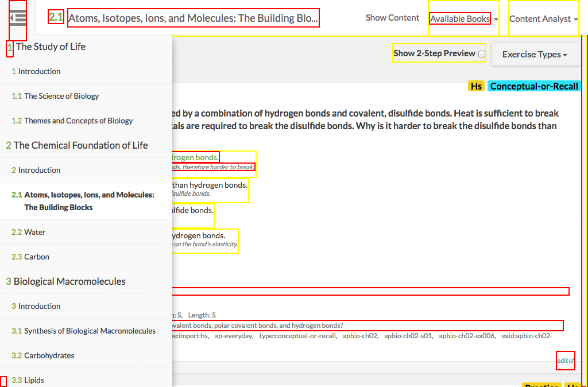

# https://tutor-{env}.openstax.org/qa/{ecosystemId}/section/{bookSection}



# AJAX Calls

## GET /api/ecosystems/1/exercises/?page_ids%5B%5D=5

```json
{
  "items": [
    {
      "content": {
        "attachments": [],
        "authors": [
          {
            "name": "OpenStax",
            "user_id": 1
          }
        ],
        "copyright_holders": [
          {
            "name": "Rice University",
            "user_id": 2
          }
        ],
        "derived_from": [],
        "editors": [],
        "is_vocab": false,
        "number": 46,
        "published_at": "2015-09-16T20:13:33.325Z",
        "questions": [
          {
            "answers": [
              {
                "content_html": "Bohr model would have 2 electron rings, Bohr model would not show the sub-shell of second ring",
                "correctness": "1.0",
                "feedback_html": "Bohr model would not show the sub-shells of the second ring.",
                "id": 183
              },
              {
                "content_html": "Bohr model would have one electron ring, Bohr model would not give information about number of electron in each ring",
                "correctness": "0.0",
                "feedback_html": "Bohr model would have two electron rings. The first ring has two electrons and second has seven electrons.",
                "id": 184
              },
              "... skipped 2"
            ],
            "collaborator_solutions": [
              {
                "attachments": [],
                "content_html": "The nucleus of fluorine in the Bohr model would show <span data-math=\"9\">9</span> protons and <span data-math=\"10\">10</span> neutrons, yielding its at ... 408 more",
                "solution_type": "detailed"
              }
            ],
            "combo_choices": [],
            "community_solutions": [],
            "formats": [
              "multiple-choice",
              "free-response"
            ],
            "hints": [],
            "id": 46,
            "is_answer_order_important": true,
            "stem_html": "Use the periodic table to describe what a Bohr model of Fluorine (F) would look like and explain why the Bohr model is not an accurate representation  ... 37 more",
            "stimulus_html": ""
          }
        ],
        "stimulus_html": "",
        "tags": [
          "filter-type:import:hs",
          "filter-type:import:has-context",
          "... skipped 18"
        ],
        "uid": "46@1",
        "version": 1
      },
      "has_interactive": false,
      "has_video": false,
      "id": "46",
      "pool_types": [
        "practice_widget",
        "all_exercises"
      ],
      "tags": [
        {
          "id": "apbio-ch02-ex005",
          "is_visible": false,
          "type": "generic"
        },
        {
          "id": "exid:apbio-ch02-ex005",
          "is_visible": false,
          "type": "generic"
        },
        "... skipped 18"
      ],
      "url": "https://exercises-dev.openstax.org/exercises/46@1"
    },
    {
      "content": {
        "attachments": [],
        "authors": [
          {
            "name": "OpenStax",
            "user_id": 1
          }
        ],
        "copyright_holders": [
          {
            "name": "Rice University",
            "user_id": 2
          }
        ],
        "derived_from": [],
        "editors": [],
        "is_vocab": false,
        "number": 48,
        "published_at": "2015-09-16T20:13:33.353Z",
        "questions": [
          {
            "answers": [
              {
                "content_html": "Ionic bond involves the sharing of electrons whereas a covalent bond involves the transfer of electrons.",
                "correctness": "0.0",
                "feedback_html": "The sharing of electrons occurs in covalent bonding. The transfer of electrons occurs in an ionic bond.",
                "id": 191
              },
              {
                "content_html": "An ionic bond involves the transfer of electrons whereas a covalent bond involves the van der Waals force of interaction.",
                "correctness": "0.0",
                "feedback_html": "The covalent bond is entirely different from the van der Waals force of interaction.",
                "id": 192
              },
              "... skipped 2"
            ],
            "collaborator_solutions": [
              {
                "attachments": [],
                "content_html": "Ionic bonds occur when one atom transfers one or more electrons to the other, resulting in positively and negatively charged ions. The oppositely char ... 116 more",
                "solution_type": "detailed"
              }
            ],
            "combo_choices": [],
            "community_solutions": [],
            "formats": [
              "multiple-choice",
              "free-response"
            ],
            "hints": [],
            "id": 48,
            "is_answer_order_important": true,
            "stem_html": "What makes ionic bonds different from covalent bonds?",
            "stimulus_html": ""
          }
        ],
        "stimulus_html": "",
        "tags": [
          "filter-type:import:hs",
          "filter-type:import:has-context",
          "... skipped 18"
        ],
        "uid": "48@1",
        "version": 1
      },
      "has_interactive": false,
      "has_video": false,
      "id": "48",
      "pool_types": [
        "practice_widget",
        "all_exercises"
      ],
      "tags": [
        {
          "id": "apbio-ch02-ex007",
          "is_visible": false,
          "type": "generic"
        },
        {
          "id": "exid:apbio-ch02-ex007",
          "is_visible": false,
          "type": "generic"
        },
        "... skipped 18"
      ],
      "url": "https://exercises-dev.openstax.org/exercises/48@1"
    },
    "... skipped 16"
  ],
  "total_count": 18
}
```

